# How Cache Works Inside a CPU

Caching is a complex subject, so let's take it one step at a time. imagine you're playing a video  game where the screen is filled with hundreds of enemies, items and other game objects, each moving,  animating and reacting to the environment in real time behind the scenes. the game needs to update  the state of each of those entities every frame, usually 60 times per second. before the mid 2000s,  most games used object-oriented design to define the architecture of the game. in this design,  every character and item encapsulates its internal properties and keeps them close in memory.  **However, these game entities are not stored next to each other.
They are scattered throughout memory. in most cases, to Loop through the list of Game entities and update them,  the memory has to retrieve data from many different locations. this repeated access to main memory and jumping around  dozens of times per second is very inefficient and causes performance degradation.**

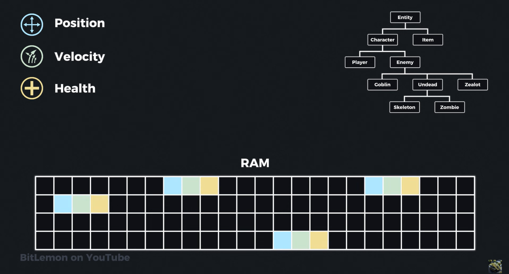

To overcome this inefficiency in modern games, developers often group similar data components of  these entities together in memory rather than following a traditional `object-oriented approach`.  for example, instead of having each character store all its data in a single object, a game might  store all positions in one continuous block of memory, all velocities in another, and so on. this  layout, known as `data oriented design,` **allows the game to iterate over and update all similar  properties at once.** modern games use an entity component system to manage individual components of  entities and group them together in memory. now, why am I telling you all of this?

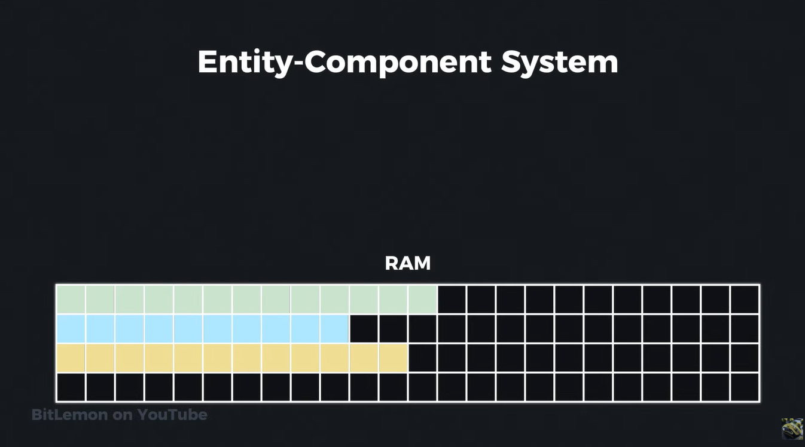

**Because using data oriented approach leverages the CPU cache to its fullest potential.** the CPU  cache is a small, extremely fast memory component that stores copies of the data the CPU is likely to use next,  instead of accessing the main memory, which is very slow. **the CPU can copy chunks of data from the  main memory to its cache, read and write the data in the cache and update the main memory later  if the data in the cache was modified.**

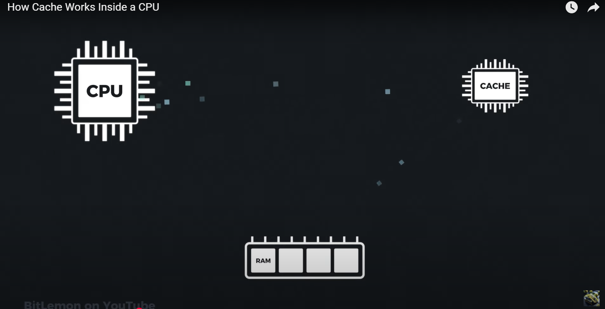

 modern CPUs usually have multiple levels of cache- L1, L2 and L3- with varying sizes and speeds.  where L1 is the smallest and fastest and L3 is larger but slower, these caches are found either  inside the CPU package or very close to it. for Simplicity, I will talk about the concept of cash  in general, rather than getting into the specifics of cache architecture and hierarchies.  let's see how the cache Works in action. back to our game example. every time the game  needs to update the position of all characters, it has to Loop through each of the position  values and update them. based on some physics formula.

 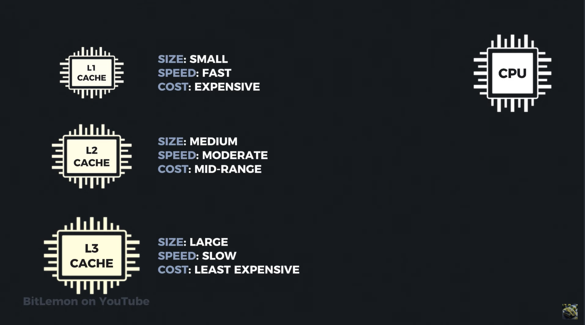

The first thing the CPU does when asked to read from memory is to check whether this memory  address is already in the cach. in our example, the first position value is not in the cache  because the CPU hasn't fetched it for from the main memory yet this is known as a `cache Miss.`  in this case, the data from the requested address will be copied from the main memory to the cache  and updated from there. in addition to the requested data, the addresses following the requested  one will also be copied from the main memory to the CPU cache.
**Because programs usually access data in memory sequentially, when the game tries to update the  next position value, it will already be in the cache. so the CPU can directly update the value  in the cache and avoid accessing the slow main memory. this is known as a `cache hit.`**
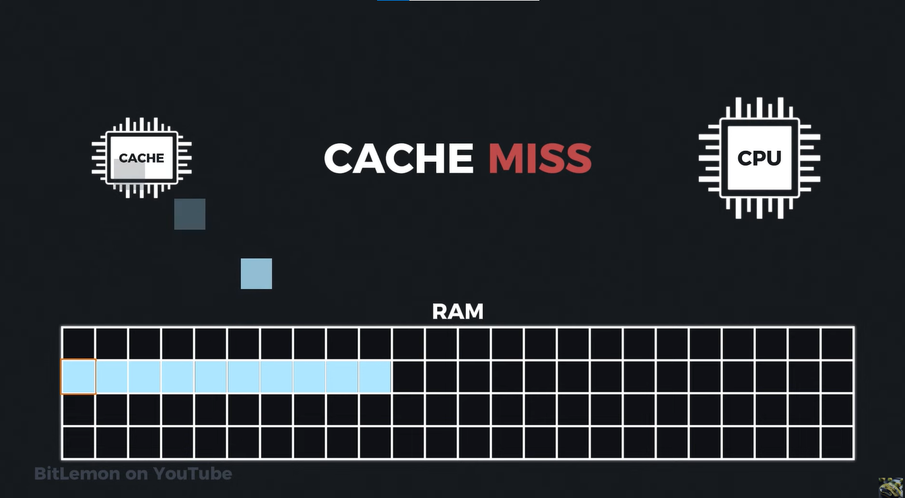

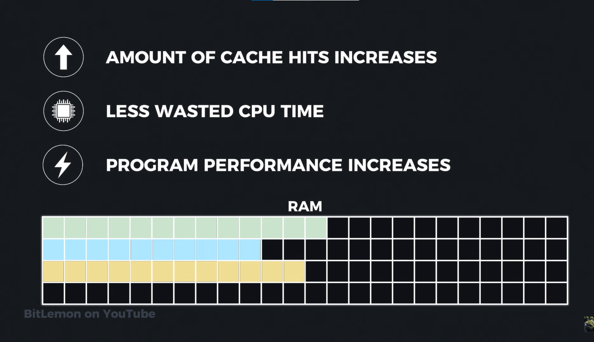

When data is stored continuously in memory, the likelihood of cach hits increases. the CPU spends  less time waiting for data from the slower main memory, which increases performance and makes the  program run faster. **the efficiency of cach usage is heavily influenced by the `locality of reference principle,`  which has two key components: `temporal locality` and `spatial locality.`**

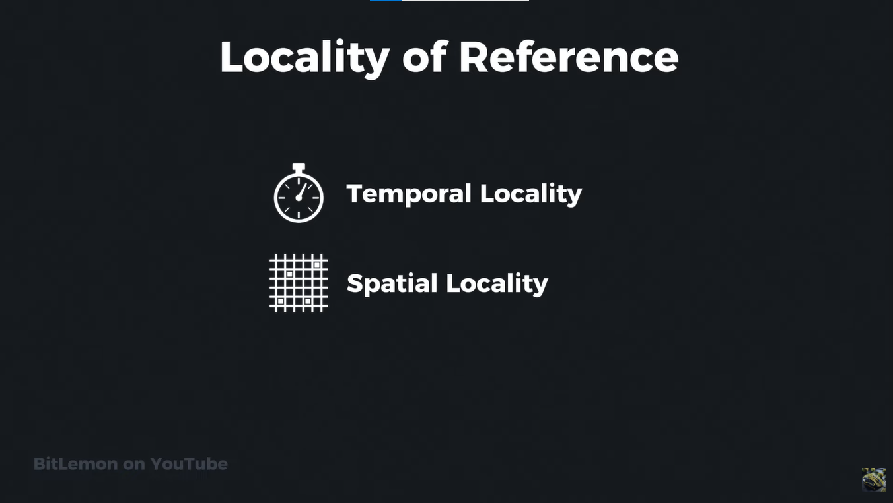

**temporal locality suggests that recently accessed data is likely to be accessed again in the near future.**
This principle refers to the likelihood that if a program accesses a particular memory location,  it will access the same memory location again soon. in our video game example, if the position of  a character is updated every frame, the position data will be accessed repeatedly in a short  period of time. by keeping frequently accessed data in the cache, the CPU can quickly access  this data without needing to reload it from the slower main memory, thus improving performance.
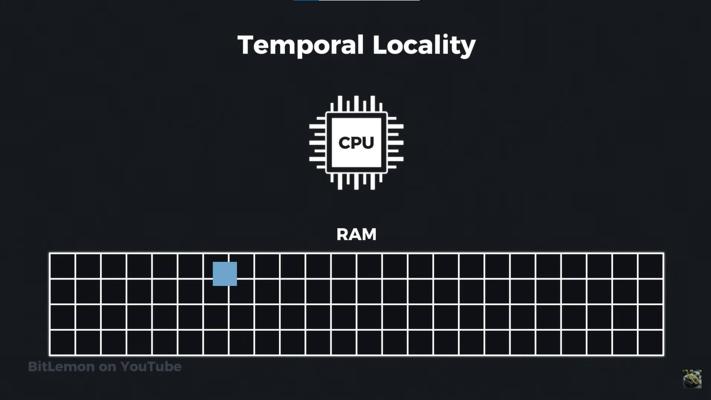

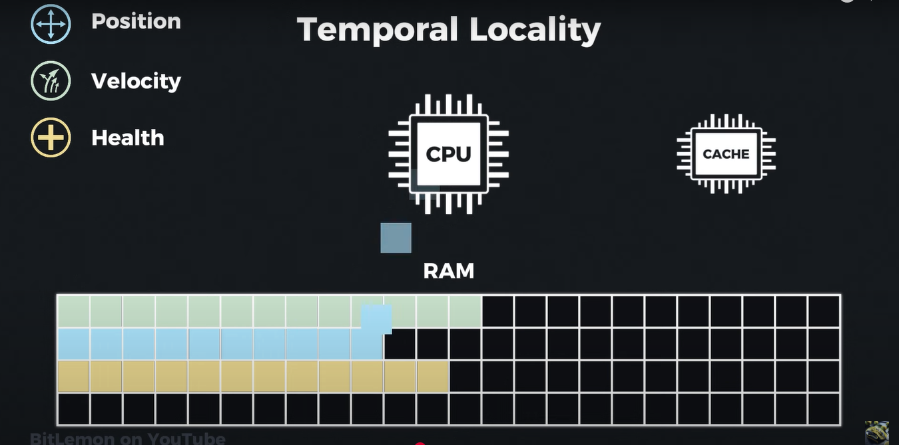

**Spatial locality suggests that data physically close in memory tends to be accessed around the same time.**  when a program accesses a specific memory location, it is likely to access nearby memory locations shortly after.  in our example, when the game updates the position of one character, it will usually update the positions of all  adjacent characters stored continuously in memory.

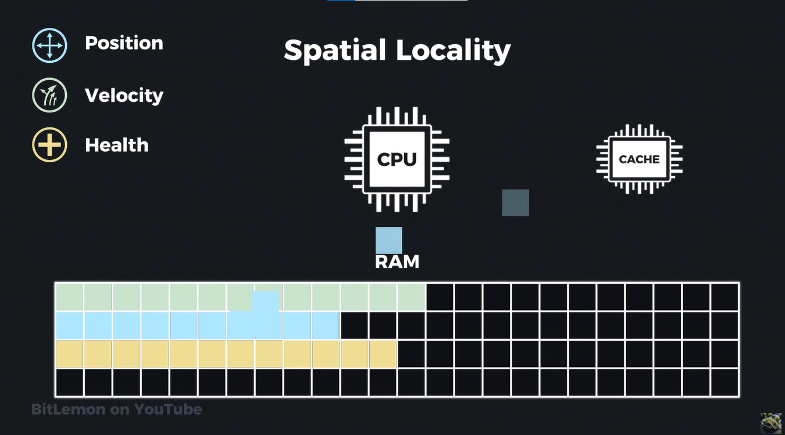

By organizing data continuously. the game ensures that when one piece of data is loaded into the cache,  **the adjacent data is also loaded, leading to fewer cache misses and more efficient memory access.** 
`let's talk about cach memory structure.` there are several types of cache components, the most notable of which are the `instruction cache and the data cache.`the instruction cache is a small Hardware component that accelerates the fetching and execution of CPU commands, while the data cache is used to speed up data access. for this explanation, I will focus only on the `data cache.`
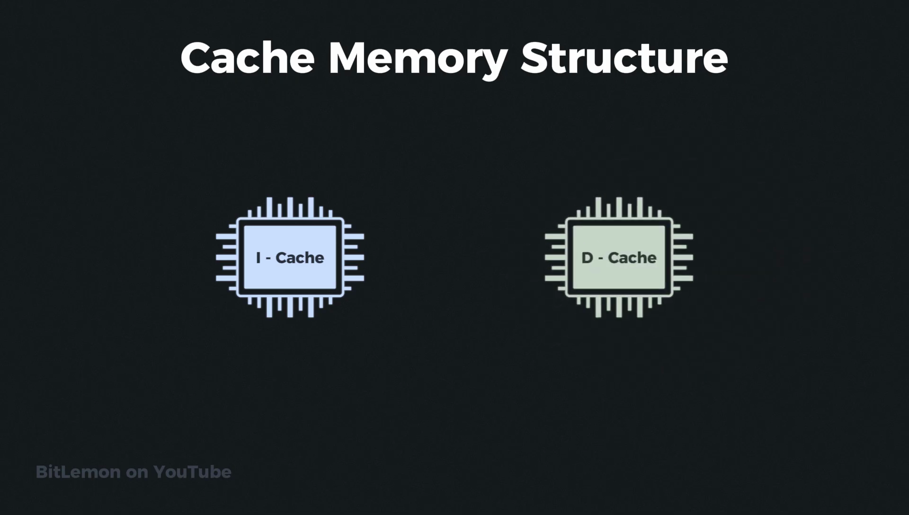

**A typical cache organizes its data into lines which are the smallest chunks of memory the Cache can transfer.**
1. A cash line is usually 32, 64 or 128 bytes, depending on the architecture, with `64 byte lines` being the most common Choice.
2. The data is also `tagged with a number` representing the general location in main memory from which the data came.
3. To accelerate the process of finding data in the cache, it is divided into `sets of cach lines` where each set contains multiple cash lines.
4. Each memory chunk across all sets is known as a `cash bank or a way`. this type of cache is called an `n-way` set associative cache.  for example, a cach with eight ways is described as an `eight-way set associative cache.`

In cache memory, `sets are the groups of cache lines`, and `ways` refer to the number of cache lines  within each set. A specific memory block can only be mapped to a particular set, but within that set,  it can go into any of the available "ways" (lines). The "n-way set associative" notation indicates that each  set contains n lines or ways. 

**Set**
* A set is a group of cache lines.
* The cache is divided into multiple sets.
* A memory block is mapped to a specific set based on its address. 

**Way**

* A way is a single cache line within a set. 
* The number of ways determines the associativity of the cache (e.g., a 4-way set associative cache has 4 lines per set). 
* It represents the number of locations within a set where a memory block can be stored. 

1. Let's consider a computer that can handle up to 64 GB of RAM and see how memory addresses are mapped into a 32 KB cache. 

2. let's assume it has a cache with 64 sets and eight ways, where each cache line contains 64 bytes of data.

|                                    |             |
|------------------------------------|-------------|
| Total RAM size                     | 64GB        |
| Total Chace size                   | 32KB        |
| Total set size                     | 64          |
| Ways (lines)                       | 8/set       |
| Data Bytes / line                  | 64 Bytes    |
| Bits need to represent RAM address | 36          |

These 36 bits are divided into three sections:

Memory is divided into block of 64 Bytes i.e 2^6. Hence **offset = 6.**
Those 6 bits are simply the lowest bits of the address.

Cache has 64 sets i.e 2^6. Hence **set index = 6.**

Remaining bits are **Tags = 24.**

| Field      | Bits | Total range                          |
| ---------- | ---- | ------------------------------------ |
| **TAG**    | 24   | Identifies 2²⁴ possible “regions”    |
| **INDEX**  | 6    | Selects 1 of 64 sets                 |
| **OFFSET** | 6    | Selects 1 of 64 bytes inside a block |
| **Total**  | 36   | → full 64 GB address space           |

24 bits that represent the tag of the data. six bits for the set index, which tells the cache in  which set this data is found, and six bits for the offset within a single cach line to find the  requested bite. when the cache receives the address, it extracts the six bits of the set index  and places the data in the next available cach line in that set. in addition, it copies the  24-bit tag associated with that data. when the CPU wants to read the data from the cache, it  sends the requested address to the cache which performs the same process. in Reverse, it extracts  the set index from the given address, finds the 24-bit tag and sends back the data associated with that tag.

[Set Associative Mapping](https://youtu.be/KhAh6thw_TI?si=Div0hHtchUx9gIOz)

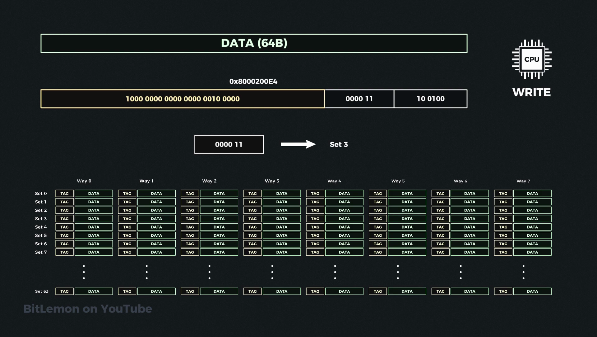

The CPU will then take the first six bits of the address which represent the offset in the cach line and extract the exact required data.

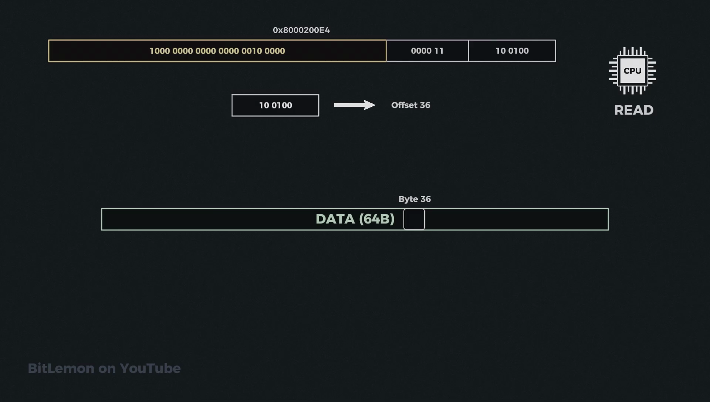

**in this example, every memory address is mapped to its specific set in the cache but still has flexibility regarding which line to go to within that set.** however, in an extreme case, a cache can have only one set, which means data from the main memory can go anywhere in the cache. this type of cache is called `fully associative.` it is very flexible, but it requires more power and cheap area to retrieve data.

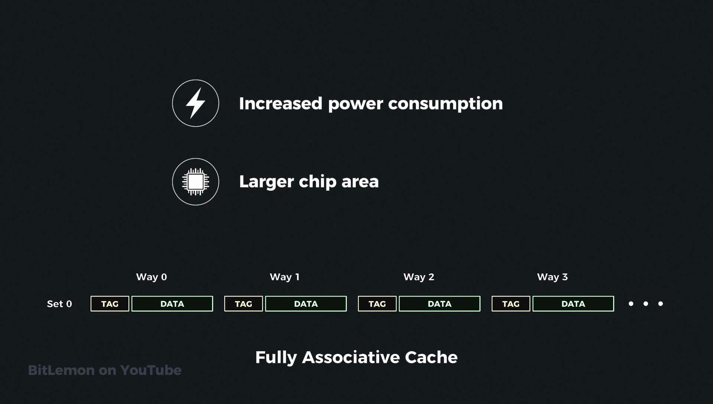

 On the Other Extreme, a cache set can have a single way, which means every main memory address can only be mapped to one specific location in the cache. this implementation is known as direct mapped cache. in this case, copying data into the cache or retrieving it is very fast, but It suffers from many conflict misses which occur when the designated Cash Line is already occupied and must be evicted to make room for the new data. in reality, most cash implementations are a compromise between those two extremes. since the cash is so small, it fills up quickly and must evict data to make room for new incoming data.

 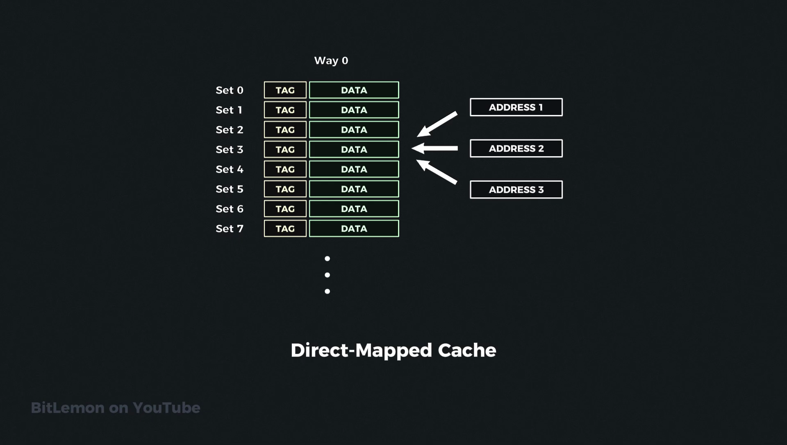

 but how does it know which cash lines? to clear? it uses an algorithm called the cach replacement algorithm.

 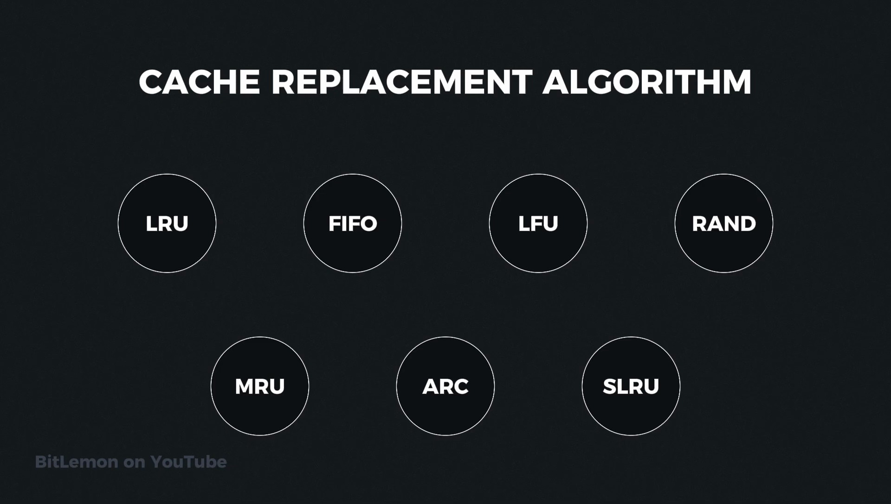

There are many types of replacement algorithms and every cache uses the best one for its purpose. but this topic is for next time. thanks for watching. I'll see you soon.
