**Cache Coherence and Write Policies**

Every time the CPU reads data from the cache, it is guaranteed to receive the correct up-to-date data that corresponds to the requested address in main memory, regardless of whether it's a read hit or a read miss. Writing to the cache introduces a challenge: when a block of data in the cache is modified, the main memory may still hold the outdated information at the accessed address. This is known as the `cache coherence problem.` The main issue with stale data in memory is that other components in the system might access this outdated information, leading to incorrect results.

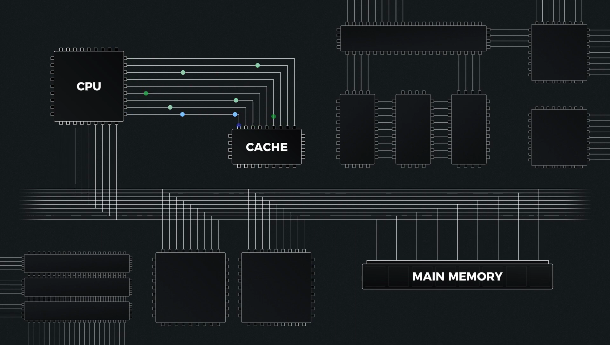

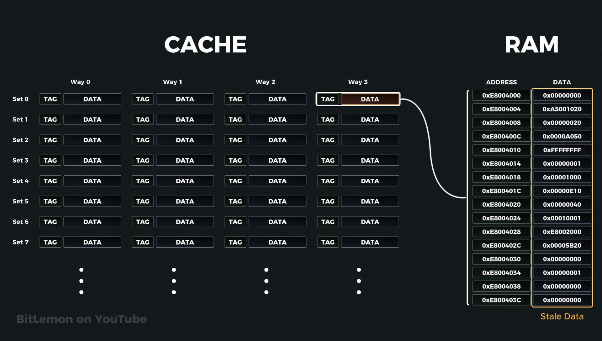

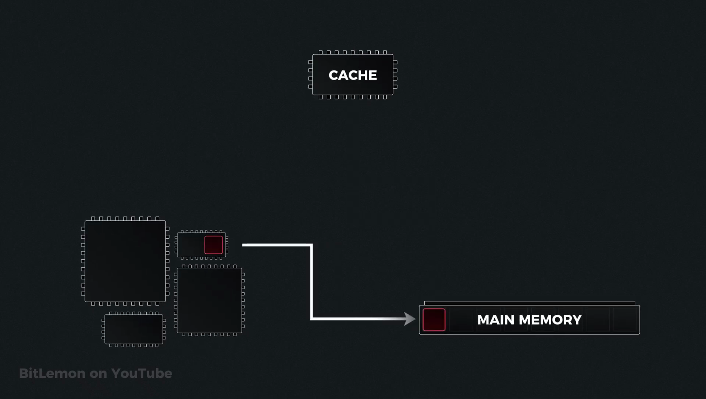

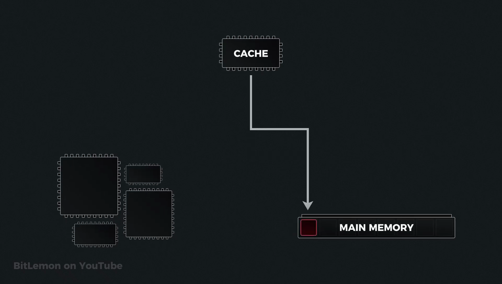

This problem is even more critical in multicore and multiprocessor systems, where each core or processor has its own cache, but they all connect to the same main memory. As a result, if one core modifies data in its cache without updating main memory or notifying other caches, other cores might continue reading the outdated data directly from memory or from their own caches.

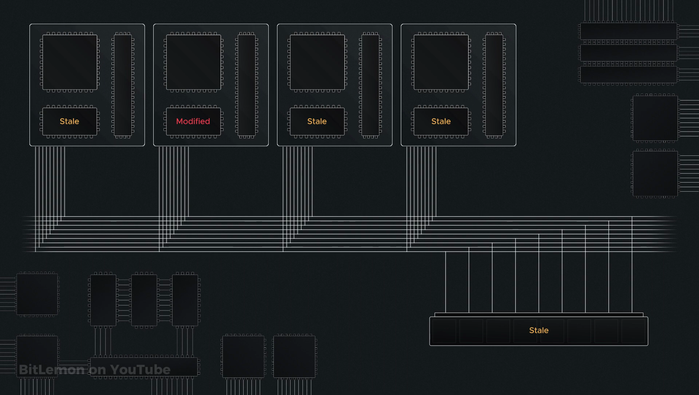

To address this issue, caches use specific write policies suited to system needs. Cache write policies cover two scenarios: one for `write hits` and another for `write misses.`

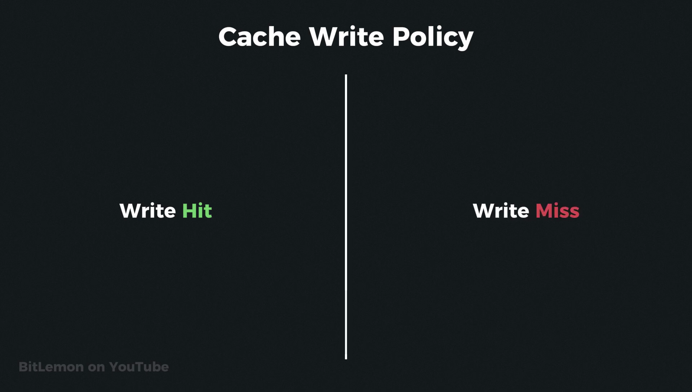

**In the write hit scenario,** the requested address is already in the cache. When the CPU sends new
data to the cache, the cache controller updates the data at the specified address. At this point,
 however, the cache and main memory are inconsistent. To manage this, the cache follows one of two 
 policies: 
 1. it either updates the main memory immediately, making the cache and main memory consistent 
 again, knows as `write-through` 
 2. delays the main memory update until a later time, such as when a block eviction is needed 
 or an explicit cache flush is requested. known as `write-back`

**In a write miss scenario,** the modified address is not found in the cache. Here, the system must decide how to handle the cache miss.
1. It can either allocate space in the cache, load the data, and update it there, or 
2. skip the cache entirely and write the new data directly to main memory. 

**In a write-through cache, any data written to the cache is immediately written to main memory as well**. 
This immediate update keeps the cache and main memory synchronized at all times, reducing the
complexity of tracking modified data in the cache.
 
However, there are some trade-offs: because each 
write operation involves updating both the cache and main memory, write operations can be slower. 
Additionally, this policy increases traffic on the memory bus, which can impact the performance of 
other components that also need access to main memory.

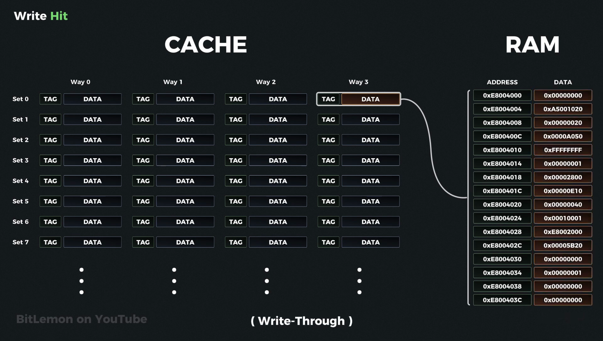

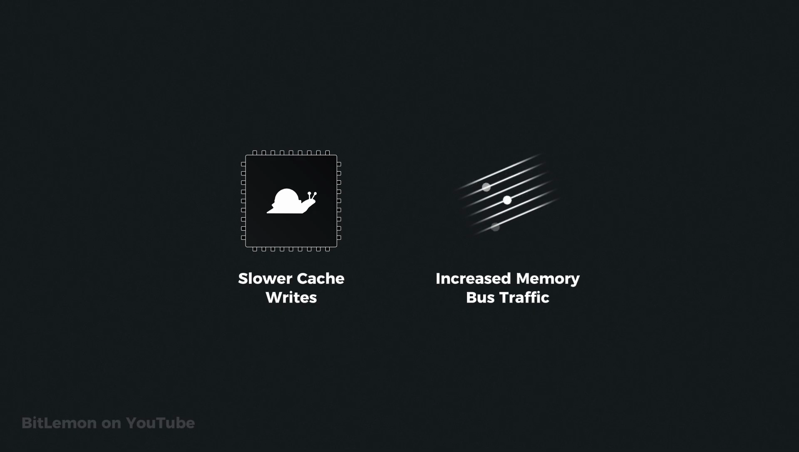

**In the write-back policy,** when data is modified, it is initially written only to the cache. 
The main memory is updated later, typically when the data is evicted from the cache or during 
specific events like a cache flush.

 With this approach, multiple changes to a cache line are combined 
into a single write to main memory, reducing the number of memory writes needed. The primary benefits 
of this policy are faster cache write operations and reduced traffic on the memory bus, which 
conserves bandwidth and can improve overall system performance. 

However, the `write-back approach` requires more complex cache management to keep track of modified 
blocks, and it carries a risk of data loss if the cache fails or power is lost before the modified 
data is written back to main memory.

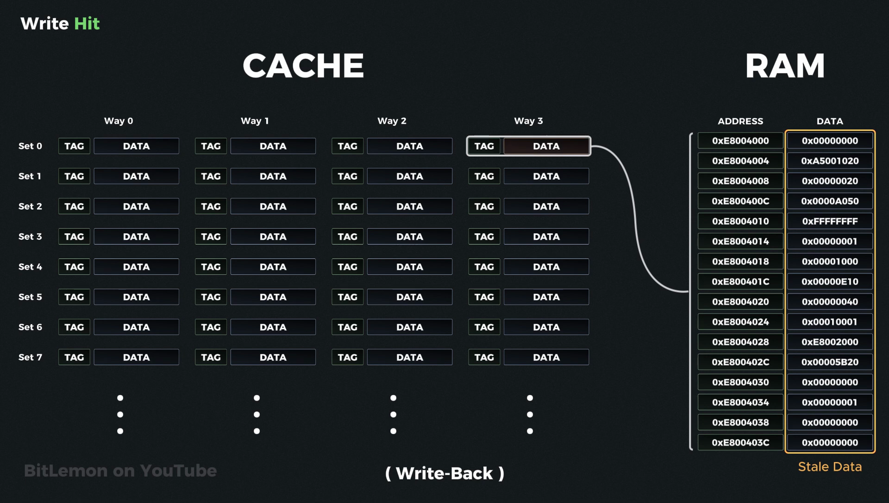

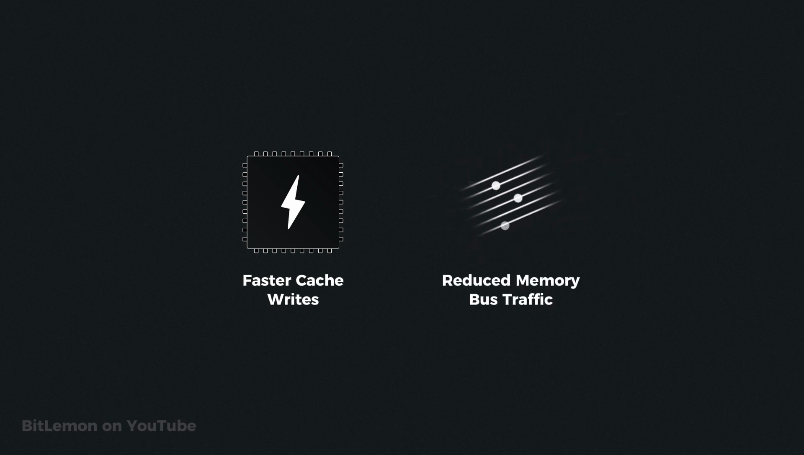

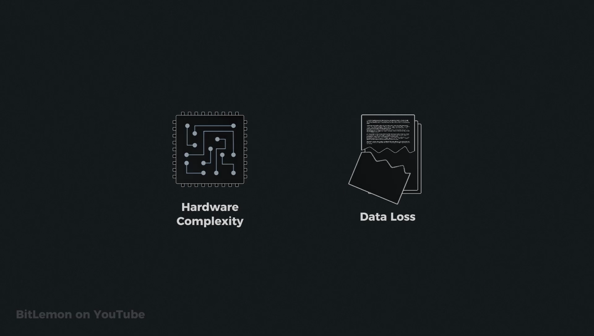

**In a write-back cache,** each cache line has a special bit called the Dirty Bit, which tracks if the  data in that line has been modified since it was loaded from the main memory. Whenever a  cache line is modified, its Dirty Bit is set to one. This indicates that the data in the cache line  is now different from what's in main memory. 

If a cache line hasn't been modified, its Dirty Bit stays at zero. When a cache line needs to be 
evicted to make space for new data, the `cache controller` checks its Dirty Bit. If the Dirty Bit is 
zero, the cache can discard the line immediately since the data matches what's in main memory. If the 
Dirty Bit is one, the modified data is written back to main memory before eviction, ensuring that 
main memory has the latest data.

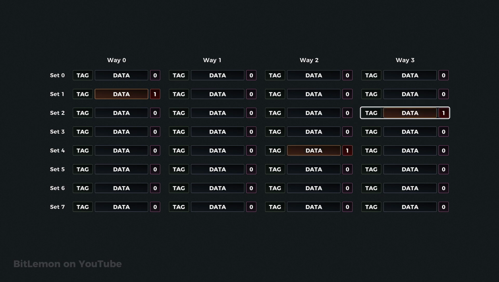

**During a cache flush,** the controller checks every cache line for any line where the Dirty Bit is set to one.  The cache immediately writes the data back to main memory and then resets the Dirty Bit to zero,  indicating that memory and cache are once again in sync.

------------

**The write-allocate policy** applies when a **write miss** occurs. In this case, a line is allocated in the cache,  and the requested data is loaded from main memory.

The write itself is then performed in the cache. After modifying the data in the cache, if the system 
uses write-through, the updated data is immediately written to main memory. However, if the system 
uses write-back, the Dirty Bit is set to one, and the main memory is updated later when the cache 
line is evicted or a cache flush occurs.

In general, the write-allocate policy assumes that new data will be accessed multiple times since it
involves evicting a cache line and fetching the new data into the cache. This assumption can improve 
performance if the data is accessed repeatedly.

However, if the new data is never accessed again, the system wastes time fetching it and may have evicted useful data that could have been accessed again. In systems where addresses are typically accessed only once, this approach becomes inefficient and leads to `cache pollution`, where infrequently used data displaces more frequently used data, causing the cache to be filled with data that will never be reused.

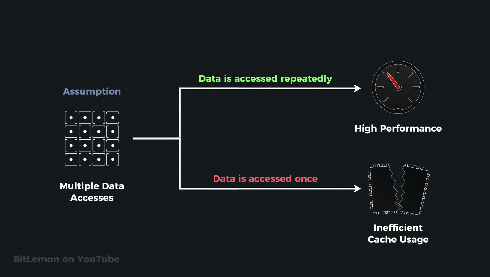

Like the write-allocate policy, the **no-write-allocate policy** applies only when a write miss occurs.
However, instead of loading the new data into the cache, it writes the data directly to main memory, 
bypassing the cache entirely. 

The main advantages of this strategy are that it avoids the overhead of evicting and loading data
 into the cache when the write miss occurs and prevents cache pollution with rarely accessed data. 
 The downside is that if the same address is accessed again, another cache miss will occur. This 
 policy assumes that addresses are written once and never accessed again. In systems where data is 
 frequently read and written, this approach can lead to frequent cache misses, which reduces 
 performance.

**Write Hit**
1. `Write Through :` Update Cache Data ==> Update Data in RAM immediately
2. `Write Back :` Update Cache Data ==> Updata Data in RAM in Later

**Write Miss**
1. `Write allocate :` Fetch address from RAM ==> Load into Cache ==> Update Data ==> Update Later in RAM
2. `No Write allocate :` Directly write on RAM address

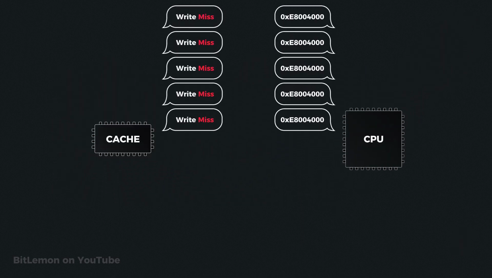

**The write-back policy works well in combination with write-allocate since both policies aim to maximize cache utilization and reduce memory bus traffic.** This combination is effective in CPU L1 data caches because it is optimized for high-performance tasks with frequent read and write operations on the same data.

**On the other hand, the write-through policy pairs well with no-write-allocate to optimize for data consistency.** This combination is useful for applications such as logging systems, where data is written once but not likely to be accessed again in the near future. Since there's little benefit in caching this type of data, this combination helps avoid fetching rarely used data into the cache and prevents cache pollution.

While these two combinations are common, other combinations can be used depending on specific system requirements.

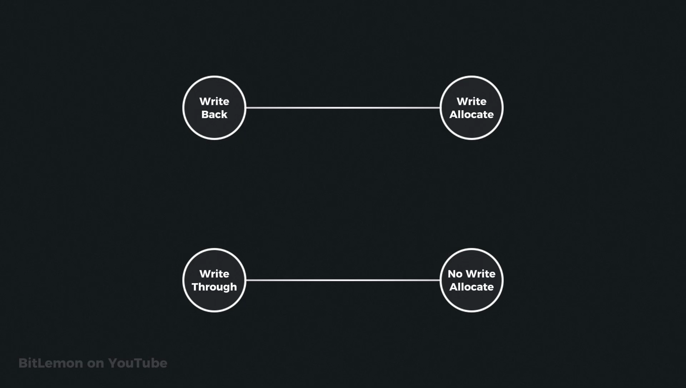
