# Understanding CPU Cache Hierarchies

Did you know that accessing main memory can take hundreds of CPU cycles? The processor operates at a very high speed, but every time it needs to fetch data from main memory, it's forced to wait until the requested data is retrieved. This huge delay is why computers have caches to keep the data the CPU needs closer and minimize those costly interruptions.

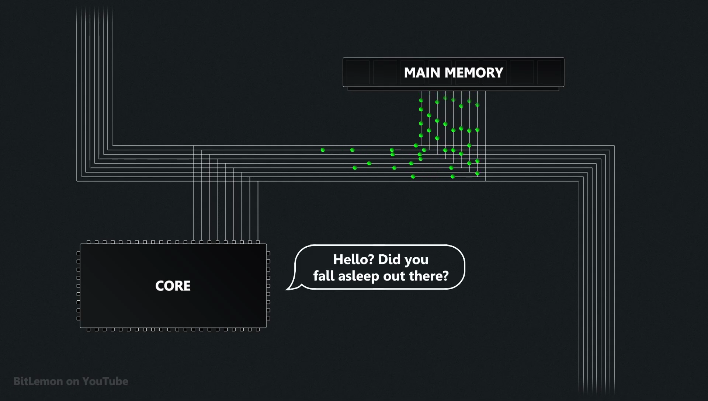

Modern CPUs feature a hierarchical cache system where the cache closest to the processor core is the smallest and fastest, while the furthest cache is the largest but slowest. Large caches are inherently more complex, which increases their access times.
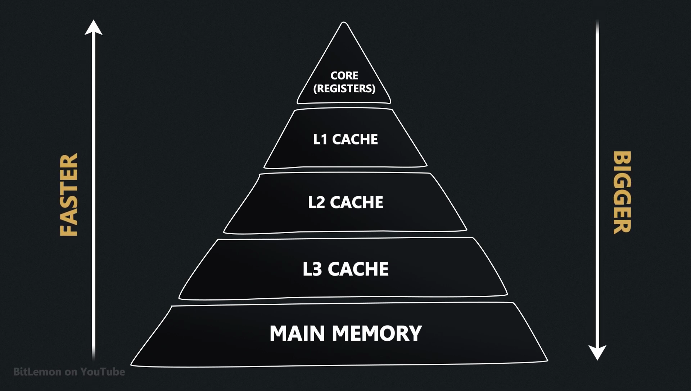

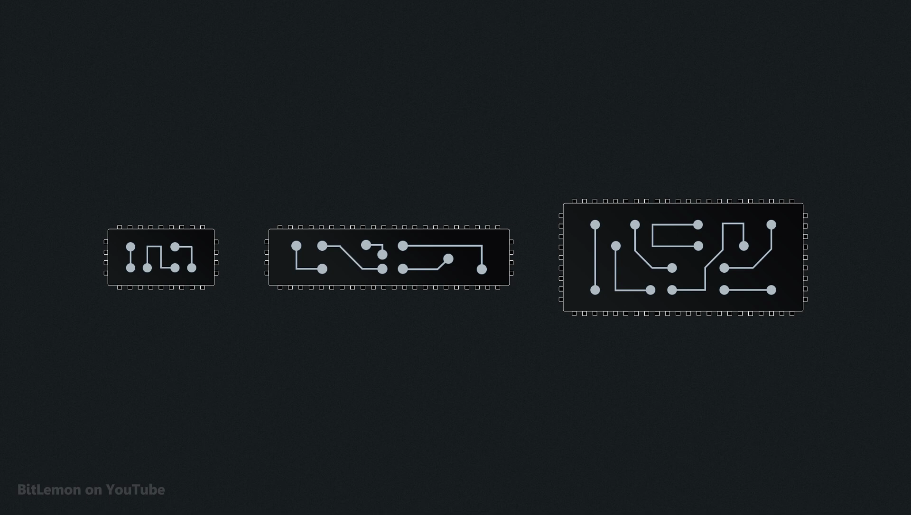

To maximize performance while reducing latency and cost, the first level of cache, known as L1, is designed to be very small to match the speed of the processor. L1 caches are typically divided into two separate components: one optimized for data fetching and another for storing instructions.

At this point, the size of the cache becomes a limiting factor. To solve this, many CPU architectures incorporate an additional cache that is larger in size but works at lower speeds. This is known as L2 cache. The L2 cache is usually a unified cache, which means it can store both data and instructions. It is dedicated to a single processor core and can directly communicate with the L1 caches.

However, most modern systems are multi-core systems and need a fast way to share data between them. That's why CPUs usually have another cache, L3. This cache is larger but slower than L2. It serves two main purposes: it allows data sharing between processor cores without accessing main memory, and it provides an additional layer in the memory hierarchy. When both L1 and L2 caches miss, the L3 cache is checked before resorting to main memory.
Some specialized systems add an L4 cache on top of the usual L1, L2, and L3 caches to boost performance even more.

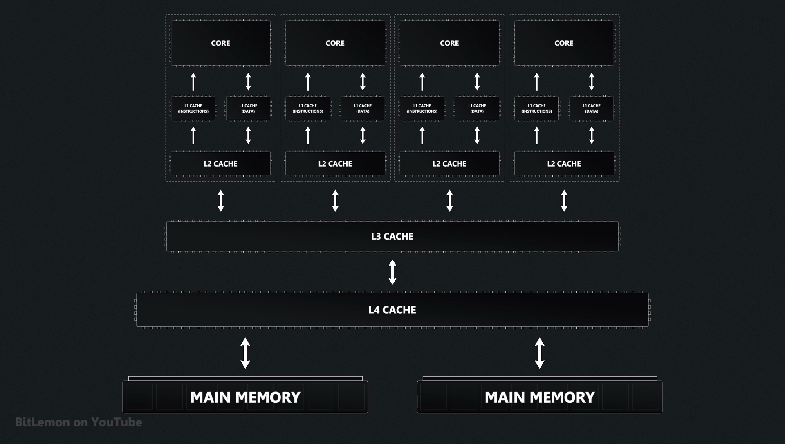

The L1 cache is the smallest in the hierarchy, typically ranging from 16 kilobytes to 128 kilobytes per core. It has an associativity of between two and eight ways. It is the fastest among all caches, with a latency in the range of a few CPU cycles.
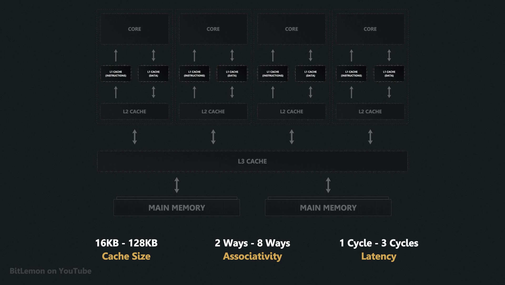

L2 caches are slightly larger than L1, ranging from 256 kilobytes to 2 megabytes per core, with older machines having up to several megabytes per core. In terms of associativity, L2 has between 4 and 16 ways and a latency of 4 to 10 CPU cycles.
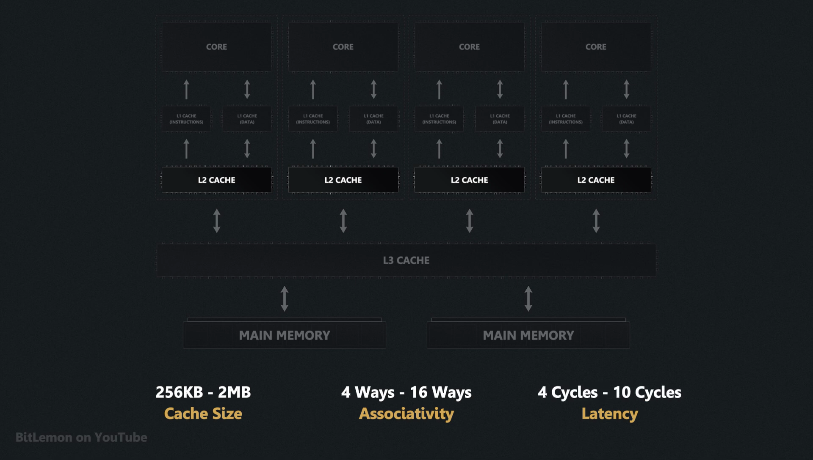

L3 caches are the largest in the hierarchy in most architectures, ranging from 2 megabytes to 32 megabytes per core, with some Apple and AMD CPUs having more than 32 megabytes per core. L3 typically has an associativity of 16 ways, though this can vary between system architectures. It has the longest latency, ranging from 10 to 40 cycles.
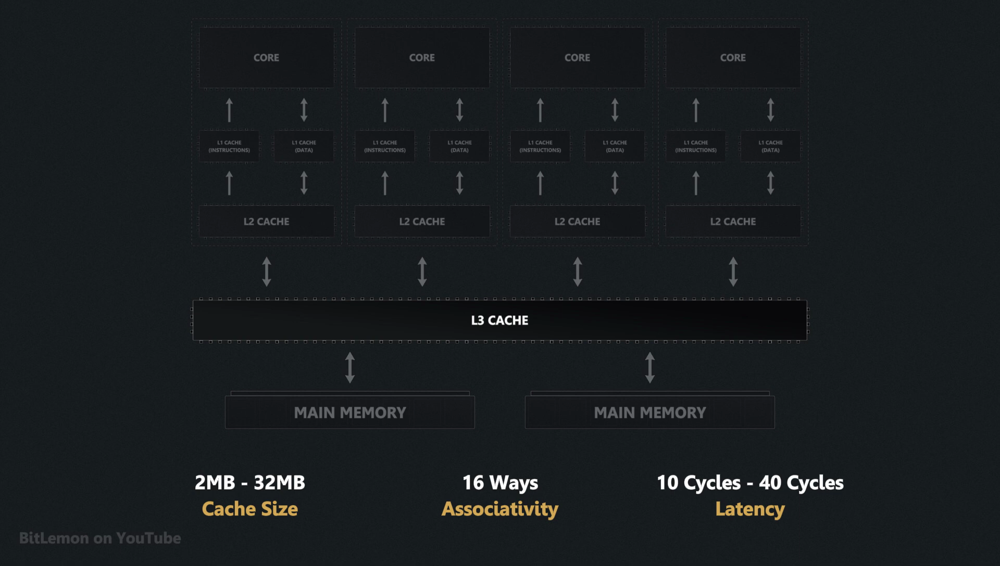

**Cache hierarchies can be categorized by their inclusion policies,** 
which decide whether a data block is stored in just one cache level, copied across multiple levels,
or handled in a more flexible manner.
**The three main inclusion policies are** 
1. inclusive, 
2. exclusive, and 
3. non-inclusive (non-exclusive or non).

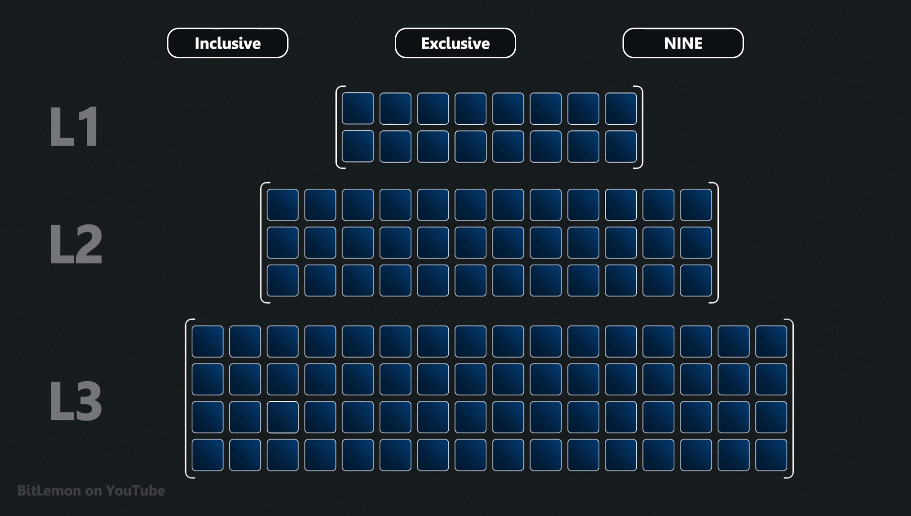

**In the inclusive policy,** data stored in a higher level cache, such as L1, which is closest to the
processor core, is also stored in lower level caches like L2 and possibly L3. In this case, you could 
say that L2 includes L1.

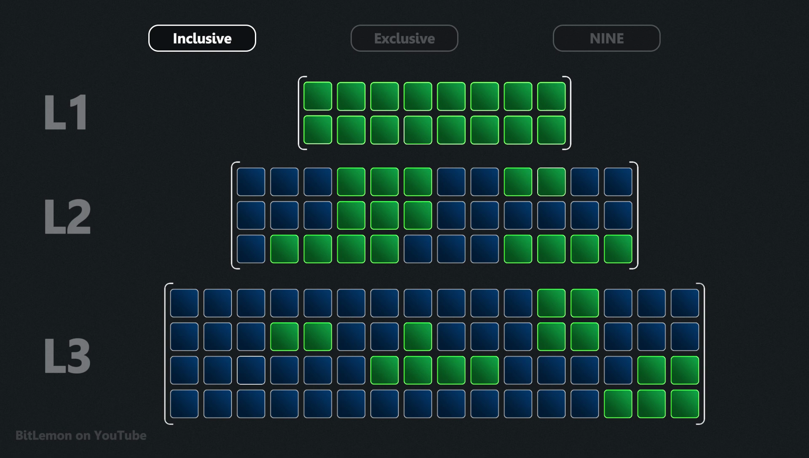

**The exclusive policy** states that a data block can only exist in one cache level at a time. If 
it's in L1, it won't be in L2 or L3, and vice versa. In this instance, L2 is exclusive of L1.

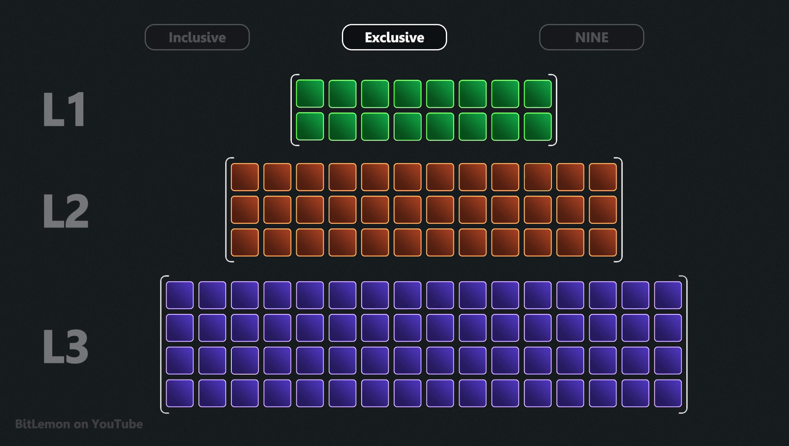

**The non-inclusive, non-exclusive policy** is a hybrid of the previous two; there is no strict rule 
for duplication. Data may or may not exist across multiple cache levels depending on the system's 
design.

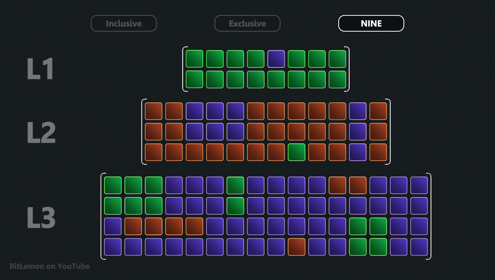

**In real-world systems, CPU cache hierarchies combine inclusion policies.**
For example, Intel processors like Sandy Bridge, Ivy Bridge, and Skylake have an inclusive `L3 cache`
and a `non-inclusive, non-exclusive L2 cache.` Each of these policies has its benefits and drawbacks, 
but they all play a role in how data is retrieved or written within the cache hierarchy.

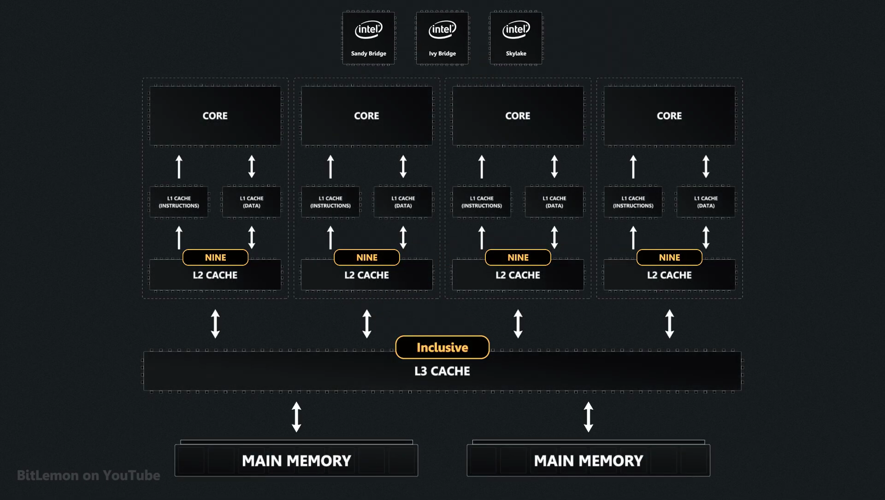

Let's look at an example. Let's assume we have an inclusive cache hierarchy with three levels. A read request will always start at the highest cache level, L1. If the requested address is found in L1, the data is simply forwarded to the processor core. If the address is not in L1, the search moves to L2. If the address is found in L2, the data is copied to L1 and then forwarded to the processor core. This step is important since having the data in L1 improves the hit rate if the same address is accessed again soon.

If the address is not found in L2, the search continues in the largest cache, L3. The same idea applies here: if the address is found in L3, it is copied to L2, then L1, and finally forwarded to the processor core. If none of the caches contain the address, the read request is sent to main memory. The data from main memory is retrieved, and in this fully inclusive system, it is copied to L3, L2, and L1 before being forwarded to the processor core.

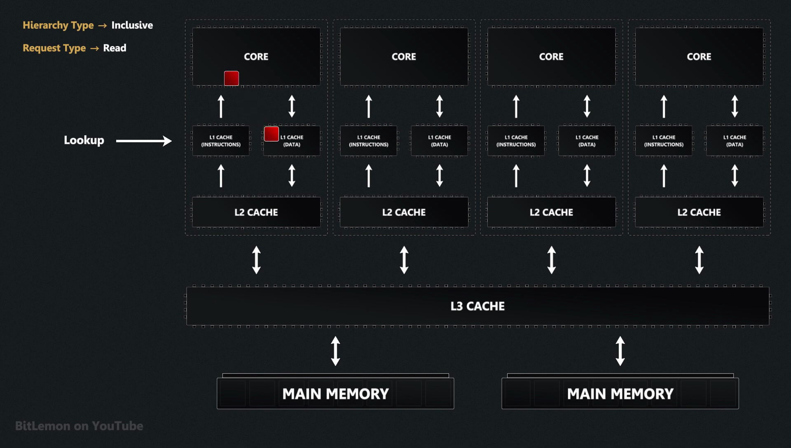
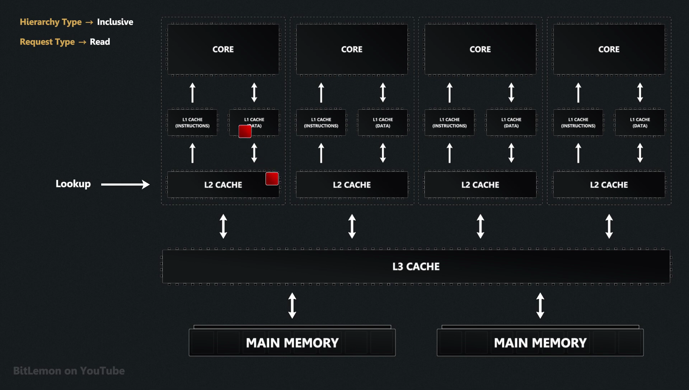
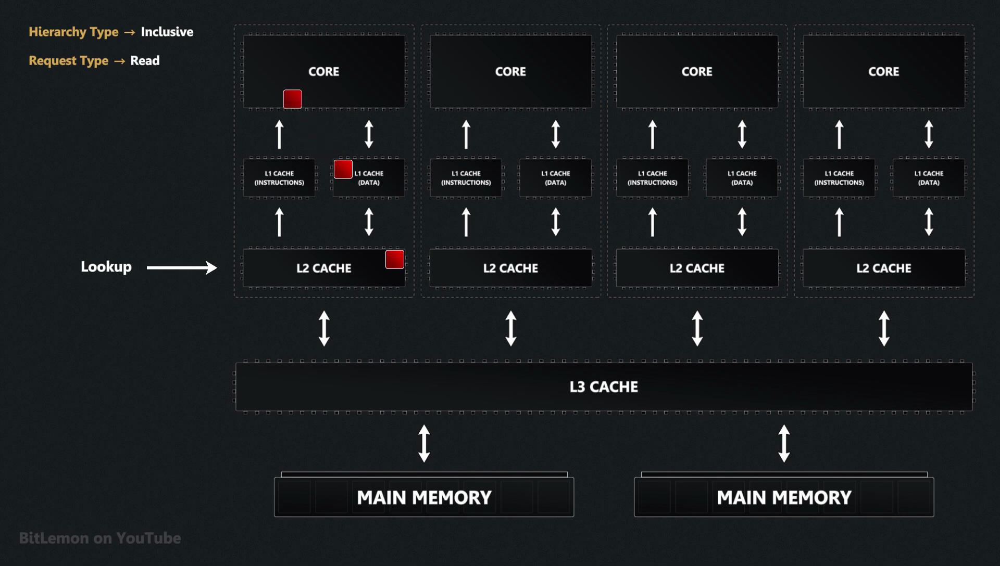

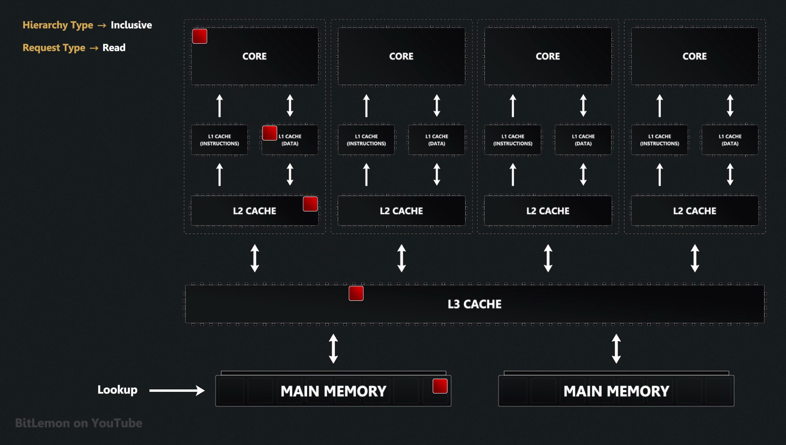

When the CPU issues a write request, how the cache handles it depends on the system's write policy. For simplicity, let's assume all caches in the hierarchy use the same policy. In the write-through policy, data written to L1 immediately propagates to L2, L3, and main memory. This ensures all levels remain synchronized during a write operation.
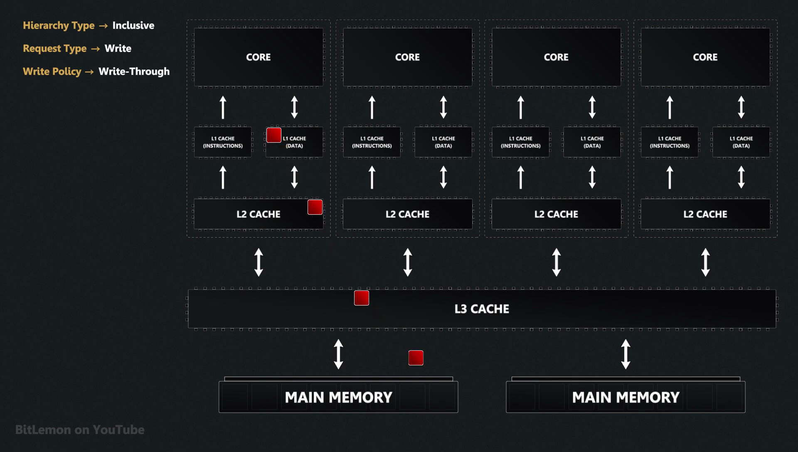

In contrast, the write-back policy delays updates to lower levels of the hierarchy. If a data block is modified in L1, it is marked as dirty. The update to lower caches or main memory only occurs when the data block is evicted from L1.
For example, when a dirty block is evicted from L1, it is written to L2, where it will also be marked as dirty, waiting eviction to the next level.
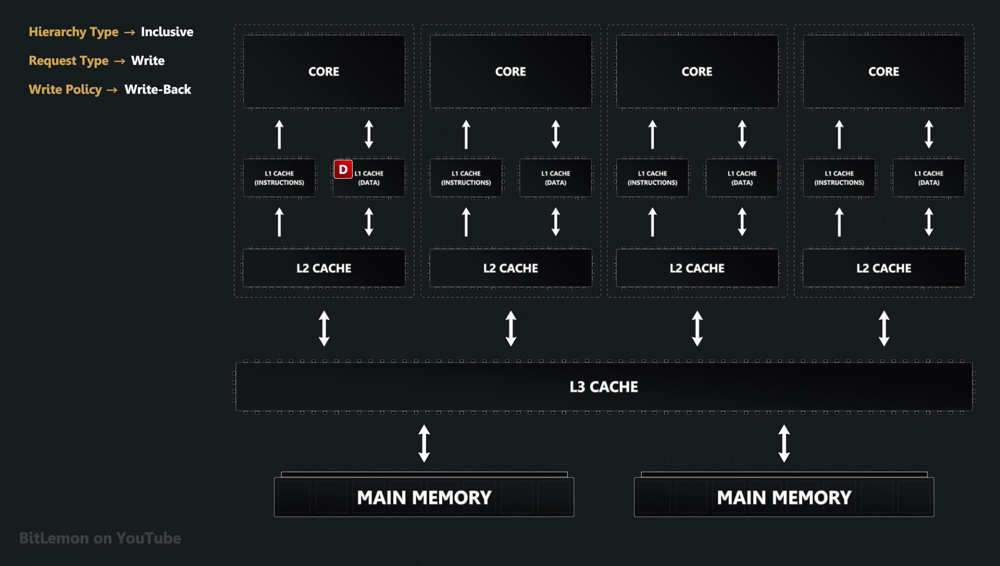

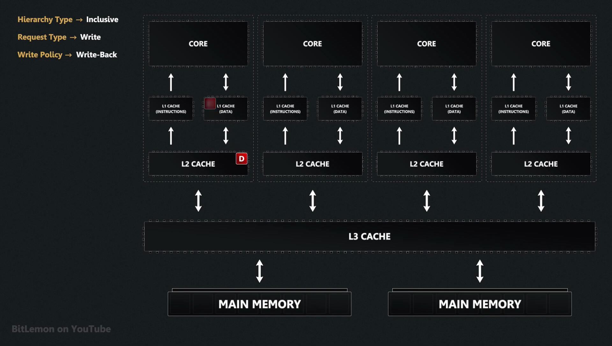

Write misses are handled based on the cache's allocation policy. Write-allocate means data blocks are brought into the cache hierarchy on a miss and updated there, while no-write-allocate means the cache is bypassed and the data is written directly to the next level.
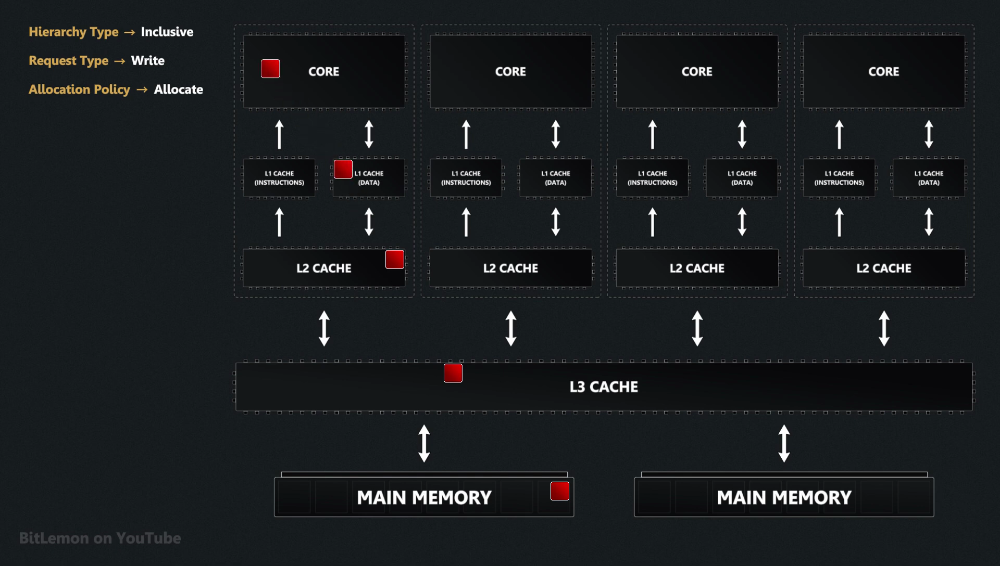
If all cache levels are configured as no-write-allocate, data is written directly to main memory.
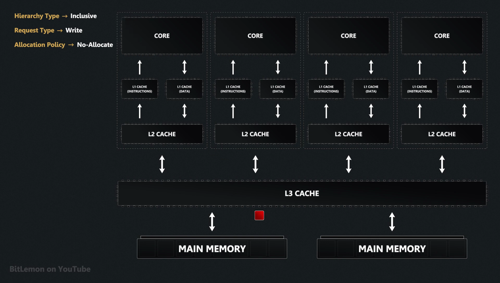

## Summary

### Purpose of CPU Cache

    Accessing main memory is slow (hundreds of CPU cycles).

    Caches reduce latency by storing frequently used data closer to the CPU.

### Cache Hierarchy Levels

**L1 Cache:**

    Closest, smallest, fastest (16 KB–128 KB per core).

    Split into instruction and data caches.

    Latency: Few CPU cycles.

Associativity: 2–8 ways.

L2 Cache:

Larger than L1 (256 KB–2 MB per core).

Unified (stores both data and instructions).

Dedicated per core.

Latency: 4–10 CPU cycles.

Associativity: 4–16 ways.

L3 Cache:

Shared among multiple cores.

Much larger (2 MB–32+ MB).

Latency: 10–40 cycles.

Associativity: Typically 16 ways.

L4 Cache (if present):

Even larger, slower, and often off-chip.

Used in specialized or high-performance systems.

### Inclusion Policies

Inclusive:

Data in L1 also exists in L2 and L3.

Exclusive:

Data exists only in one cache level at a time.

Non-Inclusive / Non-Exclusive:

No strict duplication rules; flexible design.

### Example: Read Operation in Inclusive Cache

CPU checks L1:

If hit → data sent to core.

If miss → check L2:

If hit → data copied to L1 and sent to core.

If miss → check L3:

If hit → data copied to L2 → L1 → core.

If miss → fetch from main memory and copy to L3 → L2 → L1 → core.

### Write Policies

Write-through:

Updates all levels and main memory immediately.

Write-back:

Modifies only L1 initially (marked dirty).

Writes to lower levels occur upon eviction.

### Write Miss Handling

Write-allocate:

Data block loaded into cache and then written.

No-write-allocate:

Data written directly to next level or main memory.

### Real-World Examples

Intel Sandy Bridge, Ivy Bridge, Skylake:

L3: Inclusive.

L2: Non-inclusive, non-exclusive.
