# Quick Questionairy

1) What is DMA? Why do wee need it?
   **Defination:** DMA is a mechanism that allows data transfer between memory and peripherals without CPU intervention, improving overall system efficiency.
2) What is 1st party and 3rd party DMA?
3) What are the operration modes of DMA?
4) What is IOMMU? Why do we need it?

---

If I ask a random person on the street what the parts of a computer are, they would probably mention things like the monitor, mouse, keyboard, or hard drive.
They might also mention the CPU, RAM, or a graphics card if they're a little more tech-savvy or play computer games. However, at the most fundamental level,
a basic computer only needs three components: a central processing unit, memory, and a bus to connect and manage data transfers between them.
A power supply is also necessary, but here I'm focusing on the functional aspects of a computer. All other components, such as USB devices, storage drives,
network adapters, audio hardware, and graphics cards, are considered peripheral devices.

A typical computer includes many peripheral devices, most of which need to read or write data to main memory from time to time, some more than others.
For example, running a video game requires a constant flow of data between RAM and the graphics card's internal memory, called VRAM. This makes main
memory a shared resource for the CPU and all other connected devices.

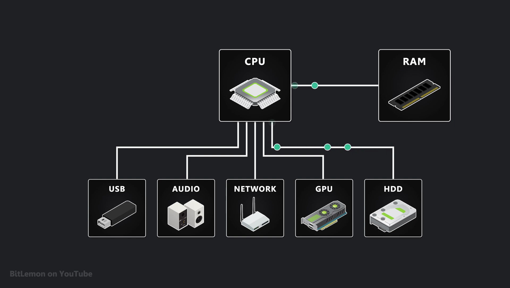

**Transferring data between main memory and the peripheral device is not direct, as I'm showing here; it requires executing several instructions, such as reading data from RAM and writing it to the device's internal memory. These operations can only be performed by a unit capable of processing such instructions, like the CPU. But if the CPU had to manually move every piece of data that a device needs, it would spend most of its time shuffling data back and forth instead of doing what it's supposed to do: running programs.**

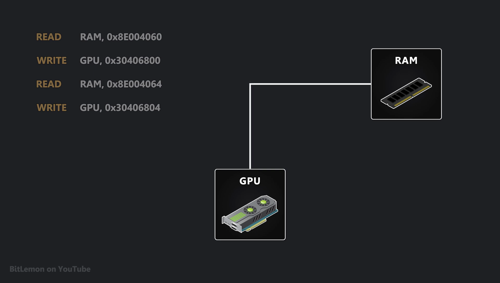

**To solve this problem, computers include a specialized processor called a Direct Memory Access (DMA) Controller, which handles data transfers for peripheral devices independently of the CPU. This allows the CPU to focus on executing program instructions without being constantly interrupted by data transfer requests.**

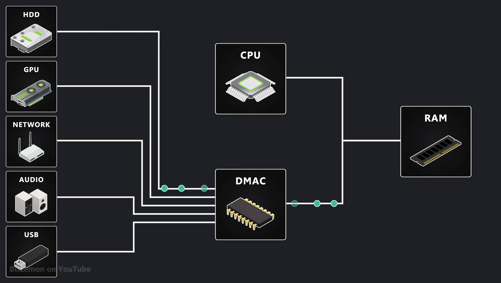

**Older systems that used PCI or ISA bus architectures relied on a shared bus that connected the CPU, main memory, and peripheral devices. At any given moment, only one entity could control the bus.** If multiple entities attempted to drive the bus lines at the same time, a condition known as bus **contention would occur, leading to delays or data corruption**.

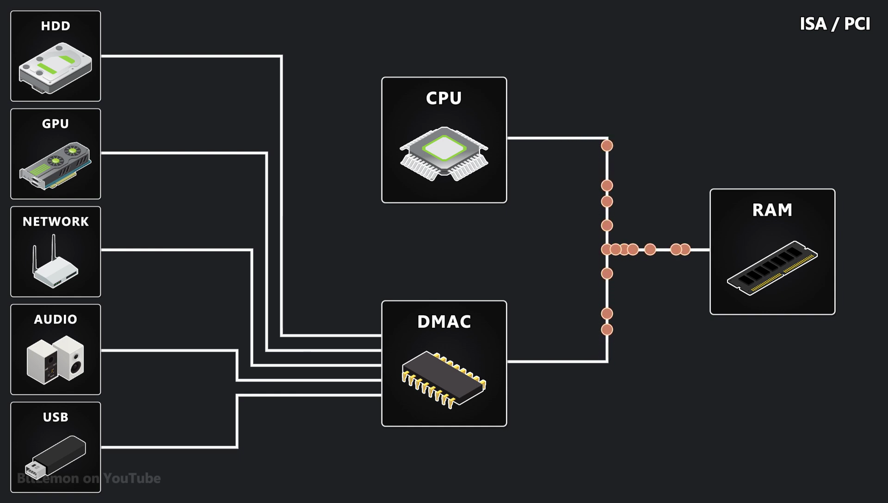

To prevent this, a centralized hardware component called the **bus arbiter managed access to the bus**, ensuring that only one processor or device had control at any given moment.

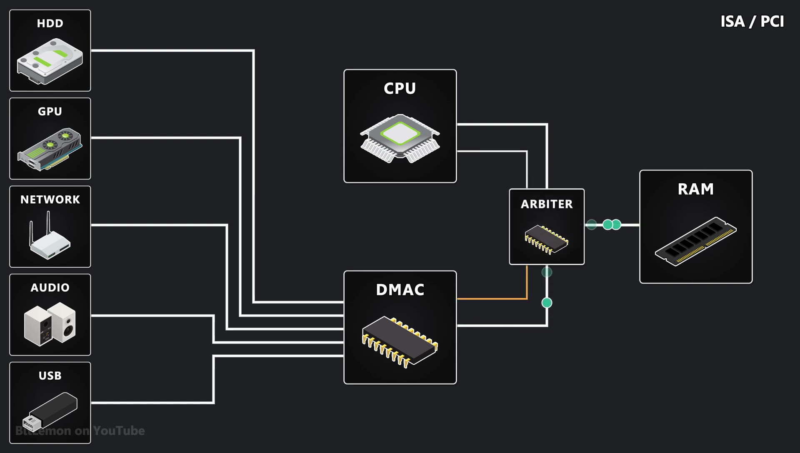

**In those older computer architectures, a single DMA controller was responsible for transferring data between peripheral devices and main memory. This configuration is known as a centralized DMA controller or third-party DMA. When a device needed to transfer data, it would send a request to the DMA controller. The DMA controller, in turn, would request control of the bus from the bus arbiter. Once bus control was granted, the DMA controller would perform the actual data transfer between the device and main memory. If multiple devices requested data transfer simultaneously, the DMA controller would prioritize them according to a specific arbitration algorithm.**

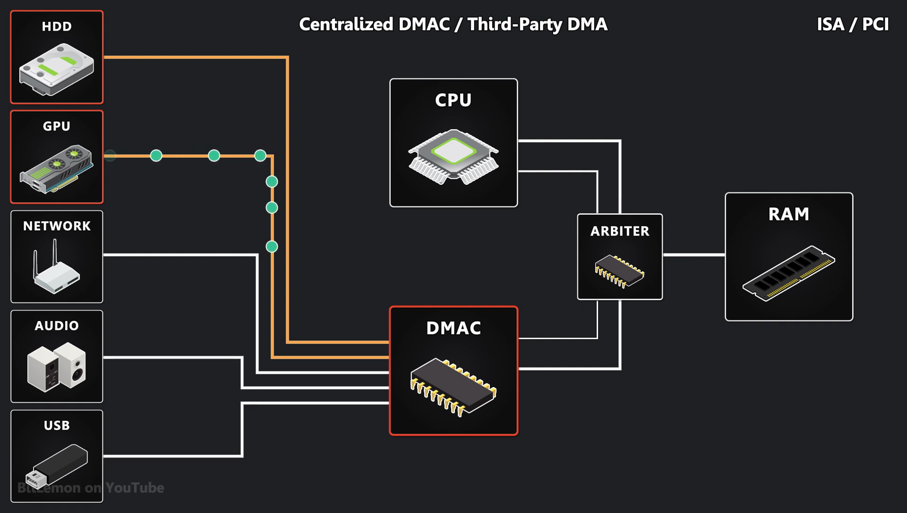

**While this system worked, it eventually became a bottleneck because the centralized DMA controller couldn't keep up with the increasing speed and throughput demands of newer generations of computers.**

**To overcome this limitation, data transfers no longer relied on a centralized DMA controller. Instead, each peripheral device was designed with its own internal DMA controller, allowing it to independently manage data transfer. This technique is known as bus mastering or first-party DMA**. With this approach, devices could access their internal memory faster, request control of the bus, and transfer data without depending on a shared DMA controller. However, **if multiple devices needed to use the bus simultaneously, the bus arbiter was responsible for managing access. Since the CPU is typically the most critical component in a system, it was often given higher priority over other devices when requesting bus access.**

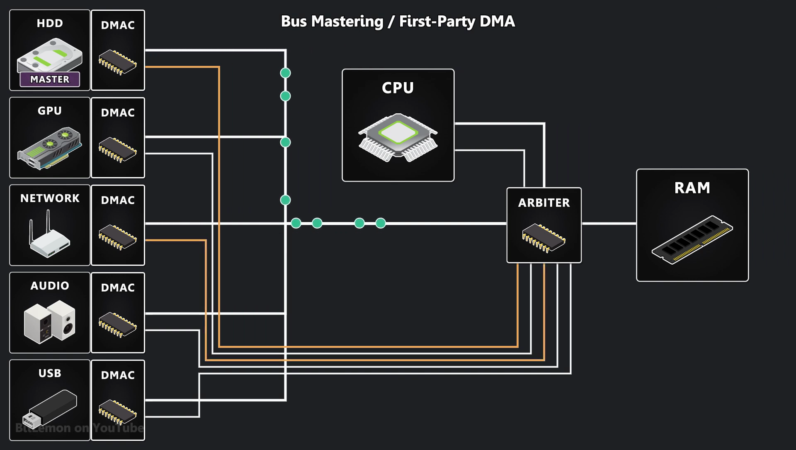

**DMA controllers transfer data in a way that allows the device to operate efficiently while trying to maximize CPU access to the bus. They achieve this by alternating between three transfer modes:**

**1) Burst mode,
2) Cycle stealing mode,
3) Transparent mode.**

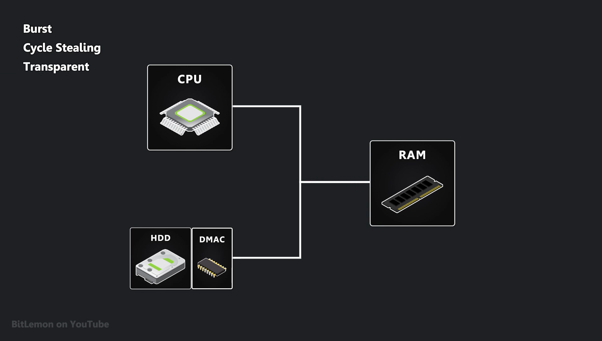

**Burst mode** is used when large chunks of data must be quickly moved between a peripheral device and main memory. In this mode, the DMA controller gains full control over the memory bus, which may temporarily block the processor from accessing the bus while the transfer occurs. Once the transfer is complete, the DMA controller releases the bus, allowing the bus arbiter to grant access to the next waiting processor or device.

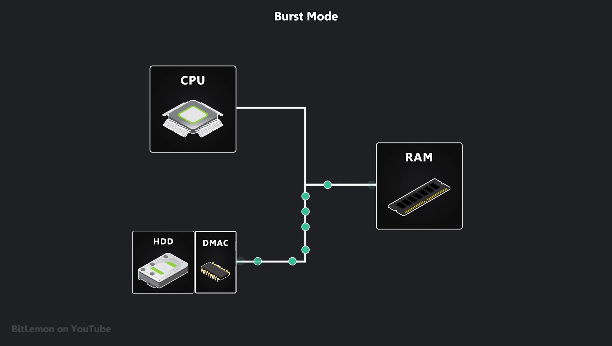

**Cycle stealing mode** is used by devices that frequently transfer small amounts of data, such as network cards or sound cards. Here, the DMA controller takes control of the bus for just a few cycles at a time, allowing the CPU to continue execution with minimal interruptions. While this mode does introduce minor slowdowns, it is far less disruptive than burst mode, which locks the bus for an extended period.

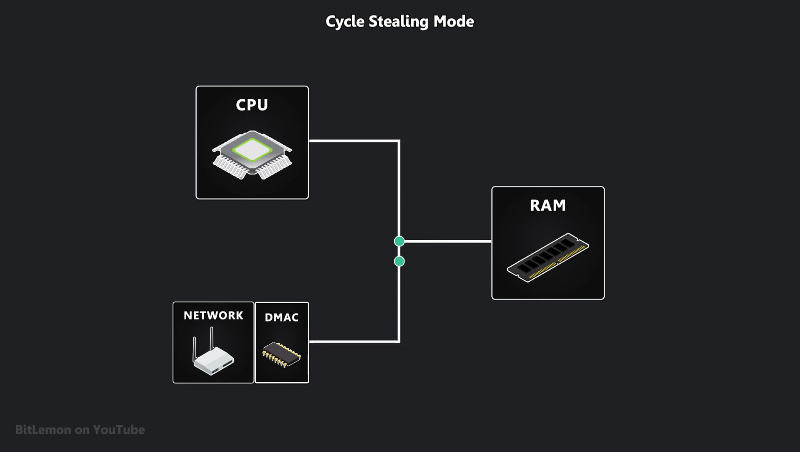

**Transparent mode** is the **most CPU-friendly**. **In this mode, the DMA controller only transfers data when the memory bus is completely idle, meaning no other component is using it. Since the CPU is the primary user of the bus,** this ensures the DMA transfers never interfere with its memory access requests. The trade-off is that while this mode eliminates CPU slowdowns, **it can result in very slow DMA transfers if the bus is frequently occupied.**

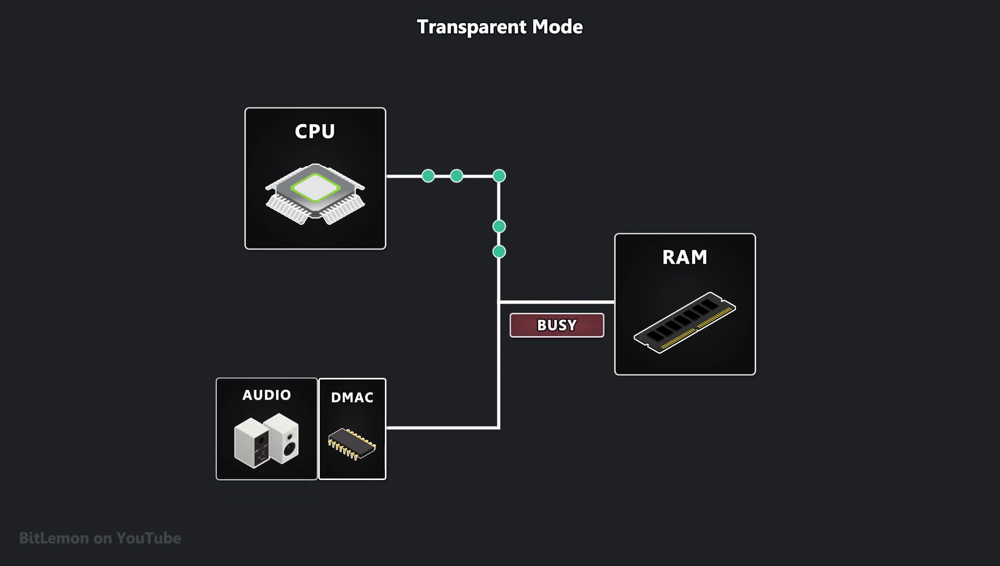

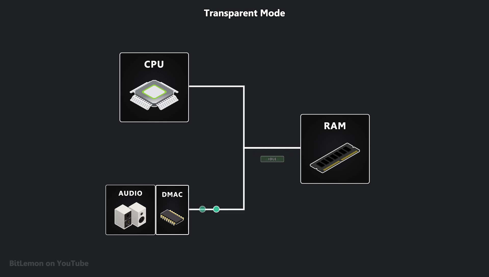

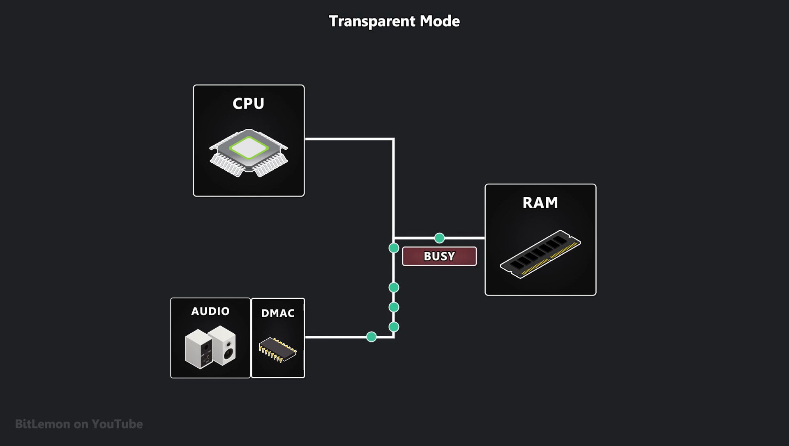

***The good news is that regardless of the transfer mode used by a DMA controller, the CPU can often continue executing instructions even in burst mode. This is thanks to the processor's caching system, which allows it to fetch frequently used data from cache instead of accessing main memory. In most cases, the CPU can continue running instructions using cached data. However, if a cache miss occurs, meaning the required data isn't in the cache, the processor must request data from main memory. If a DMA controller is currently using the memory bus, the CPU may experience a stall while waiting for the bus arbiter to grant access**.*

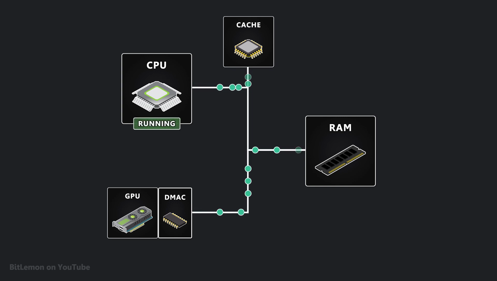

Today, most general-purpose computers use PCI Express as the main expansion bus standard. Unlike older PCI-based systems that relied on a single shared bus, **PCI Express uses a point-to-point topology where data is routed between the CPU, memory, and peripheral devices through switches that can manage multiple data transfers happening at the same time.** **In a PCI Express system, each peripheral device must have its own DMA controller to handle data transfers, similar to bus mastering in older architectures. However, unlike traditional bus mastering, where devices had to compete for control of a shared bus, PCI Express allows multiple devices to send and receive data simultaneously using their own dedicated lanes. The PCI Express switches and root complex dynamically manage the flow of information to ensure efficient data transfers and prevent bus contention.**

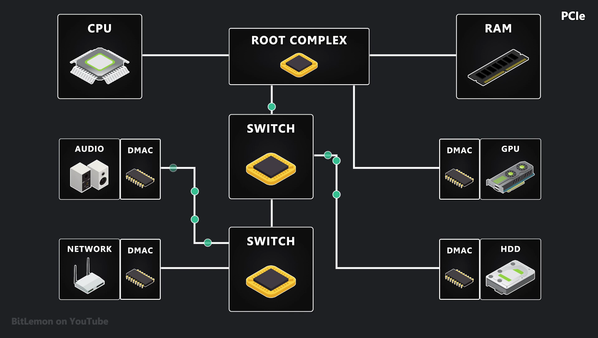

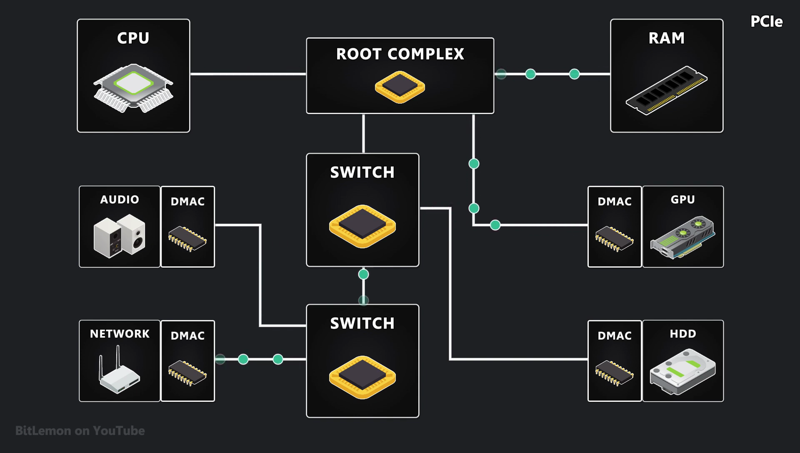

If you're familiar with virtual memory, you might notice a potential issue here. DMA controllers are processors designed to transfer data from point A to point B; they aren't aware of the current state of main memory, nor do they need to be. So how do they know where to write or read data from in physical memory? Just like any running process, peripheral devices operate in a virtual address space. This gives them the illusion of having exclusive access to the entire memory space. **Behind the scenes, the operating system maps a device's virtual addresses to physical memory using a mechanism known as I/O page tables.** To accelerate this translation process, a specialized hardware component called the **input/output memory management unit is used**. Every time a device initiates a DMA transfer, its DMA controller must go through the unit to translate virtual addresses into physical ones. This not only enables fast address translation but also enforces memory protection, preventing devices from accessing memory they don't own and helping mitigate DMA-related cyber attacks.

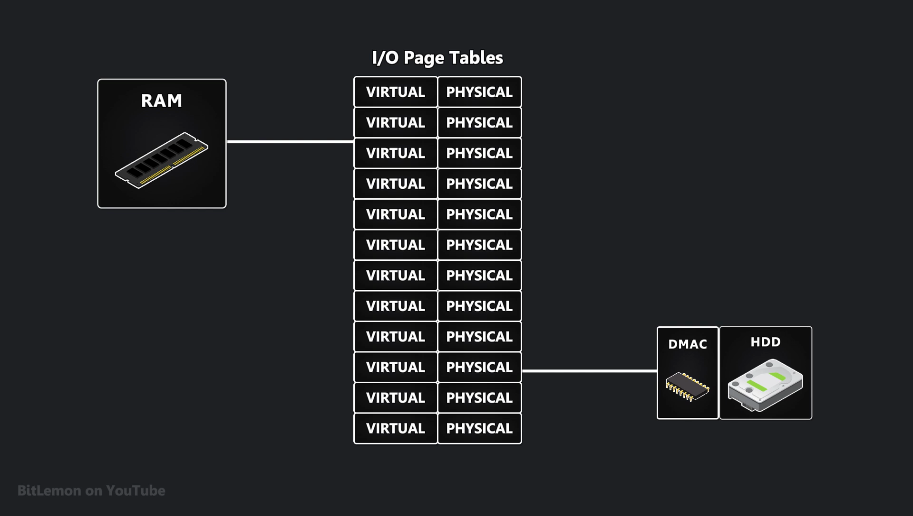

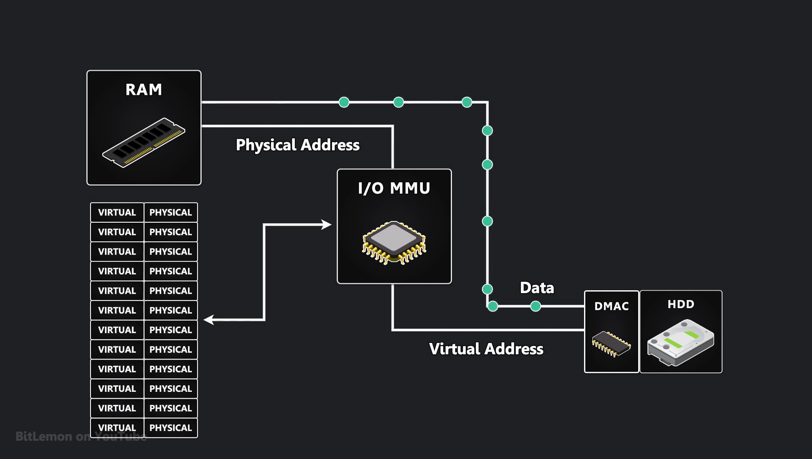
