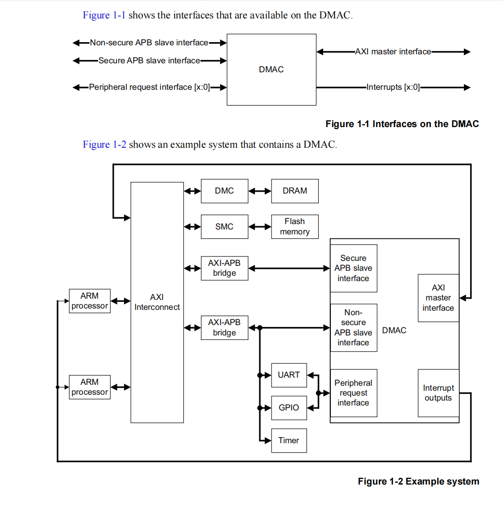
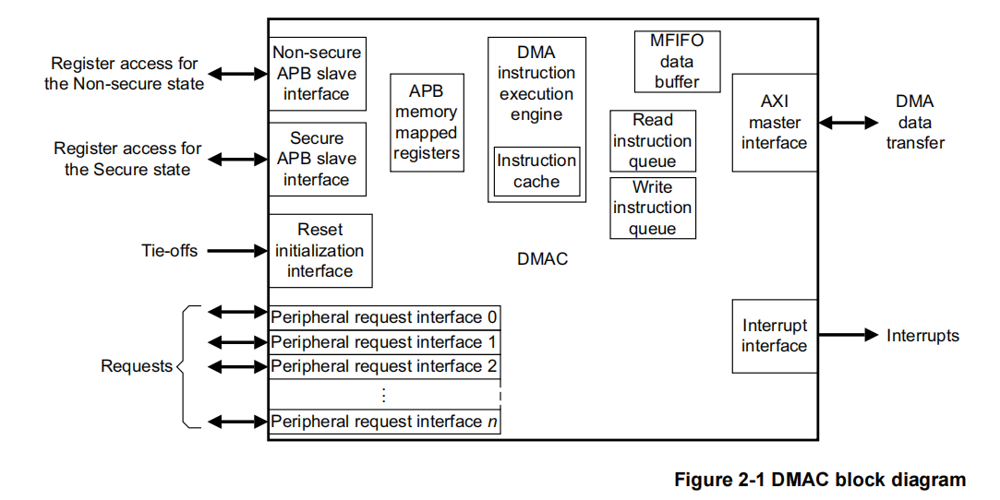

# Direct Memory Access Controller

1. Read **DMA330 ARM official** document.

## What is Direct memory access controller i.e DMAC ?

1) The DMAC is an Advanced Microcontroller Bus Architecture (AMBA) compliant peripheral
   that is developed, tested, and licensed by ARM.
2) The DMAC provides an AXI master interface to perform the DMA transfers and two APB slave
   interfaces that control its operation.
3) The DMAC includes a small instruction set that provides a flexible method of specifying the
   DMA operations.



## Basic Terminolgy

1) **DMA channel =>** A section of the DMAC that controls a DMA cycle by executing its own
   program thread. You can configure the number of channels that the DMAC contains.
2) **DMA cycle =>** All the DMA transfers that the DMAC must perform, to transfer the
   programmed number of data packets.
3) **DMA manager =>** A section of the DMAC that manages the operation of the DMAC by
   executing its own program thread.
4) **DMA transfer =>** The action of transferring a single byte, halfword, or word.

NOTE:

```
In the context of DMA (Direct Memory Access), a thread here does not refer to:
* a CPU software thread (like in POSIX threads or an OS task), or

* a CPU hardware thread (like a Hyper-Threading core).

Instead, it refers to a simple, independent control sequence inside the DMA controller.
It is best described as a **microcoded or state-machine thread — a hardware-executed finite-state machine programmed** to:

* fetch DMA descriptors (transfer parameters),

* follow a sequence (load, wait, store, trigger interrupt),

and run independently of the CPU.

📦 Analogy
Imagine the DMAC as a factory, and each DMA channel is a robot arm with its own scripted job (its "thread"):

Channel 0: Move data from memory A to memory B.

Channel 1: Move audio data to I2S buffer.

Each robot works independently, following its own instructions.
```

## Overview



The DMAC contains an instruction processing block that enables it to process program code that
controls a DMA transfer.

`DMAC has logic unit which is able to decode some set of instructions specifically meant for DMA operations`

The program code is stored in a region of system memory that the DMAC accesses using its AXI master interface.

`DMA program code take place in .data section i.e RAM not in .text section of program binary. Detail step by step approach is given in below table.`

The DMAC stores instructions temporarily in a cache. You can configure the line length and depth of the cache.

| Step | Who Does It                        | What Happens                                                                                                                                 |
| ---- | ---------------------------------- | -------------------------------------------------------------------------------------------------------------------------------------------- |
| 1.   | **CPU**                      | Allocates a memory buffer (in RAM) to hold**DMA instructions** (e.g., `DMAMOV`, `DMAST`, `DMAEND`)                               |
| 2.   | **CPU**                      | Fills that buffer with  **32-bit opcodes**, just like writing normal data                                                            |
| 3.   | **CPU**                      | Configures the DMA controller (via MMIO) — including passing the**start address** of that buffer into the **`EXEC` register** |
| 4.   | **DMA Controller** (not CPU) | Starts fetching instructions from the address provided (via AXI bus)                                                                         |
| 5.   | **DMA Controller**           | Decodes and executes them internally: reads data from source, writes to destination, loops, raises IRQs, etc.                                |
| 6.   | **DMA Controller**           | Stops when it hits a `DMAEND` instruction                                                                                                  |

🔧 Think of the DMA Instruction Stream Like a Script

* It's not compiled code
* It’s a binary script for the DMA engine’s interpreter
* It’s stored like an array in RAM
* The CPU only needs to prepare it and point to it

This Makes DMA Programmable

* Reuse the same DMA hardware for many different patterns (memcpy, scatter-gather, looping, conditional)
* Offload memory movement work from the CPU
* Execute these transfers independently and in parallel

**The DMA Manager Thread is not tied to data transfers.**

Instead, it’s like the “orchestrator” that:

* Executes setup/housekeeping instructions
* Starts/stops channel threads
* Handles instructions like DMASEV, DMAKILL, DMAFLUSHP
* Its instruction stream is separate and lives in a dedicated buffer

**The DMA controller has a small instruction execution engine that:**

* `Can fetch and execute one 32-bit instruction per AXI clock`
* This includes channel threads and manager thread instructions

"To ensure that it regularly executes each active thread, it alternates by processing the DMA manager thread and then a DMA channel thread."

**The controller uses a round-robin scheduler:**

* Execute one manager thread instruction
* Execute one channel thread instruction
* Repeat...

This interleaving ensures:

* The manager thread doesn’t get starved
* All active channel threads make progress

`It provides a separate Program Counter (PC) register for each DMA channel.`
`The DMAC also contains a Multi First-In-First-Out (MFIFO) data buffer that it uses to store data that it reads, or writes, during a DMA transfer.`

# Interview QnA

Here are 50 DMA (Direct Memory Access) interview or self-study questions arranged from beginner to expert level, focusing on embedded systems:

---

## Beginner Level (1–15)

Basic understanding and DMA fundamentals.

1. What is DMA and why is it used in embedded systems?
    
    DMA (Direct Memory Access) is a hardware feature that allows peripherals or devices to transfer data directly to or from system memory without involving the CPU for each data transaction.

    In simple terms, the CPU programs the DMA controller once, and then the DMA hardware becomes a mini-processor that moves data between memory and peripherals automatically

2. How does DMA differ from CPU-driven data transfer?

3. What are the basic components of a DMA controller?
    1)     

4. What are typical peripherals that use DMA?
5. What are the common transfer types in DMA (e.g., memory-to-memory, peripheral-to-memory)?
6. What is the role of the DMA request (DREQ) and acknowledge (DACK) signals?
7. What are burst mode and single mode in DMA transfers?
8. What is a DMA channel?
9. How does DMA improve CPU performance?
10. What is meant by DMA latency?
11. What happens when DMA and CPU access the same memory at the same time?
12. What is the difference between polling, interrupt-driven, and DMA-based data transfer?
13. Can a DMA controller be programmed by software?
14. What is scatter-gather in DMA?
15. How is DMA configured in an embedded system like STM32 or LPC?

---

## Intermediate Level (16–35)

Understanding DMA registers, integration, and use in real-time systems.

16. How do you configure a DMA transfer in STM32 (or your platform).
17. What are circular and linear modes in DMA.
18. How do you link DMA with UART or SPI in practice.
19. How does a DMA interrupt handler work.
20. What is a transfer complete (TC) interrupt in DMA.
21. How does DMA handle priority between multiple channels.
22. What is double buffering in DMA.
23. How do you avoid cache coherency issues with DMA and CPU sharing memory.
24. How does DMA interact with the MMU (Memory Management Unit).
25. What are descriptor-based DMA engines.
26. Explain memory-to-peripheral transfer using DMA.
27. What is DMA chaining.
28. What is the role of linked list descriptors in DMA.
29. How do you ensure synchronization between CPU and DMA.
30. What is the role of DMA FIFO (First In First Out) buffers.
31. How do you debug a failed DMA transaction.
32. What is a typical size limitation for DMA transfers.
33. How do you handle unaligned memory in DMA.
34. What is the difference between blocking and non-blocking DMA APIs.
35. Explain the role of bounce buffers in DMA.

---

## Advanced/Expert Level (36–50)

Deep architectural, performance tuning, and driver-level questions.

36. How does DMA operate in a system with multiple bus masters.
37. How do you implement a zero-copy DMA system.
38. How is DMA managed in a multicore system.
39. Explain how DMA interacts with cacheable and non-cacheable memory regions.
40. What are the security risks of DMA (e.g., DMA attacks).
41. How do you protect a DMA controller from accessing illegal memory.
42. How does Linux handle DMA using the DMA mapping API.
43. What is dma_map_single() vs. dma_map_sg() in Linux.
44. How do IOMMU and DMA relate.
45. How would you implement a custom DMA driver in Linux or Baremetal.
46. What are the differences between coherent and streaming DMA mappings.
47. How do DMA engines in PCIe or AXI interconnects work.
48. How would you handle DMA transfer timeout and recovery.
49. Explain the role of dma_alloc_coherent() and its implications.
50. How do you benchmark DMA throughput and latency effectively?

---
