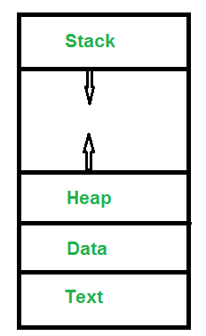
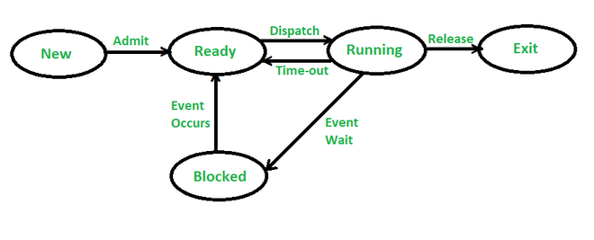

# Process

The process is the running instance of a program which occupies space in memory (RAM),  A program is a `passive entity` and process is an `active entity`. A process may passes through  the states as given below.

**Process memory** is divided into four sections for efficient working :

- The **Text section** is made up of the compiled program code, read in from non-volatile storage when the program is launched.
- The **Data section** is made up of the global and static variables, allocated and initialized prior to executing the main.
- The **Heap** is used for the dynamic memory allocation and is managed via calls to new, delete, malloc, free, etc.
- The **Stack** is used for local variables. Space on the stack is reserved for local variables when they are declared.

## Process vs Program

Let us take a look at the differences between Process and Program:

| Process                                                      | Program                                                      |
| ------------------------------------------------------------ | ------------------------------------------------------------ |
| The process is basically an instance of the computer program that is being executed. | A Program is basically a collection of instructions that mainly performs a specific task when executed by the computer. |
| A process has a **shorter lifetime**.                        | A Program has a **longer lifetime**.                         |
| A Process requires resources such as memory, CPU, Input-Output devices. | A Program is stored by hard-disk and does not require any resources. |
| A process has a dynamic instance of code and data            | A Program has static code and static data.                   |
| Basically, a process is the **running instance** of the code. | On the other hand, the program is the **executable code**.   |

------------
## [The different Process States in OS (Linux)](https://www.geeksforgeeks.org/states-of-a-process-in-operating-systems/)

Processes in the operating system can be in any of the following states:

- `NEW`- The process is being created.
- `READY`- The process is waiting to be assigned to a processor.
- `RUNNING`- Instructions are being executed.
- `WAITING`- The process is waiting for some event to occur(such as an I/O completion or reception of a signal).
- `TERMINATED`- The process has finished execution.

# Types of Processes

Suppose there are two processes. One is parent process while the other is child process.  In a real time, there can be two scenarios: 

### Orphan Process
The parent dies or gets killed before the child. 
In the above scenario, the child process become**s the orphan process (as it has lost its parent).**
In Linux, the init process comes to the rescue of the orphan processes and adopts them.
This means after a child has lost its parent, the init process becomes its new parent process. 

### Zombie process
**The child dies and parent does not perform wait() immediately.** 
Whenever the child is terminated, the termination status of the child is available to the parent through the wait() family of calls.
So, the kernel does waits for parent to retrieve the termination status of the child before its completely wipes out the child process.
Now, In a case where parent is not able to immediately perform the wait() (in order to fetch the termination status), the terminated child process becomes zombie process.
**A zombie process is one that is waiting for its parent to fetch its termination status.**

**Although the kernel releases all the resources that the zombie process was holding before it got killed,  some information like its termination status, its process ID etc are still stored by the kernel  Once the parent performs the wait() operation, kernel clears off this information too.**

## Daemon process 

A process that needs to run for a long period of time and does not require a controlling terminal,
these type of processes are programmed in a way that they becomes a `daemon processes.`
For example, monitoring software like key-logger etc are usually programmed as daemon processes.
A daemon process has no controlling terminal. 

--------------

# What is Process Scheduling?

The act of determining which process is in the **ready** state, and should be moved to the **running** state is known as **Process Scheduling**.

The prime aim of the process scheduling system is to keep the CPU busy all the time and to deliver minimum response time for all programs. For achieving this, the scheduler must apply appropriate rules for swapping processes `IN` and `OUT` of CPU.

Scheduling fell into one of the two general categories:

- **Non Pre-emptive Scheduling:** When the currently executing process gives up the CPU voluntarily. Process does not allow forcefull give up of CPU.
- **Pre-emptive Scheduling:** When the operating system decides to favour another process, pre-empting the currently executing process.

------

## What are Scheduling Queues?

- All processes, upon entering into the system, are stored in the **Job Queue**.
- Processes in the `Ready` state are placed in the **Ready Queue**.
- Processes waiting for a device to become available are placed in **Device Queues**. There are unique device queues available for each I/O device.

A new process is initially put in the **Ready queue**. It waits in the ready queue until it is selected for execution(or dispatched). Once the process is assigned to the CPU and is executing, one of the following several events can occur:

- The process could issue an I/O request, and then be placed in the **I/O queue**.
- The process could create a new subprocess and wait for its termination.
- The process could be removed forcibly from the CPU, as a result of an interrupt, and be put back in the ready queue.

In the first two cases, the process eventually switches from the waiting state to the ready state, and is then put back in the ready queue. A process continues this cycle until it terminates, at which time it is removed from all queues and has its PCB and resources deallocated.

------

## Types of Schedulers

There are three types of schedulers available:

1. Long Term Scheduler
2. Short Term Scheduler
3. Medium Term Scheduler

Let's discuss about all the different types of Schedulers in detail:

### Long Term Scheduler

Long term scheduler runs less frequently. Long Term Schedulers decide which program must get into the job queue. From the job queue, the Job Processor, selects processes and loads them into the memory for execution. Primary aim of the Job Scheduler is to maintain a good degree of Multiprogramming. An optimal degree of Multiprogramming means the average rate of process creation is equal to the average departure rate of processes from the execution memory.

### Short Term Scheduler

This is also known as CPU Scheduler and runs very frequently. The primary aim of this scheduler is to enhance CPU performance and increase process execution rate.

### Medium Term Scheduler

This scheduler removes the processes from memory (and from active contention for the CPU), and thus reduces the degree of multiprogramming. At some later time, the process can be reintroduced into memory and its execution can be continued where it left off. This scheme is called **swapping**. The process is swapped out, and is later swapped in, by the medium term scheduler.

Swapping may be necessary to improve the process mix, or because a change in memory requirements has overcommitted available memory, requiring memory to be freed up. This complete process is descripted in the below diagram:

------

## What is Context Switch?

1. Switching the CPU to another process requires **saving** the state of the old process and **loading** the saved state for the new process. This task is known as a **Context Switch**.
2. The **context** of a process is represented in the **Process Control Block(PCB)** of a process; it includes the value of the CPU registers, the process state and memory-management information. When a context switch occurs, the Kernel saves the context of the old process in its PCB and loads the saved context of the new process scheduled to run.
3. Context switch time is **pure overhead**, because the **system does no useful work while switching**. Its speed varies from machine to machine, depending on the memory speed, the number of registers that must be copied, and the existence of special instructions(such as a single instruction to load or store all registers). Typical speeds range from 1 to 1000 microseconds.
4. Context Switching has become such a performance **bottleneck** that programmers are using new structures(threads) to avoid it whenever and wherever possible.

## Process Control Block

There is a Process Control Block for each process, enclosing all the information about the process. It is also known as the task control block. It is a data structure, which contains the following:

- **Process State**: It can be running, waiting, etc.
- **Process ID** and the **parent process ID**.
- CPU registers and Program Counter. **Program Counter** holds the address of the next instruction to be executed for that process.
- **CPU Scheduling** information: Such as priority information and pointers to scheduling queues.
- **Memory Management information**: For example, page tables or segment tables.
- **Accounting information**: The User and kernel CPU time consumed, account numbers, limits, etc.
- **I/O Status information**: Devices allocated, open file tables, etc.

