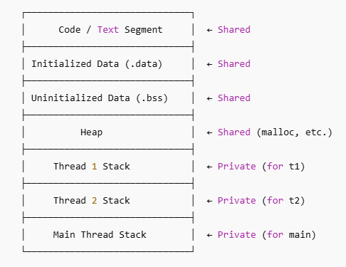

# Thread vs Process

### **Comparison Chart**

|                                                 **Process**                                                 |                                   **Thread**                                   |
| :---------------------------------------------------------------------------------------------------------------: | :-----------------------------------------------------------------------------------: |
|                              Process is also called a **heavy-weight** process.                              |                  Thread is also called **light-weight** process                  |
|                           Operating system interface is required for process switching.                           |                Operating system is not required for thread switching.                |
|                             Each process operates independently of the other process.                             |     One thread can read, write or even completely clean another thread’s stack.     |
|      In multiple processing, each process executes the same code but has its own memory and file resources.      |         All threads can share the same set of open files and child processes.         |
|                                         More Time required for creation.                                         |                           Less Time required for creation.                           |
|                                       System calls involved in the process.                                       |                               No system calls involved.                               |
| If one server process is blocked then other server processes cannot execute until the first process is unblocked. | If one thread is blocked and waiting then the second thread in the same task can run. |
|                                               Uses more resources.                                               |                                 Uses fewer resources.                                 |

***Thread stacks can be located anywhere in the `process's virtual address space.`
They are managed by the kernel via mmap, and there's no requirement for them to be within or between the main thread's stack and heap.***

> **Is it possible that process stack can enter in the boundaries of thread stack ?**

❌ No, under normal and correct operation, a process's main stack cannot intrude into another thread’s stack. Here's why — and how stack boundaries are strictly managed.

> **⚠️ Can Stack Overflow Happen?**
 
 Yes, but it doesn't cross into other threads' stacks unless you're violating memory protections. Two ways this can go wrong:

 1. **Manual Stack Mismanagement (e.g. unsafe pthread_attr_setstack)**
    If you set overlapping or too-small stacks manually, undefined behavior can occur.

 2. **Massive Recursion / Buffer Overflow**
    If you blow past the stack limit, you might corrupt adjacent memory or get a segmentation fault,
    but the OS will usually catch it first via guard pages.

 
