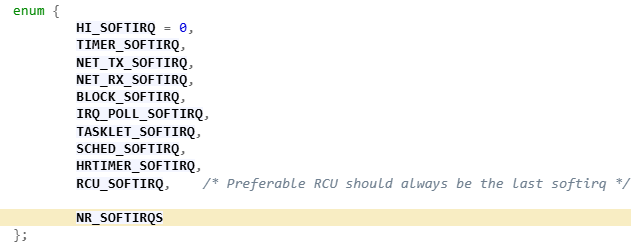
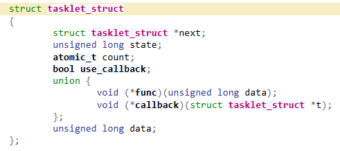

Here's a **crisp, interview-focused answer** — ideal for **quick revision** and **on-the-spot explanation**. It covers **facts, sequence, and justification** without fluff.

---

### ✅ **Tasklets & Softirqs — Interview-Ready Summary**

**🔹 Why Bottom Halves?**
To split interrupt handling:

* **Top half (ISR)**: Fast, minimal work.
* **Bottom half**: Defers heavy processing, avoids delaying IRQs.

---

**🔹 Softirq Basics**

* Fixed set (max **32**) per kernel.
* Preallocated, run in **interrupt context**.
* Can’t sleep. Example: `NET_RX_SOFTIRQ`, `TASKLET_SOFTIRQ`.

---

**🔹 Tasklets = Built on Softirq**

* Tasklets are **built on `TASKLET_SOFTIRQ`**.
* Scheduler: `tasklet_schedule()` internally raises softirq.
* Handled by `tasklet_action()` from softirq framework.

---

**🔹 Lifecycle in Driver**

1. `request_irq()` – Register ISR.
2. ISR → calls `tasklet_schedule(&my_tasklet);`
3. Kernel softirq mechanism runs the tasklet after ISR.
4. If softirq is overloaded → `ksoftirqd` (kernel thread) handles it.

---

**🔹 Tasklet Facts**

* Run in **softirq (interrupt) context**.
* **Never run concurrently on multiple CPUs** (per-tasklet serialization).
* Lightweight, can’t sleep → good for fast atomic ops.
* Use **workqueues** if sleep/block is needed.

---

**🔹 Why Only 32 Softirqs?**

* Static array (bitmask-based).
* Avoid overhead, keep dispatch fast.
* Most work is offloaded via tasklets/workqueues, not new softirq types.

---

### 🎯 When to Use Tasklets

* For deferring **non-blocking, atomic work** from IRQs.
* Prefer tasklets when:

  * You don’t need to sleep
  * You want low overhead
  * You want guaranteed non-concurrent execution

---

Let me know if you'd like this in **flashcard or cheat-sheet format** too.

---

---

1. Interrupt line IRQ i.e 32 can disable on local processor and other processor also in system.
2. There could be one possible scenario where system disable all the IRQ lines on local processor
   but disable only one IRQ i.e 32 on other processors.
3. What kind of work can be done inside top handler ? Usefull tips.

   * If the work is time sensitive.
   * If the work is related to the hardware
   * If the work ensure that another interrupt does not interupt it.
   * **For Everything else, consider performing the work in the bottom half.**
4. "Later" simply means "not now." Bottom halves defer work to a future time when the system is less busy and **interrupts are enabled**—not to a specific moment, just anytime after the interrupt handler finishes.

   - All the kernel’s mechanisms for deferring work are “bottom halves.”
5. **The Original “Bottom Half”**

   ```bash
       The BH interface was simple. it provided a statically created list of 32 bottom halves for 
       the entire system.The top half could mark whether the bottom half would run by setting 
       a bit in a 32-bit integer. Each BH was globally synchronized. No two could run at the 
       same time, even on different processors.This was easy to use, yet inflexible; a simple 
       approach, yet a bottleneck in SMP.

       **Analogy**
       ----------

       Original Linux Bottom Halves (BH) – Explained with an Analogy:

       Imagine a **restaurant kitchen** with **only 32 trays** (slots) to hold delayed orders (these are the **bottom halves**, or BHs).

       * When a waiter (top half/interrupt handler) receives an order quickly, they don’t prepare it right away (too busy!).
       * Instead, they **put the order slip on one of the 32 trays**, marking it as “needs to be cooked later.”

       But here's the catch:

       * **Only one chef can work at a time**, no matter how many chefs (CPUs) are in the kitchen.
       * Even if tray #1 and tray #2 have different orders, **they can't be cooked at the same time**.
       * This system is **simple** and **easy to manage**, but becomes a **bottleneck** as orders (interrupts) increase.

       So:

       * ✅ Easy to use.
       * ❌ Limited to 32.
       * ❌ No parallel work (even with multiple chefs).

       That’s why Linux later introduced better methods like **tasklets** and **workqueues**, to allow more flexible and parallel processing.

   ```
6. Later on, the kernel developers introduced **task queues** both as a method of deferring work and as a replacement for the BH mechanism. to replace the BH interface entirely. It also was not lightweight enough for performance critical subsystems, such as networking.
7. During Linux 2.3, **softirqs and tasklets** were introduced to replace the older BH system.

   * Softirqs are a set of statically defined bottom halves that can run simultaneously on any processor; even two of the same type can run concurrently.
   * Softirq must be registered statically at compile time.
   * Tasklets, built on top of softirqs. **Two different tasklets** can run concurrently on different processors. **Two of the same type of tasklet** cannot run simultaneously.
8. As of now in kernel 2.6 there are main 3 bottom half mechanism in the kernel.

   * softirqs
   * Tasklets
   * WorkQueues.
   * Note: Old BH and task queue interfaces are also available but as memories.
   * `Kernel Timers` is also a mechanism for deferring work.
9. Number of softirqs is statically determined at compile time. As of now in kernel 6.15 NR_SOFTIRQS = 11 entries in `struct softirq_action softirq_vec[NR_SOFTIRQS]`

   
10. A registered softirq must be marked before it will execute.This is called raising the softirq.

    * Usually, an interrupt handler marks its softirq for execution before returning.Then, at a
      suitable time, the softirq runs.
11. Pending softirqs are checked for and executed in the following places:

    * In the return from hardware interrupt code path.
    * In the ksoftirqd kernel thread.
    * In any code that explicitly checks for and executes pending softirqs, such as the networking subsystem.
      NOTE: Regardless of the method of invocation, softirq execution occurs in __do_softirq(),
      which is invoked by do_softirq()
12. Softirqs are reserved for the most timing-critical and important bottom-half processing
    on the system. Currently, only two **subsystems—networking** and **block devices**—directly
    use softirqs.Additionally, kernel timers and tasklets are built on top of softirqs.
13. By convention, **HI_SOFTIRQ** is always the first and **RCU_SOFTIRQ** is always the last entry
14. After a handler is added to the enum list and registered via open_softirq(), it is ready to
    run.To mark it pending, so it is run at the next invocation of do_softirq(), call
    raise_softirq(). For example, the networking subsystem would call, **raise_softirq(NET_TX_SOFTIRQ);**
15. **Implementing Tasklets:**

    1. Tasklets are implemented on top of softirqs, they are softirq.
    2. Tasklets are represented by two softirqs: HI_SOFTIRQ and TASKLET_SOFTIRQ.The only difference in these types is that the HI_SOFTIRQ-based tasklets run prior to the TASKLET_SOFTIRQ based tasklets.
    3. 
       * A union in C allows different fields to share the same memory, so only one of them can be used at a time.
         ```
            if (t->use_callback)
             t->callback(t);
         else
             t->func(t->data);
         ```
       * The state member is exactly zero, TASKLET_STATE_SCHED, or TASKLET_STATE_RUN.
       * The count field is used as a reference count for the tasklet. If it is nonzero, the tasklet is
         disabled and cannot run; if it is zero, the tasklet is enabled and can run if marked pending.
16. **Scheduling Tasklets:**

    1. Scheduled tasklets (the equivalent of raised softirqs)5 are stored in two per-processor structures: tasklet_vec (for regular tasklets) and tasklet_hi_vec (for high-priority tasklets).
    2. Both of these structures are linked lists of tasklet_struct structures. Each tasklet_struct structure in the list represents a different tasklet.
    3. Tasklets are scheduled via the tasklet_schedule() and tasklet_hi_schedule() functions,
    4. Raise the TASKLET_SOFTIRQ or HI_SOFTIRQ softirq, so do_softirq() executes this tasklet in the near future.
17. **Using Tasklets:**

    1. You can create tasklets statically or dynamically.
    2. As with softirqs, tasklets cannot sleep.This means you cannot use semaphores or other blocking functions in a tasklet
    3. Tasklets also run with all interrupts enabled, so you must take precautions.
    4. To schedule a tasklet for execution, tasklet_schedule() is called and passed a pointer to the relevant tasklet_struct:
    5. After a tasklet is scheduled, it runs once at some time in the near future. If the same tasklet is scheduled again, before it has had a chance to run, it still runs only once.
    6. **As an optimization, a tasklet always runs on the processor that scheduled it**
18. **ksoftirqd:**
    **Problem in Simple Terms:**

    **What is happening:**
    The Linux kernel uses softirqs to handle delayed work from interrupts (like network packet processing).

    These softirqs may keep re-triggering themselves if there’s too much load (e.g., a busy network).

    If the kernel keeps handling these softirqs immediately, user apps (your browser, games, etc.) don’t get CPU time → bad experience.

    If the kernel delays softirq handling too much, system functions (like networking) become slow → bad performance.

    Dilemma:
    Option 1: Keep processing softirqs again and again.

    ✅ Softirqs get done quickly.

    ❌ User programs don’t run. System feels "frozen".

    Option 2: Delay re-triggered softirqs until next interrupt.

    ✅ User apps get time to run.

    ❌ System services (like networking) get delayed or fail.

---

    ✅ The Real Solution:
        Don’t process re-triggered softirqs immediately (if already under load).

    Instead, the kernel uses special background threads called ksoftirqd/n (one per CPU core).

    These threads:

    Have the lowest priority, so they won’t interrupt important user programs.

    But they will get CPU time eventually — especially when the system is idle.

    🧠 Smart Behavior:
        If the system is busy, ksoftirqd threads wait their turn.

    If the system is idle, they jump in and quickly process softirqs.

    This way, both:

    User apps run smoothly, and

    System services still complete their work.

    🔄 How ksoftirqd Works (Step-by-Step):
        Each CPU has its own thread: ksoftirqd/0, ksoftirqd/1, etc.

    These threads check: “Are there any softirqs pending?”

    If yes, they call do_softirq() to process them.

    If softirqs keep reactivating themselves (looping), ksoftirqd will keep processing.

    Between rounds, it checks: “Should I pause and let something more important run?”

    Once done, it goes into sleep mode (called TASK_INTERRUPTIBLE) and waits to be awakened again.

| Concept           | Meaning                                                        |
| ----------------- | -------------------------------------------------------------- |
| `ksoftirqd/n`   | Background thread per CPU to handle softirqs when load is high |
| Lowest priority   | So they don’t interrupt user programs                         |
| Runs in idle time | Ensures softirqs finish even when re-triggered                 |
| Avoids starvation | Neither user-space nor kernel tasks are completely blocked     |

---

19. **Work Queues:**

Work queues are a way to delay some work and run it later in a kernel thread.
This work runs in process context, meaning:
It can sleep (pause and wait).
It can use things like semaphores, allocate memory, or do disk I/O.

**Final Summary:**
Work queues = Deferring work to a kernel thread (runs in process context).
✅ Can sleep.
✅ Can do complex operations.

Softirqs/Tasklets = Deferring work in interrupt context.
❌ Cannot sleep.
✅ Super fast and light.

Use work queues when:
You need to block, wait, or do heavy operations.
Use tasklets/softirqs when:
You need quick, non-blocking work after an interrupt.

20. **Implementing Work Queues**

Linux already provides **default worker threads** named events/n(one per CPU), where n = CPU number.
Example:
events/0 → CPU 0
events/1 → CPU 1
These threads process deferred work from different parts of the kernel (including drivers).
So, you don’t need to create your own thread — you can just use the default one, which is the most common way.

When to Create Your Own Thread?
If your task is very heavy, long-running, or performance-critical, you can create a custom worker thread.
Why?

- So you don’t overload the default threads.
- Other work (from other drivers) won’t get delayed.

**Data Structures Involved:**
🔹 **struct workqueue_struct**
    This represents a full work queue system. It contains:
    One cpu_workqueue_struct per CPU (i.e., per worker thread).
    Metadata: name, whether it's single-threaded, real-time, etc.

🔹 **struct cpu_workqueue_struct**
This is per CPU and holds:
    The work list (linked list of pending tasks).
    A lock for protection.
    A wait queue to put the worker thread to sleep until new work arrives.
    A pointer to the actual kernel thread handling the work.
    ```

    struct cpu_workqueue_struct {
        spinlock_t lock; /* lock protecting this structure*/
        struct list_head worklist; /* list of work */
        wait_queue_head_t more_work;
        struct work_struct *current_struct;
        struct workqueue_struct *wq; /* associated workqueue_struct */
        task_t *thread; /* associated thread */
    };
    ```
🔹 **struct work_struct**
    Each individual piece of work is stored in this. It holds:
    The function to run.
    A list entry to link it into the worklist.


# Softirq vs Tasklets

| Properity   | Softirq | tasklets |
|-------------|----------|----------|
| Allocation  | Softirqs are statically allocated at compile-time. Unlike tasklets,<br>you cannot dynamically register and destroy softirqs. | Tasklets can be statically allocated using DECLARE_TASKLET(name, func, data) <br>or can also be allocated dynamically and initialized at runtime using tasklet_init(name, func, data) |
| Concurrency | Softirqs can run concurrently on several CPUs, even if they are of the <br>same type because softirqs are reentrant functions and must explicitly <br>protect their data structures with spinlocks. | Tasklets are non-reentrant and tasklets of the same type are always serialized: <br>in other words, the same type of tasklet cannot be executed by two CPUs at the same time. <br>However, tasklets of different types can be executed concurrently on several CPUs. |
| Processing  | Softirqs are activated by means of the raise_softirq(). The pending softirqs are processed by do_softirq() <br>and ksoftirqd kernel thread after being enabled by local_bh_enable() or by spin_unlock_bh() | Tasklets are a bottom-half mechanism built on top of softirqs i.e. <br>tasklets are represented by two softirqs: HI_SOFTIRQ and TASKLET_SOFTIRQ. <br>Tasklets are actually run from a softirq. The only real difference in these types is that the HI_SOFTIRQ based tasklets <br>run prior to the TASKLET_SOFTIRQ tasklets. So, tasklet_schedule() basically calls raise_softirq(TASKLET_SOFTIRQ) |

