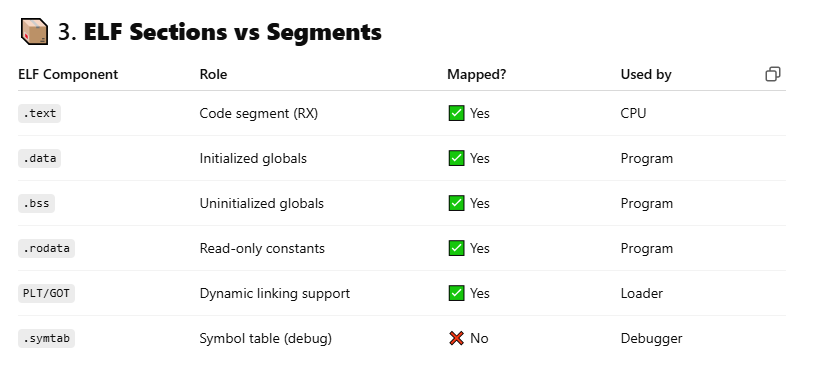
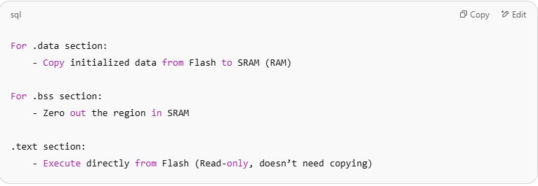
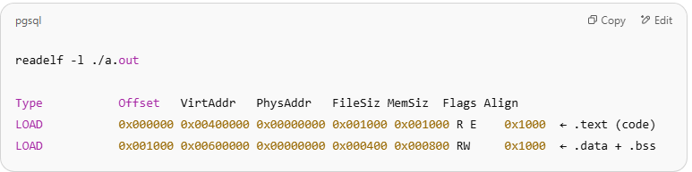
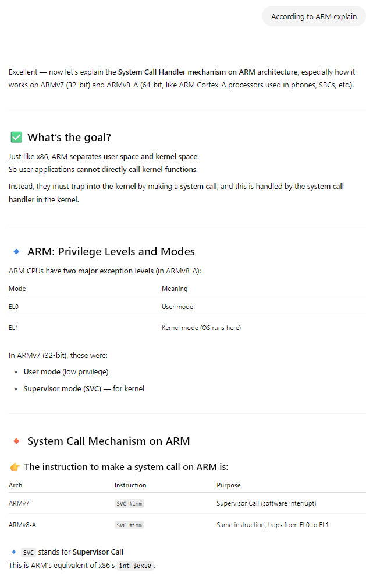
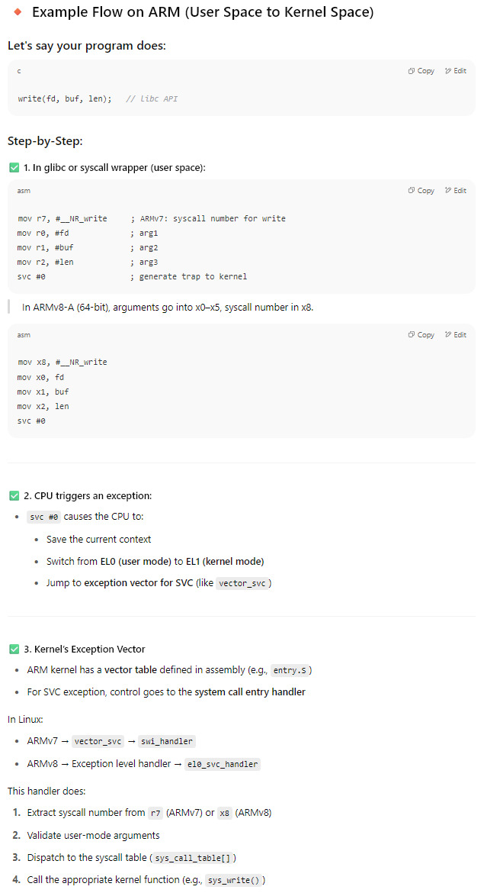
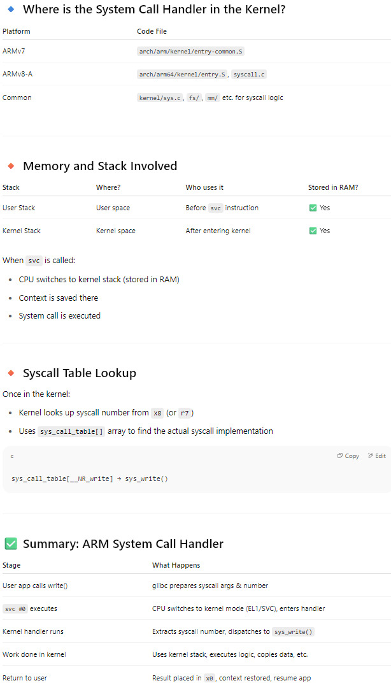
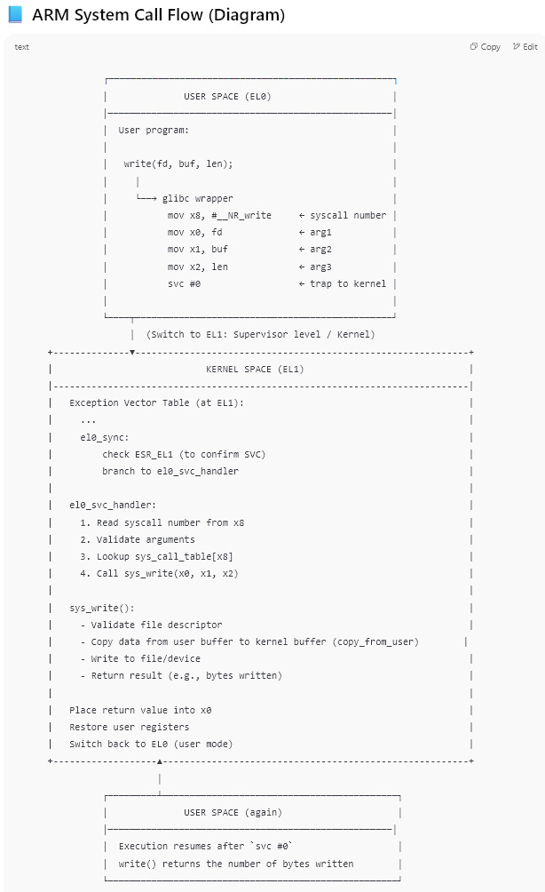

# Deadlock

**How deadlocks are recovered in Linux?**
**How to detect and find out if a program is in deadlock?**
**Are there some tools that can be used to do that on Linux/Unix systems?**

**Deadlocks are not recovered they are avoided**. Once you have a deadlock (caused by wrong programming) the only  solution is to kill the running program and fix it.

If you suspect a deadlock, do a `ps aux | grep <exe name>`, if in output, the `PROCESS STATE CODE` is `D`  (Uninterruptible sleep) means it is a deadlock.

Because as @daijo explained, say you have two threads `T1` & `T2` and two critical sections each protected by `semaphores S1 & S2` then if `T1` acquires
`S1` and `T2` acquires `S2` and after that they try to acquire the other lock before relinquishing the one already held by them, this will lead to a deadlock
 and on doing a `ps aux | grep <exe name>`, the `process state code` will be `D` (ie Uninterruptible sleep).

**Tools:**
Valgrind, Lockdep (linux kernel utility)

# Linux kernel Boot

**1. Bootloader prints "Starting kernel..."**

* This is the last message from the bootloader (e.g., U-Boot).
* It sets up:
  * Kernel image in memory
  * Device Tree Blob (DTB)
  * Initrd/initramfs (optional)
* It sets CPU to correct mode (e.g., EL2/EL1 on ARM64).
* Then it jumps to the  **kernel's entry point** .

**2. Kernel Entry Point in Assembly**

* This is architecture-specific (`arch/arm64/kernel/head.S`).
* It sets up:
  * Stack pointer
  * Basic page tables
  * Exception vector `(Load VBAR_EL1 with virtual vector table address)`
* Turns on **MMU** and  **caches** .
* Then jumps to `start_kernel()` in C.

**3. `start_kernel()` function begins (in C)**

* Located in `init/main.c`.
* It is the first high-level C function in Linux.

**4. `start_kernel()` key steps (highlights):**

> You can memorize these 7 stages:

**(a)** `setup_arch()`

– Parses device tree, memory layout, and CPU info.

**(b)** `mm_init()`

– Sets up memory management and page allocators.

**(c)** `console_init()`

– Sets up early console and `printk`.

**(d)** `printk(linux_banner)`

– **This prints the Linux version banner.**

**(e)** `trap_init()`, `sched_init()`

– Initializes traps, scheduler, timekeeping.

**(f)** `rest_init()`

– Creates the first kernel thread (`init`).

**(g)** `kernel_init()`

– Mounts root filesystem and launches user-space `init`.

## Final Answer You Can Say

> After `Starting kernel...`, the bootloader jumps to the Linux kernel's entry point in assembly (head.S).  It sets up the stack, enables MMU, and switches to virtual addressing. Then it jumps to `start_kernel()` in C,  which handles memory setup, interrupt controller, and early console.  During this, the `printk` function prints the Linux version banner. That's the first message seen from the kernel itself.

## Post-Banner Boot Process

“After the Linux banner is printed, the kernel continues initializing core subsystems.

It sets up interrupts, scheduler, memory zones, and the root filesystem.

Then, it creates the first user-space process by calling `kernel_init()`,

which eventually executes `/sbin/init`, or the init process from initramfs.

From there, user-space starts, and system services come up.”

# How Programs and Libraries are Loaded into Memory

How Programs and Libraries are Loaded into Memory (Linux, ELF format).

When you run a program: `$./my_program` the **kernel loader** (`execve()` syscall) does the job of loading the program and required libraries into memory.

🧠 Step-by-Step: Program Loading:

**1. Disk to Memory (via ELF format)**
Linux binaries (like ./my_program) are ELF (Executable and Linkable Format) files.

> The ELF file contains:
> Code (.text)
> Initialized data (.data)
> Uninitialized data (.bss)
> Symbol tables, headers
> Dynamic linking info

**2. The OS loader (kernel space) does:**
Step	Description
1️⃣	Parses ELF headers
2️⃣	Allocates memory regions for text, data, bss
3️⃣	Loads .text segment as read-only, executable
4️⃣	Loads .data segment as read-write
5️⃣	Allocates .bss and initializes to zero
6️⃣	Sets up stack (with argc, argv, envp)
7️⃣	Maps heap starting after data
8️⃣	Resolves dynamic libraries (e.g., libc.so)
9️⃣	Jumps to entry point (from ELF header)

✅ All of this is triggered by `execve()` under the hood.

**Dynamic Libraries Loading (.so files)**

## Section-2

✅ Microcontrollers (Bare-metal systems)
In bare-metal systems (no OS) — like STM32, AVR, etc.:

The Flash memory contains the entire program.

Upon reset, startup code (bootloader or crt0.s) does this:

🔹 Why is .text executed from Flash?
Because:

Flash is memory-mapped into the address space

MCU executes code directly from it (e.g., at address 0x08000000)

No need to copy .text to SRAM (saves RAM space)

📌 Advantage: Saves SRAM, smaller footprint.

---

✅ Linux (with MMU and virtual memory)
In contrast, on Linux:

ELF executables are loaded from storage (disk, SSD) into virtual memory by the kernel

The .text, .data, .bss sections are mapped into memory (using mmap)

🔹 What happens to .text section?
It is mapped into memory (typically from the file-backed ELF via mmap)

Pages are marked read-only and executable

So it appears as if .text "came to memory", but it’s actually lazy-loaded (demand paging)

📌 Linux needs .text in RAM because:

Code must be paged in and managed by the MMU

Linux supports dynamic linking, relocation, etc.

| Feature                       | Microcontroller (Bare-metal) | Linux (MMU-based system)        |
| ----------------------------- | ---------------------------- | ------------------------------- |
| `.text`                     | Executed from Flash          | Loaded into memory (via mmap)   |
| `.data`                     | Copied from Flash to SRAM    | Mapped into memory (read/write) |
| `.bss`                      | Zero-initialized in SRAM     | Zeroed memory (anonymous mmap)  |
| Code execution                | Direct from Flash            | From virtual memory (RAM)       |
| MMU / paging                  | ❌ No                        | ✅ Yes                          |
| Bootloader initializes memory | ✅ Yes (startup code)        | ❌ Kernel/loader does it        |

🔧 Extra: Embedded Linux on SoCs
In embedded Linux on SoCs (e.g., Cortex-A):

.text is loaded from Flash (e.g., eMMC) into RAM during boot

U-Boot or TF-A loads kernel ELF or uImage into DRAM

No code is executed directly from Flash — everything runs from DRAM

**If all .text section of all the programs copied into RAM than RAM will not have sapce after some time.**

❓ Do all .text sections of all programs stay in RAM and consume space permanently?
➡️ No, and here's why RAM doesn't get full:

📌 Key Points to Say in Interview
Linux doesn't copy full .text sections into RAM upfront — it uses demand paging to load code only when needed.

Code sections (.text) of shared libraries (like libc) are shared among processes — one copy in RAM.

The .text section is memory-mapped directly from disk (ELF), not duplicated.

Clean, unused .text pages can be evicted anytime (no swap needed) and reloaded from disk when required.

This makes RAM use efficient and scalable, even with many processes.

> The .text section is memory-mapped directly from disk (ELF), not duplicated.
> If above line is correct than what happens if the backing ELF file is deleted while the program is still running.
>
> ## 📌 But if you delete the ELF file?
>
> Deleting a file in Linux  **doesn't remove the data immediately** . Instead:
>
> * The  **directory entry is removed** , but
> * The **inode and data blocks remain** if any process still has it **open** (including through `mmap`).
>
> That means:
>
> ✅ **The mapped `.text` section remains valid** in memory
>
> ✅ **The program continues to run normally**
>
> ✅ The program still runs
> ✅ No crash
> ✅ No .text fetch failure
>
> ❌ When could problems occur?
> Only in advanced cases:
>
> | Scenario                                    | Result                                                                               |
> | ------------------------------------------- | ------------------------------------------------------------------------------------ |
> | Page not yet loaded, and deleted ELF        | Kernel might try to fetch missing `.text` page → **fail or SIGSEGV**        |
> | Stripped or truncated file during execution | Could cause crashes (depends on which pages are needed and whether they were loaded) |
> | File overwritten with something else        | Corruption risk increases                                                            |
> | Reboot system                               | Then file is gone, program can’t be started again                                   |

**🧠 Summary (Interview-Ready)**
"Deleting the ELF file of a running program in Linux doesn't crash it immediately because memory-mapped .text pages remain valid as long as they're in memory or the inode is open — but if the program accesses pages that weren’t loaded yet, it can crash."

# Memory Segmentation

Segmentation is a memory management technique used by operating systems to divide a program's memory into logical segments such as code, data, stack, etc. Each segment represents a specific type of content or usage and is addressed separately.

🔍 **1. Why Segmentation?**
Earlier memory models used flat addressing (a single continuous memory space). Segmentation introduced the idea of dividing memory logically to:
Support modularity in programming (code/data separation)
Provide protection (e.g., read-only code segment)
Simplify memory sharing between processes
Handle growing and shrinking segments independently (e.g., stack grows down, heap grows up)
Each segment is handled and protected separately.

## Section-8

🧠 Visual Example
int *arr = malloc(4 * sizeof(int));  // allocates 16 bytes
┌──────────┬────────────────────────────┐
│ Metadata │ Usable Block: 16 bytes     │ ← You only see this
└──────────┴────────────────────────────┘

⚠️ Common Pitfalls and Mistakes:

| Mistake                                       | Explanation                                                  |
| --------------------------------------------- | ------------------------------------------------------------ |
| **Forgetting `free()`**               | Causes memory leaks.                                         |
| **Double `free()`**                   | Causes undefined behavior — may crash or corrupt heap.      |
| **Using after `free()`**              | Called**dangling pointer** — very dangerous.          |
| **Not checking `malloc()` result**    | If memory is exhausted, it returns `NULL`.                 |
| **Assuming memory is zeroed**           | `malloc()` gives garbage data unless you use `calloc()`. |
| **Buffer overflows**                    | Writing past the allocated size corrupts the heap.           |
| **Mixing `malloc()` with `delete`** | Mixing C/C++ memory models is undefined behavior.            |

🧪 Diagnosing malloc Issues:

| Tool                 | Purpose                                          |
| -------------------- | ------------------------------------------------ |
| `valgrind`         | Detect memory leaks, invalid accesses            |
| `asan` (GCC/Clang) | Catch overflows, use-after-free                  |
| `gdb`              | Inspect heap, set breakpoints on `malloc/free` |
| `mtrace()`         | Trace malloc/free behavior                       |

| Function      | Use Case                                               |
| ------------- | ------------------------------------------------------ |
| `malloc()`  | Fast, uninitialized memory                             |
| `calloc()`  | Zeroed memory                                          |
| `realloc()` | Resize while preserving contents                       |
| `free()`    | Always match every `malloc`/`calloc` with `free` |

# Difference between fork, exec and clone 

🔁 fork(), exec(), clone() – At a Glance

| System Call | What It Does                            | Memory Inheritance               | Common Use                                     |
| ----------- | --------------------------------------- | -------------------------------- | ---------------------------------------------- |
| `fork()`  | Duplicates current process              | Copies all memory (COW)          | Traditional UNIX process creation              |
| `exec()`  | Replaces process image with new program | Drops current memory             | Load new program into process                  |
| `clone()` | Customizable process/thread creation    | Share or copy memory selectively | Used in `pthread_create()`, namespaces, etc. |

🧠 fork() – Copy-on-Write Process Duplication
What it does:
Creates a child process that is a copy of the parent, including:

  Memory (stack, heap, data, bss, mmap, etc.)

  File descriptors

  Signals

  Environment, etc.

But Linux uses Copy-on-Write (COW):

  Parent and child share physical memory pages

  When one writes → the page is copied

Memory View:
Parent             Child
 ──────            ──────
 Text   ───▶ shared
 Heap   ───▶ shared (COW)
 Stack  ───▶ shared (COW)

🚀 exec() – Replace the Process Image
What it does:
  Replaces the calling process image with a new program.

  Memory layout is completely discarded and replaced.

> execl("/bin/ls", "ls", "-l", NULL);

After exec():

> New program runs in the same PID.
> Memory: text, stack, heap, env — all new.

⚙️ clone() – Flexible Creation (used in Threads)
`clone()` is lower-level and more flexible than fork().

You can control what is shared between parent and child:
Common flags:

| Flag                               | Description                                 |
| ---------------------------------- | ------------------------------------------- |
| `CLONE_VM`                       | Share memory space (like threads)           |
| `CLONE_FS`                       | Share filesystem info                       |
| `CLONE_FILES`                    | Share file descriptors                      |
| `CLONE_THREAD`                   | Same thread group (like `pthread_create`) |
| `CLONE_NEWUTS`, `CLONE_NEWPID` | Create namespaces (containers!)             |

🔐 Bonus: Memory layout after fork()
After fork():

  Parent and child have identical virtual memory maps.
  Physical pages are shared with COW:
    Read → shared
    Write → page is duplicated
  Changes in one do not affect the other (unless mmap(MAP_SHARED))
 
 ----------------

# How does system call works ?

 