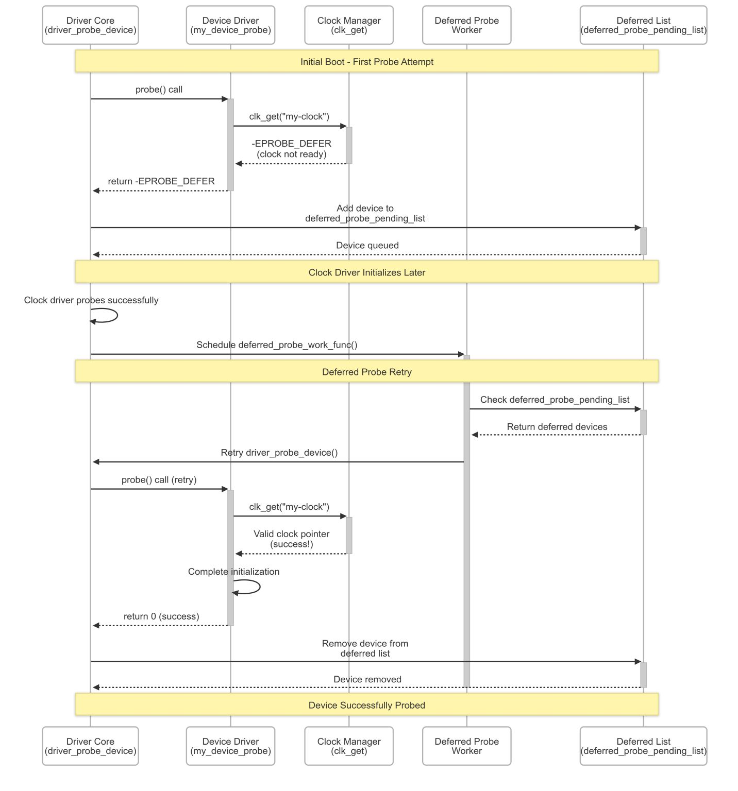

# Linux kernel Module dependecy

Ever wondered how Linux gracefully handles device dependencies during boot when driver probe order isn't predictable?

The Problem: Device discovery (e.g., via Device Tree) doesn't guarantee dependency order. A driver might probe before its required resources—clocks, regulators, GPIO controllers—are ready.

The Solution: Deferred Probing - When a driver needs an unavailable resource, it returns -EPROBE_DEFER instead of failing.

The kernel then:

1. Moves the driver to a deferred list
2. Retries after each successful probe (when new resources become available)
3. Eventually, it times out to prevent infinite loops

This mechanism transforms potential boot failures into graceful dependency resolution, allowing complex hardware to initialize reliably regardless of discovery order.

I once debugged a driver that seemed to have perfect DTS matching but whose probe() never seemed to execute. The culprit? Silent -EPROBE_DEFER returns due to a broken clock driver dependency. The driver kept deferring indefinitely without logs, making it appear as if probe() wasn't being called at all!

