CPU usage can spike to 100% during a benchmark test, but one thing that always caught my attention when I was younger was that even though the CPU is completely maxed out, the system doesn't become unusable. This is mainly because general-purpose operating systems prioritize response time, ensuring that interactive applications stay smooth even under heavy load.

Today, we're going to talk about the CPU scheduler, one of the most important components of any operating system.

Hi friends, my name is George. This video is hard to edit, but it is full of information, so here’s the content table in case you need to jump to a specific topic.
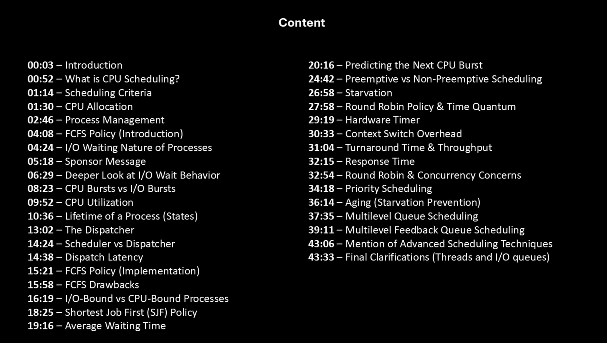

CPU scheduling is a technique used by operating systems to determine which task or process gets to use the CPU at a given time based on specific criteria. One important criterion is response time, as mentioned in the introduction. However, depending on the system, other criteria might also be important, such as CPU utilization, throughput, turnaround time, and waiting time. We will explore these concepts throughout the video.

We are going to start by building a very simple scheduler. By far, the simplest CPU scheduling algorithm is the first-come, first-served scheduling algorithm. With this scheme, the CPU is allocated to the first process that requested it.

To begin with, we must be clear about what it means to allocate the CPU to a process. When a program is executed, it becomes a process, and the operating system reserves a memory block for it. Within this block, there’s a memory segment called the text section, which contains the executable code for the program. Each process has its own dedicated text section.

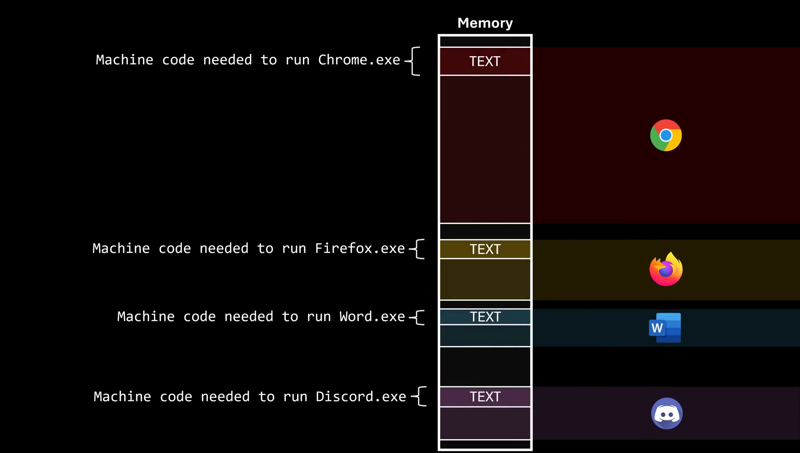
From our Computer Architecture from Scratch course, we know that the CPU contains a special register called the address register, also known as the program counter. This register points to the next instruction to be executed.
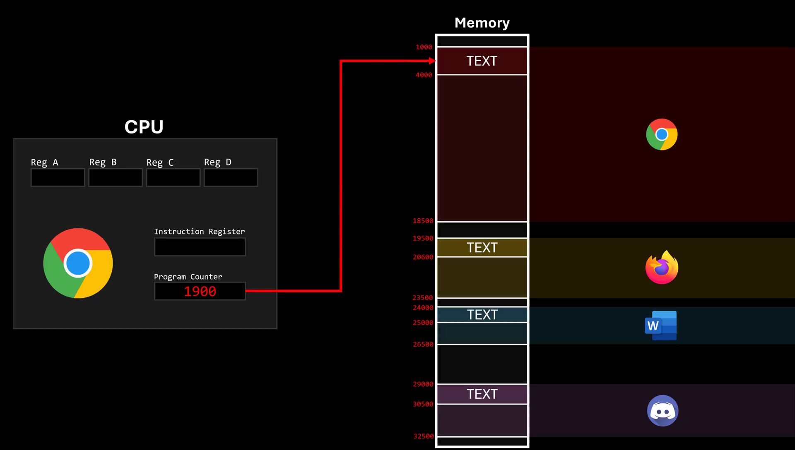
When we say the CPU is allocated to a process, it means that this register is pointing to the text section of that process, enabling the CPU to execute instructions from it.

When the CPU is reallocated to another process, the operating system modifies the address register so it points to the executable code of the new process. This involves a more complex operation called a context switch, which we’ve covered in more detail in previous episodes.
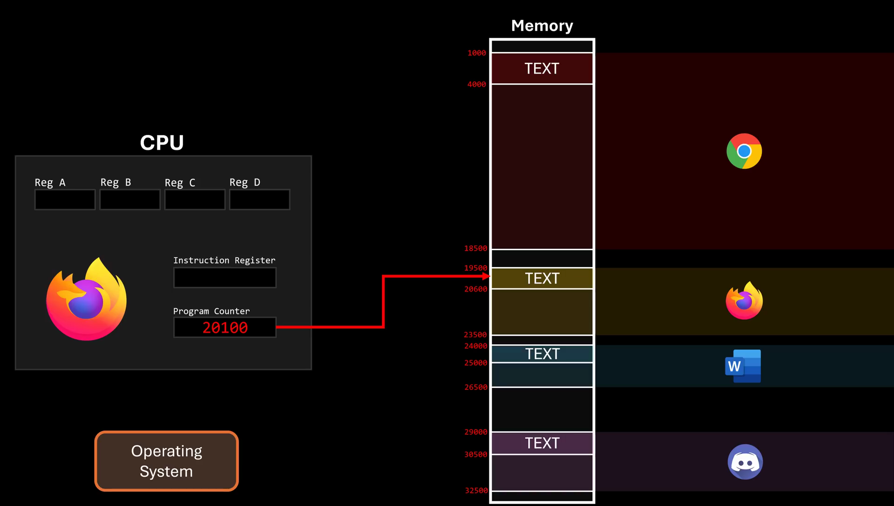

Another important concept to understand is that processes aren't concrete entities like objects or instances of structures in the traditional computer science sense. Instead, processes are contexts in which the computer operates.
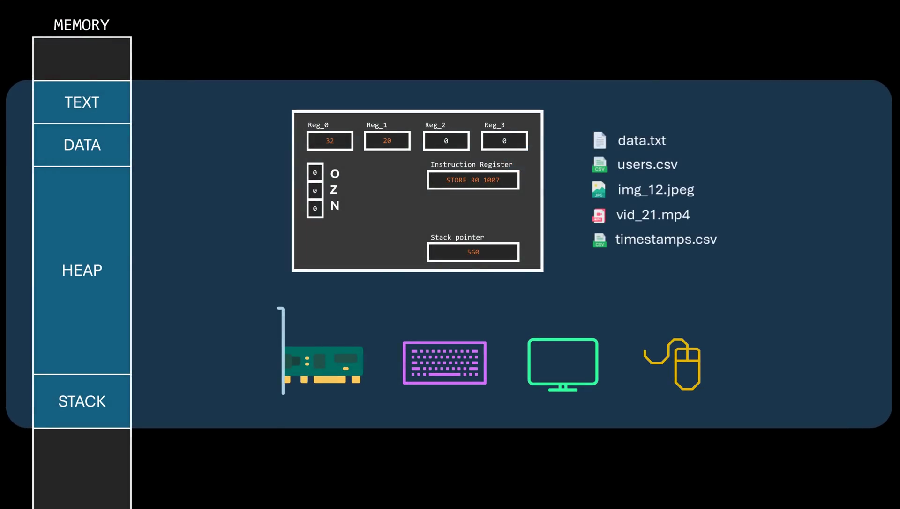

To manage these processes, the operating system uses a special structure called the process control block, or PCB. This struct is not the process itself but rather a representation of it, containing all the necessary information about the process such as its state, program counter, registers, and other management data.

Every time a process is created, the operating system generates a process control block to keep track of that new process.
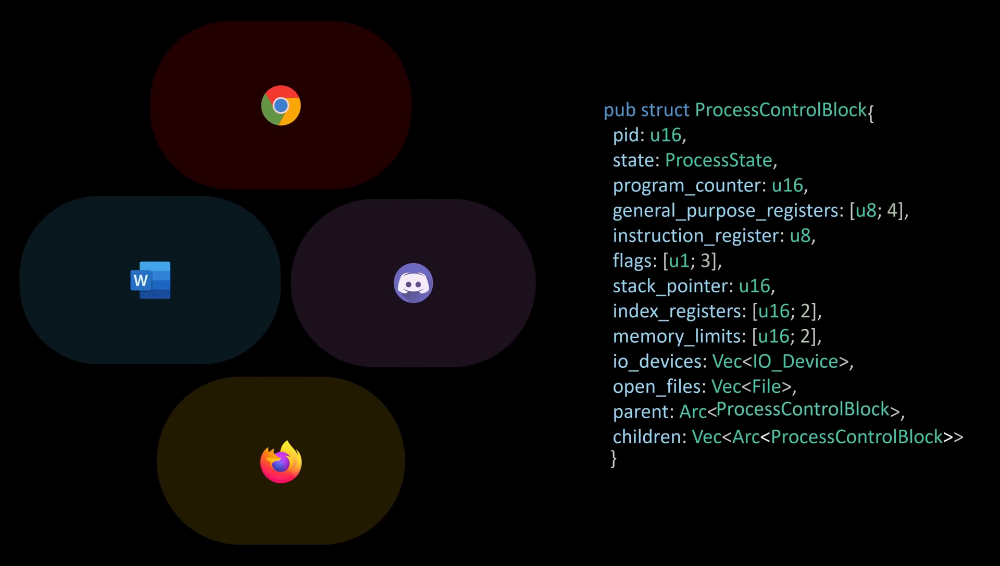

The implementation of the first-come, first-served policy is easily managed with a FIFO queue, which makes sense here because it operates on the principle that the first element added to the queue is the first one to be removed.

But we cannot directly push processes into this queue because processes are abstract contexts and cannot be treated as discrete elements of any data structure.
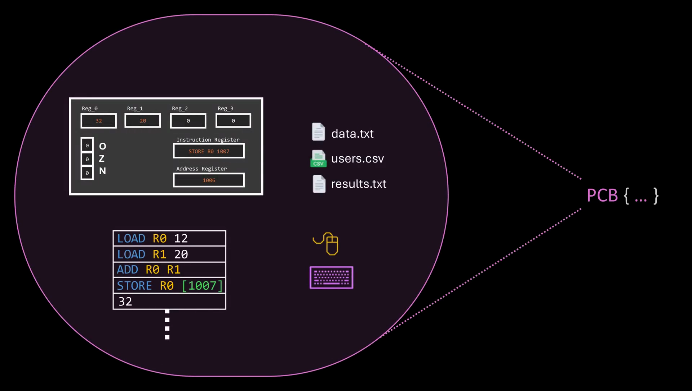
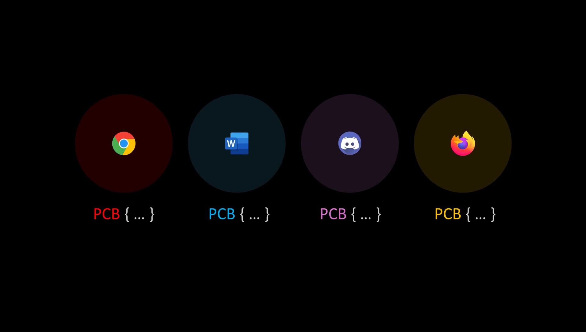
Instead, what the operating system does is push the process control block of each process into the queue.

Throughout this video, I’ll represent PCBs as boxes, and you’ll often, if not almost always, hear me refer to them as processes. But remember that what enters the queue isn’t actually a process but its process control block.
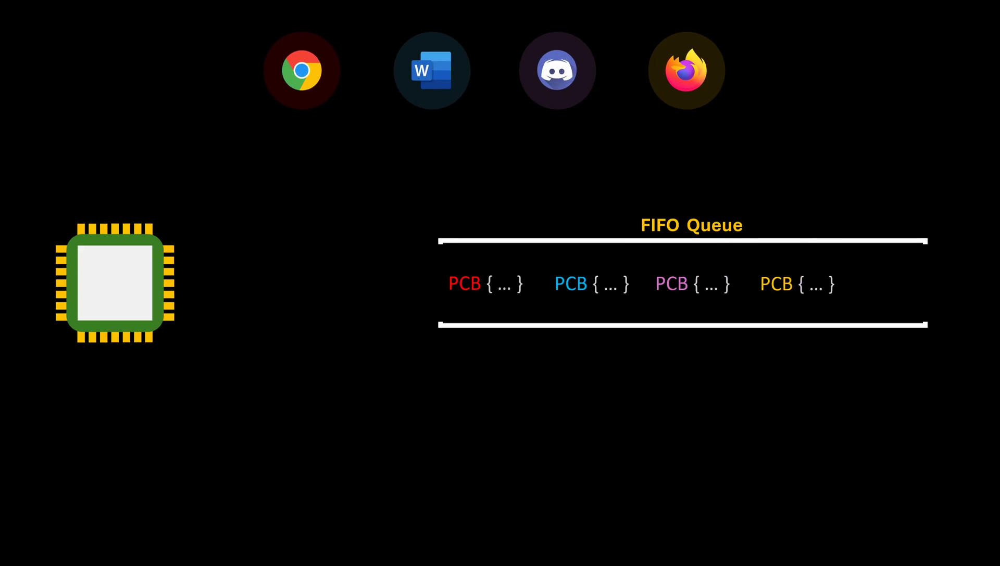
In first-come, first-served scheduling, when a process is created, its process control block is pushed onto the tail of the queue. When the CPU is free, it is allocated to the process at the head of the queue.

Sounds simple, right? Well, not quite. There’s a lot we’re overlooking.

For starters, we are assuming that a process can only get the CPU once the previous process has completed its execution. This causes a lot of problems.

First, not all processes terminate. Many applications, such as servers or background services, are designed to run indefinitely. If we allocate the CPU to a process that never ends, all subsequent processes would be indefinitely waiting in the queue.
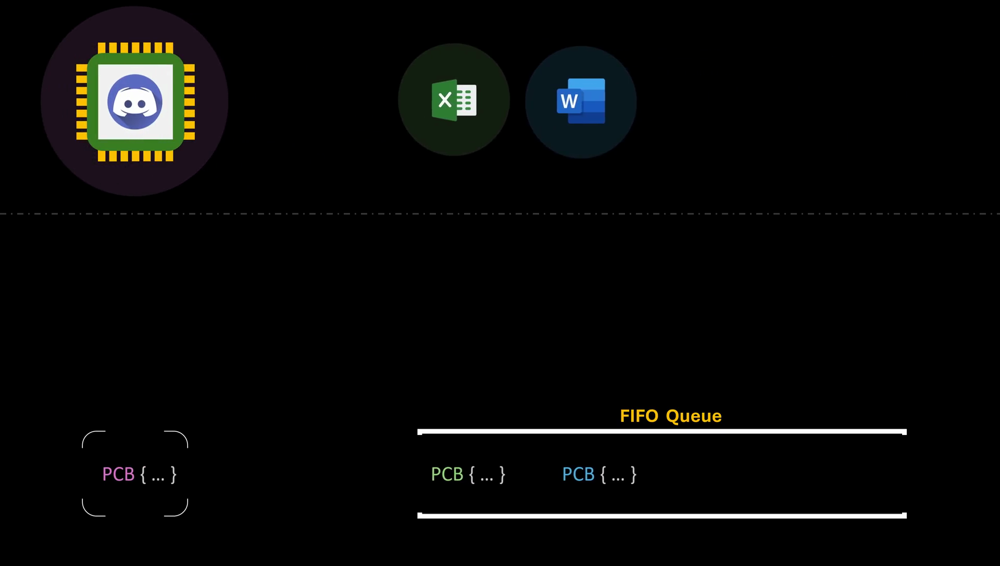
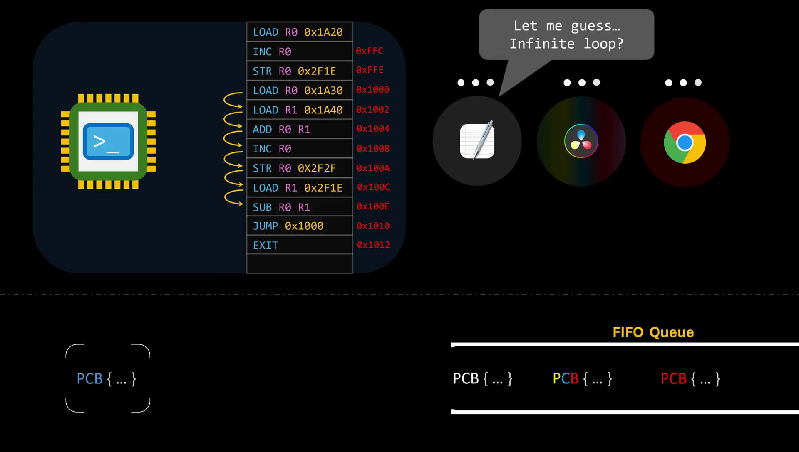
Second, if we assume that a process can only get the CPU once the previous process finishes its execution, we ignore an important fact: programs in execution don’t use the CPU continuously. If a task takes 2 minutes to execute, it doesn’t mean it kept the CPU busy for the entire 2 minutes. During execution, there are often periods where the program is waiting for something else.
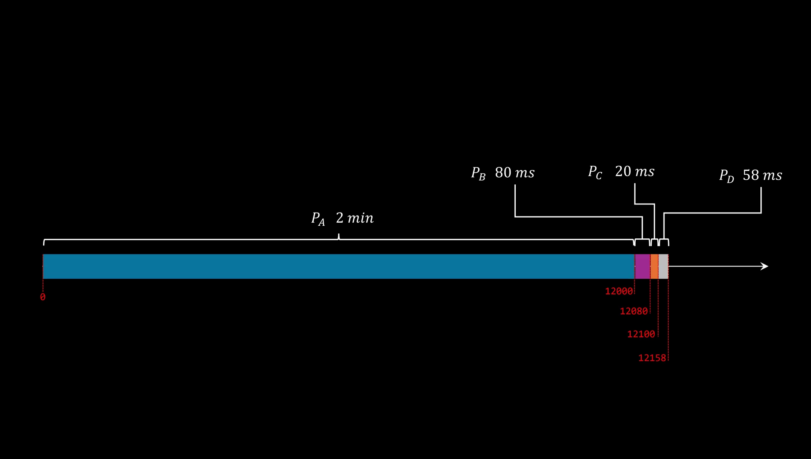
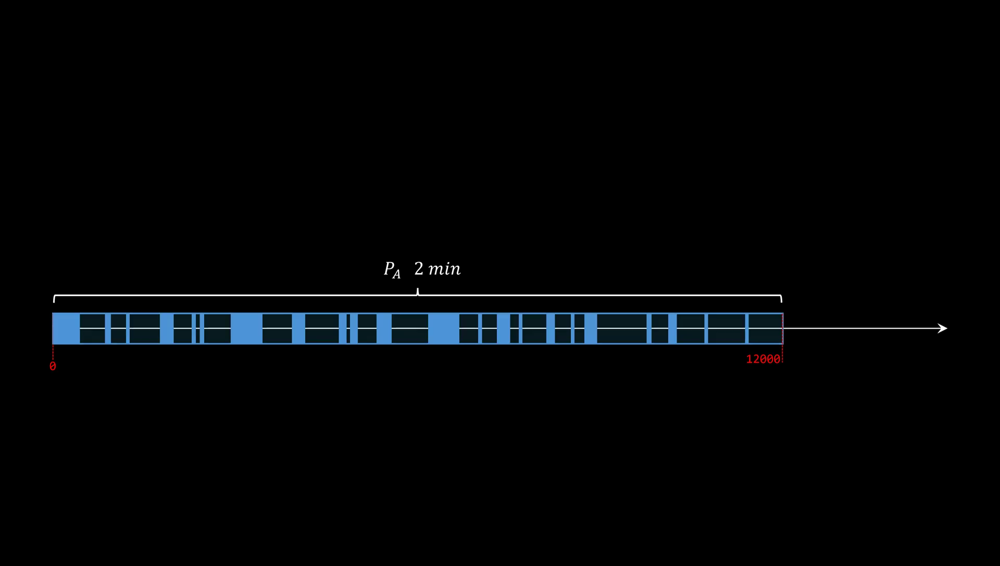
To illustrate this, let’s break it down with an example program. Its purpose is to copy the content from one file to another, but to avoid using a lot of memory, it copies data in chunks—let’s say eight bytes at a time. We’re particularly interested in the part of the program where the copying happens.
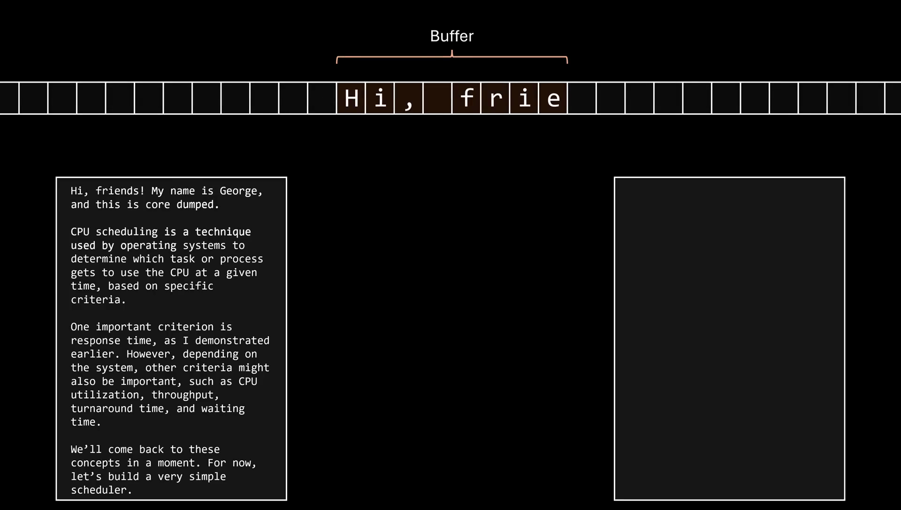

If we were to observe the instructions being executed by the computer, it might look like this.
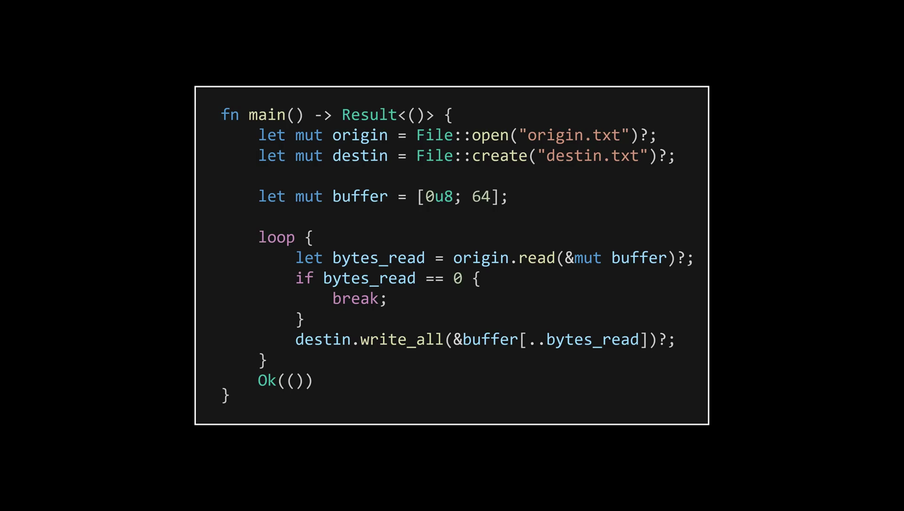

Now, it might initially seem like these instructions are executed continuously, one after another, but if we were to represent it more accurately, it would look quite different—something more like this.
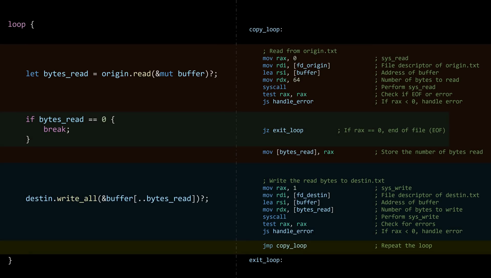

Reading from and writing to files requires the program to invoke the operating system, as file manipulation involves interacting with hardware—in this case, the disk. In other words, reading and writing involve IO operations.

The real problem here is that IO operations are usually costly in terms of performance—they can take a long time to complete.

These instructions simply cannot be executed immediately after the previous one, not until the IO operation managed by the system call is completed, which entirely depends on the IO hardware capabilities, not the CPU.
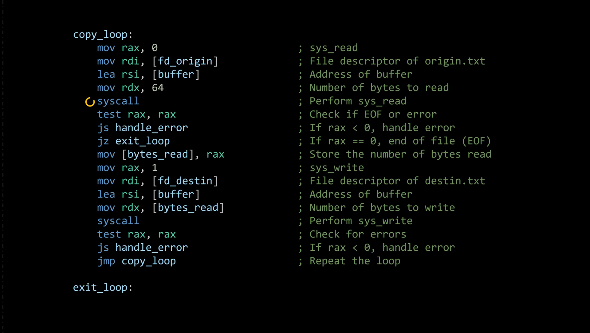

As a result, the program does not use the CPU continuously.

If we were to map CPU usage of a program over time, we would see gaps where the CPU remains idle waiting for IO operations to finish before continuing execution.
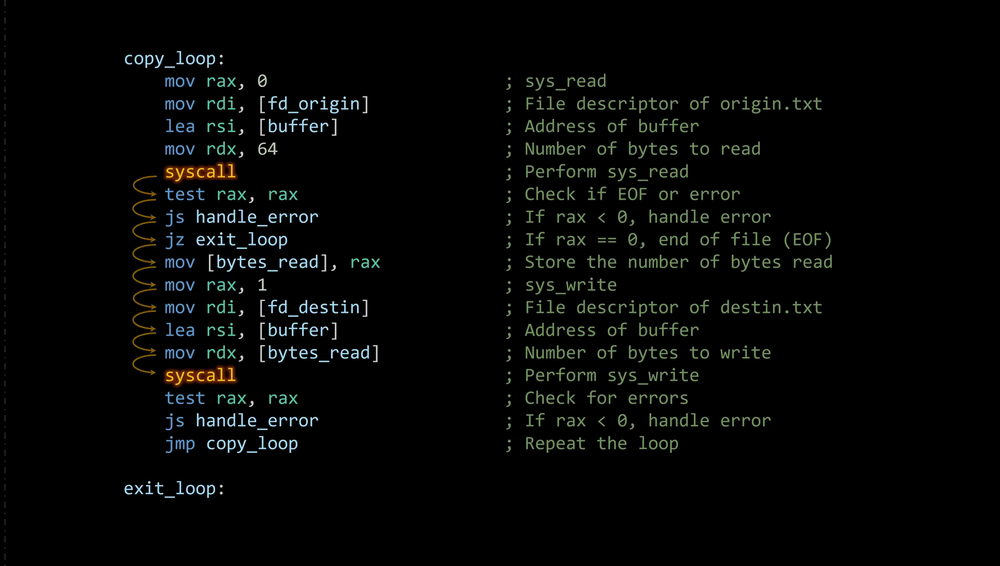
These gaps are not the exception but the norm, at least in systems based on the Von Neumann architecture, which represents over 99% of modern computers.

In fact, this behavior is so common that it has been continuously studied for decades.

Those lapses when a program is using the CPU are called CPU bursts, while those time lapses when the program is waiting for an IO operation to complete are called IO bursts.
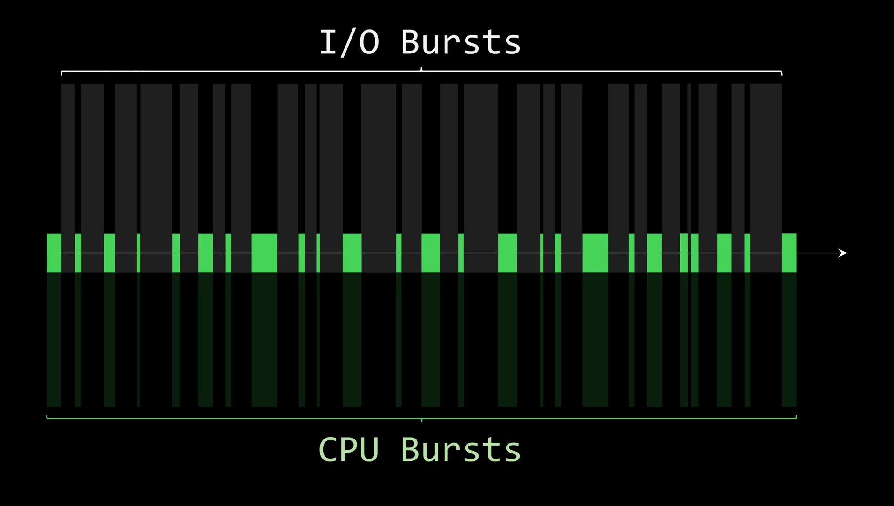
Every process execution begins with a CPU burst that is followed by an IO burst, which is followed by another CPU burst, then another IO burst, and so on. Eventually, the final CPU burst ends with a system request to terminate execution.

As I mentioned earlier, this behavior has been studied for decades, as the success of CPU scheduling largely depends on it.

The durations of CPU bursts have been extensively measured, and while they vary between processes and systems, they tend to follow a predictable distribution that looks like this.

This next part is very important. Before continuing, take a moment to pause the video and analyze what this chart represents.

The chart shows that most processes have a large number of short CPU bursts and only a small number of long CPU bursts.

This is a critical observation for designing CPU scheduling algorithms because it highlights that processes often spend significant time waiting for IO operations.

If a scheduling algorithm doesn’t account for this behavior, a lot of CPU time will be wasted.
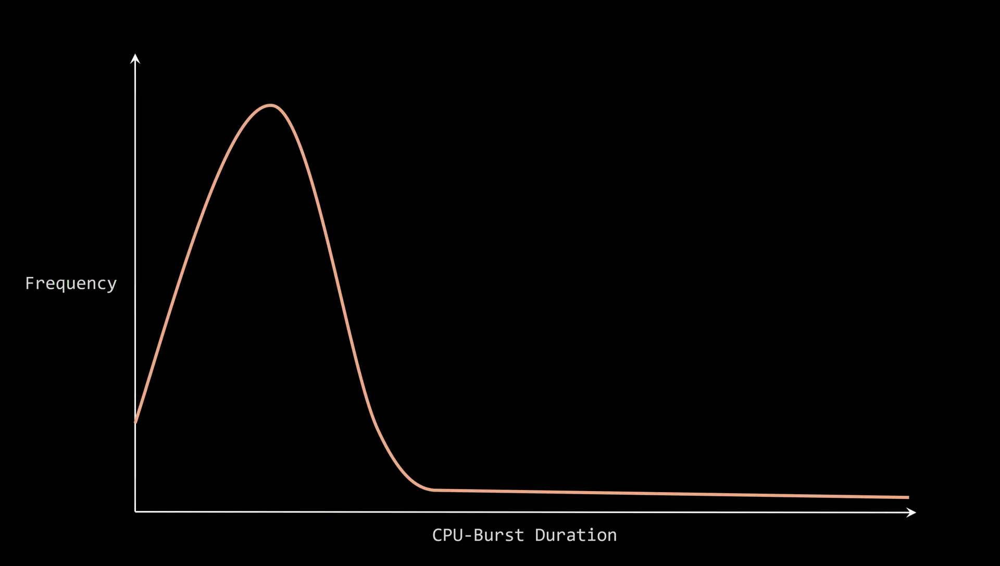

So, when a process enters an IO burst, ideally the CPU should be allocated to a different process—one that isn’t also waiting for IO operations.

One of the main goals of CPU scheduling is to—keep the CPU as busy as possible allowing processes to run as fast as they can while sharing the CPU
notice that a process's CPU burst never starts immediately after the previous one ends there is
always a small additional process in between which I've represented in gray i'll come back to this
in a moment 
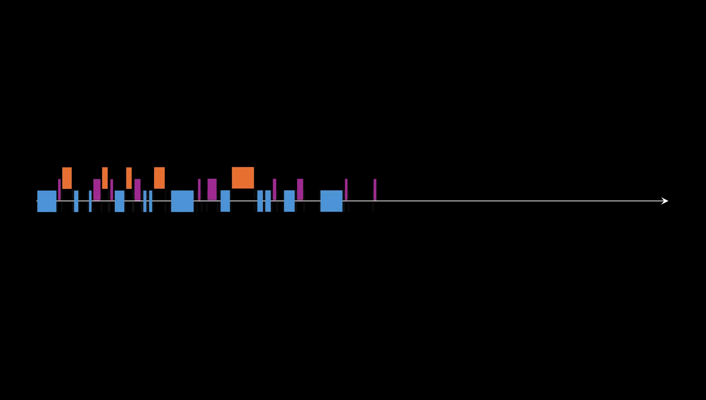

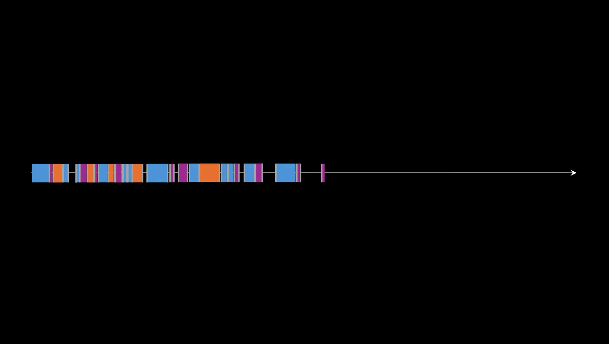

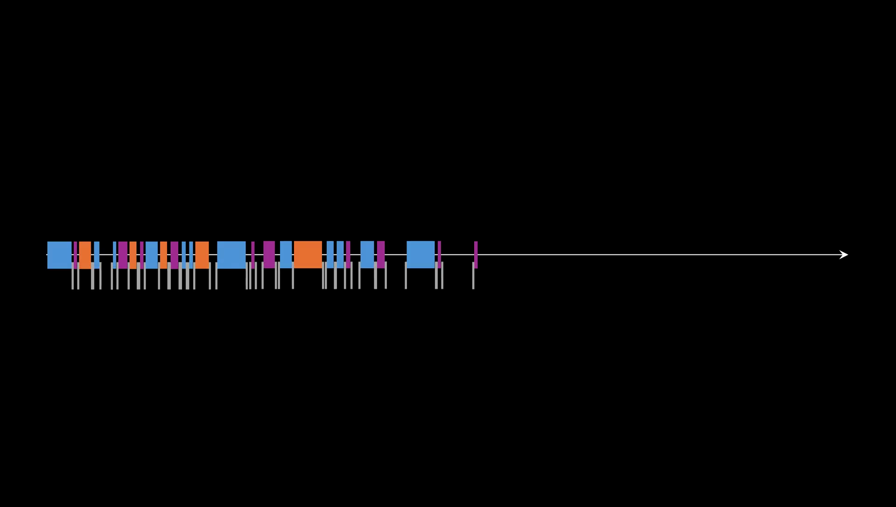
what's important to understand right now is that a scheduling algorithm must take this
into account instead of allocating the CPU to a process until it fully terminates the rule should
allocate it only until the process's current CPU burst ends achieving this behavior of course makes
the implementation of ouruler a little more complex because now we need to consider that processes
can be in different states.

---

Every process begins in the new state. A new process is a program that has just been launched, but its executable file is still being loaded into memory. Once the program is fully loaded and all necessary resources are allocated, the process enters the ready state, meaning it is prepared to execute but is waiting for CPU time.

When the CPU is assigned to a process, it enters the running state. At some point, the process will likely make a system call, such as an IO request, which voluntarily returns control of the CPU to the operating system.

Keep in mind that an IO call is not only made to request some resource, like manipulating a file or allocating memory, but also to simply wait for some event to happen, such as a user keystroke or an incoming network request.

In both cases, the process moves to the waiting state until the event happens or the IO operation is completed.

Once the request is fulfilled, the process becomes ready again, waiting for the scheduler to allocate CPU time.

Notice that even when the IO operation is completed, the process does not immediately resume execution. This happens because while the process was waiting, the CPU has most likely been allocated to another process. So, even though it is now ready to continue running, it must wait for its turn.

For most of their lifetime, processes cycle between these three states: ready, running, and waiting.

Some processes, such as web servers, are designed never to terminate and remain in this cycle indefinitely. But for most user programs, the process eventually enters the terminated state.

These names are arbitrary and they vary across operating systems. The states that they represent are found on all systems. However, certain operating systems also more finely delineate process states.

For example, a terminated process may not be really terminated. After making a system call to exit, the operating system must free allocated resources, including memory.

Some operating systems make a clear distinction between a process that has been fully terminated and one that is still in the process of termination.
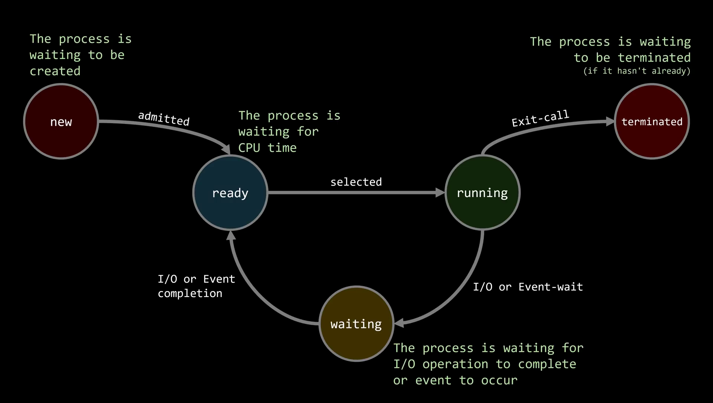

This state model explains why queues are the fundamental data structure used in CPU scheduling.

Even though there is a specific waiting state, processes in other states except the running state are also waiting.

Given that hundreds of processes may be waiting at any moment, using queues to manage their execution order is both logical and efficient.

It is important to realize that only one process can be running on a processor core at any given time.

This means that while a queue makes sense for waiting processes, it does not apply to the running process.

When studying CPU scheduling algorithms, it is necessary to be aware of another component of the operating system: the dispatcher.

When a running process enters an IO waiting state and the CPU becomes available, the dispatcher steps in with one single purpose: allocate the CPU to the process at the head of the ready queue—in other words, perform the context switch.

Although the running process is not stored in any queue, a reference to its process control block (PCB) is always maintained.

This allows the dispatcher to save the CPU state into the PCB when an interruption occurs. This saved state enables the process to resume execution later.

The dispatcher then places the PCB into the waiting queue.
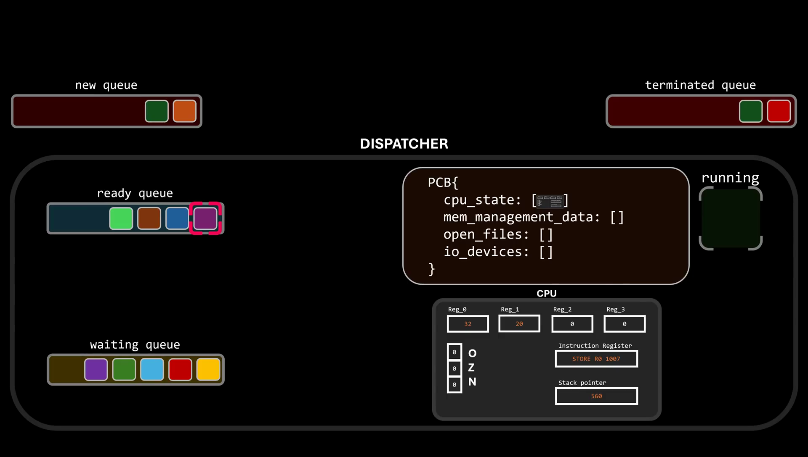

Next, after handling the interrupted process, the dispatcher retrieves the PCB of the next process from the head of the ready queue, identifies it as the new running process, restores its previous CPU state—including registers and the program counter—and reallocates the CPU, allowing the process to resume execution from where it was interrupted.

If the processor supports it, the dispatcher is also responsible for switching to user mode before handing control to the process.

In other words, the scheduler determines which process should use the CPU next by managing the ready queue according to a specific scheduling policy, while the dispatcher is responsible for the execution of the decision made by the scheduler.

These additional CPU bursts caused by the dispatcher are inevitable since the CPU itself is required to execute the context switch.

This delay is known as dispatch latency—the time it takes for the dispatcher to stop one process and start another.
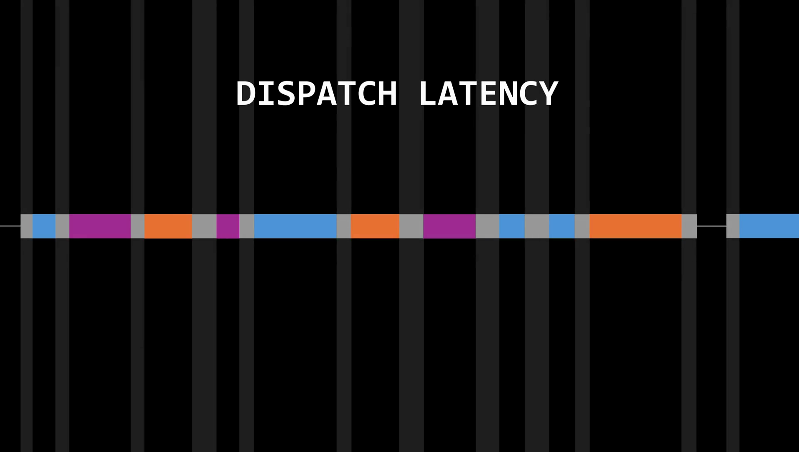
Because the dispatcher is invoked during every context switch, it must be as fast as possible.

For this reason, the dispatcher is one of the most highly optimized components of an operating system.
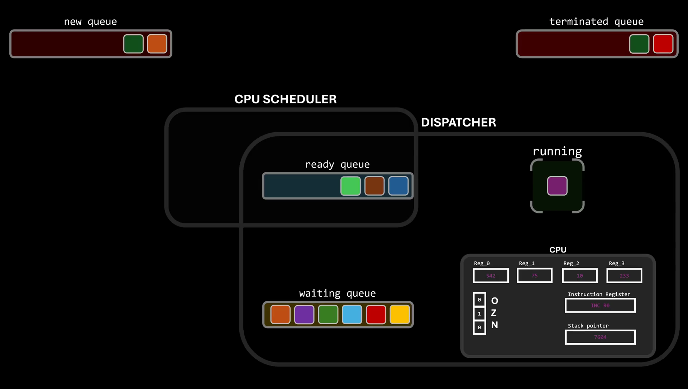

Since it is implicit, the dispatch latency is usually not illustrated between processes.

By the way, this is a variant of something known as a Gantt chart—a bar chart that illustrates a specific schedule showing the start and finish times of each participating process.

In first-come, first-served scheduling, this policy is implemented using a FIFO queue as the ready queue.

As soon as a process makes an IO request, the CPU is immediately allocated to the process at the head of the queue.

Notice that the name first-come, first-served can be somewhat ambiguous because the scheduler is not actually managing entire processes but rather their next CPU burst.

A more precise name would be first CPU burst come first served.
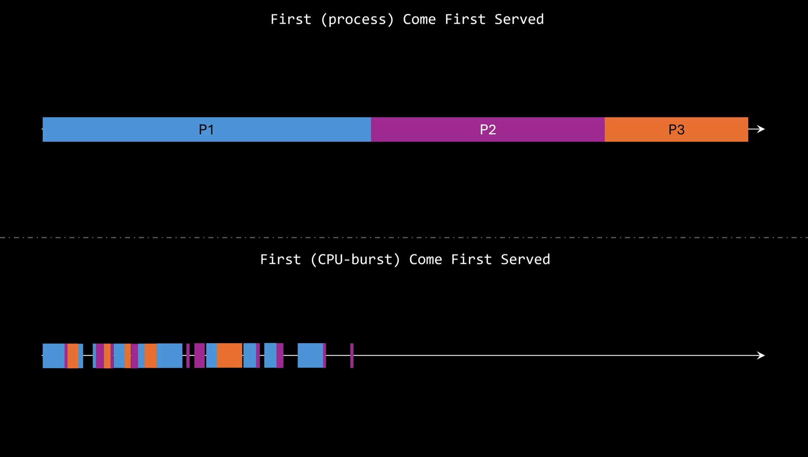
That said, since many books and resources continue to refer to it as first-come, first-served, we’ll stick with that convention.

And with that, we have the simplest CPU scheduling algorithm.

But while it does take CPU utilization into account, that doesn’t mean it’s effective at optimizing it.
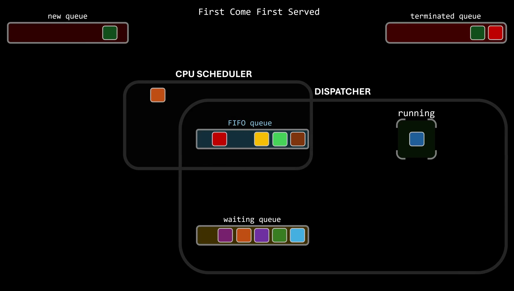

To understand why, let’s go back to our CPU burst frequency graph.

Notice that while very large CPU bursts are rare, their probability is never zero.

The most common processes, those with a high number of short CPU bursts, are known as IO-bound processes.

These processes depend heavily on IO operations, meaning their performance would improve if the IO subsystem were faster.
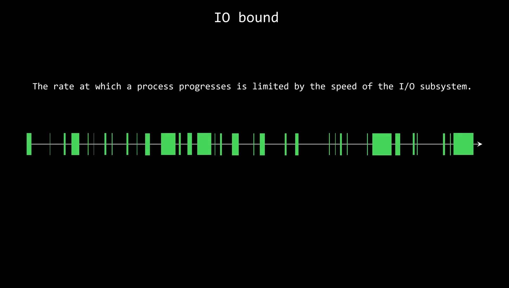

But it is also possible to have processes that exhibit a high number of long CPU bursts.

Unlike IO-bound processes, these processes do not benefit significantly from a faster IO subsystem.

Instead, they depend on faster CPU speeds, and for that reason, these are called CPU-bound processes.

The problem with CPU-bound processes and the first-come, first-served scheduling algorithm is that they can generate a negative effect on CPU utilization.
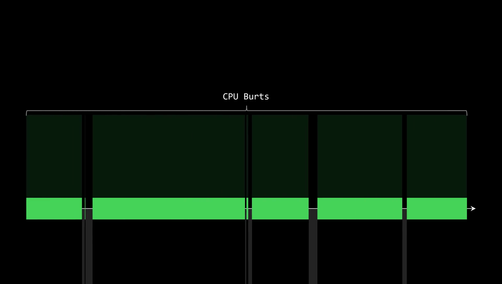
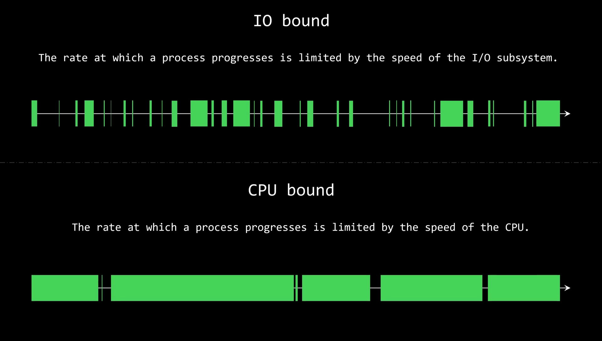
Imagine we have one CPU-bound process and some IO-bound processes.

For convenience, I’m going to use the same color for the IO-bound processes.

The CPU-bound process will get and hold the CPU for a relatively long time.

During this time, all the other processes will finish their IO and will move into the ready queue, waiting for the CPU.

While the processes wait in the ready queue, the IO devices are idle.

Eventually, the CPU-bound process finishes its CPU burst and moves to an IO device.

All the IO-bound processes, which have short CPU bursts, execute quickly and move back to the IO queues.

At this point, there’s no process to dispatch, and the CPU sits idle.

The CPU-bound process will then move back to the ready queue and be…

---

CPU Scheduling Algorithms
Allocated the CPU again, all the I/O processes end up waiting in the ready queue until the CPU-bound process is done. See the problem here? There is a convoy effect as all the other processes wait for the one big process to get off the CPU. This effect results in lower CPU and device utilization than might be possible if the shorter processes were allowed to go first.
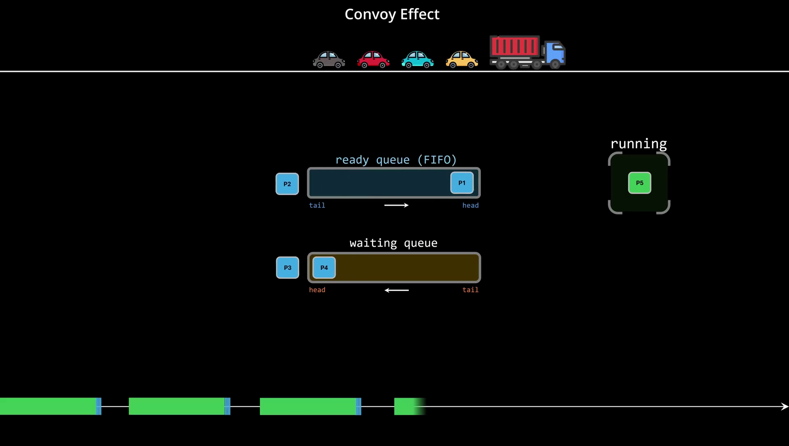

Yes, the shortest job first scheduling algorithm exists and is the next one we are going to learn. Shortest job first assigns the CPU to the process with the shortest next CPU burst. If two processes have the same burst length, first come first served is used as a tiebreaker. Again, note that a more precise name would be shortest next CPU burst first scheduling since it prioritizes the next CPU burst rather than the total process length. Most people in books refer to it as shortest job first, so once again, let's stick to that convention.

This algorithm can be implemented using a priority queue where priority is determined by the length of the next CPU burst of the waiting processes. This allows those short CPU burst processes to overtake those CPU-hungry processes, reducing the convoy effect. This algorithm is also provably optimal in that it gives the minimum average waiting time for a given set of processes.
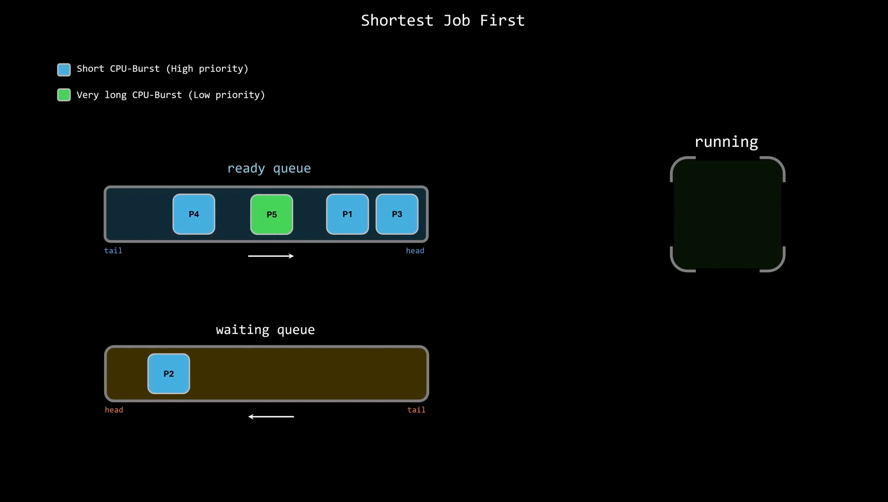

Imagine we have four processes that arrive almost simultaneously. The first process's next CPU burst takes 2 minutes to complete, while the others only take a few milliseconds each. In first come first serve, if those shorter CPU bursts arrive just after the long CPU burst, they would experience significant delays because they'd have to wait for the longer to finish. On the other hand, if processes with short CPU bursts are allowed to go first, their waiting times would be minimal, and the process with the longer CPU burst would barely be affected. It would simply start a few milliseconds later, which would make little difference to it.
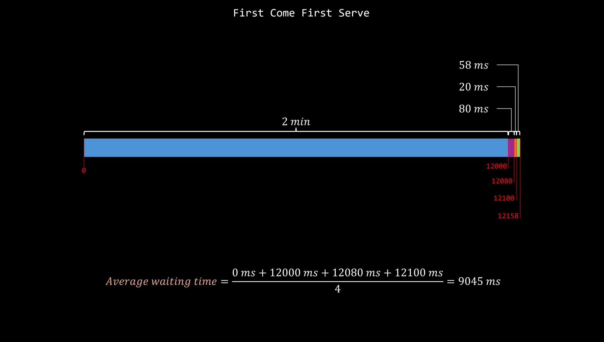

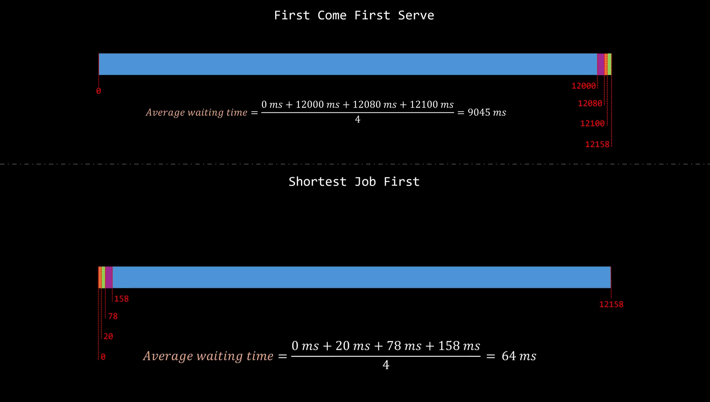

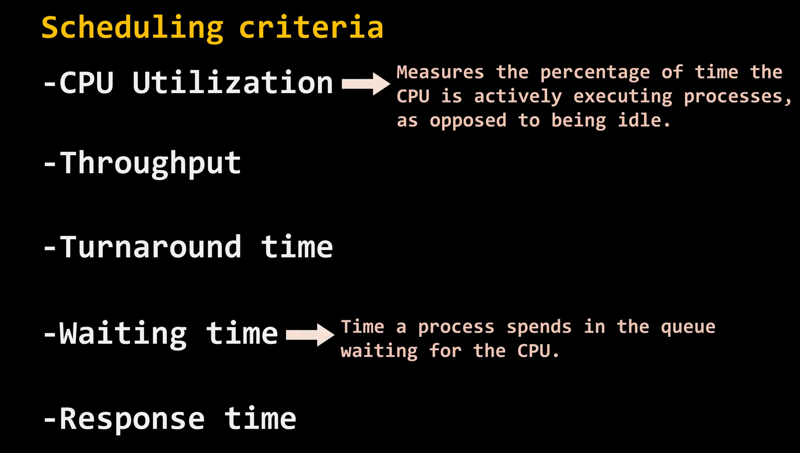

Moving a short process before a long one decreases the waiting time of the short process more than it increases the waiting time of the long process. Consequently, the average waiting time decreases. Minimizing the average waiting time in a system is crucial because it represents the time that processes are ready to run but cannot execute as they wait for their turn to use the CPU.

There are important considerations to keep in mind whenever auler relies on priority queues, as we'll explore later. But there's one major issue specifically tied to shortest jobs first: it is impossible to implement perfectly because unless we could see the future, there is no way to know the exact length of a process's next CPU burst. You might think that we could use the program counter to determine where the next system call occurs and how long the process will use the CPU before its next I/O burst. However, this approach is unreliable because between the current instruction and the next system call, there can be loops or function calls that alter execution time. The program's execution path may depend on external inputs, like user input, making prediction even harder.

For example, this function takes a user input, converts it to uppercase, and then prints it. The amount of iterations depends on the length of the user input. Since we cannot know the exact next CPU burst, the best we can do is estimate it based on past CPU bursts with the assumption that the next CPU burst will likely be similar in length to previous ones. To approximate this value, we compute an estimate using an exponential average of previously measured CPU bursts. I know this isn't rocket science, but if you're not into math, I'll break it down.
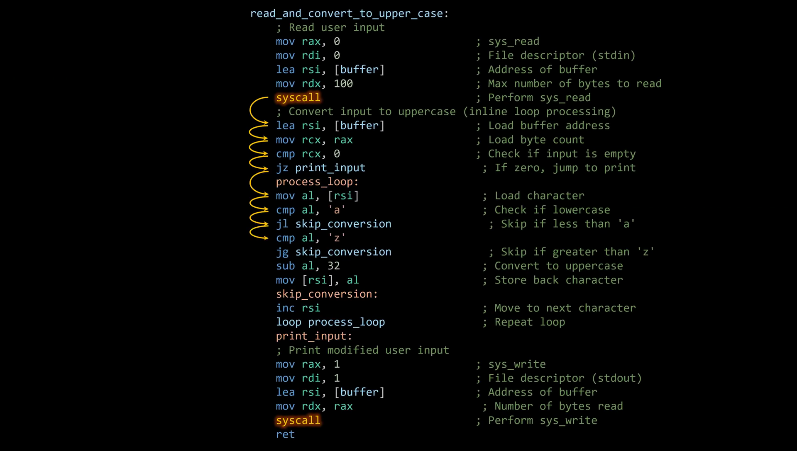

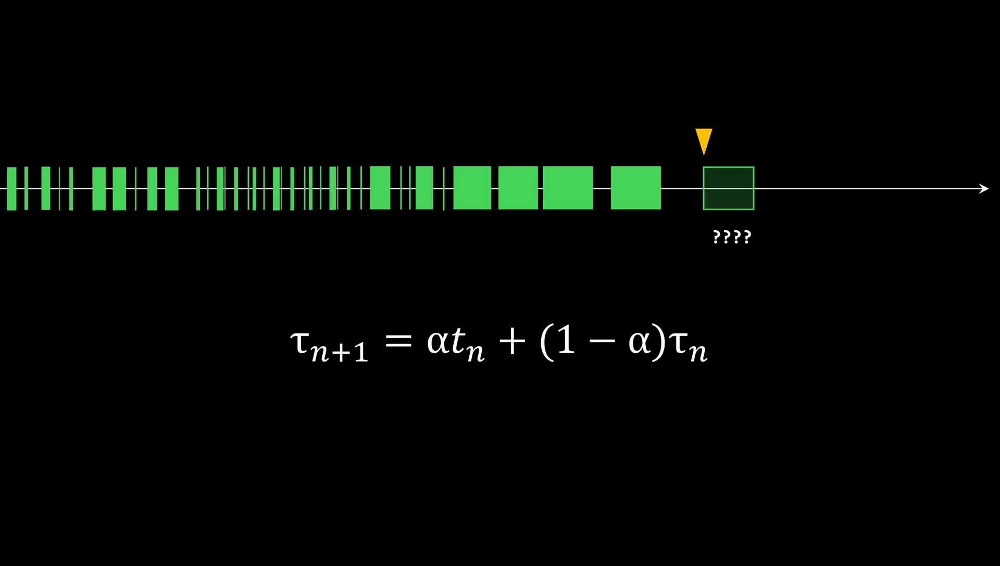

First, it's important to understand that each process's CPU burst prediction depends only on its own history; other processes do not affect its prediction. Each process's CPU bursts form a sequence of observed durations over time. n is the most recent CPU burst, n - 1 is the previous CPU burst, n - 2 is the one before that, and so on. n + 1 is the next CPU burst, the one we want to predict.
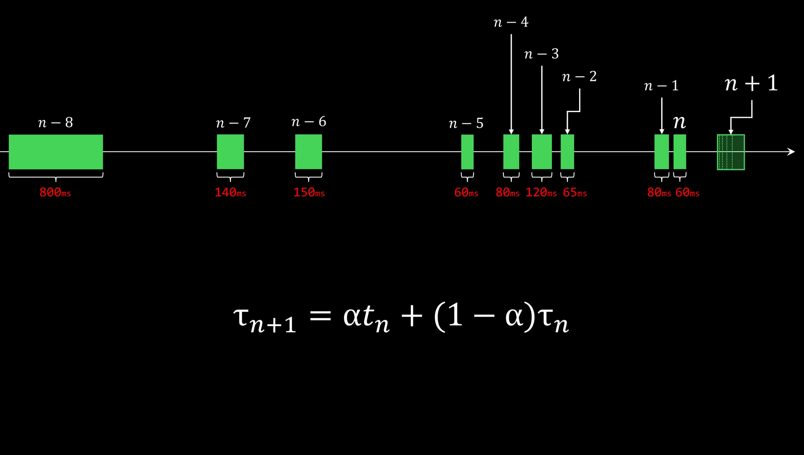

In the formula, that means tn is the predicted burst time for the process in the most recent iteration, while tn is the actual burst time that was observed. So tn + 1 is the estimated CPU burst duration for the next iteration. Since tn represents the previous prediction, we can expand the formula recursively. Since tn - 1 is the prediction before that, we can expand it again, and then tn - 2 and so on. What this shows is that this term retains the process's past history. As a result, we don't need to store an entire list of possibly thousands of CPU burst durations; we only need to keep the most recent prediction.
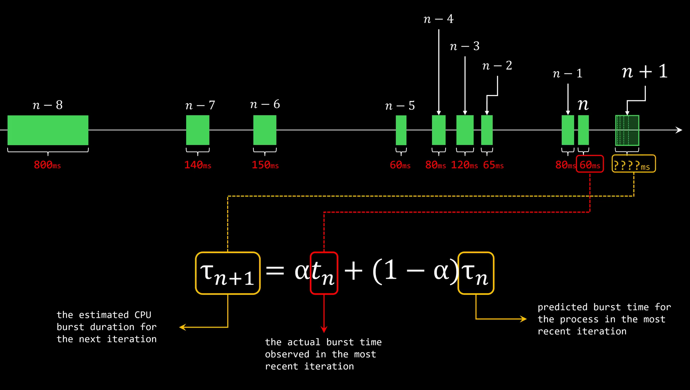
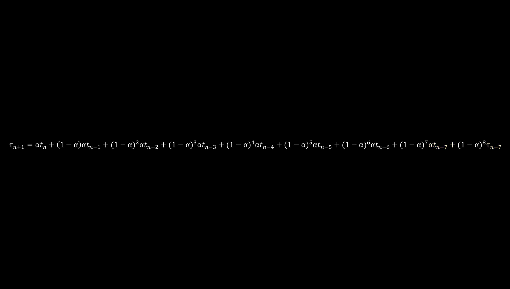
And what about this parameter alpha? Well, if alpha equals zero, the most recent CPU burst is completely ignored, and the prediction relies only on past history. If alpha equals 1, the prediction is based only on the most recent CPU burst, ignoring all past history. Thus, alpha controls the relative weight of the recent and the past history in our prediction. A common choice is alpha equals 1/2, which gives equal weight to recent and past history. And notice that this doesn't mean all observed CPU bursts in the history are equally weighted. By expanding the formula, we can see that each CPU burst duration is multiplied by alpha * (1 - alpha) raised to a power. Since alpha is between 0 and 1, the term 1 - alpha decreases exponentially, meaning older CPU bursts have less influence on the prediction. This makes sense because older execution patterns are less relevant when predicting future CPU bursts.

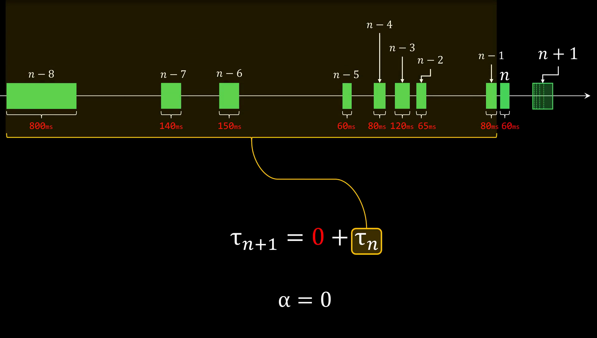
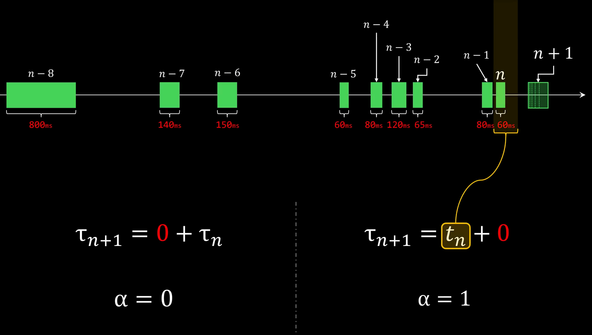

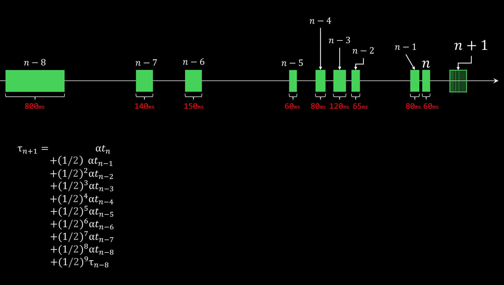
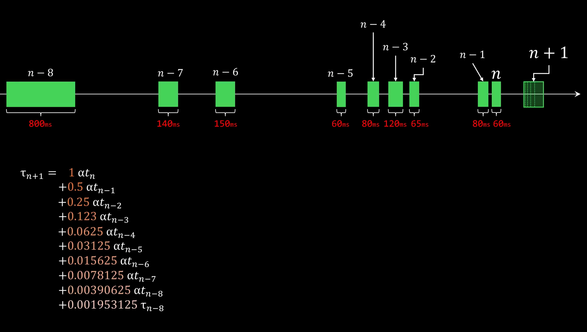
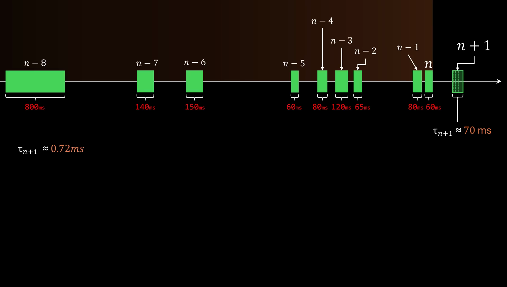
Additionally, when a process is first created, there is no historical data. In this case, the initial prediction is typically set to a constant value defined by the operating system or based on the system-wide average.
----

CPU Scheduling and Preemption
For example, using a starting value of 100 milliseconds results in a predicted next CPU burst of around 72 milliseconds, which, as you can see, is closer to recent CPU bursts than the oldest ones. Here's a chart comparing the predicted versus observed CPU bursts over a longer period of time. While not perfect, this approach provides a decent approximation. But there's an important decision the dispatcher must make that we haven't discussed yet.
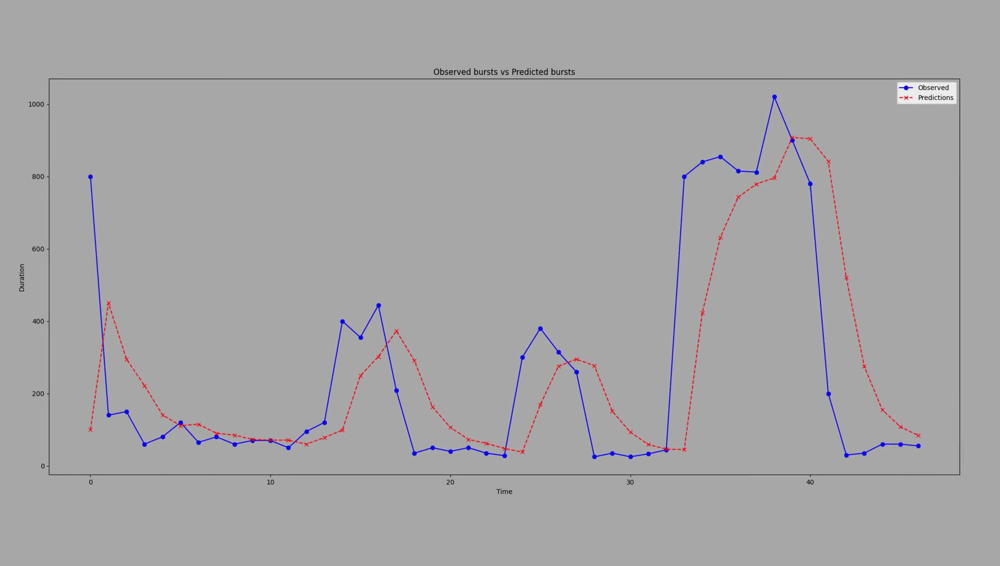

Imagine process A enters the ready queue with a specific next CPU burst and is eventually allowed to run. Then, an instant later, process B enters the ready queue, but process A is still running. The question is: if the remaining CPU burst of process A is longer than the next CPU burst of process B, should process A be interrupted to give priority to process B? This decision depends on the scheduler. If the scheduler allows running processes to be interrupted, we are dealing with a preemptive scheduling algorithm, where the operating system can preempt currently executing processes. In contrast, a non-preemptive scheduler will never preempt a running process. Even if a process with a shorter CPU burst arrives in the ready queue, it will have to wait until the running process completes its CPU burst and releases the CPU.
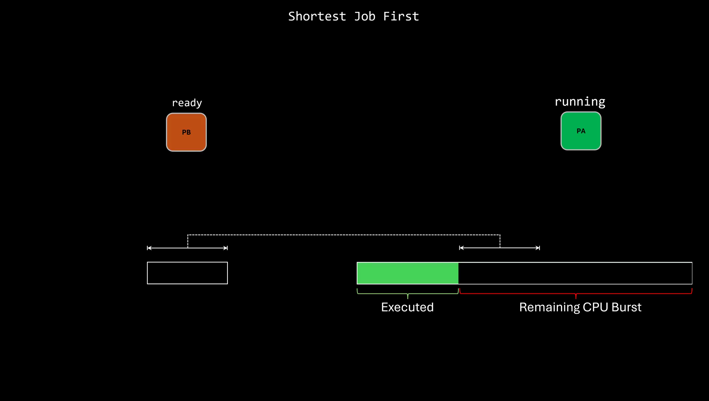

This is not a trivial decision, as the execution order of processes can change depending on whether the shortest job first algorithm is preemptive or non-preemptive. Now that we understand preemption, let's discuss why it is the default choice in modern systems. Consider a non-preemptive system where a process with an extremely long next CPU burst reaches the head of the ready queue and is selected. Since the system is non-preemptive, there is no way to interrupt this process until it voluntarily releases the CPU. But what if it never does? Infinite loops are not uncommon in computer science. If no system call is used inside the loop, the process will never return control of the CPU to the OS. This is problematic in general-purpose systems where concurrency is a key feature.
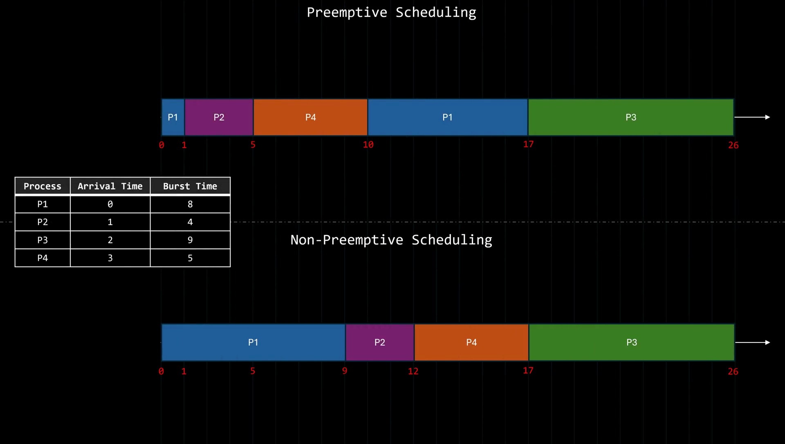

Remember, concurrency is a technique that allows the CPU to alternate execution between processes very quickly, creating the illusion that all processes are running simultaneously. However, in non-preemptive systems, if a CPU-bound process holds the CPU indefinitely or even for long periods, all other processes freeze. From the user's perspective, this is a major issue because non-preemptive systems rely on processes to behave correctly and return control in a reasonable amount of time. Malware could exploit this by intentionally avoiding system calls to monopolize CPU time. Whenever a scheduling policy causes a process to wait indefinitely in the ready queue, this is called starvation because the process is starving for CPU time. Even CPU-bound processes can suffer from starvation. For example, in shortest job first, a process with a long estimated CPU burst may be forced to stay in the queue indefinitely if many shorter CPU bursts continue arriving. The only way for this process to get CPU time is if no other process is in the ready queue. In real-world systems, this is unlikely since hundreds of processes compete for CPU time.


In terms of concurrency, that would look something like this. Thus, starvation is not just about process burst length but rather a consequence of the scheduling policy itself. While shortest job first is efficient in terms of CPU utilization and waiting time, a general-purpose operating system requires other scheduling criteria as well. A great example of preemptive scheduling is the round-robin algorithm. The round-robin scheduling algorithm is similar to first-come, first-served scheduling. A FIFO queue is used as a ready queue, but preemption is added to enable the system to switch between processes. A small unit of time, called a time quantum or time slice, is defined here. In this animation, I'm using a time quantum of 100 milliseconds. New processes are added to the tail of the ready queue. The scheduler picks the first process from the ready queue, sets a timer to interrupt after one time quantum, and dispatches the process.

One of two things will then happen: the process may have a CPU burst of less than one time quantum. In this case, the process itself will release the CPU voluntarily. The scheduler will then proceed to the next process in the ready queue. If the CPU burst of the currently running process is longer than one time quantum, the timer will go off and will cause an interrupt to the operating system, forcing a context switch to be executed, and the process will be put at the tail of the ready queue. The dispatcher then selects the next process in the ready queue. This routine is applied consistently to every dispatched process, ensuring that no single process can hold onto the CPU for long periods or indefinitely, which prevents other processes from being starved of CPU time.


Something very important to mention is that the timer is a physical device, usually embedded in the CPU circuitry, meaning preemptive scheduling can only be implemented if the hardware provides support for it. There's a very cool video about this on the channel, so if you want to learn more, stay tuned.

Since it did not request I/O, instead, it goes directly into the ready state, waiting for its next time quantum. If we need a scheduling policy that fairly distributes CPU time, round-robin is ideal. If there are n processes in the queue and the time quantum is q, each process receives one n of the CPU time in chunks of at most q time units. This ensures that once a process enters the ready queue, it will wait at most (n - 1) * q time units before its next turn. But while round-robin ensures fair distribution, waiting time is not always optimal. If the time quantum is too large, most processes will enter an I/O burst before being preempted, causing round-robin to behave like first-come, first-served at first.


--------

Scheduling Algorithms and Their Metrics

It might seem like the obvious solution is to simply reduce the time quantum, but if the time quantum is too small, processes will be interrupted too frequently, causing a high number of context switches. Remember, context switch time is pure overhead because the system does no useful work while switching. As a result, processes will take longer to complete due to excessive interruptions. The CPU will spend more time switching between processes than actually executing them.


Here we need to start talking about another scheduling criteria: the turnaround time, defined as the total time taken from a process's creation to its completion. Mathematically, it is the sum of the time spent waiting in the ready queue, the time spent executing on the CPU, and the time spent doing I/O operations. Another useful metric used as scheduling criteria is the throughput, defined as the number of processes that are completed per time unit. Again, if the time quantum is smaller than the average context switch time, the CPU will be busy but constantly switching between processes rather than executing them. Maximizing CPU utilization is meaningless if the CPU is not doing useful work.

A well-designed scheduling algorithm must balance CPU allocation and overhead to optimize both turnaround time and throughput. The average turnaround time of a set of processes does not necessarily improve as the time quantum increases, though. As you can see here, in general, the average turnaround time can be improved if most processes finish their next CPU burst in a single time quantum to ensure context switches happen only when necessary. However, turnaround time is not always the best criterion for measuring scheduling efficacy. Often, a process can start producing output before completing execution, and as we stated earlier, some processes may even never terminate. Thus, another important metric is the response time, defined as the time from submission of a request to the first response produced. This is not the total time needed to complete execution of a process, but rather how quickly it starts responding. Response time is critical because it directly affects that smooth feeling that users expect from interactive systems, especially when multitasking.


Round-robin is one of the simplest ways to achieve concurrency. Each process gets a fixed time quantum in a rotating fashion. Once a process finishes its time quantum, the next process is allowed to run. If this rotation happens fast enough, the system appears to be executing all processes simultaneously. The only problem is that all computer processors have a speed limit. As the number of concurrent processes increases, round-robin struggles to maintain responsiveness. At some point, the number of processes will be so high that each process will wait much longer before getting CPU time, and the illusion of simultaneous execution breaks down as the average response time increases.

Decreasing the time quantum might seem like a solution; after all, it could make it look like processes regain CPU time more frequently. But as we've already discussed, reducing the time quantum too much leads to excessive context switches, which is just as problematic. To deal with this issue, there are three possible solutions: increase the processor speed, allowing context switches to happen faster so we can use smaller time quantums without negatively affecting turnaround time; or use multiple processors, allowing processes to run in parallel and share the workload. However, both of these require hardware upgrades, which are not always feasible. But the third solution can be achieved through software alone with a smarter CPU scheduler.

Think about the processes running on your computer. You might be playing a video game while streaming with Outlook, a Gmail client, a file explorer, and other background apps all running simultaneously. So much stuff that round-robin causes your game to lag a bit. The question here is: do all these processes really need the same amount of CPU time? Probably not. If we assign higher priority to the right processes, we can increase their response time, making them feel smooth and responsive again from the user's perspective. Yes, it's true that background processes will get the CPU less often, but think about it: does it really matter if your email notification is delayed by half a second? That said, not all background processes are trivial; some, like operating system services, are critical.


The key point is this: if we can correctly identify which processes need higher priority, we can significantly improve overall system responsiveness without upgrading the CPU or adding more cores. Priority scheduling is implemented using a priority queue, where each process is assigned an integer value representing its priority. In this example, I'm using one and zero to distinguish between high and low priority, but the actual range of priority values varies depending on the operating system. Some systems may use a range from 0 to 255; others might go from 0 to 32,000, especially when a finer granularity of priority levels is needed. Whether lower numbers represent higher or lower priority also depends on the system. In this animation, lower values indicate higher priority.


It's also common to combine multiple scheduling strategies. For example, priority scheduling can be combined with round-robin to ensure fairness among processes with the same priority. One inherent issue with priority scheduling is starvation. In a heavily loaded system, a steady stream of higher priority processes can prevent a low priority process from ever getting the CPU. If this sounds familiar, that's because the shortest job first algorithm is essentially a type of priority scheduling where priority is based on the inverse of the predicted next CPU burst.


Here's an interesting story: the IBM 7094, a powerful mainframe computer used by NASA and the US Air Force for scientific and military applications, was introduced in 1962. Rumor has it that when they shut it down in 1973, they found a low priority process that had been submitted back in 1967 and had not yet been run. A solution to the problem of indefinite blockage of low priority processes is aging. Aging involves gradually increasing the priority of processes that wait in the system for a long time.
----------

CPU Scheduling Overview
For example, if priorities range from 127 (low) to zero (high), we could periodically, say every second, increase the priority of a waiting process by one. Eventually, even a process with an initial priority of 127 would have the highest priority in the system and would be executed with both priority and round-robin scheduling. All processes may be placed in a single queue, but depending on how the queues are managed, an O(n) search may be necessary to determine the highest priority process. In practice, it is often easier to have separate queues for each distinct priority. This is known as multi-level queue scheduling, and here there must be scheduling among the queues. One way is the one being shown on the screen right now: each queue has absolute priority over lower priority queues. Scheduling simply dispatches the process in the highest priority non-empty queue. But to avoid starving lower priority queues, we could schedule queues in another way. We can rotate the ready queue in a round-robin fashion, dispatching a different amount of processes in a row depending on the priority of the queue to time slice among the queues. Multi-level queue scheduling is commonly used to partition processes into several separate queues based on the process type, making it better to schedule processes with multiple response time requirements. It even allows us to use a different scheduling algorithm for each queue. The foreground queue might be scheduled by a round-robin algorithm, for example, while the background queue is scheduled by a first-come, first-served algorithm. And that's basically what we expect from a general-purpose CPU scheduler: to give priority to interactive processes but not to the point of starving lower priority ones.


There's just one more issue to address. In a typical multi-level queue scheduling algorithm, processes are permanently assigned to a queue when they enter the system. This has the advantage of low overhead, but it's also inflexible because processes don't behave the same way throughout their lifetime. Take your email client, for example. Most of the time, it runs quietly in the background, occasionally checking for new messages. But the moment you bring it to the foreground, you expect it to be fast and responsive. Menus, buttons, and forms all need to react instantly. A process's CPU usage pattern, and by extension its response time requirements, can change dynamically. The multi-level feedback queue algorithm was designed to adapt to these dynamic changes in behavior. Here's how it works: every process starts in the highest priority queue. If a process completes its CPU burst within a single time quantum, it can return to that queue after finishing its I/O. If a process needs more CPU time than allowed by the time quantum, it's moved down to a lower priority queue. Lower priority queues have larger time quantums, and processes that behave more like I/O-bound tasks can be moved back up if they complete their CPU burst in less time than the quantum assigned to the higher priority queue. Over time, processes that have short CPU bursts will tend to stay in higher priority queues. In contrast, CPU-bound processes will gradually sink to lower priority queues. This is how the system adjusts process priority based on behavior automatically.


Keep in mind that this is just one example of multi-level feedback queue scheduling. It comes in many variations, or as I like to say, all colors and flavors. Not only can the scheduling algorithm applied to each queue differ, but also the criteria used to decide when a process should be promoted or demoted between queues. For instance, instead of relying solely on the most recently observed CPU burst to adjust a process's priority, the system could use a prediction based on historical data, which might help avoid unnecessary queue switches in response to isolated or unusual bursts, whether extremely short or unexpectedly long.


If you've been paying attention, you might be thinking, "Wait, aren't we penalizing CPU-bound processes just for needing more CPU?" It seems we are now going against the original idea of prioritizing more important processes. Aging indeed can prevent starvation, but still, once a process is recognized as CPU-bound, it will eventually be demoted. What's the deal here? Well, this is very hard to explain without a 40-minute master class on process analysis. The best I can do now is to highlight two important facts: I/O-bound and interactive processes are not necessarily the same thing, but both are characterized by very short CPU bursts. Second, modern processors are extremely fast. If you open a task manager right now, you'll see hundreds of processes running, yet if you open a resource monitor, you'll notice that combined, they use less than 10% of total CPU time. These two facts reveal that most of the time, higher priority queues are actually empty. So when a process sinks to the lowest priority queue, it's not as doomed as it sounds. Being dispatched without aging is actually more probable than we might think. Think about when your system is under heavy load, for example, when rendering a video or running a benchmark. CPU usage hits 100%, but your desktop stays smooth, your music keeps playing, and your browser remains responsive. That's because the scheduler prioritizes everyday interactive tasks while less frequent CPU-heavy processes get served with any CPU cycles left over from higher priority processes.


If we put multi-level queue and multi-level feedback queue side by side, which one sounds more general-purpose to you? Many operating systems used some variation of multi-level feedback queue in the past, but modern systems face new challenges. These factors introduced additional complexity, and more advanced scheduling strategies were developed to handle them. In a future episode, we'll take a closer look at how modern operating systems handle CPU scheduling. We'll explore the scheduling policies of Linux, Windows, and BSD, and how they manage all these modern variables.


And that's it for now: an intuitive introduction to CPU scheduling. Before we wrap up, a few final clarifications: modern systems schedule threads, not processes. This allows concurrency within a single application. For example, one thread handles the user interface while another performs background computations. With multi-level feedback queue, the user interface of a CPU-hungry process can remain smooth since the thread that manages the UI can maintain high priority independently of the thread that performs the heavy computations. The I/O queue shown in this video is simplified; we've shown it as a FIFO queue for clarity. In reality, the I/O subsystem is more complex. Processes that enter the I/O queue may finish in a different order than they arrived. Just like first-come, first-served is inefficient for CPU scheduling, it's also not ideal for I/O devices. For instance, a process needing to use a graphics card shouldn't have to wait behind another process that's currently using the disk. All of these details, however, concern another component of the operating system: the I/O scheduler.


Let's wrap things up for now. There are more exciting topics coming soon, like race conditions and thread synchronization, so make sure to subscribe. You won't want to miss it if you enjoyed this video or learned something new.