# Understanding Threads and Concurrency

Hi friends, my name is George. Concepts threads are surprisingly easy to understand. The premise is simple: in multi-process systems, if we have one CPU and multiple running processes, the operating system makes those processes share the CPU by alternating access between them. This happens very fast—so fast, in fact, that the user is under the illusion that all processes are running simultaneously. This technique is known as concurrency, and along with another technique called CPU scheduling, it is responsible for the smooth multitasking experience we enjoy on our computers.

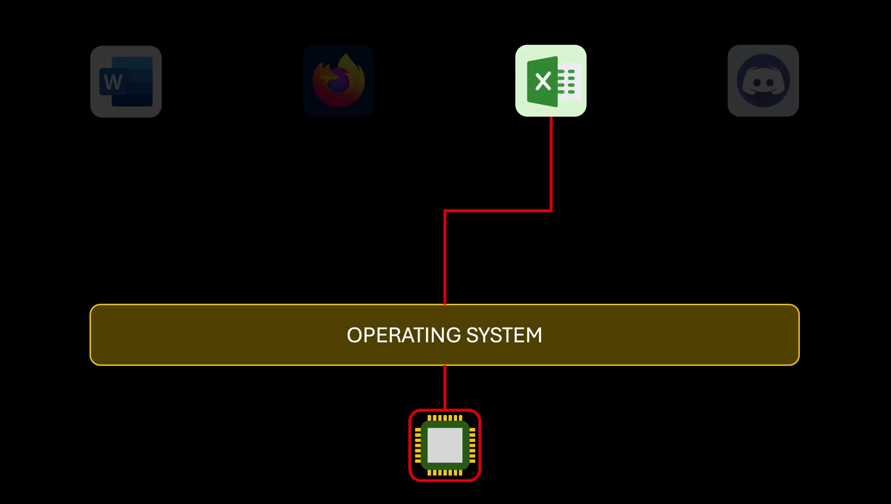

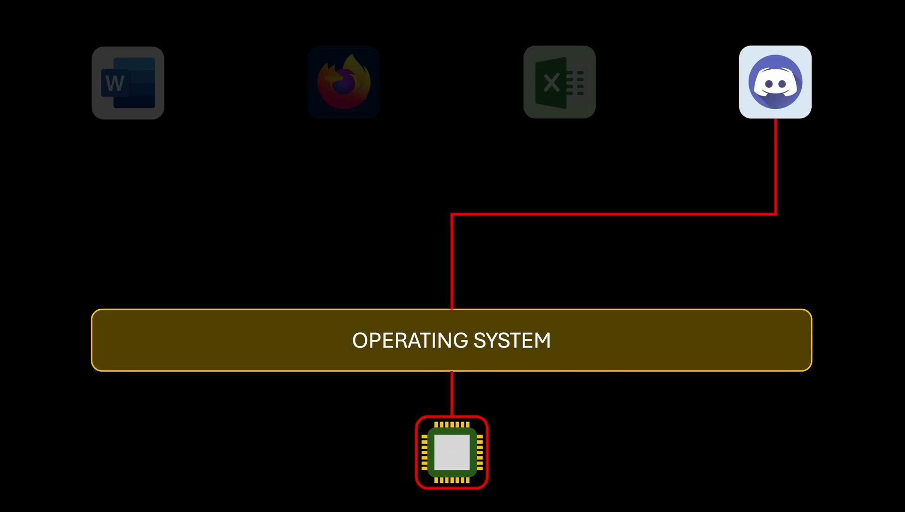

But multitasking is only the well-known purpose of concurrency and CPU scheduling. There's another, less obvious purpose: maximizing the use of computer resources. We'll dive deeper into this in my video about CPU scheduling. For now, what we need to know is that while a process is often defined as a program in execution, it doesn't necessarily mean the process is always using the CPU. Even if the CPU is allocated to that process, for example, a process might be waiting for an I/O resource. In that scenario, allocating the CPU to that process would be inefficient because it can't execute instructions until the requested I/O resource is ready. So instead, it makes sense to allocate the CPU to a different process—one that's ready to execute instructions.

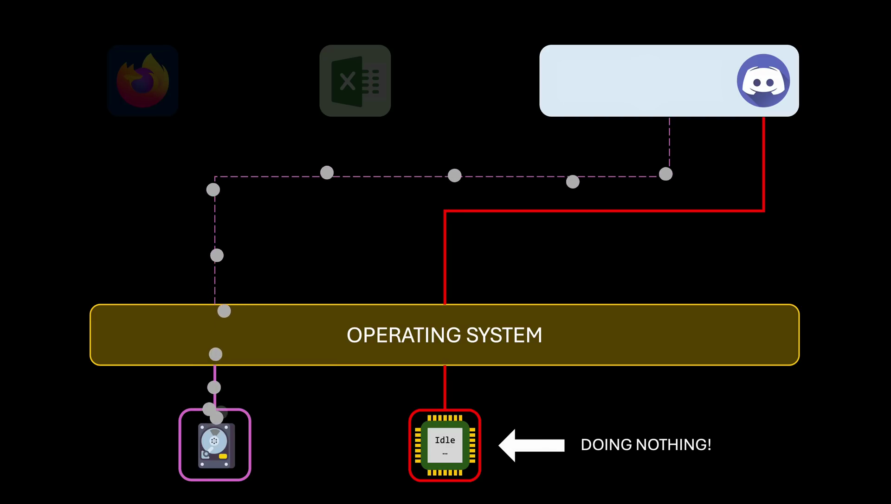

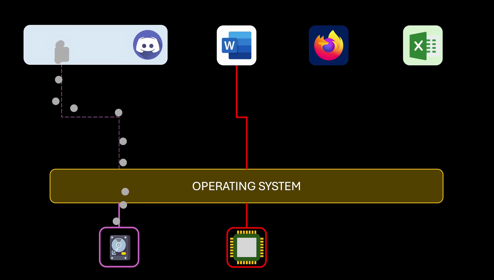

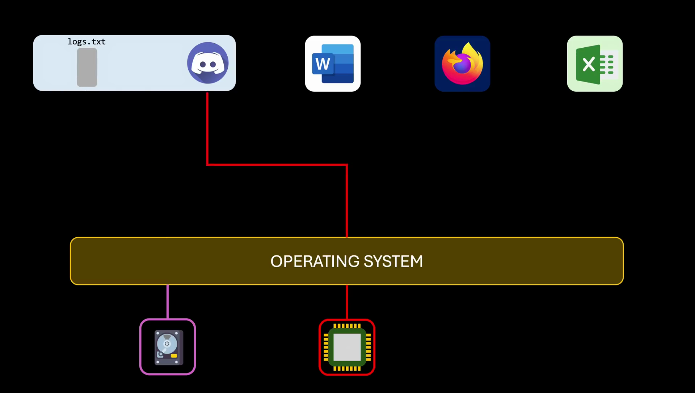

This is the second reason why concurrency is so important: it's not just about running multiple programs at once; it's also about filling those little gaps when a process can't use the CPU by assigning it to another process that can. Up **until now, in this series, we've treated processes as the fundamental unit of execution, so we've assumed there's nothing more basic than a process for scheduling purposes. So we can't employ concurrency for executable entities within the same process.**

If this sounds confusing, what I'm trying to say is that tasks within the same program, like two functions, for example, cannot run asynchronously under the traditional process approach. This makes sense if you've watched my video on processes. Remember, each process has one program counter that points to the instruction where it is interrupted when the CPU is allocated to another process. But we cannot alternate the CPU between two functions that are part of the same process because, with a single program counter, we can't keep track of where both are interrupted. One of the functions must wait for the other to finish executing.

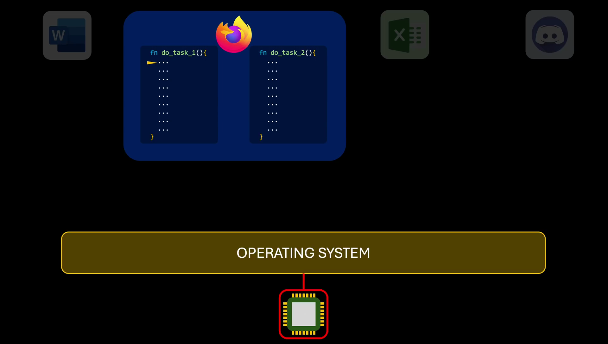

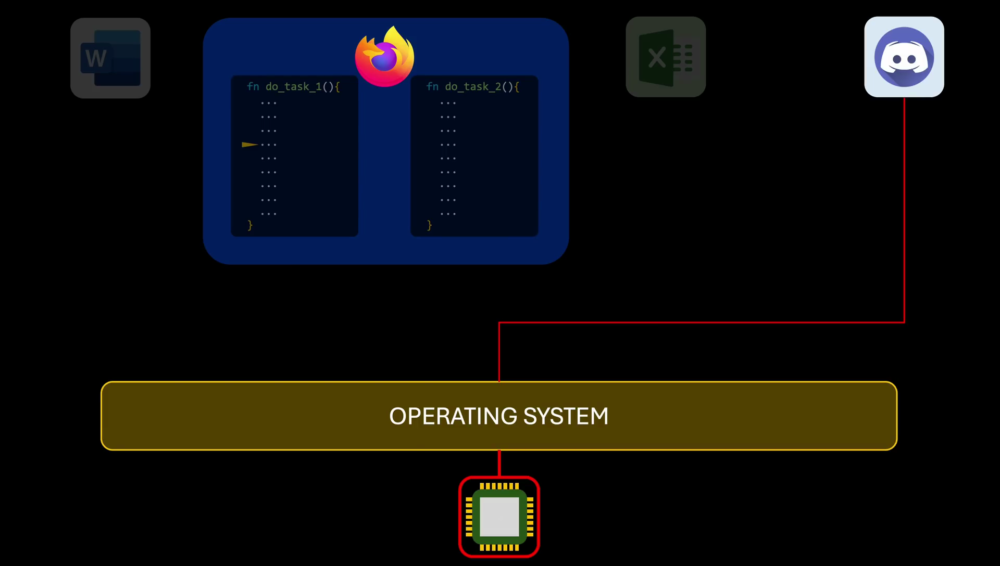

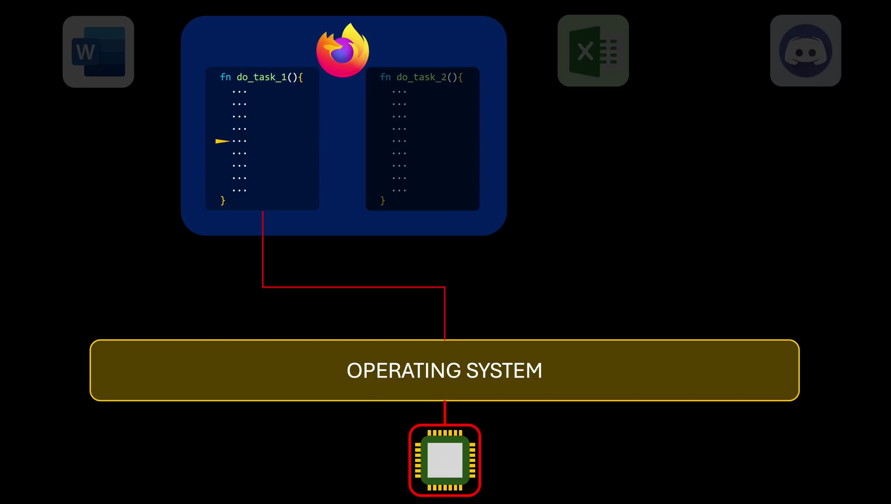

**But why would we need concurrency inside a process in the first place? I mean, if we wanted two pieces of code to run concurrently and cooperate, couldn't we just put that code in separate processes and use interprocess communication to coordinate their actions? Well, yes, but using IPC isn't always intuitive. Sometimes different pieces of code that contribute to a main goal are so correlated that putting them in different processes just feels wrong. There are many situations where concurrency within a process is incredibly useful.**

Think about a server that receives requests on port 3000, where its sole purpose is to return a profile image associated with each client. When a client sends a request, the server accepts it, processes it by searching and reading the image from disk, and once the image is loaded into memory, responds by sending the image back to the client. Because images are stored as files on disk, a very costly I/O operation is required to find the image and load it into memory. As a result, processing a request can take significantly longer than simply accepting or responding to it. These steps are executed sequentially and obviously take only a few milliseconds, so for a single client, it works just fine. But with multiple clients, complications arise.

If five requests arrive at approximately the same time, the server will accept the first one quickly but then spend significant time processing it. The second request will only be handled once the first is completed, and so on. This creates a bottleneck, with later requests waiting a long time to be attended to. Now, with five requests, the bottleneck is not that much of a problem, but imagine a thousand requests, and here we can see the real problem. Notice the gray gaps in the timeline; these represent periods where the CPU sits idle, doing nothing. This is wasted computational time—time that could have been used to accept and begin processing other clients' requests. When one task is unable to execute because another task is running, despite the two being independent, we call it a blocking effect.

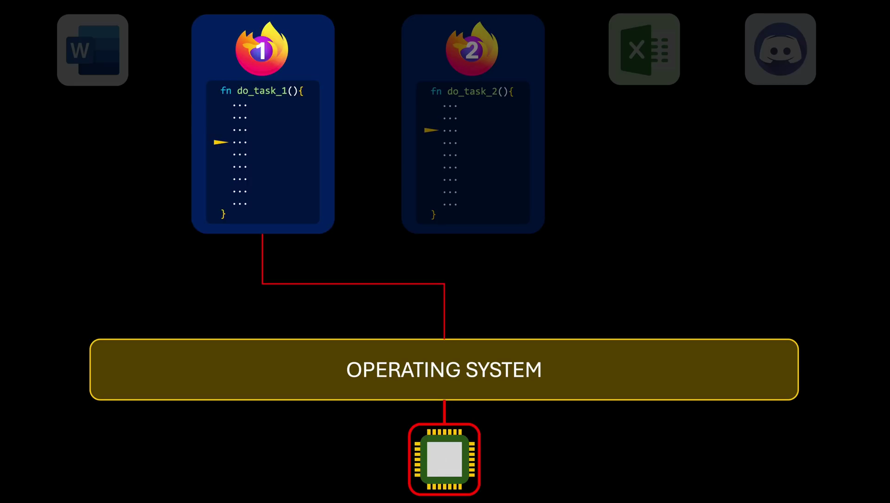

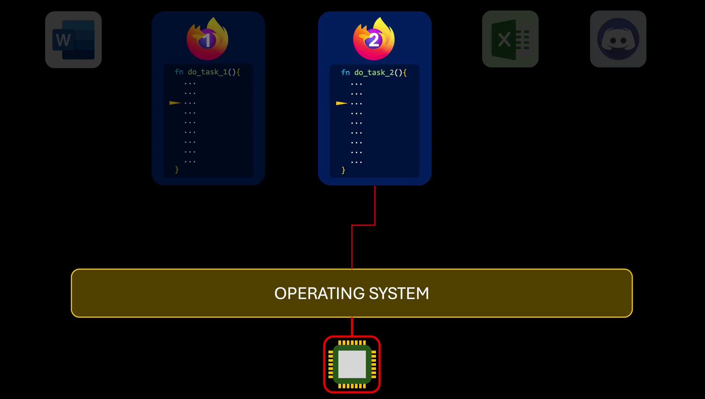

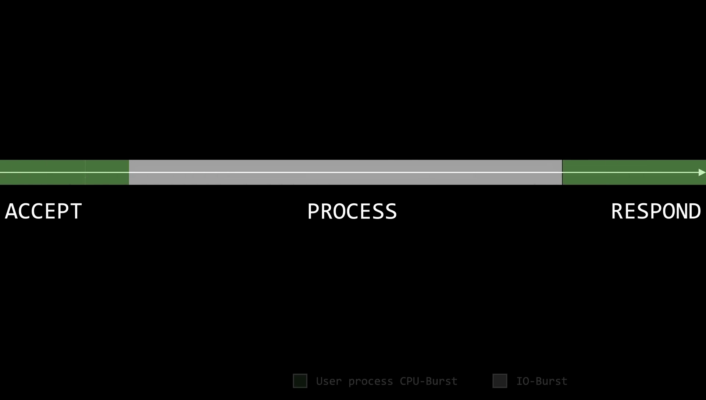

For a long time, the solution to this problem was as follows: there's a main process that listens for requests, which we'll call the Listener process. Every time a client sends a request, instead of handling it directly, the Listener process creates a whole new process to attend to that specific client. This way, if another client sends a request, it won't wait until the previous request is completely handled because the process that listens and accepts the requests runs concurrently with the one serving the previous client. In other words, this method allows taking advantage of concurrency to use the CPU as much as possible.

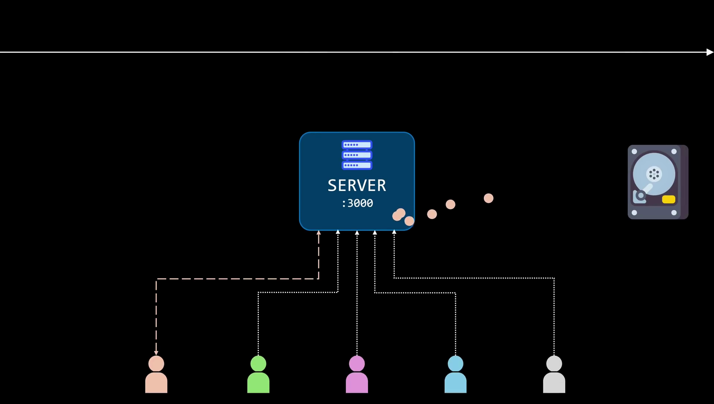

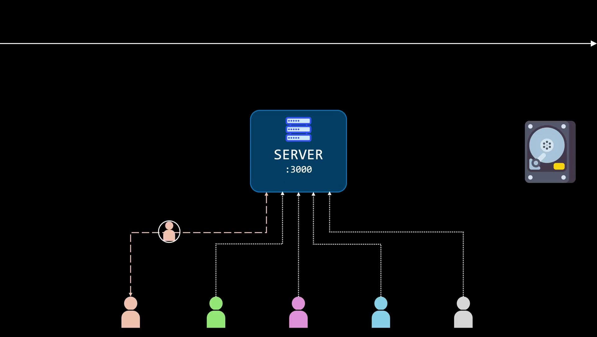

While clever, this approach isn't perfect. Remember, each process is like a self-contained context with its own properties, including an address space. Creating an entire process for every client might work for a few hundred clients, but when scaling to thousands, it becomes inefficient in terms of memory usage. Additionally, spawning a new process is not a trivial operation; it consumes processing time. So even though the goal is to utilize idle CPU gaps, a portion of that time is actually spent creating the new process itself. Moreover, if the server needs to handle some kind of global state, all child processes must be synchronized to keep track of it. This requires some form of IPC, complicating the implementation.

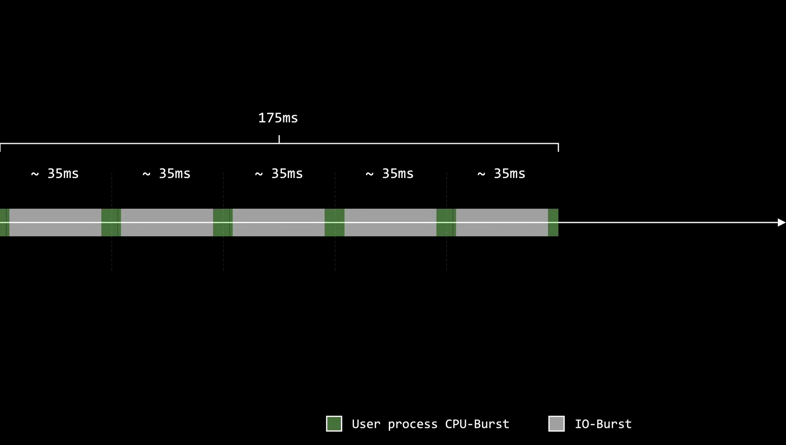

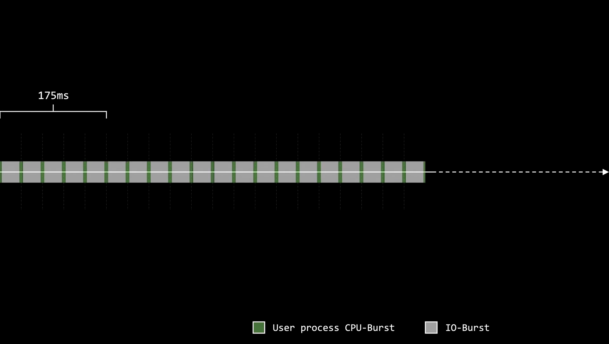

**Although processes are one of the most important concepts in computer science, they aren't perfect.** Let's discuss the solution after a quick message from the concept of a process, which is very useful. We can't just discard it, but we can modify it slightly to allow concurrency within the executable code of a single process. Remember, in general terms, a process comprises an ID, a program counter, a register set, an address space, and other resources such as open files and I/O devices. As I explained earlier, the main limitation is that a single program counter doesn't allow the process control block—the structure the OS uses to represent processes—to keep track of more than one task at a time.

The solution is to stop associating the program counter directly with the process and instead assign a program counter to each inner executable entity that we want to run concurrently within the process. These inner entities are what we call threads. By no longer limiting each process to a single program counter, we can now create a new thread whenever we need code within the same process to run concurrently. This solves the blocking problem without creating new processes. If one of the threads needs an I/O resource, such as loading the contents of a file into an array, the other threads can continue executing without being blocked.

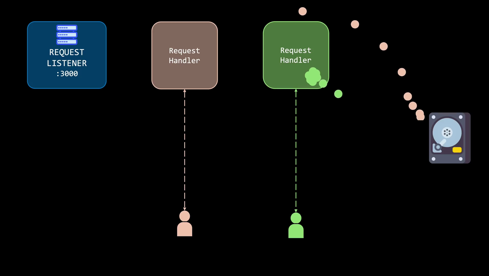

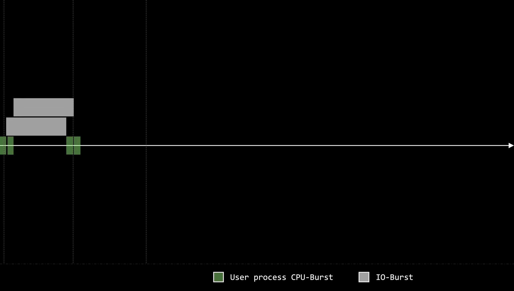

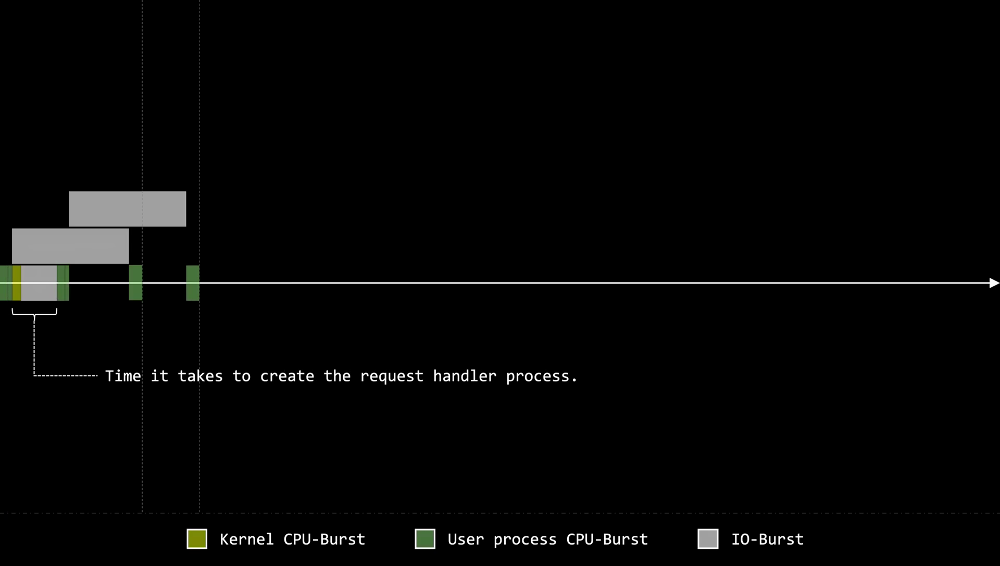

While threads share the entire address space base of the process they belong to, they cannot share a CPU state. Because threads are going to be interrupted to allocate the CPU to other threads, we need to capture the state of each thread so that when the CPU is reallocated, its state can be restored. Therefore, if each thread has its own program counter, it also must have its own register set, flags, accumulators, etc.—essentially its own CPU state. And note that this includes a separate stack pointer. Remember, the stack is a fast and efficient way to organize and access local variables in memory. If two functions in the same process run concurrently and share the same stack, they could easily overwrite each other's data. Hence, each thread must have its own stack.

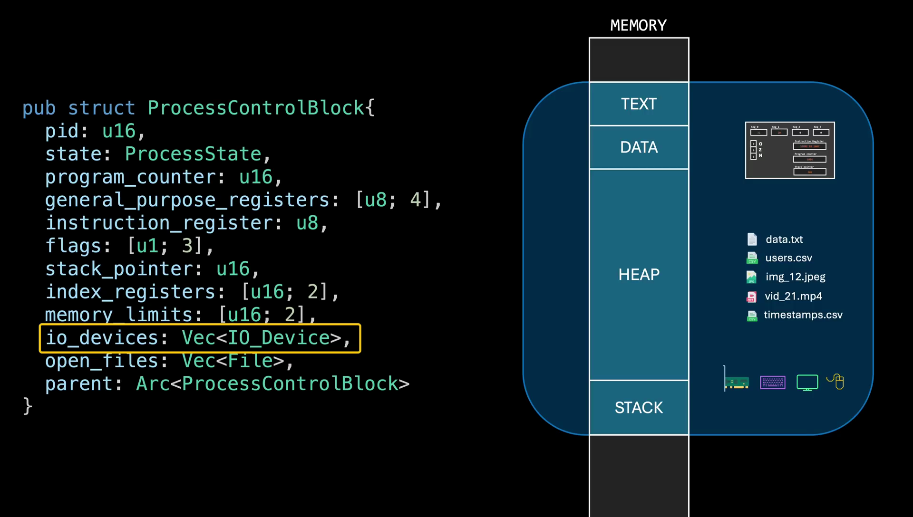

**Something that I want to make sure is very clear is that the fact that each thread has its own stack doesn't mean that they cannot read from or write to each other's. This makes perfect sense if we consider the address space as a property of the process, not the threads. Since the stacks are located within that shared address space, nothing prevents a thread from accessing another thread's stack.** Whether you should do it or not is a completely different discussion, but generally, unless you really know what you're doing, it's best to avoid accessing other threads' stacks directly.

If threads within the same process need to communicate by sharing memory, the heap is more appropriate for that. Since by its nature, the data stored in the heap is not organized in a predictable way anyway. But even with the heap, caution is still required. If one thread is reading from a block of memory while another is writing to it, the results can be disastrous. Synchronizing concurrent tasks is so critical that mechanisms for doing so are implemented directly in hardware. I'll cover this in a future video.

Completely discarding the concept of a process, address spaces of different processes are still isolated. So while sibling processes share memory by default, if threads from different processes want to share data, interprocess communication is needed. Replacing the traditional multi-process approach with the multi-threaded approach requires reimplementing the process control block. The most obvious path here would be to use a second structure to represent threads. While implementation details can vary by platform, the most common approach is the one used in the Linux kernel, where both processes and threads are represented by the same structure called task. If you ask me, I'd say this is a perfect example of good naming in programming because it abstracts away the distinction between processes and threads.

So instead of describing concurrency as alternating CPU access between processes, threads, or both, we can simply describe it as alternating tasks. This implementation is more intuitive if we want to use a single scheduler for threads and processes. Regardless of the approach, doing this requires that every process has at least one thread called the main thread. Whenever a new process is created, the operating system automatically creates this thread. So even if a process doesn't rely on multi-threading, the operating system can allocate the CPU to it by scheduling its main thread. Whether a process starts with a fixed number of additional threads or can spawn threads dynamically depends on the operating system's implementation. Most mainstream operating systems prefer the dynamic approach, where each process starts as a single-threaded process and additional threads are created at runtime if needed. This, of course, increases the complexity of the operating system's internal implementation, as it must provide system calls for dynamic thread creation. But it's the preferred method because, in many cases, it's impossible to know at compile time how many threads will be needed at runtime.

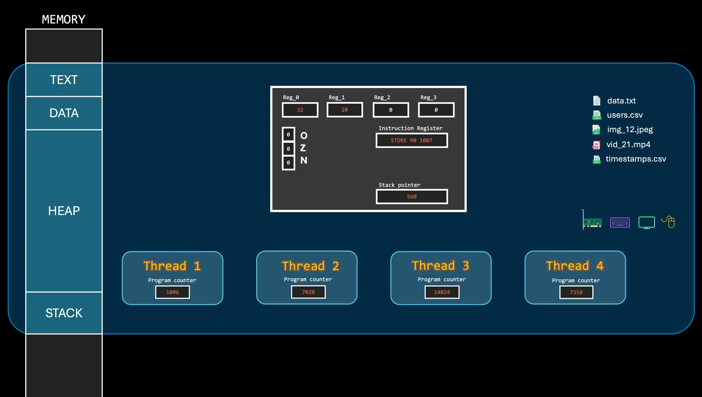

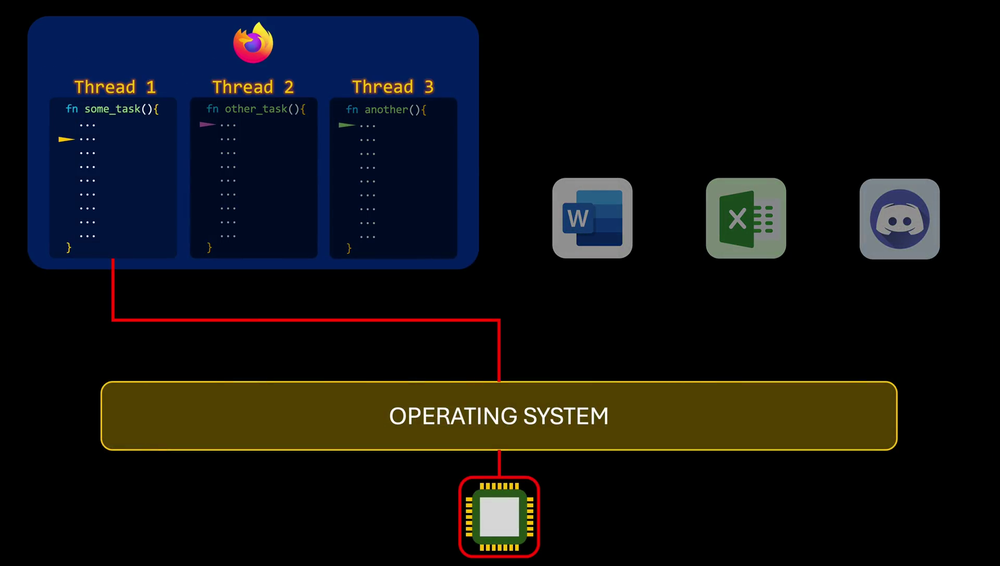

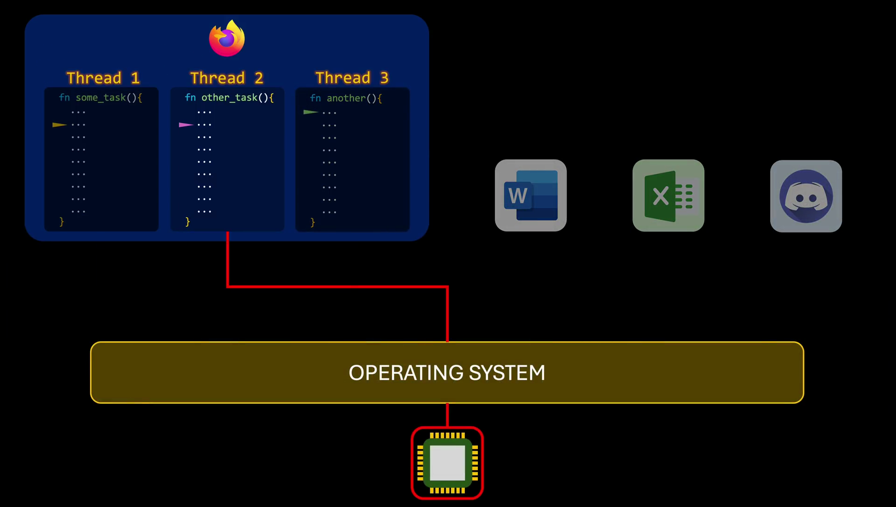

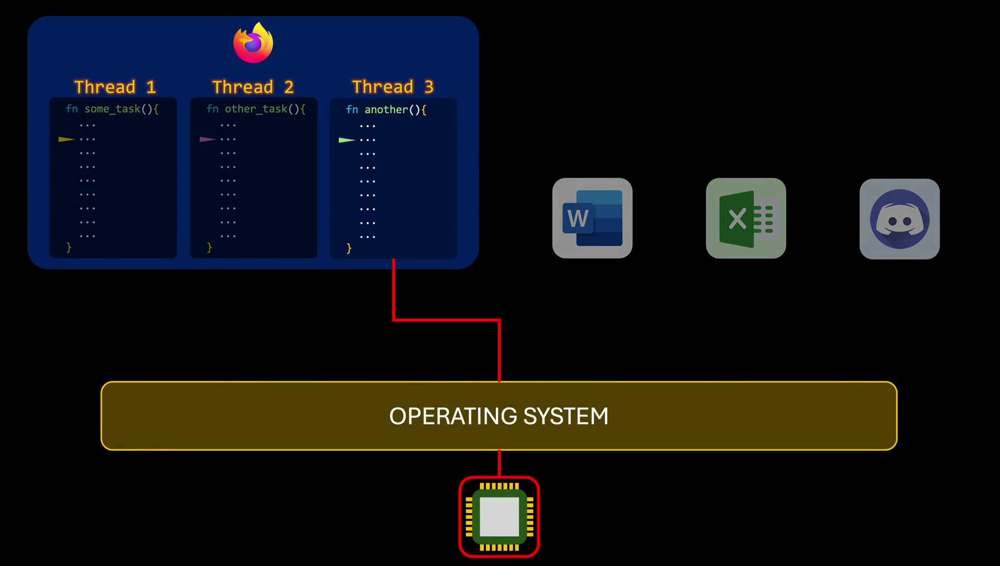

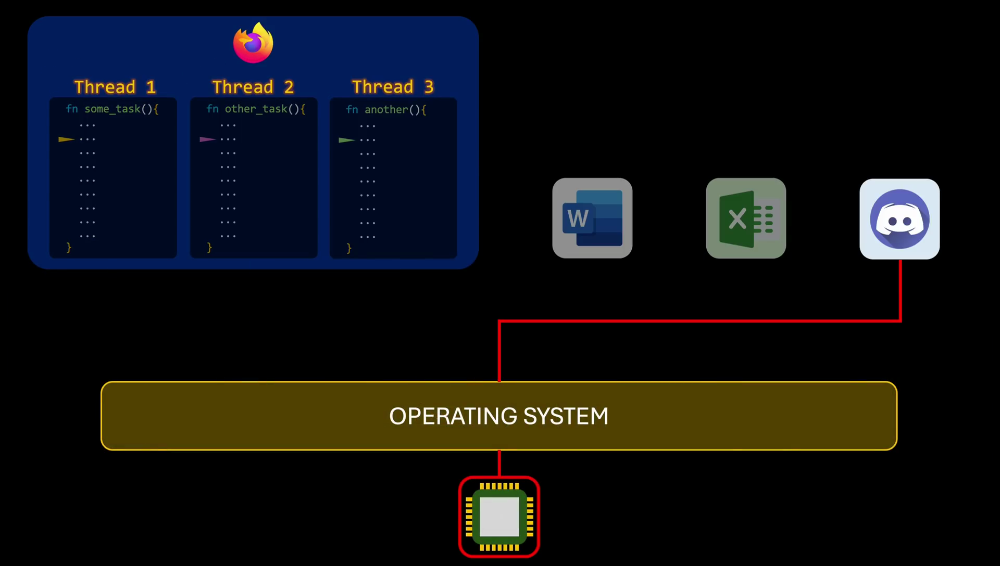

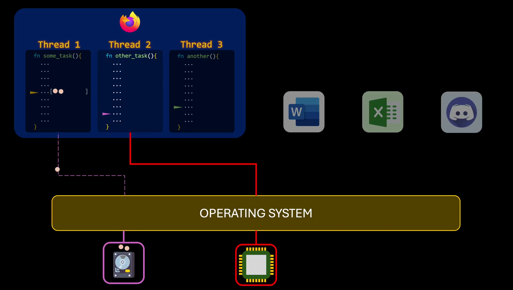

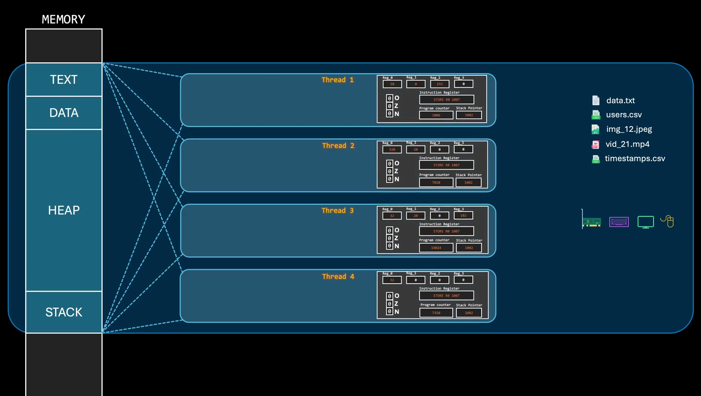

Okay, that's a lot of information! Before we discuss how all of this applies to our server example, there's one last thing we need to know. In many implementations, because the main thread identifies the process it belongs to, if other threads are spawned and the main thread terminates its execution, the execution of all the other threads will immediately terminate. There are multiple ways to handle this problem, but that's a topic for another video.

Back to our server example: with the multi-threading approach, we can spawn a new thread for each incoming client, achieving a similar effect to the multi-process approach but with far less memory consumption. Additionally, there can be a performance improvement when using threads because the system calls used to create threads are generally completed much faster than those used to create new processes. The reasons for this should be obvious at this point.

And that being said, we should now define what a thread is. But first, we'll define what a thread is not. A thread is not a function, and any code that a thread executes is in the text section of the memory layout of the process. **The thread doesn't contain code; it points to the code through its program counter. This means multiple threads can point to the exact same executable code.** This is precisely what happens in our server example since all the requests need to be handled in the same way. All the handler threads don't contain a function but rather point to the same function in memory.

**If you're wondering if threads accessing this memory area at the same time is dangerous, it's not, because executable code and constants reside in the text and data sections—two regions that are never written to. All the information pertinent to a specific thread generated at runtime resides either on the stack or the heap. So threads accessing the same executable code concurrently is perfectly safe.**

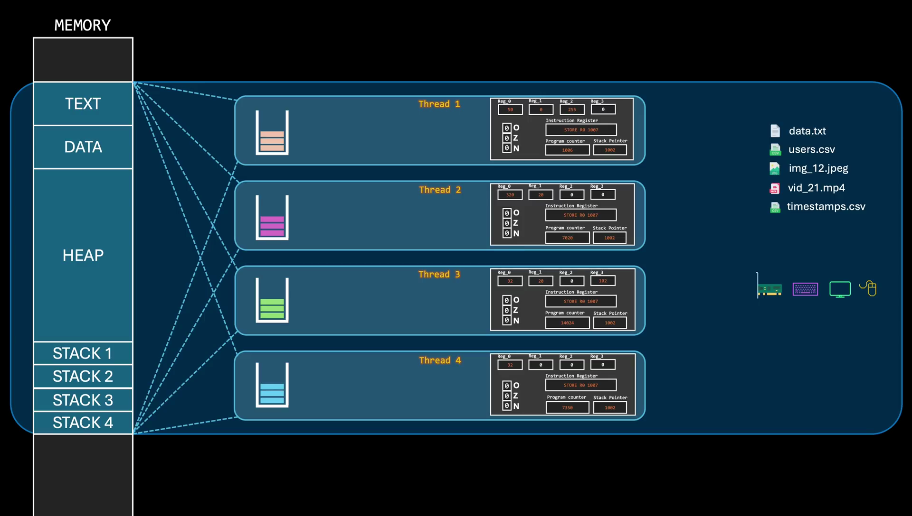

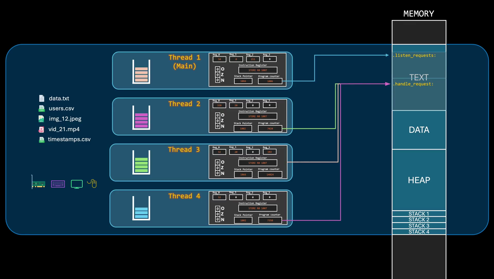

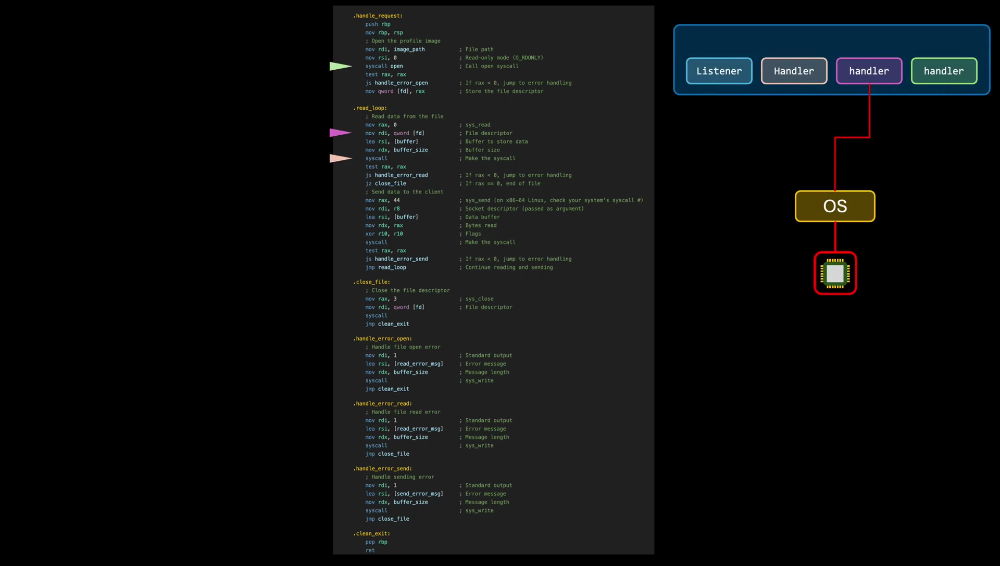

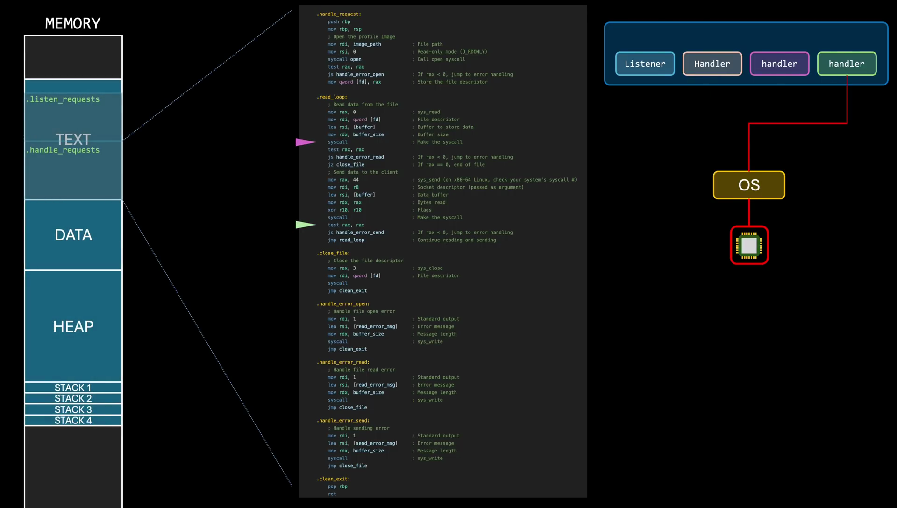

Perhaps this last part helps you understand why, in low-level languages like C, spawning a thread requires us to pass a pointer to a function as a parameter. This might seem confusing, but what we're actually doing is passing the memory address where the code that the thread will execute begins. So please don't misinterpret my animations: threads are not asynchronous functions.

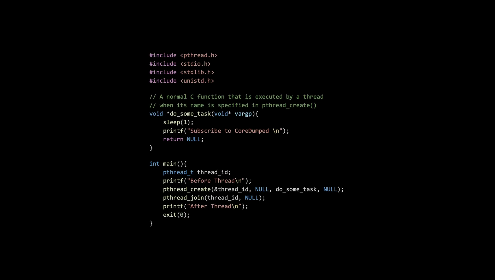
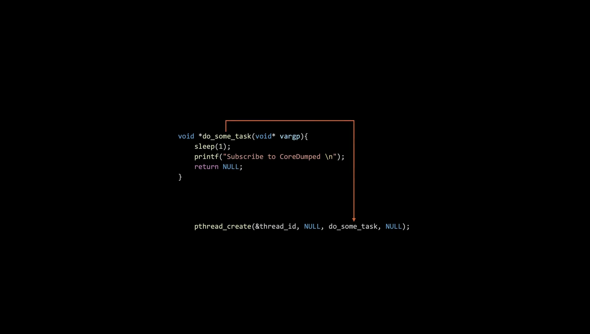
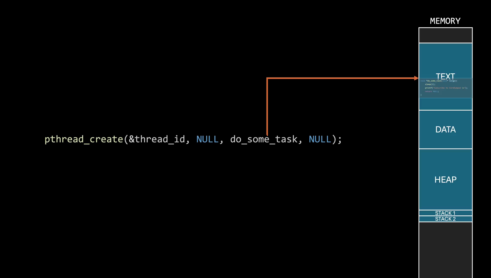
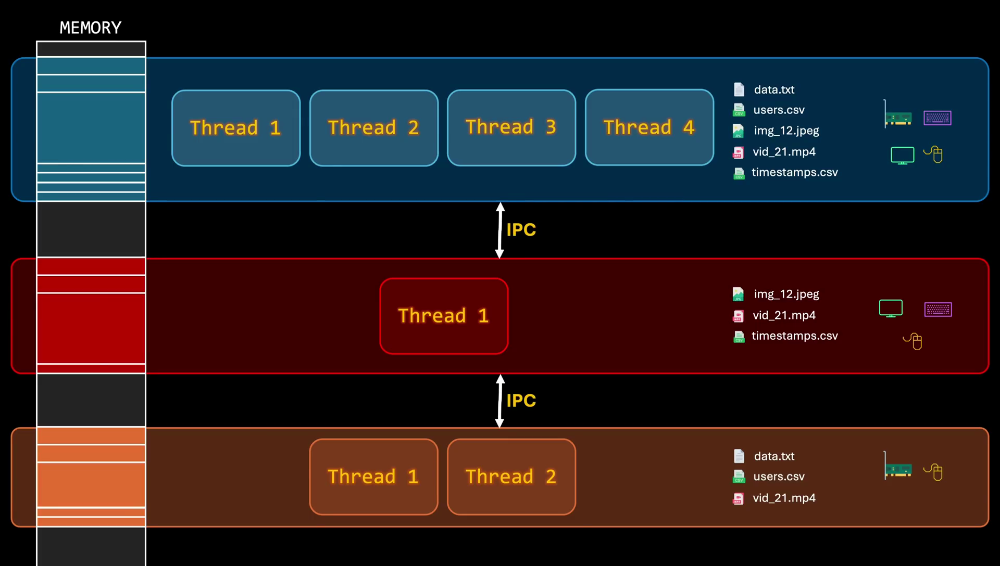
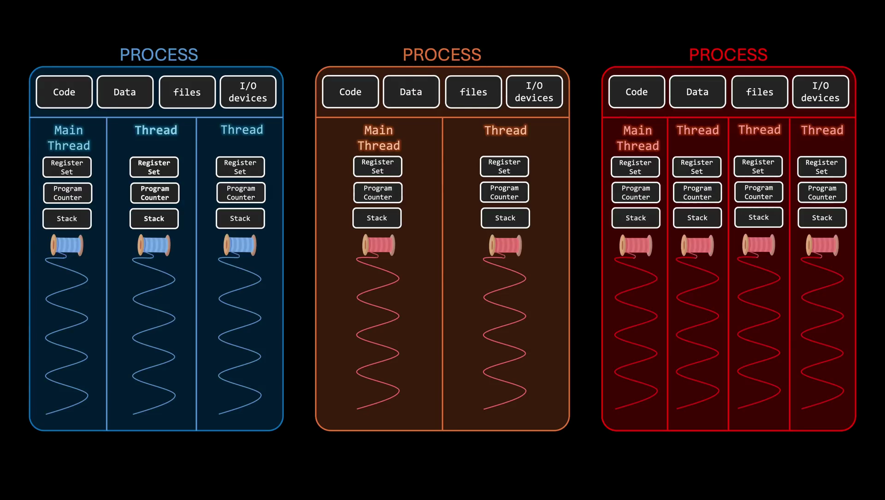
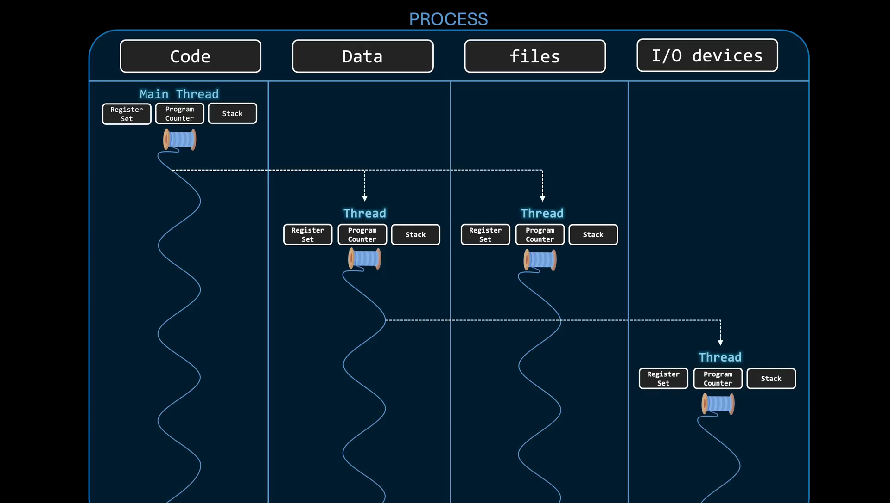

There are two ways we can define threads. From the operating system's point of view, threads are what processes were in our previous episode: the most basic unit of execution. From a developer's perspective, threads are a mechanism to tell the operating system that certain pieces of code inside our program can be executed concurrently. Another interesting definition that I've heard is that threads can be seen as lightweight processes—easier and faster to create.

And remember, everything I've said in this video applies even to systems that dispose of a single-core processor. Let's wrap things up for now. In the next episode, we'll discuss the additional purpose of threads in systems where the processor has multiple cores: the fundamentals of parallelism.

# Summary

**Understanding Threads and Concurrency**

🧠 Core Concepts:
Concurrency allows multiple processes to appear to run simultaneously on a single CPU via time-sharing.

CPU scheduling ensures efficient use of CPU time by switching between processes when one is waiting (e.g., for I/O).

Concurrency is not just multitasking—it's also about filling CPU idle gaps effectively.

📦 Processes vs. Threads:
A process is a self-contained unit with its own memory and program counter.

Traditional concurrency only alternates between processes, not functions inside a process.

This leads to limitations like blocking, where tasks inside one process can’t execute concurrently.

⚙️ Why Threads?
Threads allow concurrent execution within the same process.

Each thread has its own:

Program counter

Registers

Stack

All threads in a process share:

Address space

Heap

Code (text section)

🌐 Server Example:
A server processing requests sequentially creates bottlenecks due to I/O wait time.

Early solution: spawn a new process per client → expensive (memory and time).

Better solution: spawn a thread per client → lightweight, faster creation, shared memory.

🔄 Synchronization:
Threads need synchronization when accessing shared memory to prevent data corruption.

Especially critical when multiple threads access the heap.

🧩 Implementation Notes:
In Linux, both threads and processes are represented as tasks, enabling unified scheduling.

All processes start with a main thread, and more threads can be created dynamically.

Termination of the main thread often terminates all other threads unless handled properly.

✅ Thread Definitions:
OS view: Basic unit of execution.

Developer view: Mechanism to enable concurrent code execution within a process.

Threads are often called lightweight processes.

🔐 Safety & Execution:
Threads don’t contain code—they point to code.

Concurrent execution of the same code is safe as text/data sections are read-only.