# Threads and Multi-Core Processors
Started talking about threads, and it seems you guys loved it. Today, we're continuing that discussion, focusing specifically on the role of threads in systems with multi-core processors.

Hi friends, my name is George. Let's get started. Once again, an important concept we need to know in advance is concurrency. When we have multiple processes but only a single CPU, the operating system can make it feel like all those processes are running simultaneously by alternating CPU access between them at incredible speed.

In the last episode, we learned about threads, which are very useful when writing programs for two key reasons. If one task in the same program takes a long time to complete and another takes only a few milliseconds, concurrency ensures the shorter task doesn't have to wait a long time to start running. If a task is waiting for an I/O resource, such as a file read or a network response, it can't use the CPU during that time. Instead of letting the CPU sit idle, the operating system can allocate that unused time to another task that's ready to run.

So, threads are simply a way to tell the operating system that multiple tasks within the same process can run concurrently. They enable applications to perform multiple tasks at the same time. For example, in an email client app, we need to display the user interface on the screen while listening for the user keystrokes, while uploading an attachment like a photo from your file system, while performing grammar checking, and while monitoring for incoming emails. In order to provide a good user experience, none of these tasks should wait for each other to complete.

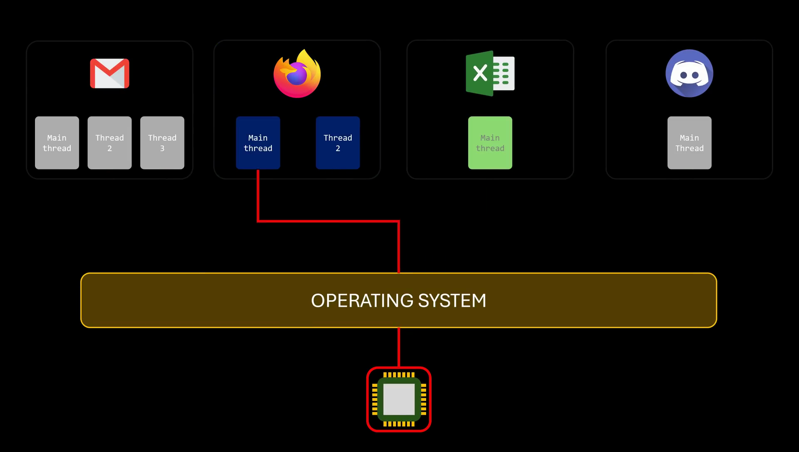

Implementing concurrency has some challenges, though. If the number of concurrent tasks increases too much, at some point, the system won't feel smooth anymore. Even if the CPU alternates between tasks extremely quickly, there comes a point where there are so many tasks that it takes too long for each one to regain access to the CPU. To address this, there are three possible solutions. The most obvious would be to simply make the CPU faster. If the CPU can handle more work in the same amount of time, tasks can regain access to it more quickly. This solution, though, isn't perfect because if we keep increasing the number of tasks, we will eventually end up back where we started: too many tasks causing delays. Plus, making CPUs faster has become increasingly difficult over the last decade.

The second solution would be to schedule CPU access in a more clever way. This is a more complicated solution that deserves its own video. The third solution, like the first one, is more of a brute force approach: if a single processor can't handle too many tasks, no matter how fast it is, just add more processors. This can be achieved in several ways: by adding more CPU sockets to the same motherboard, allowing for multiple physical CPUs, or by including multiple processing units within a single package or chip, known as multi-core processors. And, though less common, by combining multiple multi-core chips in the same motherboard.

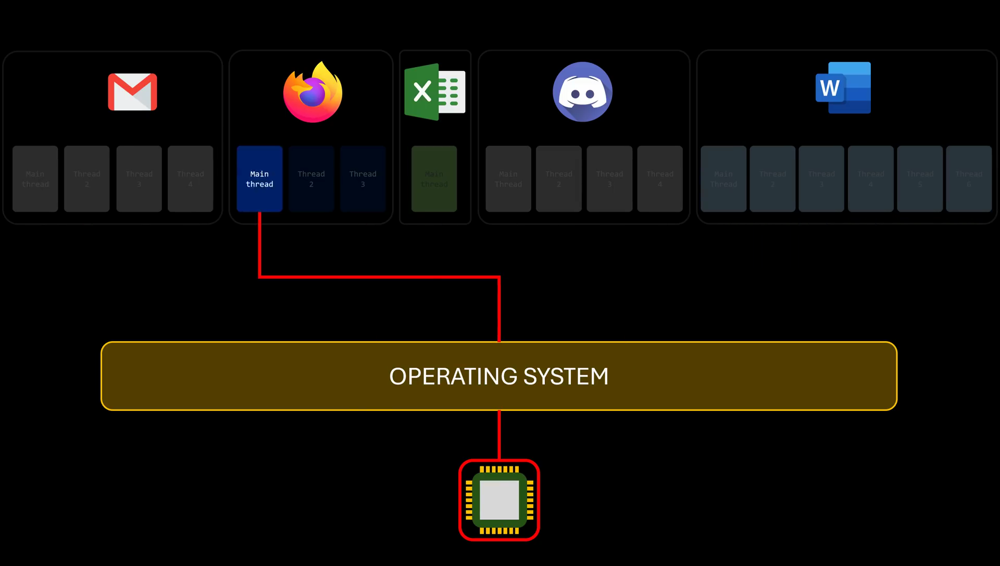

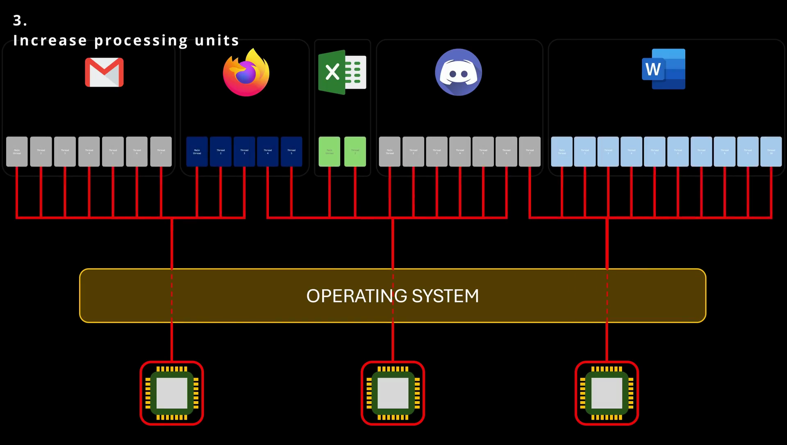

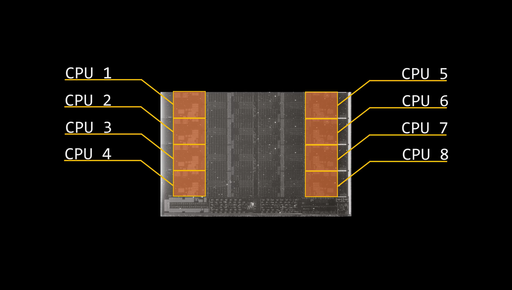

The terminology around processors can get a bit ambiguous. The term CPU is often used to refer to the entire package or chip; however, each core inside the package works as an independent processing unit, essentially a CPU that shares some components, like the cache, with other cores. In any case, each core appears as a separate processor to the operating system. So, if you heard the term "cores" a lot in this video, you know what I mean.

An application with eight threads on a system with a single computing core means that concurrency merely means that the execution of the threads will be interleaved over time because the processing core is capable of executing only one thread at a time.

But on a system with multiple cores, concurrency takes on a new meaning. Here, some threads can truly run at the same time because the system can assign each thread to a separate core. In other words, with multiple cores, we're no longer just dealing with concurrency; we're dealing with parallelism.

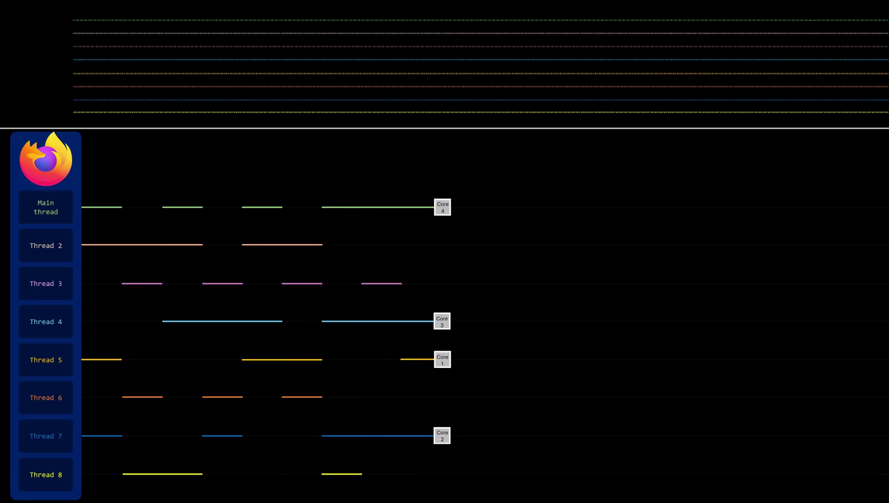

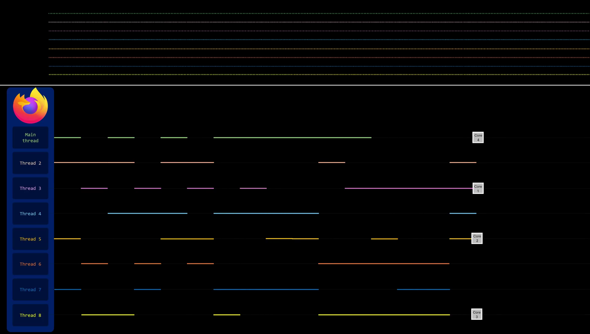

Notice the distinction between concurrency and parallelism in this discussion. A concurrent system supports more than one task by allowing all the tasks to make some progress. In contrast, a parallel system can perform more than one task truly simultaneously. Thus, it is possible to have concurrency without parallelism. One of the main advantages in parallel systems is that the smoothness of multitasking becomes less reliant on the illusion created by fast interleaving. Suddenly, it makes even more sense why virtually all modern operating systems consider threads, rather than processes, as the basic unit of execution. With multi-core processors now the standard, threads within the same process can take full advantage of parallelism.
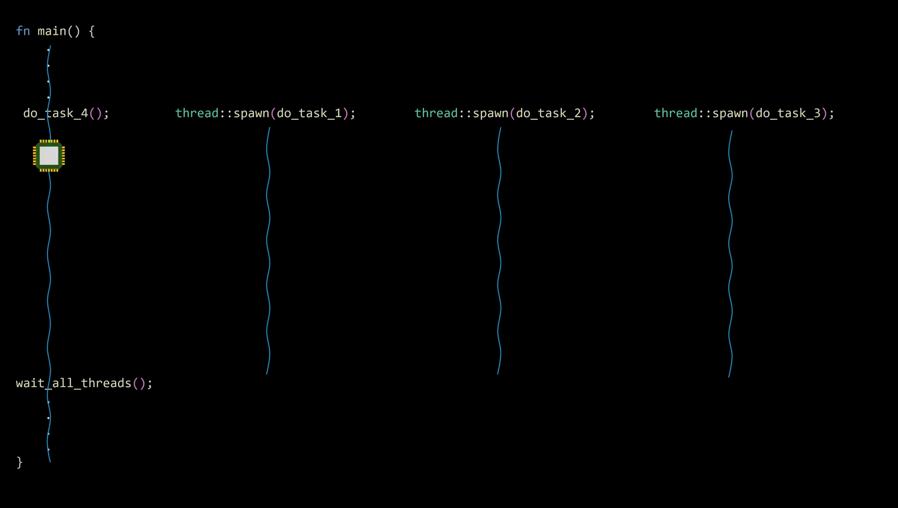
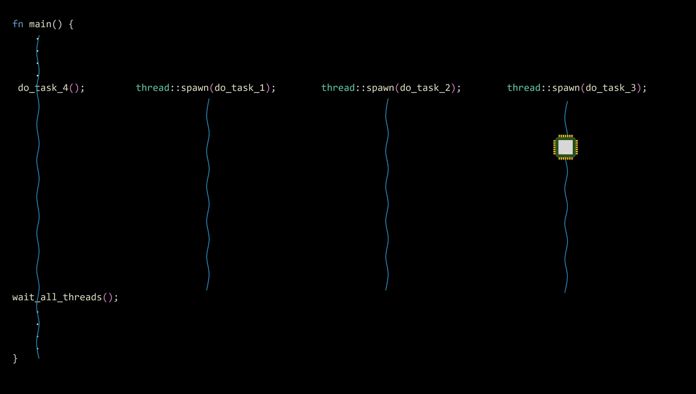
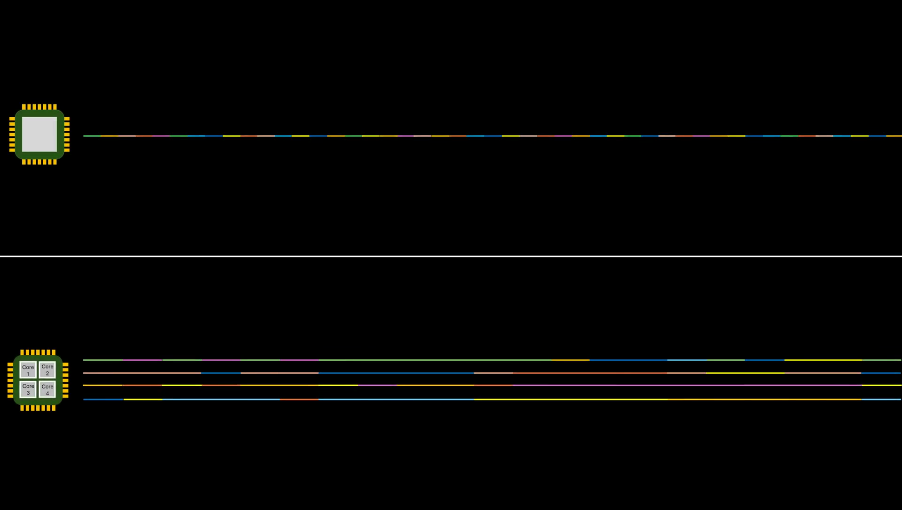

For us as programmers, this means that if we want to run tasks in parallel, all we need to do is declare those tasks as concurrent using threads. The operating system will handle the rest, interleaving the CPU between threads if no additional core is available or assigning one core to each thread if the system runs on a multi-core processor. This makes our programs more portable since we don't have to compile for a specific number of cores. Just always consider two important things: the number of cores is fixed, so creating a thousand threads doesn't mean that a thousand tasks will run in parallel. Instead, if the system has n cores, up to n threads can execute in parallel at any given time. And pay attention to this: up to n, because threads compete for resources. Even if we create the exact number of threads as the number of cores available, threads from other processes also need CPU time. Since one of the main goals of the operating system is to ensure fair distribution of CPU resources across all threads, it limits how many of our own threads can run in parallel.

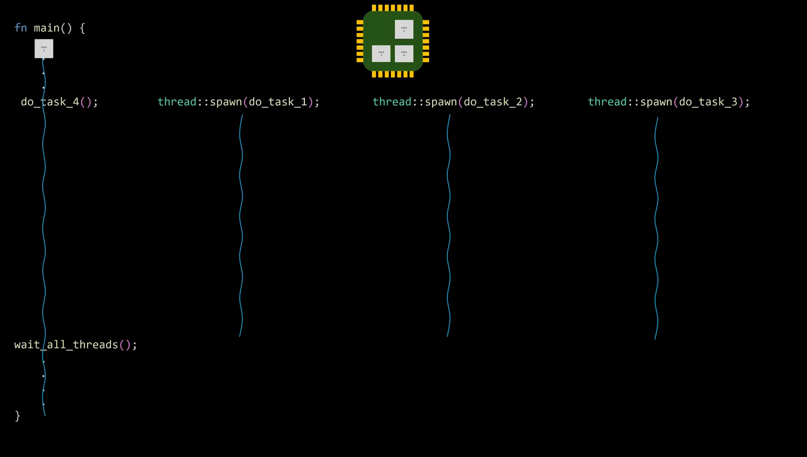
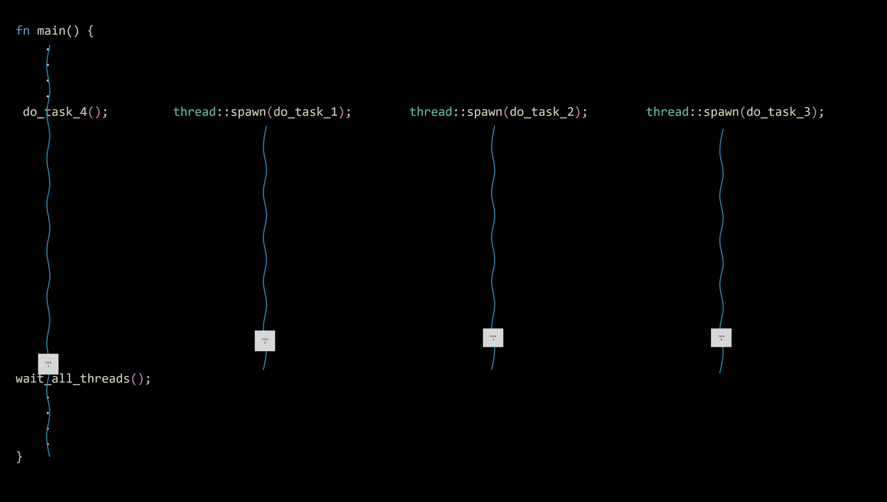

With that being said, let's discuss another reason why we might need parallelism in our programs: performance. This one is pretty obvious. If we can truly run more than one task at the same time, we can significantly reduce the total time it would take to complete those tasks compared to running them sequentially on a single-core system.

In general, there are two types of parallelism: data parallelism and task parallelism. Data parallelism focuses on distributing subsets of the same data across multiple computing cores and performing the same operation on each core. Task parallelism involves distributing not data, but tasks or threads across multiple computing cores. In other words, each thread is performing a unique operation. But here we have multiple scenarios: different threads may be operating on the same data, or they may be operating on different data.

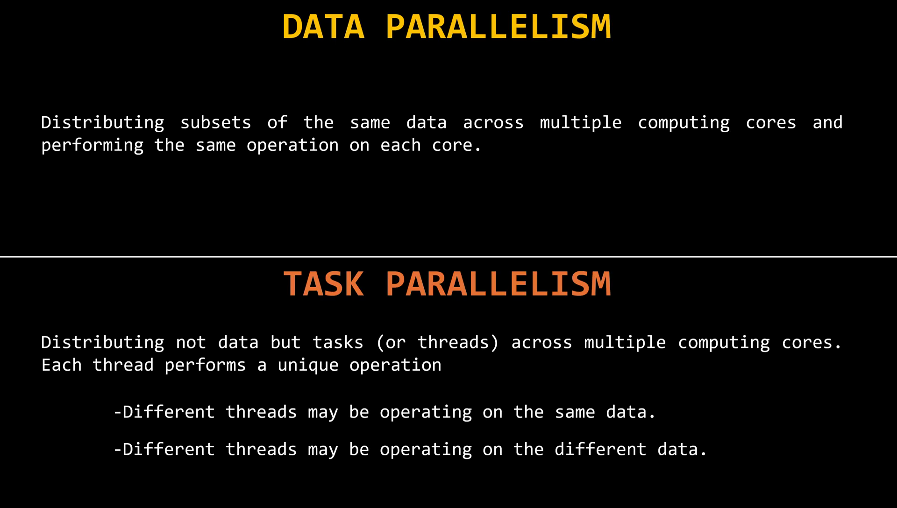

Let's say we have a large data set of numbers stored in an array, and our task is to find all the prime numbers in that array. This problem requires us to iterate over the entire array, checking whether each number is prime. The key here is to understand that the result of checking whether a number is prime doesn't depend on the results for any other numbers in the array. If we want to check whether the last number in the array is prime, we don't need to wait for the earlier numbers to be checked. Each number can be processed independently.

Now, if we have a four-core processor, we can split the data into four equal parts and assign each part to a different core. This is an example of data parallelism because all cores are performing the same operation on distributed subsets of the data. However, keep in mind that splitting the work across four cores doesn't necessarily mean we'll get four times the performance. For example, I tested the same example on my computer over 10 million times, and here's the average time it took to compute each subset. How much performance gain we can achieve from parallel operations is beyond the scope of this video.

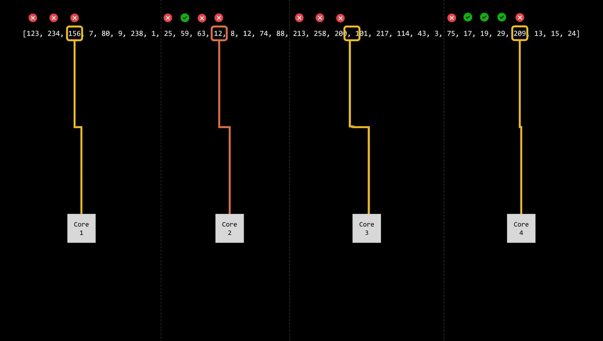

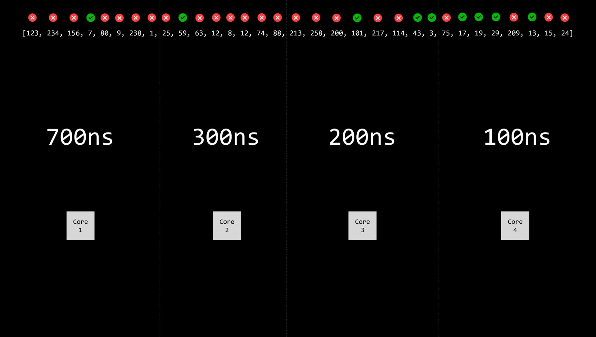

But I'd say we're given the same data set, but this time we're tasked with finding the lowest value in the array, finding the highest value, calculating the arithmetic mean of all the elements, and checking if the array contains the number 101. In this case, it doesn't make sense to split the data into subsets because each of these operations requires access to the entire data set to compute their results. But here's what we can do: assign each operation to a different core. This is an example of task parallelism—different threads working with the same data set but performing different operations. Again, using four cores doesn't mean the process will be four times faster, but it's still a significant improvement. On a single-core system, we'd have to perform these four operations one after the other. With four cores, we can execute them simultaneously, reducing the total time.

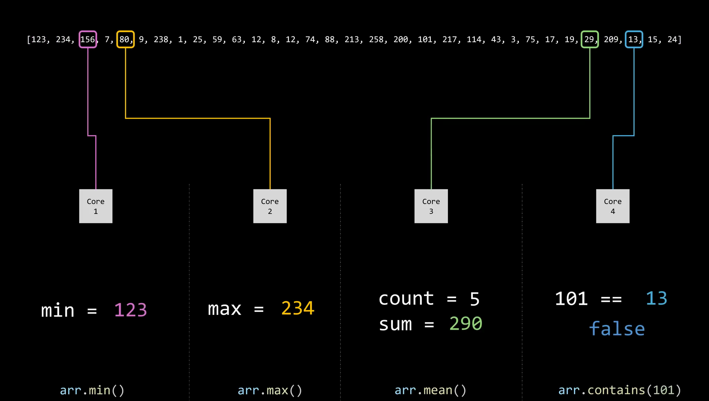

And that's about it for now. There's more content about threads coming soon.

# Summary

**Threads and Multi-Core Processors**
Concurrency allows multiple tasks to make progress by sharing CPU time, especially useful when one task is idle (e.g., waiting for I/O).

Threads enable multiple tasks within the same program to run independently, improving responsiveness (e.g., in an email app).

On a single-core system, threads are interleaved—only one runs at a time.

On multi-core systems, threads can run truly in parallel, each on a separate core—this is parallelism.

The OS schedules threads either by interleaving or distributing them across available cores.

Three solutions to handle too many concurrent tasks:

Make the CPU faster (limited scalability).

Improve task scheduling (complex).

Add more processors (multi-core systems).

Terminology: Each core in a CPU acts like a separate processor, even if they share some components.

Concurrency ≠ Parallelism:

Concurrency: tasks make progress.

Parallelism: tasks truly run at the same time.

Threads are preferred over processes as the basic execution unit in modern operating systems.

Creating more threads than cores doesn't mean all run in parallel—only up to n threads can run simultaneously on n cores.

Two types of parallelism:

Data Parallelism: same operation on different data chunks (e.g., checking primes in array parts).

Task Parallelism: different operations on same/full dataset (e.g., finding min, max, mean).

Parallelism boosts performance but doesn’t scale linearly due to overhead and resource contention.

Examples illustrate how dividing work across cores can save time—but gains depend on task and system setup.

