# Virtual Memory Explained
Hi everyone, Nicola here. In this video, we will talk about virtual memory. I will walk you through the problems, how virtual memory solves them, and finally how it's implemented. We will look at three problems that virtual memory solves: not enough memory, memory fragmentation, and security.
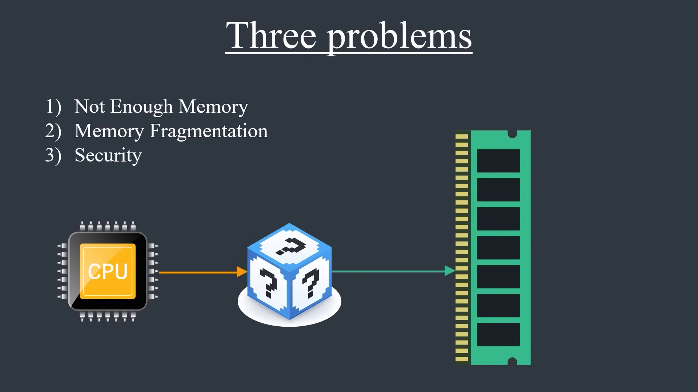

In the old days, computer memory was expensive, and computers didn't have as much RAM as today. For instance, most CPUs could support up to 4 GB of RAM, but it was common for computers to have only 1 GB of RAM or even less. Why could CPUs support only up to 4 GB? That's because registers could store 32 bits and could access up to 2^32 bytes of memory, which is 4 GB. This is what every program could do in theory. Modern CPUs, on the other hand, have a 64-bit address space, but we will use 32 bits for examples in this video because the numbers are easier to work with.

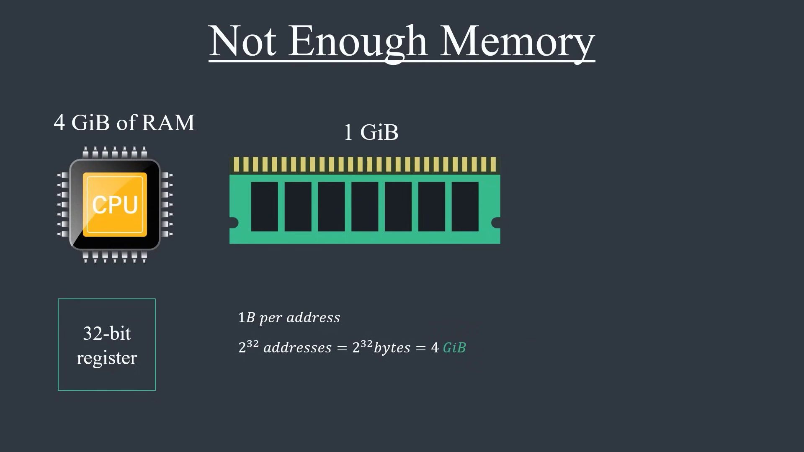
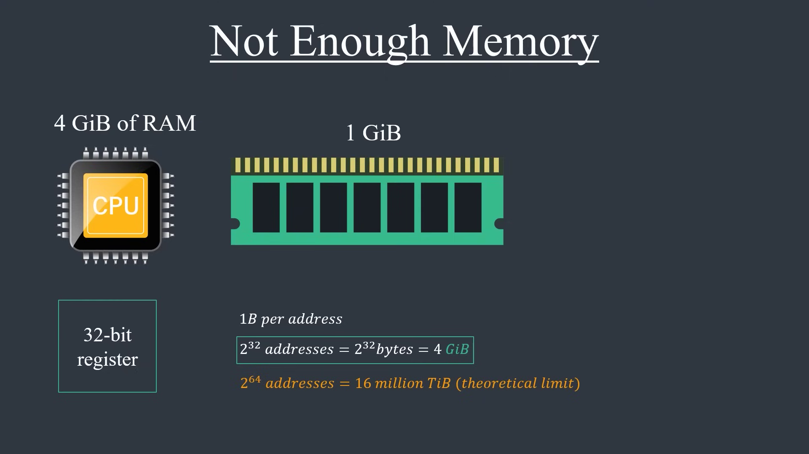

Our computer has only 2 GB of RAM in this example, which is a 31-bit space. So what happens when a program tries to access the first few bytes? That's not a problem. But what happens when the program tries to use more than 2 GB of memory? The program will crash because there is no memory to access. This is why programs used to crash in the 1950s or so.
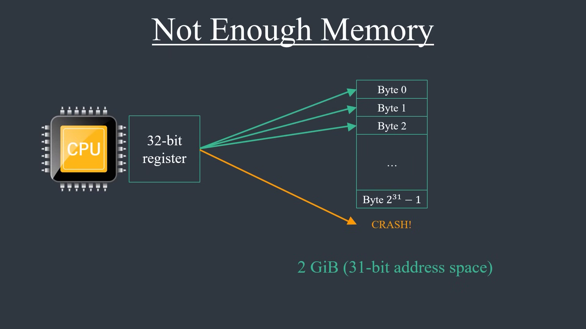

Memory Fragmentation
Now let's look at the second problem. Let's say that we have installed 4 GB of RAM, and we have three programs: a video player that runs a movie and needs 1 GB of RAM, a video game that needs 2 GB of RAM, and photo editing software that also needs 2 GB of RAM. If we run programs 1 and 2, they can fit in memory; they use 3 GB, leaving 1 GB free. If we close the video player, the memory usage is now 2 GB, and there's also 2 GB of free space. We should be able to run the photo editing software, but we can't because the memory is split. Even though there's enough space in total, this is called memory fragmentation.
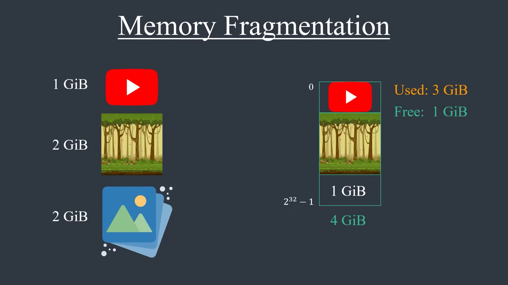

Why can't we split our program across the memory, you may ask? We could, but writing such programs would be very hard. If we have a global array of elements, we wouldn't be able to access any element using indexes if it was split across two memory chunks. For instance, we would have to implement some kind of indirection, and as you'll see later, this is what virtual memory is.
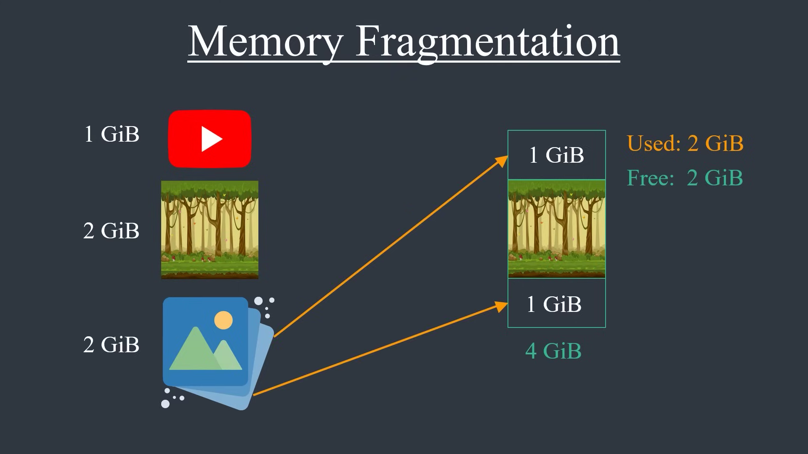

Data Corruption
Let's look at the third problem. We've said that each program can access any 32-bit address. So what happens if two programs try to access the same memory? For example, let's say that both programs write some value to the address 64: a video game that stores the player's current health and the music player that writes the remaining song duration. When the song finishes, the music player writes zero to this address, and if this is also the player's health, you would be dead, and it would be game over. That would be very annoying because these two programs are corrupting each other's state.
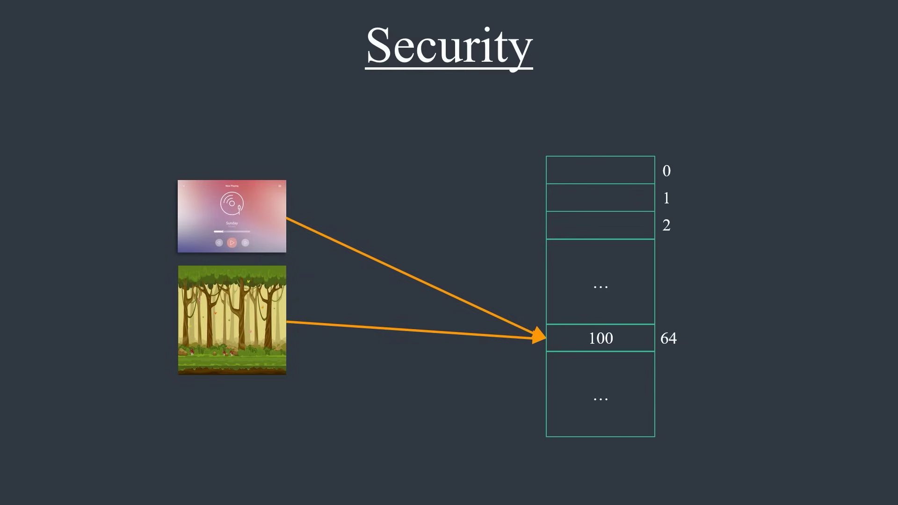

So to summarize, if all programs have access to the same 32-bit memory space, they can crash if they access invalid memory addresses because the computer has less than 4 GB of RAM. They can also run out of space if there are multiple programs running due to memory fragmentation, or they could also corrupt each other's data. The key problem here is that programs have access to the same memory space. So if we can give each program its own memory space, then we might be able to solve these problems.
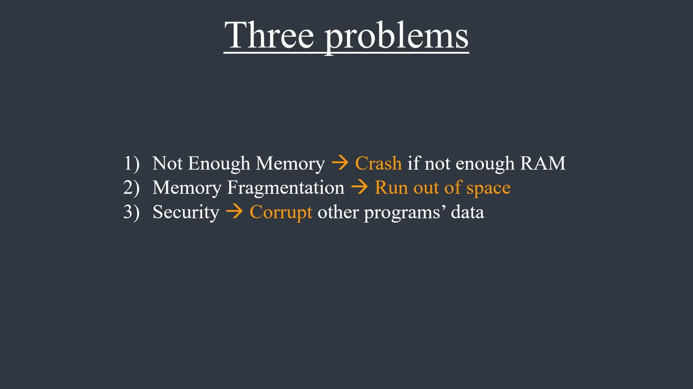

## Virtual Memory
The memory space assigned to each program is called virtual memory, and every program has its own virtual memory that doesn't overlap with other programs. But this means that we have to map each program's virtual memory space to RAM space. **We will refer to RAM as physical memory and to RAM addresses as physical addresses. We use the terms physical memory and physical address instead of RAM memory and address because RAM is not the only physical memory device that the CPU can access. It can also access memory or registers of other devices that are mapped to the same address space.**
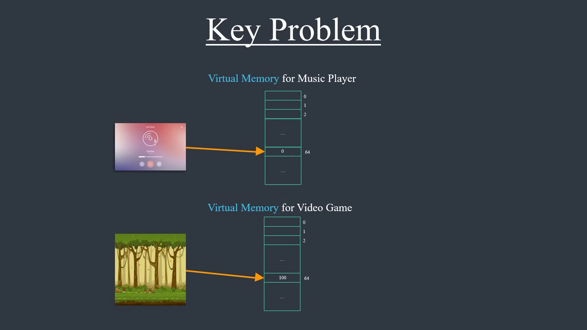
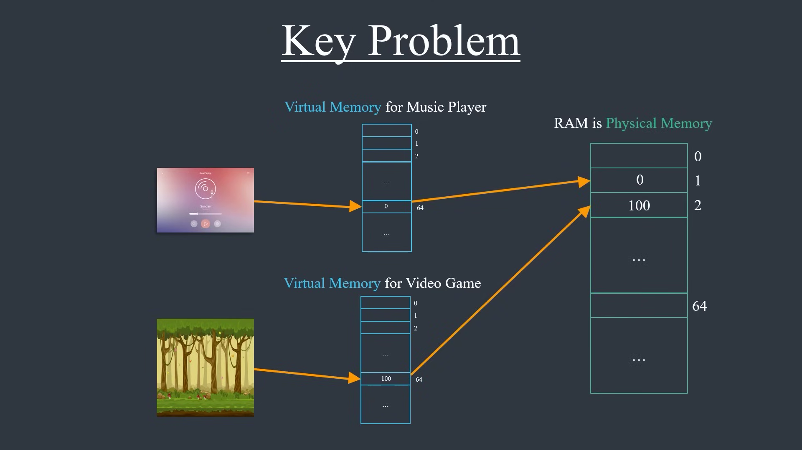

When a computer boots, the RAM installed on it becomes available to the OS from a certain physical memory address.  **The OS also reserves part of the RAM for itself, while the remaining part is used for programs.** But I'm diverging a bit from the main topic. RAM is the most important device for understanding how virtual memory works, so when I say physical address or physical memory in this video, you should think of RAM.
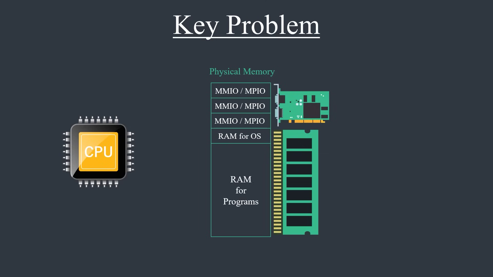
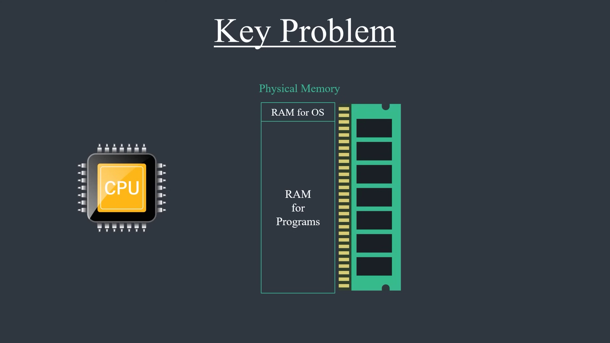

## How Virtual Memory Solves Problems
Let's see how virtual memory solves these problems. Without virtual memory, each program can access a 32-bit address space, which is directly mapped to RAM. With virtual memory, each program still has a 32-bit address space, but now we also have a map in the middle. This map knows how to convert a virtual address to a physical address. If a program wants to access address zero, for example, we look at the map and find that it corresponds to, say, address 5. Any virtual address can be mapped to any physical address.
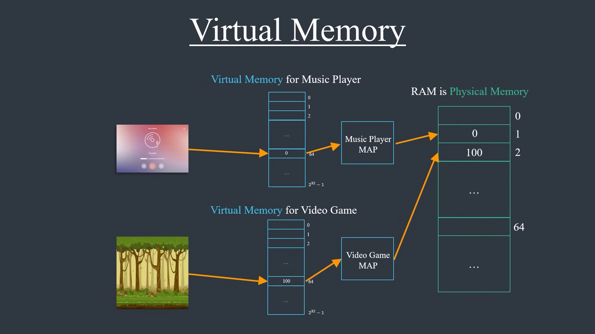
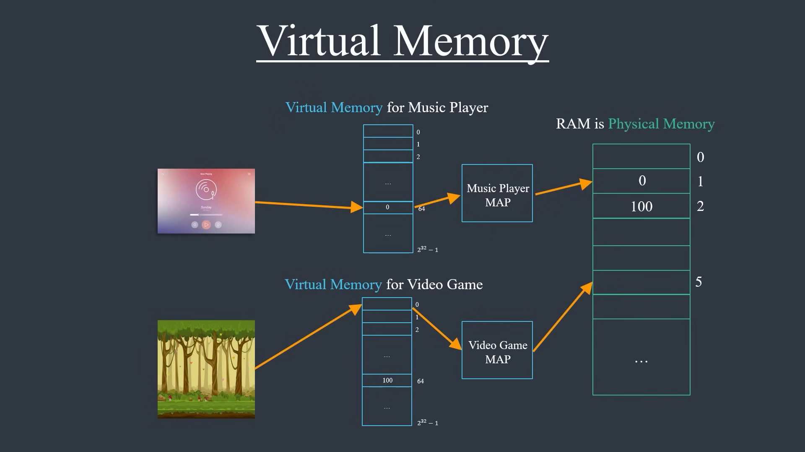

But what happens if a program tries to access more data than what can fit in RAM?  The data can be stored somewhere else, and the OS can tell us, "Hey, this data is not in memory;  it's on the hard disk." For example, the operating system will find the oldest data, in this case, address zero,  move it to disk, and load the accessed address 3. It will also update the mapping. The program can now read address 3.  **The mapping allows us to use a disk to give us additional memory when needed. This additional memory  is called swap memory.** When the data is not available in RAM and the OS has to go and read it from the disk,  we call this a page fault. We will talk about page faults later.
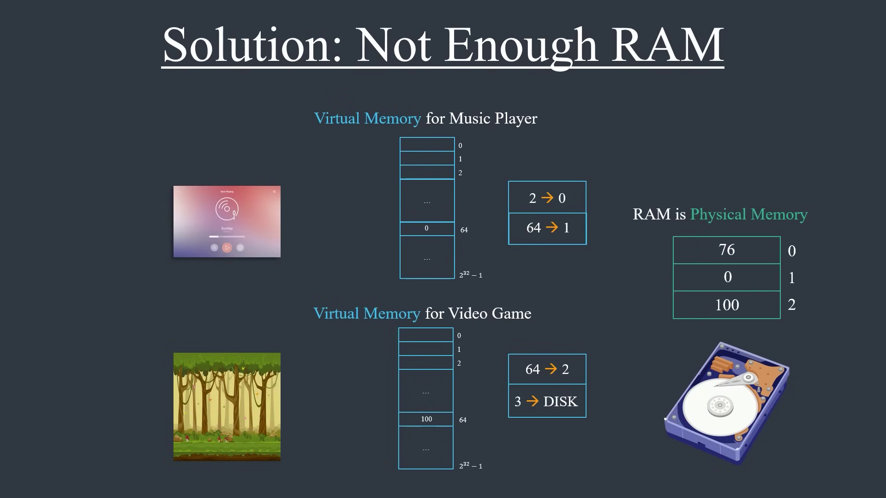

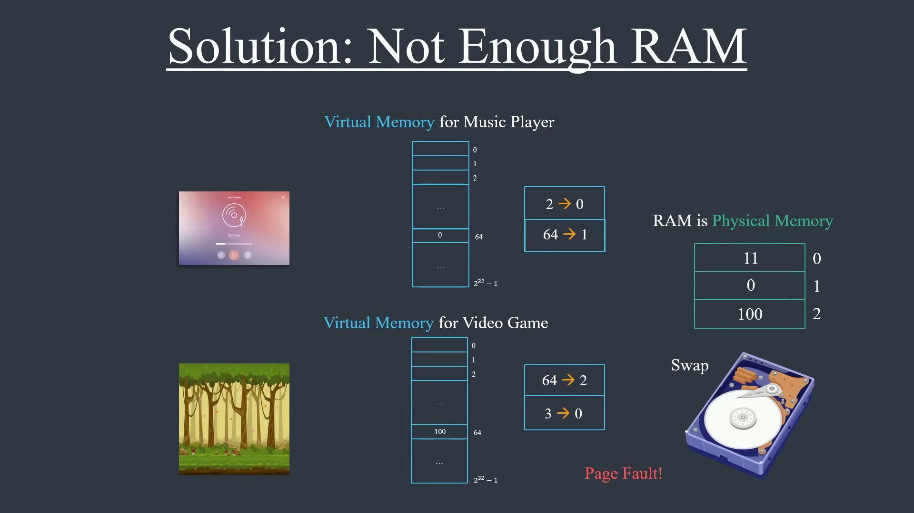
This is not all that great, though, because reading data from disk to RAM and updating the mapping is very slow. SSDs may have up to a thousand times slower latency to read the first byte, but it's still better than crashing in most cases. This is why having more RAM can massively improve the performance of your PC if it spends a lot of time swapping the data between RAM and disk.

## Solving Fragmentation
Now let's see how virtual memory solves the fragmentation problem. Remember our previous example where we closed the video player and wanted to start photo editing software while keeping the video game running? We were left with 2 GB of free RAM space, but the space was split into two 1 GB chunks. We couldn't run our program because it wouldn't fit in the continuous address space. With virtual memory, we can map parts of the program into each of the available chunks. From the program's perspective, nothing has changed, and it still assumes that the memory is continuous.
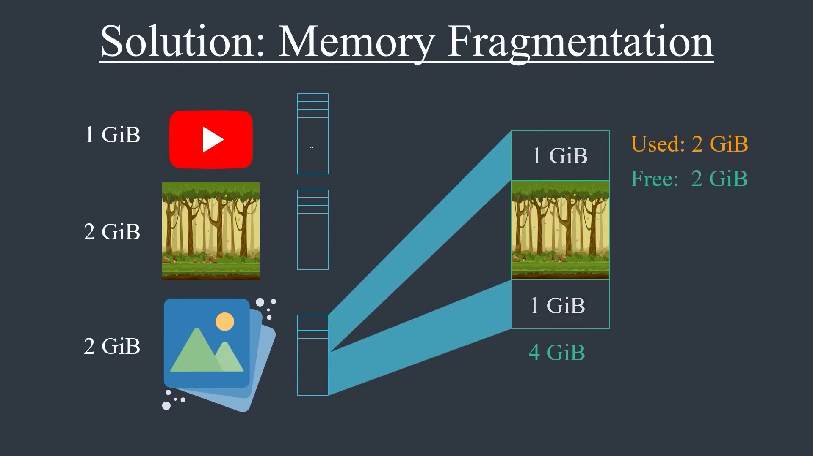

## Security with Virtual Memory
Now let's talk about the security problem. How does virtual memory keep programs secure? Let's go back to the example with a video game and a music player. Both programs have their own virtual address space and a map. When the video game accesses the player's health at address 64, it is mapped, for example, to a physical address 10. When the music player writes the remaining song duration, it writes it to, say, physical address 4. Even though each program tries to write to address 64, they're mapped to different physical locations. But the complete isolation is also not great because programs wouldn't be able to share any data.
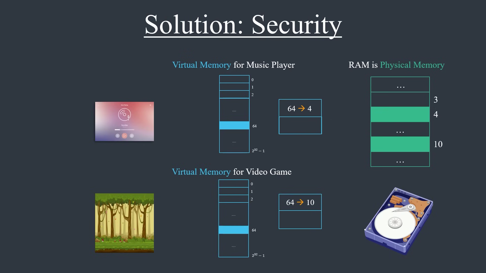

Fortunately, this is easy to fix by having parts of each program mapped to the same physical space. For example, each program may want to read the same shared library, such as Win32 API or libc, or they could use a shared memory space in RAM to exchange data without going through some other device like disk or network interface.
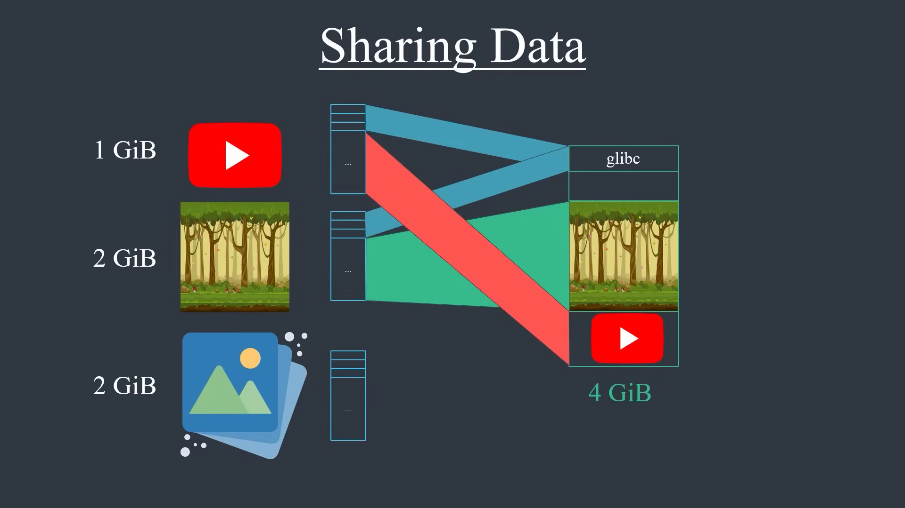

## Implementation of Virtual Memory
Now let's have a look at how virtual memory is implemented. What happens when a program accesses memory?  Let's say that a program wants to load data from address 64 into a register R1. When the CPU executes this instruction,  first it has to find the mapping from the virtual address 64 to a physical address and then read the data from the  physical address. **This map is called a page table, and each mapping is called a page table entry.**

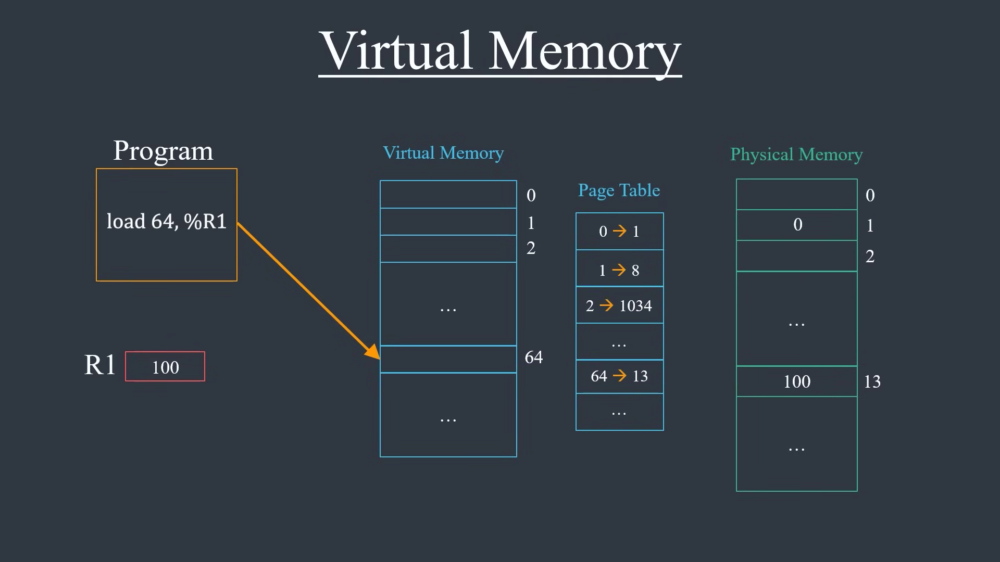

### Example
In our example, we have one entry for every virtual address. Actually, CPUs work with words, which is the size of a  CPU register. In our example, a word is `32 bits or four bytes`, so technically the page table has one entry for every  word in the virtual address space. So how much space do we need to store the mapping for each word? There are  2^32 addresses, each corresponding to a single byte, which means that there are 2^30 words. This is about 1 billion  entries. A single entry stores a physical address, which is also 32 bits, so the size of a page table would be 4 GB,  and there is one page table for every program. This is clearly a lot, so what can we do?
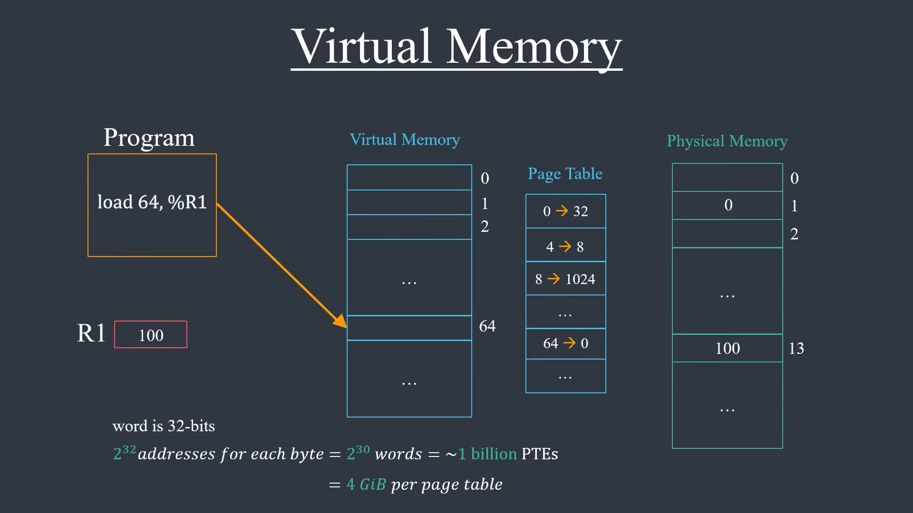

We can divide the memory into chunks, which we call pages, hence the name page table, and map pages  of memory instead of mapping each individual word. For example, virtual addresses 0 to 4,095 are mapped  to some physical addresses, say 16,384 to 20,479. This means that we don't need a single page table entry  for each word anymore; instead, we need one entry for every 4 kilobytes of data, which is 1,024 words.  The size of the page table entry doesn't have to be 4 kilobytes, but this is typical. My Linux box uses 4 kilobyte pages,  but it's possible to use other page sizes too. With 4 kilobyte pages, each page has about 1 million entries,  and the size of each entry is still 4 bytes, so each table needs 4 GB of size, which is manageable.
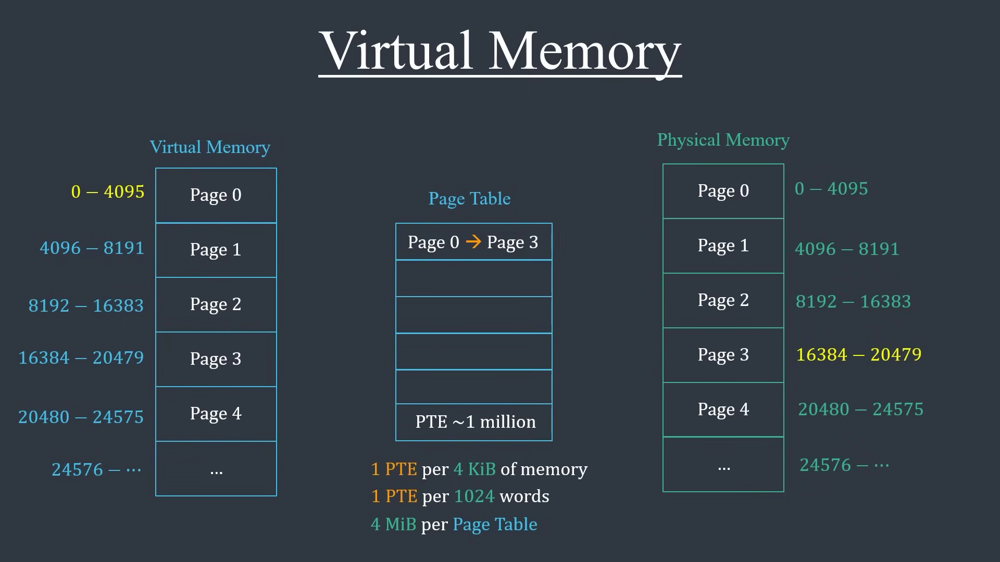

There is a trade-off here, though. Instead of moving a single word out of memory at a time, we now have to move 4 kilobytes of data. But this works quite well in practice because nearby memory locations are often accessed at the same time.

## Mapping Pages
So how do we map pages? Previously, we used to map each individual word, and the translation was just a lookup in the page table. Now the page table tells us that a range of virtual addresses is mapped to a range of physical addresses. Page zero covers the range of 0 to 4,095, and so on. We have the same for the physical space. Let's say that the virtual page one is mapped to the physical page two. What is the physical address for the virtual address 4,200, for example? The answer is 8,296 because each individual address in the virtual page is mapped to the physical address using the same offset. Address 4,200 is offset by 104 from the start of the virtual page one, so we know that it's going to be offset by the same number of bytes in the physical page, which starts at 8,192.
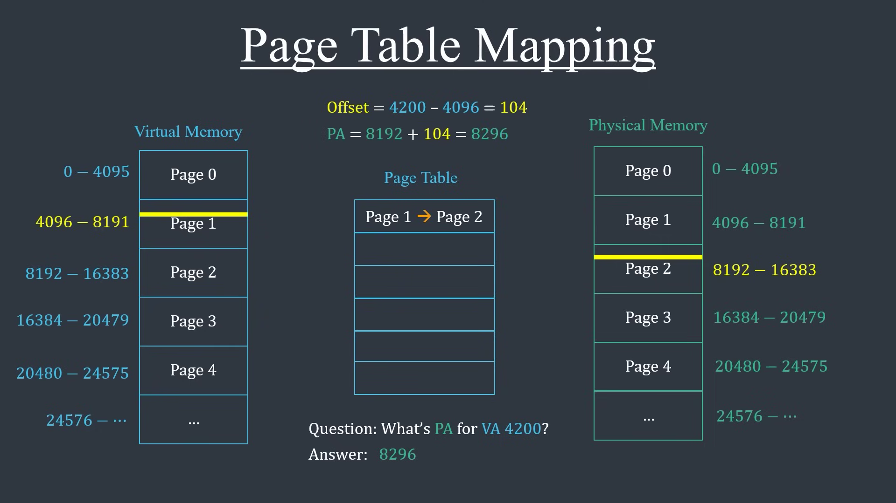

## Address Translation at the Bit Level
Let's see how address translation works at the bit level. Let's say that we have 32 bits of virtual address space, 30 bits of physical addresses, which is 1 GB of RAM, and the page size is 4 kilobytes, which is 12 bits. To translate a virtual address to a physical address, we keep the offset. The last 12 bits of both virtual and physical addresses are the same. To map the remaining 20 bits of the virtual address, the CPU asks the page table and gets back the remaining 18 bits of the physical address. Part of the virtual address without the offset is called the virtual page number, and part of the physical address without the offset is called the physical page number. Page tables map virtual to physical page numbers.
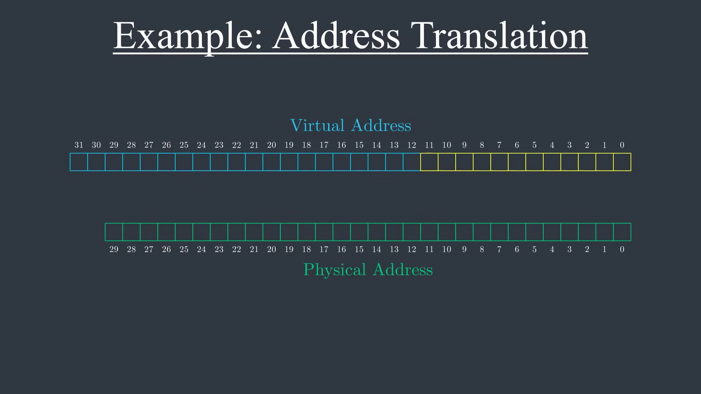
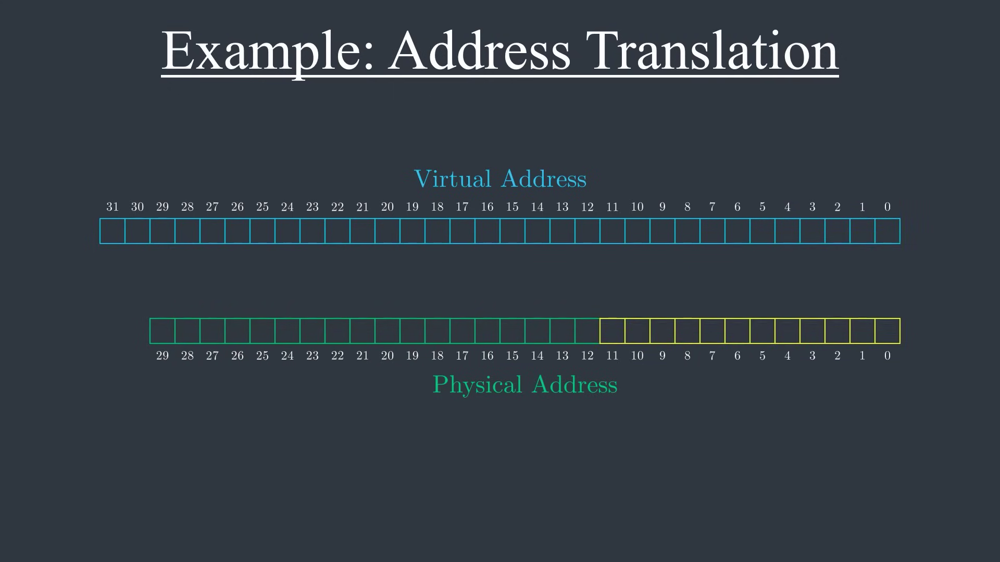
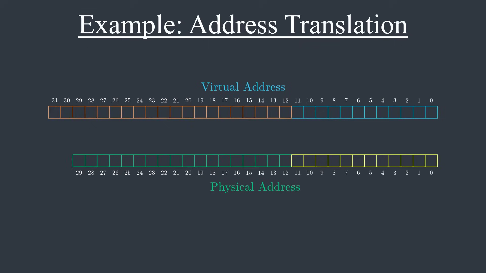
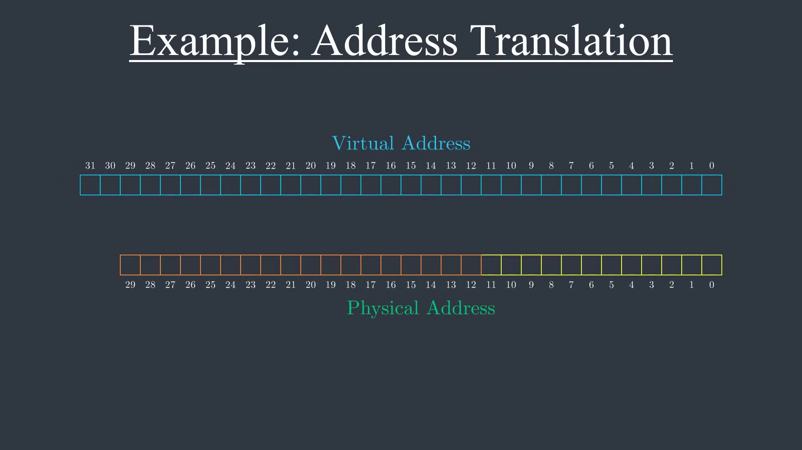

Let's look at an example. Say that we want to translate a virtual address, say 1 2 3 4 5 678. The last 12 bits remain unchanged, which is 678, so we just copy this to the physical address. Then we look up the virtual page number 1 2 3 4 5 in the page table, which returns a physical page number 0432. To get the full physical address, we concatenate the physical page number with the offset.
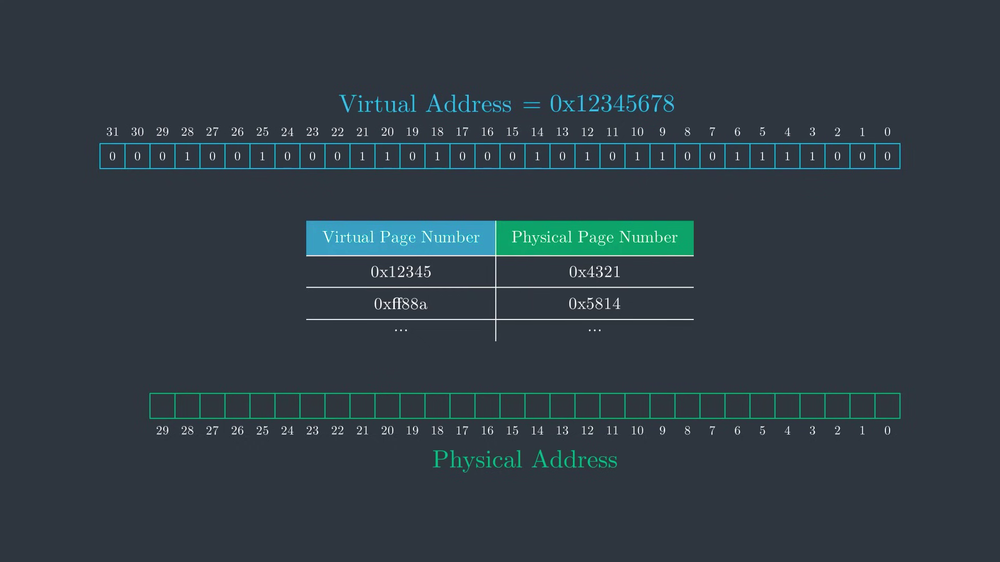
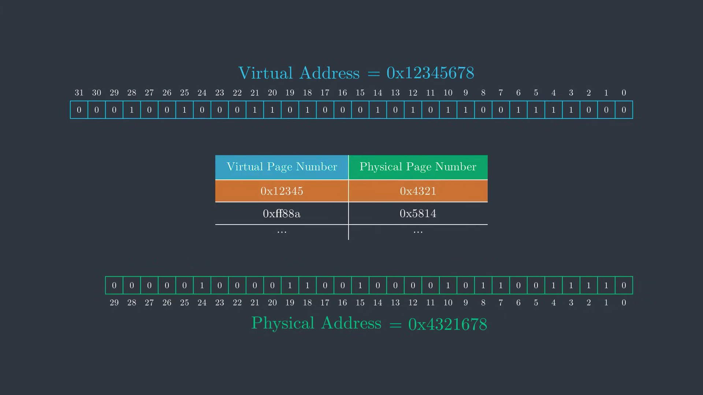

## Page Faults
Now let's talk about page faults. We've already mentioned what happens when the data is in RAM and the program tries to access it. The page table entry will say that the data is, for example, on the hard disk. But how does this actually work? When a CPU tries to read some virtual address, it looks up the mapping in the page table. The page table says that the data is on disk, so the CPU doesn't know how to read it from RAM. Instead, the CPU raises an exception, and this exception is called a page fault.

The operating system handles the page fault exception by choosing which page to evict from RAM, which is usually the least recently used one. If the page is dirty, the OS writes it back to disk. We say that the page is dirty if the program has written something to it after loading it from disk. If the program hasn't written anything to the page, then there is no need to save it to disk because its contents haven't changed. So we gain a little bit of performance here.
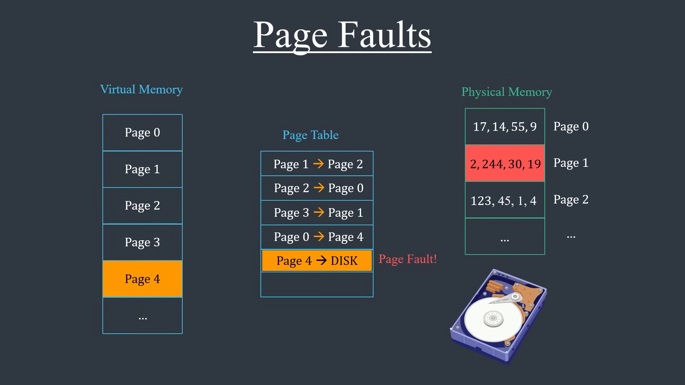
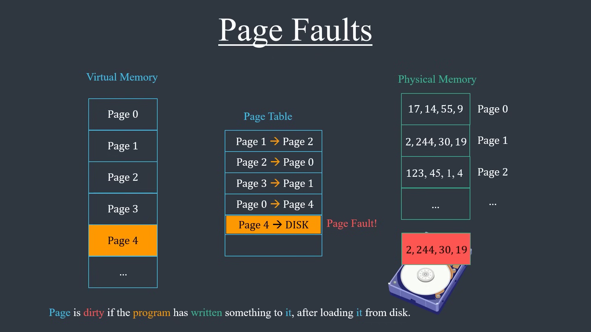

After that, the OS loads the requested page from disk into RAM, updates the page table, and goes back to executing the same instruction that caused the page fault. This time, the data is in RAM, so the CPU can access it. Page faults are very, very slow, and when this happens, the OS usually switches to executing another program in the meantime. Since disk I/O is very slow, modern CPU architectures have modules called DMAs, which stands for Direct Memory Access. DMA can load data from disk to RAM directly while the CPU is doing something else.
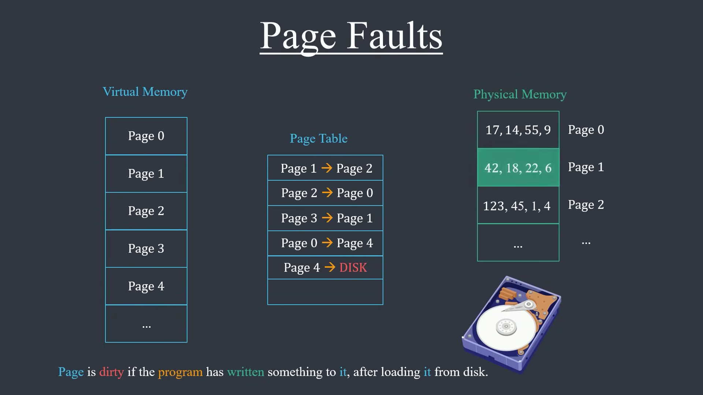

## Summary of Key Concepts
Let's summarize what we've learned so far:

* Each program has its own virtual memory space.
* When we say physical memory, we think of RAM.
* Both virtual and physical memory spaces are split into 4 kilobyte chunks called pages.
* The last 12 bits of physical and virtual addresses are called the offset, while the remaining bits are called virtual  and physical page numbers (this is assuming 4 kilobyte pages).
* The page table maps a virtual to physical page number without the offset.
* There is one page table per program.
* A page fault is an exception that the CPU generates when it tries to access a page that is not in physical memory.

## TLB
I hope you see why virtual memory is so useful. But isn't this indirection slow? For every memory access, we need to find the page translation in the page table, which is stored in RAM, so this requires another RAM access: translation of the address and then access the actual data from RAM again. This looks very expensive just for a single memory access, and you're right, it is expensive. We need a way to find the physical address very quickly.
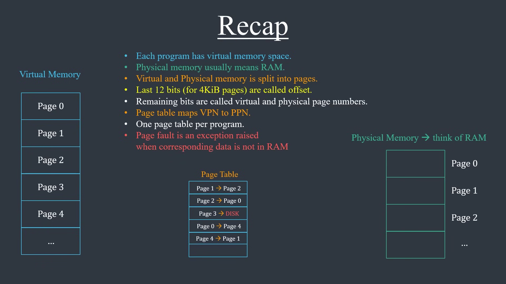

What we could do is add a special hardware component in the CPU that can cache translations from virtual to physical addresses. This component is called the Translation Lookaside Buffer, or TLB for short. This cache is very small but very fast. When the CPU wants to translate the virtual address, it asks the TLB. If the translation is in the TLB, then it's very fast, usually less than a cycle. If not, then we need to load it from the page table into the TLB, which is slow.
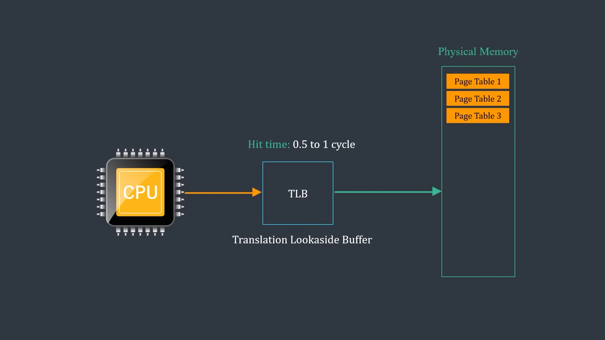
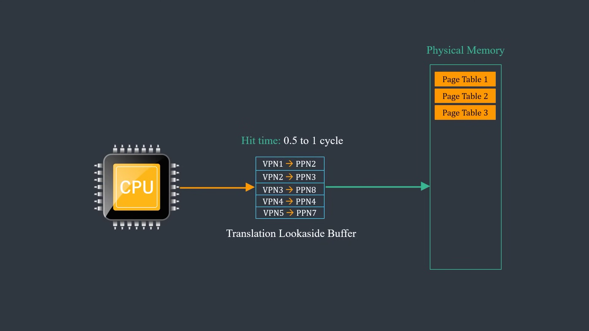
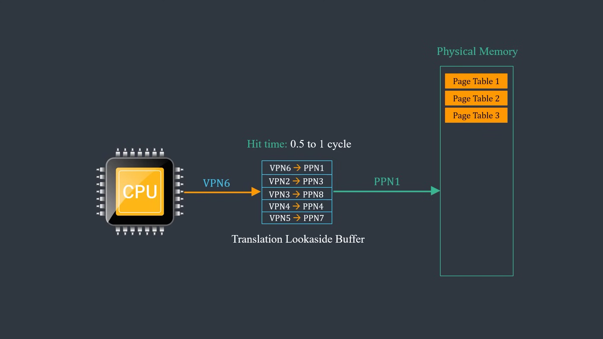
Modern CPU architectures usually have two TLBs: one for instructions and one for data. TLBs are small, around 4,000 entries on modern architectures. This is why TLBs are constantly being updated. Fortunately, this works well in practice because of data locality.

## Improving TLB Performance
What can we do further to improve the performance of TLBs? Well, we can add more hardware. CPUs usually have two levels of TLB caches, which reduces the need to access RAM. Another common practice is to have something similar to DMA modules to load pages from RAM to TLBs without having to go back to the OS.
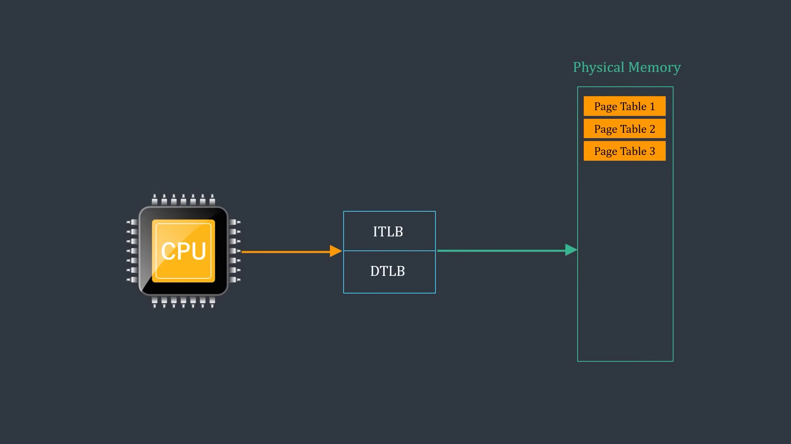
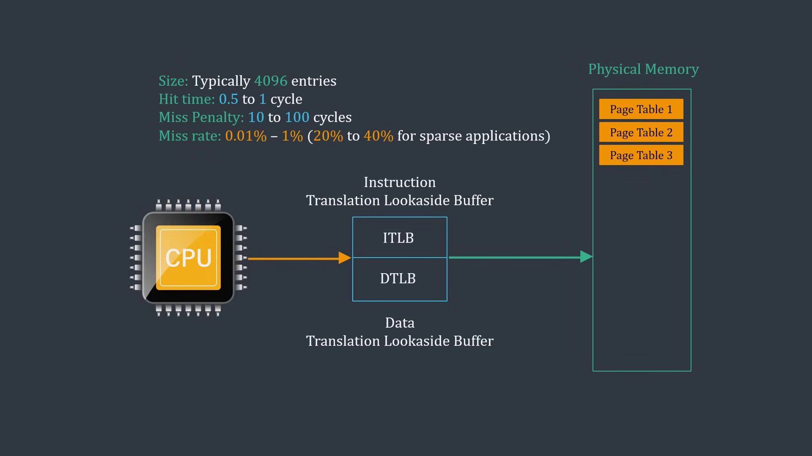

Let's see an example. The CPU wants to translate a virtual address 1 2 3 4 5 6 7 8. Same as before, the page offset is the same, so we just copy the last 12 bits to the physical address. The virtual page number is 1 2 3 4 5, which is translated by looking for the mapping in the TLB. The TLB is empty, so the page is loaded from RAM. We locate the virtual page 1 2 3 4 5 in the program's page table, fill in the physical page number in the TLB, and we can now complete the translation. Next time, when the program tries to access a virtual address with the same page number, it will be loaded directly from the TLB.

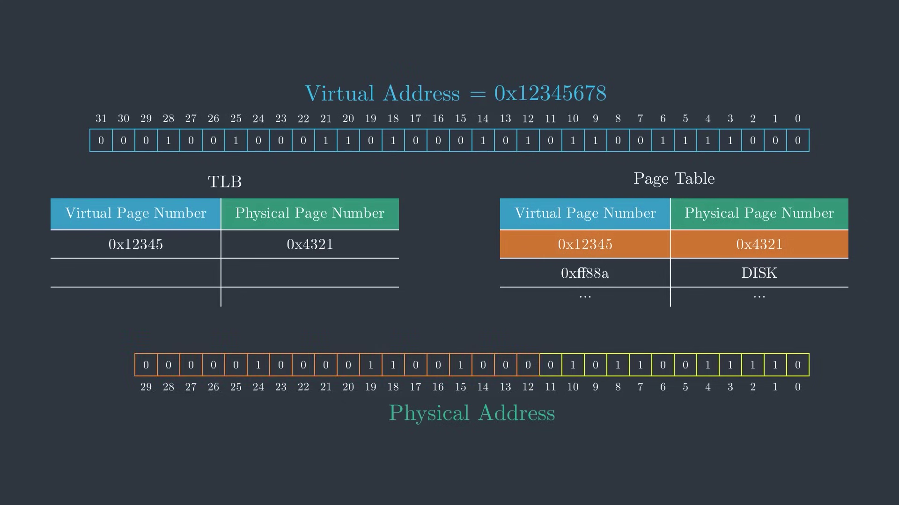

What happens if the TLB is full and the virtual page number is not there? We remove the one that is least recently used and load the corresponding page in the same way as before. If a program wants to access a page that is on disk, it's still loaded into the TLB, and the CPU generates a page fault. Actually, the piece of hardware that is responsible for address translation and generating page faults is called the MMU, which stands for Memory Management Unit. The Memory Management Unit is usually on the CPU board and is programmed by the OS.
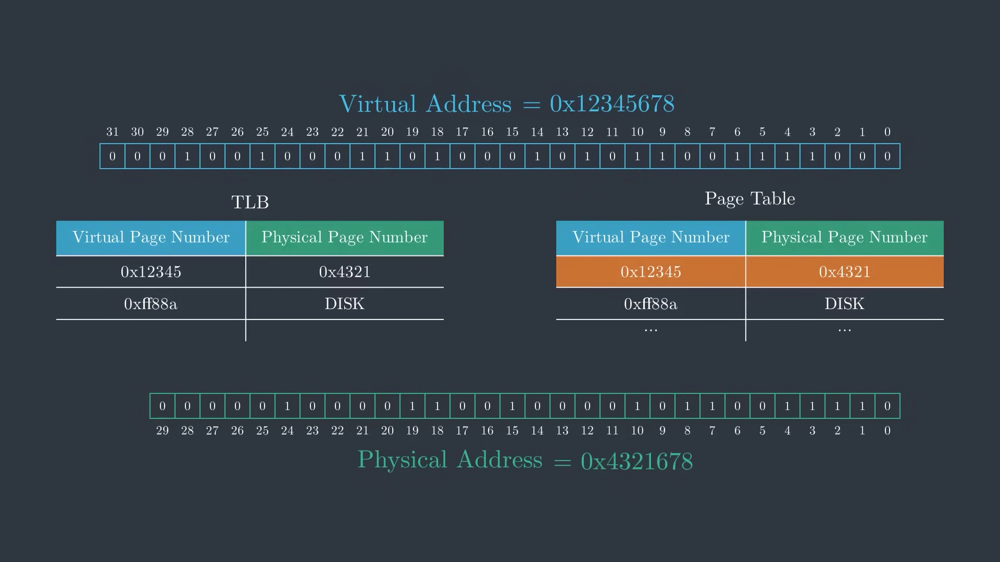
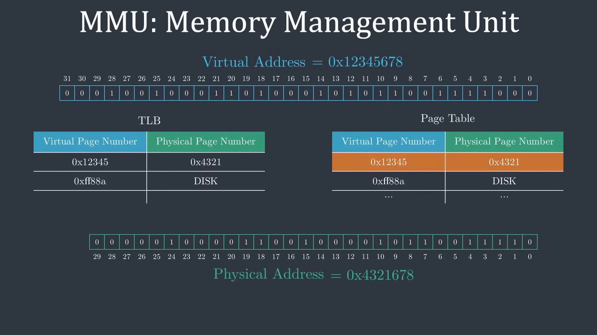

## Memory Requirements for Multiple Programs
This all looks great, but how much memory do we need to run, say, 50 programs? We need 4 megabytes of memory for each program, so this would be 200 megabytes. Modern computers run many programs at the same time. For example, I have 595 programs running right now in the background on my Linux box, which would need more than 2 GB of RAM just for page tables. Even if most of these programs didn't require much memory for themselves, that's a lot of wasted RAM.
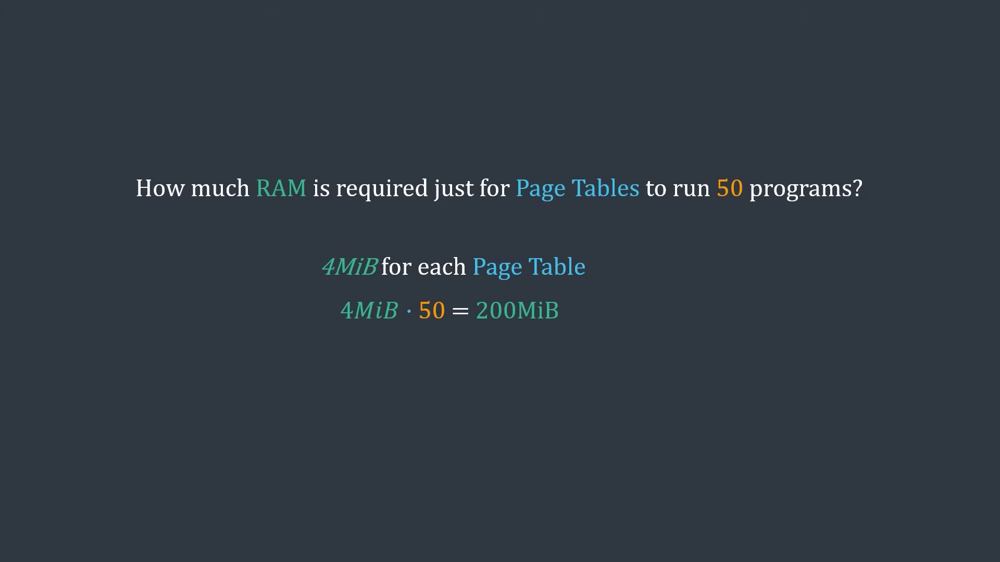

The hard part is that we can't swap the page tables out because the CPU needs page tables to translate virtual to physical addresses. If the page table is not in RAM, we can't find it. But we are already swapping arbitrary memory locations, so can we do the same for pages? To solve this problem, we can introduce another level of page table entries for each program.
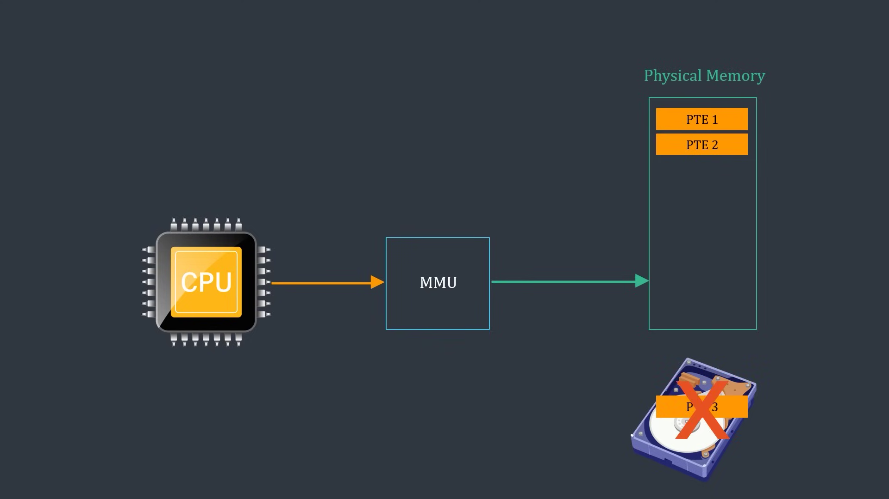

Let's go back to our example with 4 kilobyte page tables. The last 12 bits are used as an offset, and there are 2^20 page table entries, so around 1 million. If we organize them into 4 kilobyte chunks, then we need 1,024 chunks. These chunks are second-level pages. To swap them out to disk, we need a mechanism to track their location in RAM or on disk. We can solve this by introducing another level of page table entries, which we call the first level. The first level provides translation from a virtual address to a page entry in the second level, and the second level provides the final translation to a physical address. Page tables can have more than two levels. Adding more levels increases complexity, and we need more memory accesses. Linux uses five-level page tables to overcome the limit of 64 TB of physical RAM, which some vendors provide today for servers.
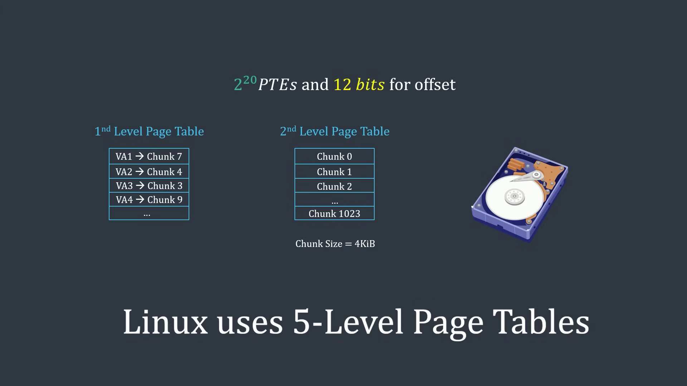
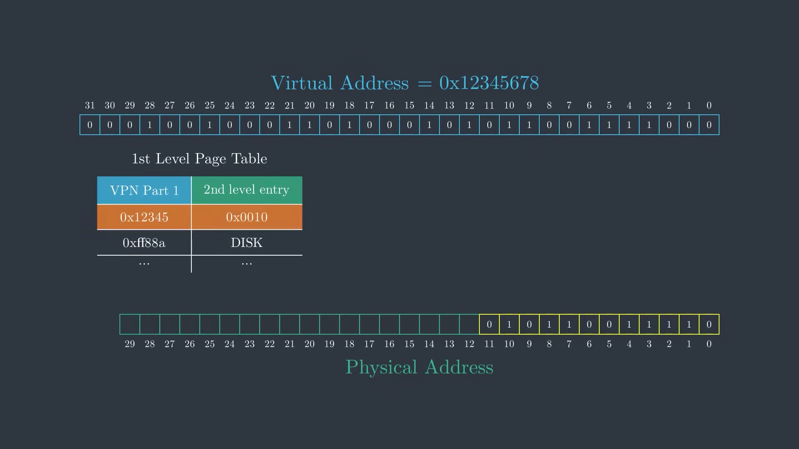

## Multi-Level Page Table Example
Let's see an example where we translate a virtual address using multi-level page tables. We have 32 bits of virtual addresses and 30 bits of physical addresses. We are going to translate the same virtual address as before. The first-level page table entries are always stored in RAM, and we have some second-level page table entries. They're in RAM as well, but some of them can be on disk. With 4 kilobyte pages, the last 12 bits are used as an offset, which is the same as before, so we just copy them to the physical address.

Now let's see how to translate the virtual page number. We will divide it into two parts, each part is 10 bits long. We will use the first 10 bits to look into the first-level page table entries. This tells us that we need to look further into the second-level page table entries that are stored at the address 0010. We get the second-level page table entries from memory and use the other 10 bits to find the exact entry, which gives us the final translation. While we always need to keep the first-level page tables in RAM, the second-level page table entries can be swapped out to disk to save memory. This is especially useful for programs that don't use much RAM and don't need to address the full virtual address space.
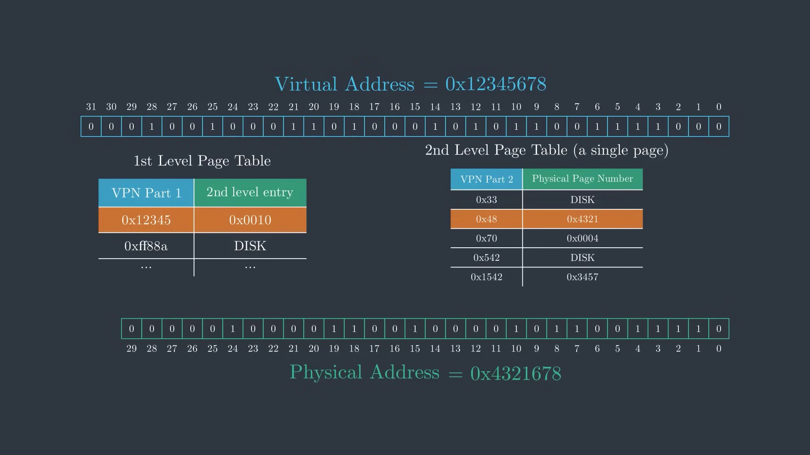