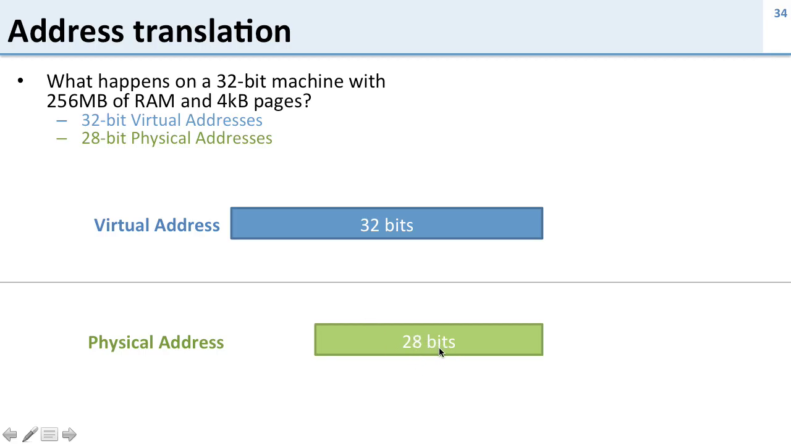
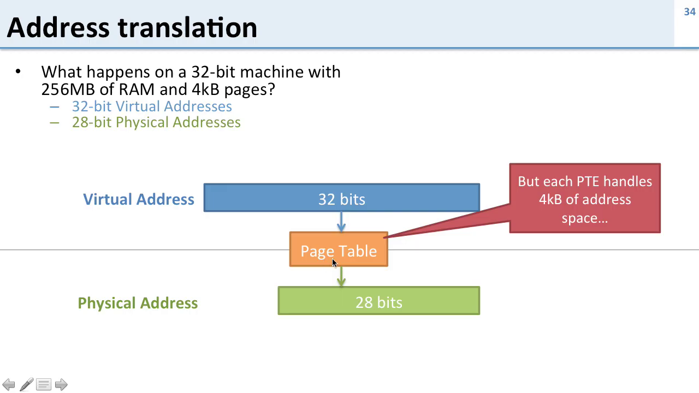
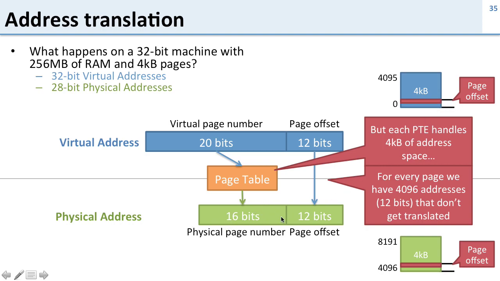
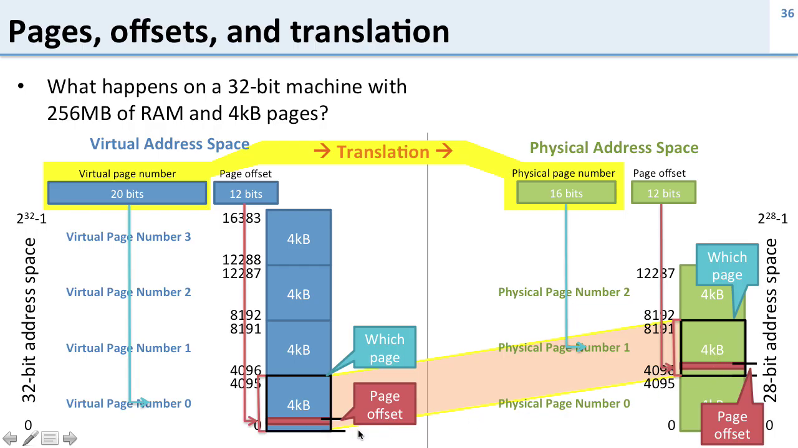

# Address Translation

## **Summary in Bullet Points**

* A **32-bit virtual address** allows a process to access up to **4 GB** of memory.
* The actual **physical memory** available might be much smaller, e.g., **256 MB**, which corresponds to **28-bit physical addresses**.
* **Address translation** converts a virtual address to a physical address using the **page table**.
* **Page size** is assumed to be **4 KB** (4,096 bytes).
* A 4 KB page requires **12 bits** for the **page offset** (lower bits), which are **not translated** — they remain the same in both virtual and physical addresses.
* The **remaining 20 bits** of the 32-bit virtual address are used as the **virtual page number**.
* These 20 bits are translated via the **page table** into **16-bit physical page numbers**, suitable for 28-bit physical addresses.
* The **page table** only translates the **virtual page number**, not the offset.
* In virtual address space:

  * Virtual page number = upper 20 bits.
  * Page offset = lower 12 bits.
* In physical address space:

  * Physical page number = mapped from virtual page number.
  * Page offset remains the same.
* Since physical memory is smaller than virtual memory:

  * Only a subset of virtual pages can be resident in physical memory at a time.
  * The rest can be stored on disk (if paging/swapping is used).

## **Questions and Answers**

**Q1: What is the purpose of address translation?**
**A:** It converts a virtual address used by a program into a physical address used by the hardware to access memory.

---

**Q2: In the example, how large is the virtual address space and the physical memory?**
**A:** Virtual address space is **4 GB (32-bit)**; physical memory is **256 MB (28-bit)**.

---

**Q3: What is the page size, and how does it affect address translation?**
**A:** Page size is **4 KB**, which means the **lowest 12 bits** of an address are used as the **page offset**, and they are **not translated**.

---

**Q4: What gets translated in a virtual address?**
**A:** Only the **virtual page number** (upper 20 bits); the **page offset (12 bits)** remains the same.

---

**Q5: Why does the virtual address have more page number bits (20) than the physical address (16)?**
**A:** Because the **virtual address space is larger** than the physical memory. There are more virtual pages than physical pages.

---

**Q6: How does the system manage this mismatch in size?**
**A:** By using a **page table** to map virtual pages to physical pages and swapping non-resident pages to/from disk as needed.

---

**Q7: What is the role of the page table?**
**A:** It maps **virtual page numbers** to **physical page numbers**, enabling translation and access control.

---

**Q8: Why are translations done in page-sized chunks?**
**A:** To simplify and speed up the mapping — only the page number needs translation, not each byte address.

---

**Q9: Does the physical memory care about whether addresses came from virtual or physical?**
**A:** No, the physical memory just receives addresses; the translation logic ensures correct mapping beforehand.

