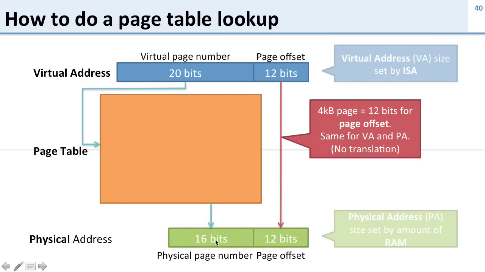
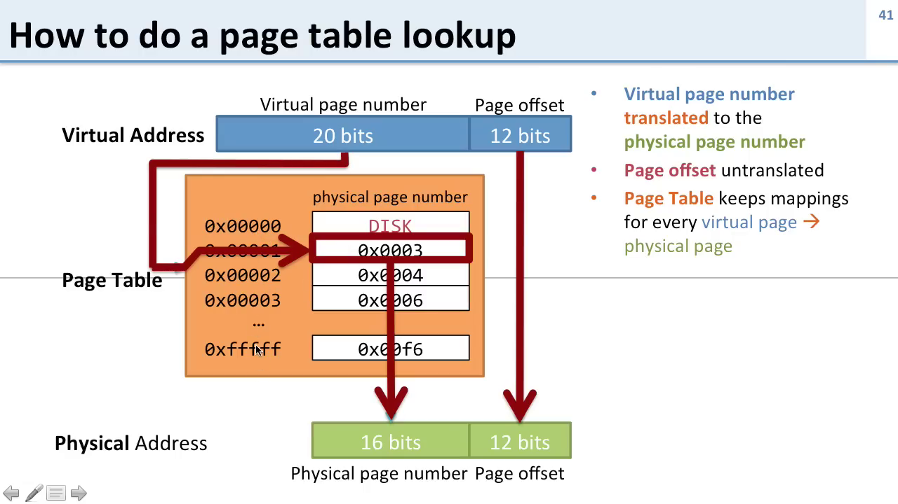
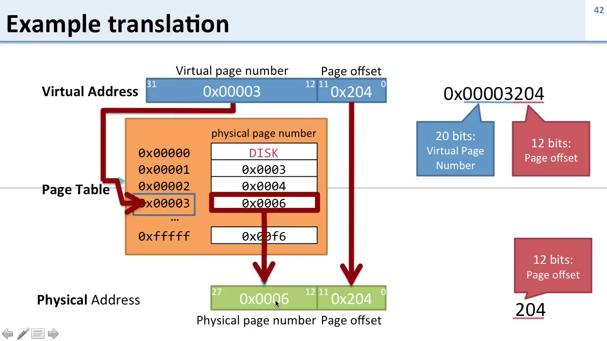
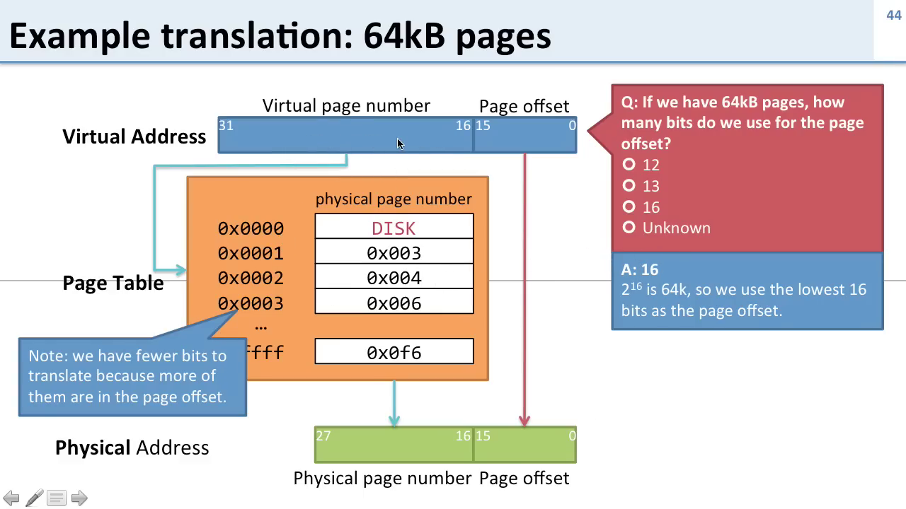

---

### 🔹 **Summary in Bullet Points**

* Virtual address size is defined by the **Instruction Set Architecture (ISA)**; physical address size is defined by the **installed RAM**.
* With **4 KB pages**, the **lowest 12 bits** of a virtual address form the **page offset** — **not translated**, passed directly to the physical address.
* The **upper 20 bits** (of 32-bit address) are the **virtual page number (VPN)** and are **translated** using a **page table**.
* **Page Table** maps each **virtual page number** to a **physical page number (PPN)** or a **disk indicator** if the page is not in memory.
* Each **Page Table Entry (PTE)** contains:

  * Physical page number (if in RAM), or
  * Disk information (if not in RAM).
* The page table handles **only the virtual page number**. The offset is directly appended to the translated physical page number.
* Fewer **physical pages** than **virtual pages** implies:

  * More VPN bits than PPN bits.
  * Some virtual pages reside on **disk**, not RAM.
* **Example Translation**:

  * Virtual address `0x00003204` → virtual page number used to find corresponding physical page → physical address becomes `0x00000624`.
* If virtual page is **not in memory**, translation fails → OS must **page in** data from **disk**.
* Increasing page size to **64 KB** changes structure:

  * Now **16 bits** used for **page offset** (2¹⁶ = 64K).
  * Remaining **16 bits** used for **virtual page number**.
  * Fewer entries in page table → page table is **smaller**.
  * Each page table entry still maps VPN to a PPN or disk location.
  * **Larger pages** reduce overhead but increase **data granularity** — more memory or disk data per page.

---

---

### 🔹 **Questions and Answers**

**Q1: How is a virtual address translated to a physical address?**
**A:** The **virtual page number** is looked up in the **page table** to get the **physical page number**, which is combined with the **unchanged page offset** to form the physical address.

---

**Q2: What part of a virtual address is not translated?**
**A:** The **page offset** (e.g., lower 12 bits in a 4 KB page) — it is directly used in the physical address.

---

**Q3: What happens if the virtual page is not in RAM?**
**A:** The page table entry indicates that it is on **disk**, and the system must load it into RAM before translation can complete.

---

**Q4: Why do we need a page table?**
**A:** To **map virtual pages to physical pages**, enabling **virtual memory abstraction** and handling **paging** when data is not in memory.

---

**Q5: What is a Page Table Entry (PTE)?**
**A:** It holds either:

* The **physical page number** where the virtual page is stored, or
* An indicator that the page is **on disk**.

---

**Q6: How many bits are used for page offset in a 64 KB page system?**
**A:** **16 bits**, because 2¹⁶ = 64 KB.

---

**Q7: How does increasing page size affect the page table?**
**A:** Fewer pages → **fewer entries** in the page table → **smaller** page table size.

---

**Q8: What trade-off comes with larger pages (e.g., 64 KB)?**
**A:** Fewer page table entries, but **less granularity** — more data must be loaded/swapped per page.

---

**Q9: What is the result of translating virtual address `0x00003204`?**
**A:** It translates to physical address `0x000006204`, assuming the corresponding page is in memory.

---

**Q10: What happens when virtual page number = 0 and page table says it's on disk?**
**A:** The address **cannot be translated immediately**. OS must **bring the page from disk** into memory first.

---

