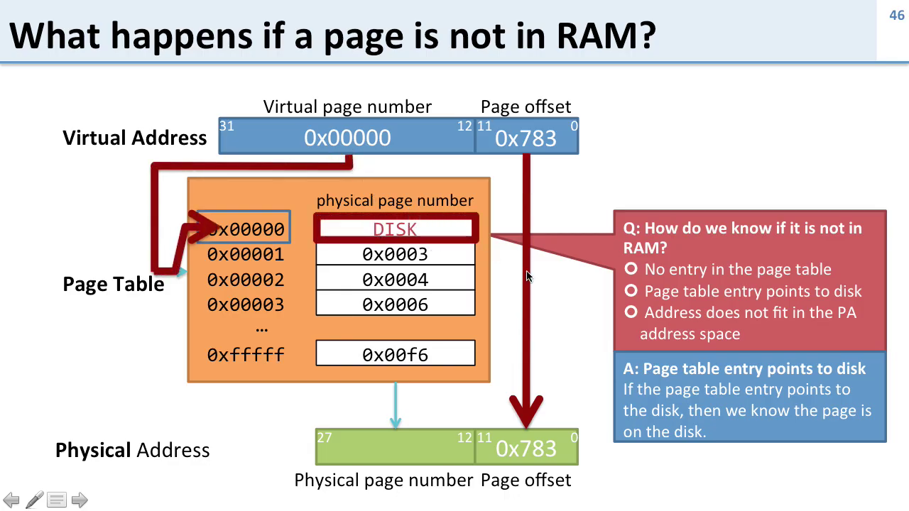
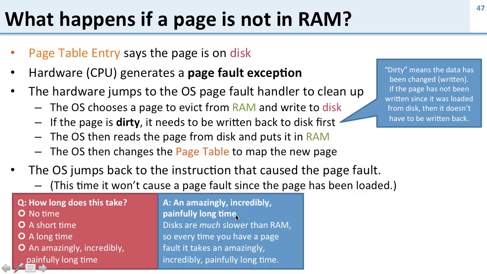
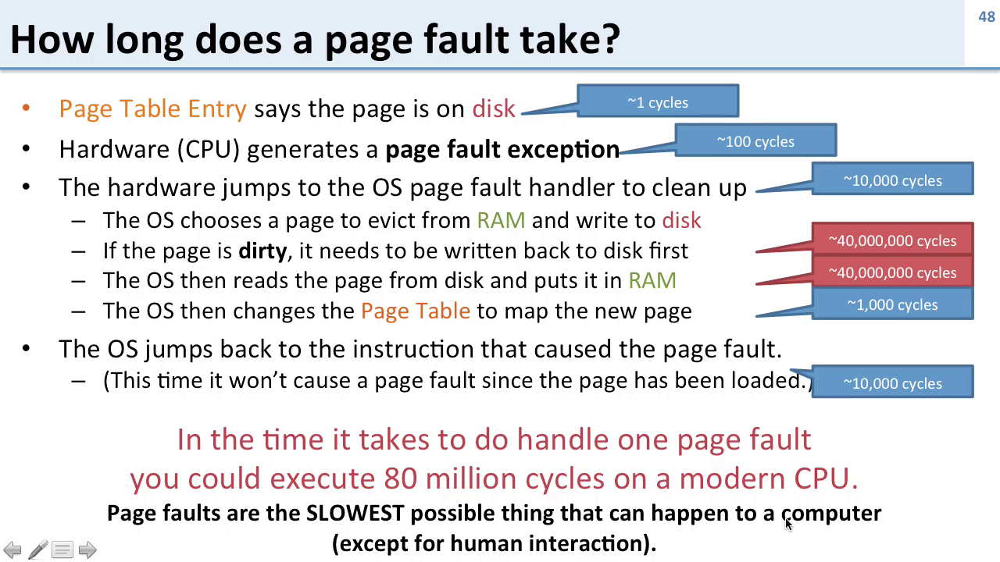
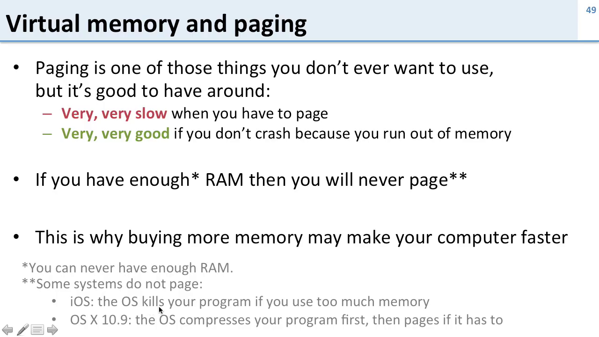

---

### 🔹 **Summary in Bullet Points**

#### 📌 **What is a Page Fault?**

* A **page fault** occurs when a program accesses a **virtual page** that is **not in RAM**.
* The **page table entry (PTE)** indicates if a page is on **disk** or in **RAM**.
* If a page is **on disk**, the CPU generates a **page fault exception**, which the **operating system (OS)** handles.

---

#### 📌 **Handling a Page Fault**

1. CPU checks the **page table** and finds that the page is on disk.
2. CPU raises a **page fault exception**.
3. OS runs the **page fault handler**:

   * Chooses a page in RAM to **evict** (free up space).
   * If evicted page is **dirty** (modified), it must be written back to disk.
   * If not dirty, no write is needed.
4. OS loads the **required page from disk into RAM**.
5. OS **updates the page table** with the new physical location.
6. OS **resumes execution** from the instruction that caused the fault.

---

#### 📌 **Performance Cost of Page Fault**

| Step                         | Approximate CPU Cycles  |
| ---------------------------- | ----------------------- |
| Check page table             | Very fast               |
| Raise page fault             | 100s–1,000s cycles      |
| Jump to OS handler           | \~10,000 cycles         |
| Evict a page (write to disk) | \~40 million cycles     |
| Read page from disk          | \~40 million cycles     |
| Update page table            | \~1,000 cycles          |
| Return to user program       | \~10,000 cycles         |
| **Total**                    | \~80 million CPU cycles |

---

#### 📌 **Why Are Page Faults So Slow?**

* **Disk access** is millions of times slower than RAM.
* Page faults often make the OS **context switch** to another program while it waits.
* Even with **SSD**, page faults are still costly.

---

#### 📌 **Virtual Memory and Paging**

* Paging allows **more virtual memory** than physical RAM.
* Avoids **crashes** when memory is overused.
* **Slows down** the system when paging occurs.
* If a system has **enough RAM**, paging rarely occurs.
* **Buying more RAM** improves performance by reducing paging.

---

#### 📌 **Operating System Behavior**

* Some systems (e.g., **iOS**) do **not support paging**:

  * If memory is exceeded, the OS **kills the app**.
  * Apps must **manage memory carefully**.
* Some systems (e.g., **macOS 10.9**) use **compression**:

  * Unused memory pages are **compressed** instead of paged out.
  * Faster than disk I/O and helps reduce paging.

---

---

### 🔹 **Question & Answer Section**

**Q1: What triggers a page fault?**
**A:** Accessing a virtual page not currently loaded in RAM.

---

**Q2: How does the system know a page is not in RAM?**
**A:** The **page table entry** indicates that the page is stored on **disk**.

---

**Q3: What does the CPU do when a page fault occurs?**
**A:** It raises a **page fault exception** which is handled by the **operating system**.

---

**Q4: What does the OS do during a page fault?**
**A:**

* Picks a page to **evict** (if RAM is full).
* **Writes it to disk** if it's dirty.
* **Loads** the required page from disk into RAM.
* **Updates** the page table.
* **Restarts** the instruction that caused the fault.

---

**Q5: What is a "dirty" page?**
**A:** A memory page that has been **modified** after being loaded from disk. It must be **written back** to disk on eviction.

---

**Q6: How long does a page fault take?**
**A:** Around **80 million CPU cycles**, making it one of the **slowest operations** in computing.

---

**Q7: Why is it better to avoid paging?**
**A:** Because **disk access** is far slower than RAM. Paging severely **slows down** programs.

---

**Q8: Why don’t some operating systems use paging?**
**A:**

* To maintain **performance** (e.g., iOS).
* Instead, they **kill apps** that use too much memory.
* Others (like macOS) use **compression** instead of paging.

---

**Q9: Can adding RAM help reduce page faults?**
**A:** Yes, more RAM means fewer page evictions and **better performance** due to **less paging**.

---

**Q10: Why is virtual memory still useful despite being slow?**
**A:** It provides **stability** — prevents crashes and protects programs from corrupting each other.

---

