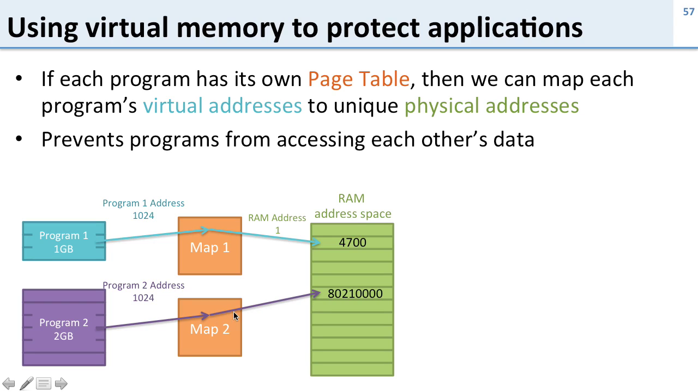
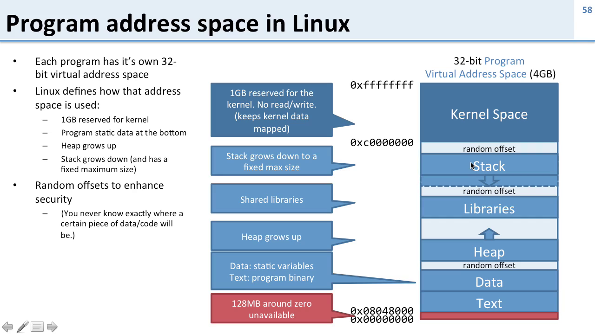
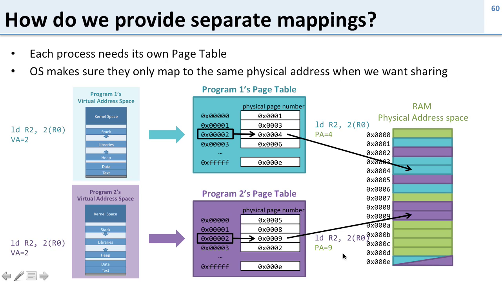
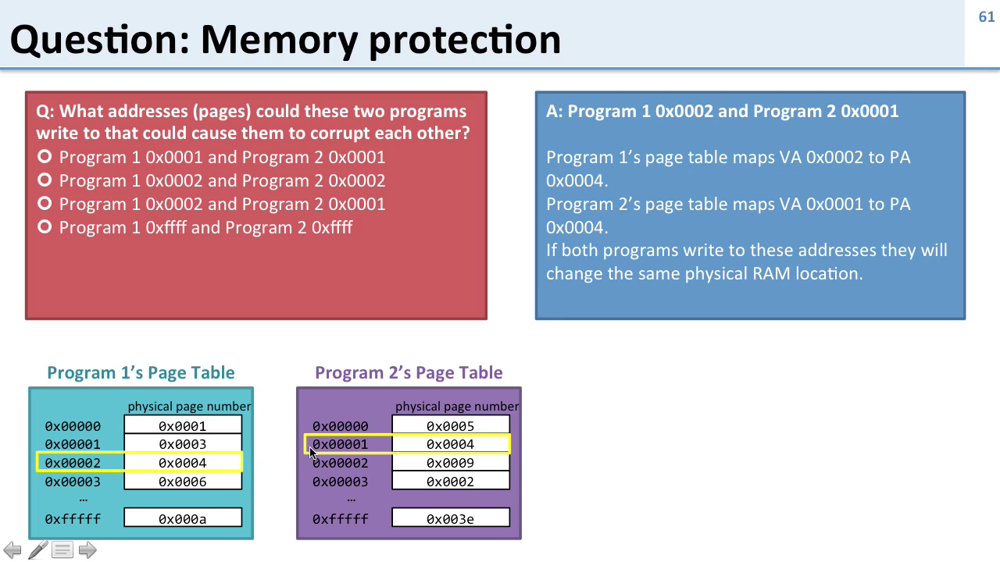

# Memory Protection

---

### 🔹 **Summary in Bullet Points**

#### 🧠 **Core Concept: Memory Protection via Virtual Memory**

* **Each program** has its own **virtual address space** with a **separate page table**.
* **Virtual addresses** may be the same between programs but are **mapped to different physical addresses** using page tables.
* This setup **isolates** programs from each other, **preventing accidental or malicious memory access**.

---

#### 🧱 **Linux Virtual Address Layout (32-bit)**

* **Top 1 GB**: Reserved for **kernel space** (not accessible by user programs).
* **Stack**: Grows **downward** from near the kernel space.
* **Heap**: Grows **upward** for dynamic memory allocation.
* **Libraries**: Loaded in the **middle** (shared code like UI libraries).
* **Text segment**: Stores **program code**.
* **Data segment**: Stores **initialized global/static variables**.
* **Low address region (\~128 MB)**: Reserved by the OS (e.g., I/O memory).

---

#### 🔐 **Memory Protection and Address Randomization**

* Linux uses **Address Space Layout Randomization (ASLR)**:

  * Introduces **random gaps** between segments like stack, heap, and libraries.
  * Improves **security** by making it hard for attackers to guess memory locations.

---

#### 🔁 **Shared vs. Private Pages**

* **Private pages**: Unique physical memory mapped to each program's virtual addresses.
* **Shared pages**: Same physical page mapped in multiple programs’ address spaces (e.g., for shared libraries or inter-process communication).

---

#### 🔄 **How Page Tables Enable Isolation and Sharing**

* The **OS switches page tables** when switching between programs.
* Two programs accessing the **same virtual address** will read/write to **different physical memory** unless deliberately sharing.
* **Example**:

  * Program 1: virtual address `0x024` → physical address 1.
  * Program 2: virtual address `0x024` → physical address 5.
* Programs can **share a physical page** if their virtual pages map to the same physical page (e.g., clipboard sharing).

---

---
### 🔹 **Question and Answer Section**

**Q1: How does virtual memory help with memory protection?**
**A:** By giving each program a separate virtual address space and page table, preventing them from accessing or modifying each other's memory.

---

**Q2: Do programs have the same or different virtual address spaces?**
**A:** Each program **sees the same 32-bit virtual address space**, but it is **mapped differently** to physical memory via individual page tables.

---

**Q3: What part of virtual memory is reserved for the Linux kernel?**
**A:** The **top 1 GB** of the 32-bit virtual address space.

---

**Q4: What happens if a user program tries to access kernel memory?**
**A:** The program **crashes** due to a **protection fault**.

---

**Q5: What is ASLR and why is it used?**
**A:** **Address Space Layout Randomization** adds **random gaps** between memory regions (stack, heap, libraries) to **prevent attacks** that rely on predictable memory layouts.

---

**Q6: How do programs share data securely?**
**A:** By **mapping the same physical page** to virtual pages in both programs (e.g., shared library or inter-process communication).

---

**Q7: Can two programs use the same virtual address to access different data?**
**A:** Yes. Since each program has its **own page table**, the **same virtual address** can point to **different physical memory**.

---

**Q8: Under what condition can two programs corrupt each other’s data?**
**A:** If both programs map their virtual pages to the **same physical page**, they can **read/write the same memory** — either intentionally (shared data) or unintentionally (a bug or misconfiguration).

---

**Q9: What does the stack and heap do in virtual memory?**
**A:**

* **Stack**: Stores function call data and grows **downward**.
* **Heap**: Used for dynamic memory allocation and grows **upward**.

---

**Q10: What are the key segments in a Linux program's virtual memory layout?**
**A:**

* **Text** (code),
* **Data** (static/constant data),
* **Heap**,
* **Libraries**,
* **Stack**,
* **Kernel space** (inaccessible to user programs).

