Transistors are very simple by themselves, but combining them results in very powerful components like arithmetic logic units capable of doing math and latches capable of retaining information to create memory. In today's video, we are going to use these components to create our own CPU, so we'll finally understand how a piece of silicon runs programs.

Hi friends, my name is George, and this is Core Dumped.

Before starting, a quick reminder about registers. We discussed that a register is a set of tiny memory cells called latches made out of logic gates and interconnected in a way that retains information. Each latch in the register has its own output wire, which we use to read the value held in the latch. Registers also have input wires and a write enable wire to overwrite the values in the latches. When the write enable signal is off, the stored values do not change regardless of the input values. Activating the write enable signal is the only way to overwrite the values in the latches. Once set, the inputs can be deactivated, and the new values will remain stored.

Our first goal is to reduce the number of wires used. We can modify each latch so that the same wires serve as both inputs and outputs. By activating a read enable signal, these wires act as outputs allowing us to read the stored information. By activating the write enable signal, we use the same wires as inputs to overwrite the information in the register. This approach reduces the number of wires needed when working with multiple registers by combining their data lines into a single general data bus.
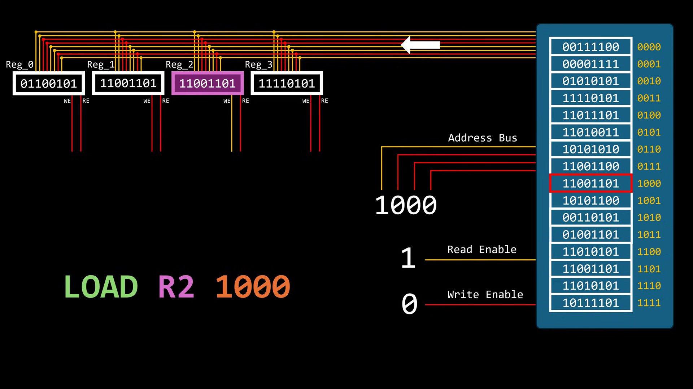

When using this data bus as an input, the input value reaches each register. Since each register has its own write enable signal, we can activate the write enable signal of only the specific register we want to modify. The same principle applies to reading: activating the read enable signal for the particular register we want to read from causes the general data bus to act as an output. By selecting the correct write or read enable input, we can read from or write to any register using a single data bus.

Fortunately, we already know about the binary decoder, which can electronically select between multiple options.

Now, let's talk a bit about memory. In the previous episode, we defined memory as an array of bytes. Each byte can be selected by inputting its position in the array through an address bus. A data bus, alongside a read enable input, can be used to read the value stored in the selected byte. This same data bus can also be used as an input alongside a write enable input to overwrite the value of the byte at the provided address.

Our goal in this part of the video is to understand how instructions like load and store are executed at the hardware level. If you are not familiar with assembly language, don't worry—I’ll explain some of these instructions along the way.

Let's begin with load instructions. Typically, program data resides in memory; however, to manipulate this data, it often needs to be loaded into registers first. Within the CPU, there's a set of registers available for this purpose. The current instruction indicates that we want the computer to load into register one the value stored in memory location 1101. Essentially, a load instruction copies the value stored in a specific memory location into the designated register.

While this process might seem straightforward in animation, this video is about understanding the hardware implementation involving cables and logic components to make this possible. Let's get to it.

We'll start by connecting the memory data bus to each register. Suppose this is the instruction we need to execute. Since we aim to copy data from memory to a register, we start by reading the memory address where the data resides. This is accomplished using the address bus and activating the read enable signal of the RAM. Consequently, the memory data bus outputs the value stored at the provided address, making this value serve as input to every register.

Since we want this value to be copied only into register two, we activate the write enable signal only for that specific register, making it overwrite its current value with the data we are reading from memory.

On the other hand, with a store instruction, we perform the opposite action. For example, this instruction directs the computer to store the current value held in register one into memory location 0110. So now, instead of reading from a memory location, we need to read from a register—in this case, register one. Activating the respective read enable input causes the value stored in that register to become the input on the memory data bus.

Additionally, we must specify the memory address where we want to store the value. Since our objective is to write to memory, we activate the memory write enable signal. And just like that, we've successfully copied a value from a register to memory.

Quite straightforward, isn't it? Well, yes. But now we got the question: where do all the signals necessary to control these components come from? We already established that binary decoders can be used for this task, but then where do the inputs for those decoders come from?

The answer—after a quick message—is: where do the input signals for these components come from? The short answer is from the instructions themselves.

As discussed in a previous video, assembly language serves as a human-friendly representation of code that computers can understand. When we write assembly, an assembler—a specialized compiler—translates this human-readable code into binary machine code. This sequence of bits contains all the essential information to instruct the computer.

For example, in a previous video, we established that if the first two bits are 00, the computer interprets the instruction as an arithmetic operation. In that particular case, the third and fourth bits specify the type of operation. If the first two bits are not 00, the instruction signifies something other than an arithmetic operation. For example, it could be a load instruction if the first bits are 01, or a store instruction if they are 10.
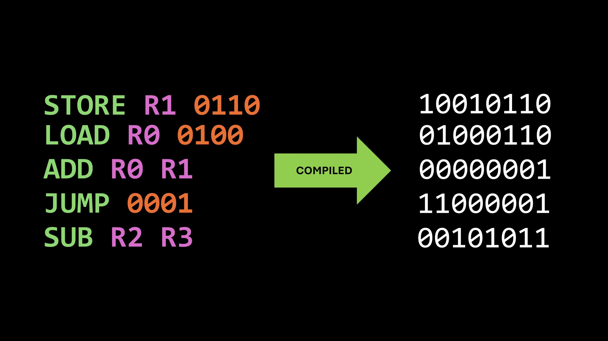

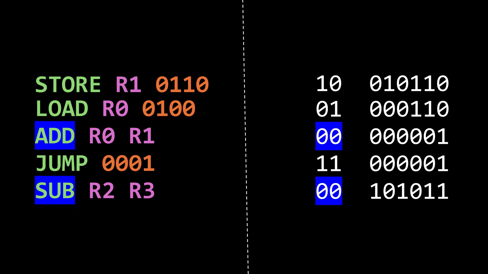

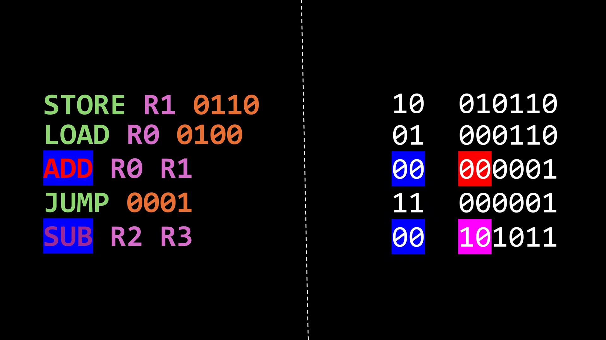

In this design, for load or store instructions, the third and fourth bits of the instruction don't indicate an operation code but rather which register to read from or write to. The last four bits represent the memory address.

To distinguish between different kinds of instructions, we employ a binary decoder, and the third and fourth bits of the instruction serve as inputs for these other decoders so they can activate the enable signals of the desired register.
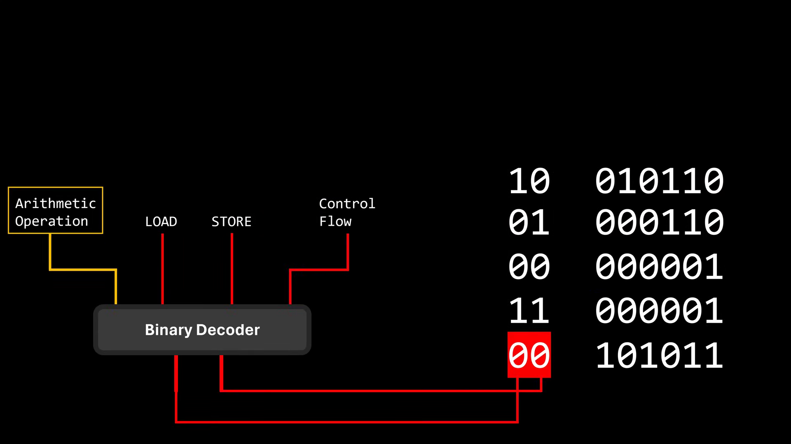

However, in this configuration, both the read and write enable signals of the register are activated simultaneously, yet only one of them should be activated depending on the instruction. Since we've already designated a decoder to differentiate between different instruction types, we can use the outputs of that decoder to ensure that only the desired input is activated according to the instruction.

This allows us not only to select a specific register but also to activate either its write or its read enable signal, but not both at the same time. Moreover, if these two bits are not meant to interact with any register, such as in the case of another type of instruction, this setup prevents any signal from reaching the registers, thus keeping their stored values safe.

Now, considering that the last four bits of the instruction represent the memory address we need to read from in the case of a load instruction, these bits will serve as input to the address bus. Finally, to copy the value of the selected address to the selected register, we simply activate the memory read enable signal. This action allows the data bus to output the value, sending it to the registers. Since only the write enable signal of register zero is active, only that register will overwrite its content with the received value.
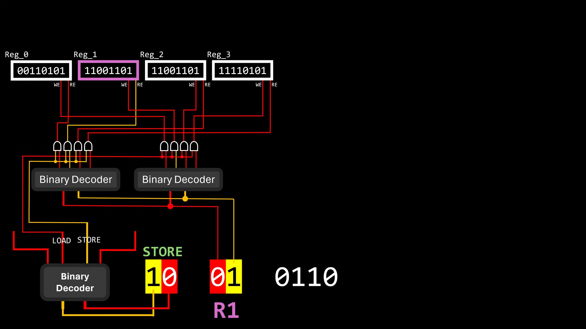

Let's do the same but now with the store instruction. As we already know, this instruction copies the value from a register to a specific memory location. Therefore, the decoder should activate only the read enable signal of the register specified in the third and fourth bit of the instruction—in this case, the read enable signal of register two. This action makes the value of that register act as an input on the memory data bus.
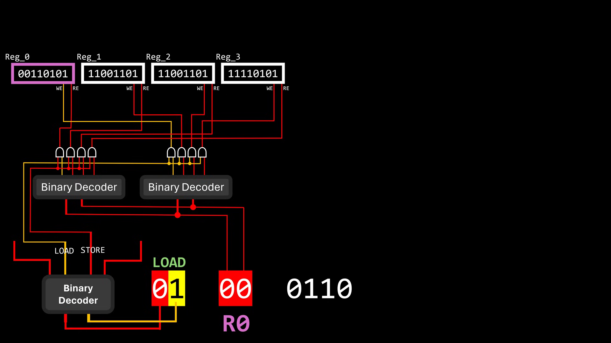

It's worth noting that the same wire that activated the memory read enable signal in the previous load instruction is now deactivating it, which is precisely what we want. In a store instruction, we aim to write to memory instead. The last four bits of the instruction indicate where we want to write the value being input into the data bus, and to prompt memory to write that value into that location, the write enable signal of the memory should be activated.
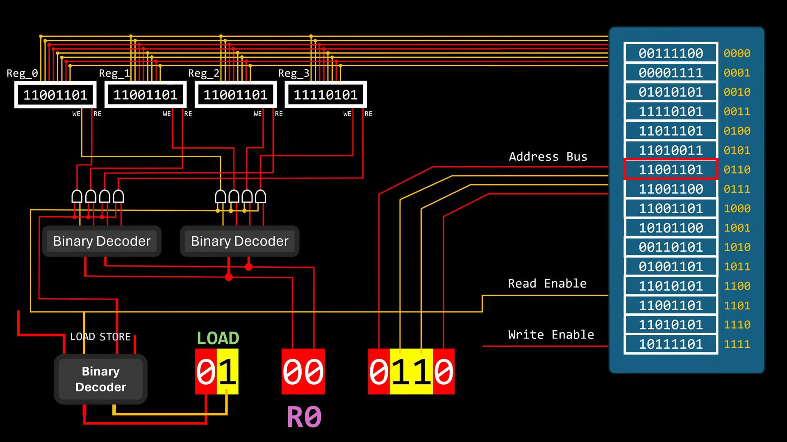

We achieve this by connecting the input to the corresponding output of the instruction decoder. And that's it—the value in register two is now copied to memory location 1111.
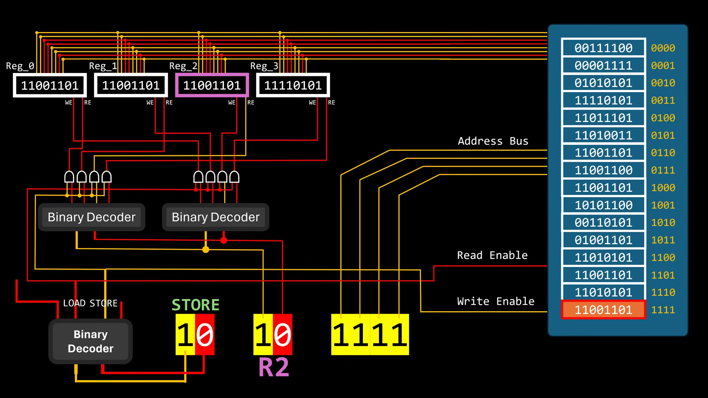

Now, we already know that the input of all of these components comes from the instruction itself, but how exactly? Well, before executing an instruction, the instruction itself needs to be loaded into a special register called the instruction register. The output data lines of this special register are used as input for the components that decode the instruction. I'll get back to this register in a few moments.
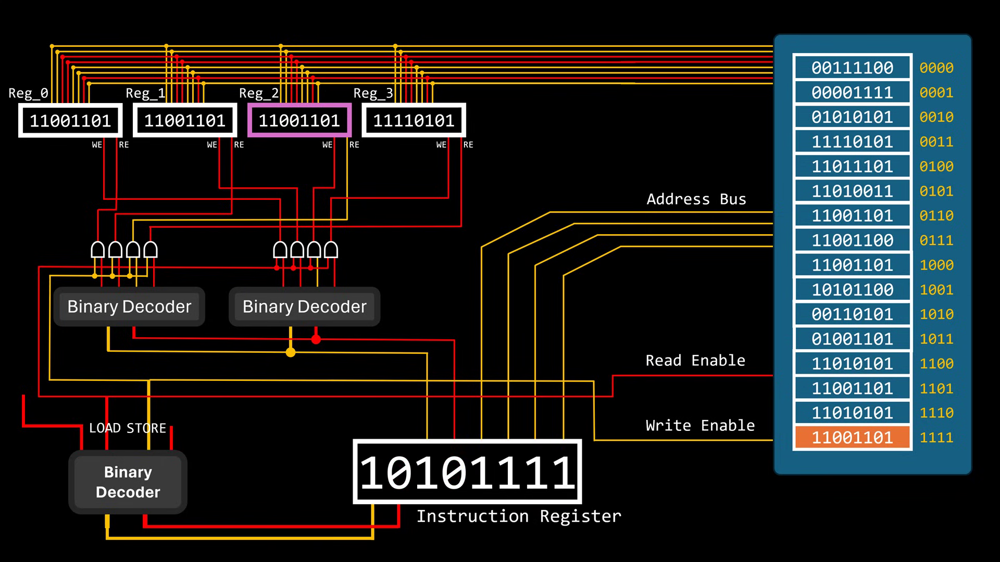

Before I do, I need to clarify something. Some of you might have noticed that this part of the circuit can be improved. Since both load and store instructions use the third and fourth bits to indicate the register to write to or read from, we could use a single decoder to achieve the same result.

There are two reasons I'm mentioning this. First, if I don't, someone in the comments will point out there's a better way to do it. Some have been arguing in the last few videos that modern hardware handles this in better ways. Once again, my response is: here, we're focusing on the fundamentals, not the fastest or most modern methods.
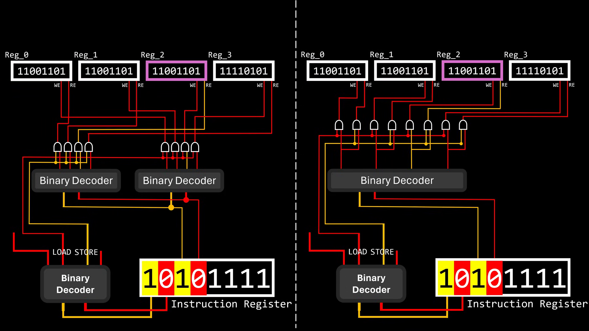

Second, discussing these design decisions is when we start talking about architecture. Now, this term can be ambiguous, but let's focus on logical design for now. Different architectural designs can achieve the same result given the same instruction. From one perspective, we could say they are compatible architectures. But if we focus only on the instructions and their effects on the circuit, we could argue they are the same architecture.

This is not always the case. For example, consider two similar architectures where the only difference is the interconnections of the instruction register outputs. In the second one, this apparently trivial change causes both architectures to perform completely different actions.

While in the first architecture, the sequence of bits in the instruction register means store the current value of register two in memory location 15, in the second architecture, the same sequence of bits means load into register one the value stored in memory location 15. Thus, despite appearances, the architectures are incompatible.
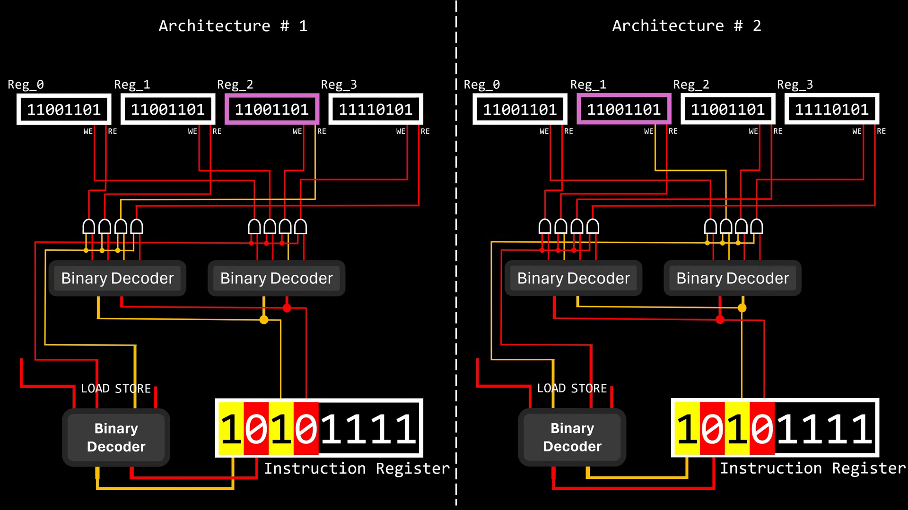

If you've ever wondered why a program compiled for Intel x86 machines cannot run on a Mac or Raspberry Pi with ARM chips—even though all are computers that understand ones and zeros—well, that's the reason. While the executable file is a list of instructions the Intel CPU can follow, that same file is a meaningless sequence of ones and zeros that other architectures just can't understand.
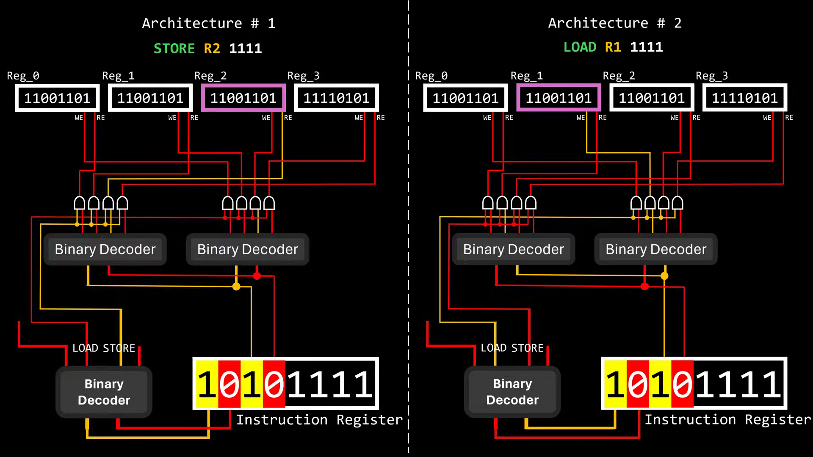

Let's continue with the main topic we were talking about—the instruction register. But before understanding how it works, let's see how our architecture executes arithmetic operations. We'll omit unnecessary components for simplicity.

As described earlier, the first two bits being 00 indicate an arithmetic operation to perform. To do this, we'll use the arithmetic logic unit (ALU) we developed in the first episode of this series.

If the instruction is an arithmetic operation, the third and fourth bits specify the type of operation—in this case, subtraction. These two bits will serve as the opcode input for the ALU.

The ALU needs two values to operate, so we need to read from two registers simultaneously, accessing each register's data line directly. This requires internal logic to bypass the general data bus used previously.
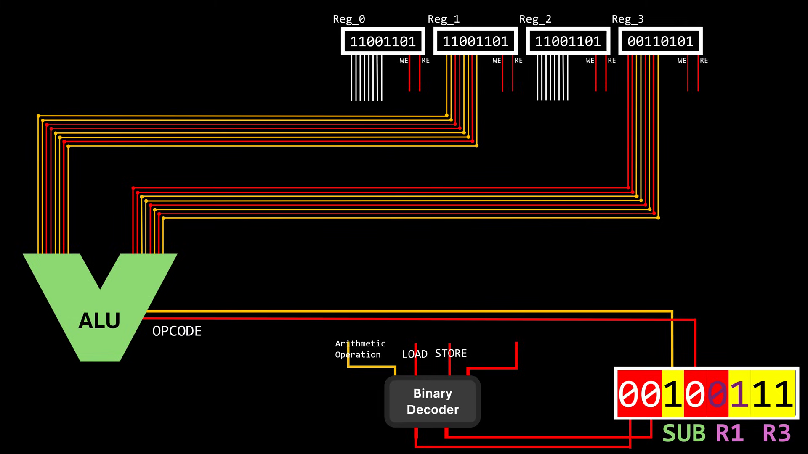

The fifth and sixth bits of the instruction determine the first operand, while the seventh and eighth bits determine the second operand. But we can't connect the registers directly to the ALU because its inputs could be any of the registers. We need circuitry that allows us to select which signals to send.

This is achieved by using a multiplexer, which internally employs a binary decoder to select which input bus value is sent to the output bus.

Now, to simplify the diagram, I'll assign a color to each register and draw its respective data bus in that color. We can use two multiplexers, one for each input of the ALU. The inputs of these multiplexers will be the individual data buses of each register.

The output of the instruction decoder, which identifies arithmetic operations, can toggle the read enable signal of all the registers, making them output their values through their respective data buses to serve as inputs to the multiplexers.

We then need to instruct each multiplexer on which register values to pass to the ALU—in this case, 2, 0, 5 and 5, 3. Since this is a subtraction operation, the ALU will output the difference between the input values, which in this particular example is 152.
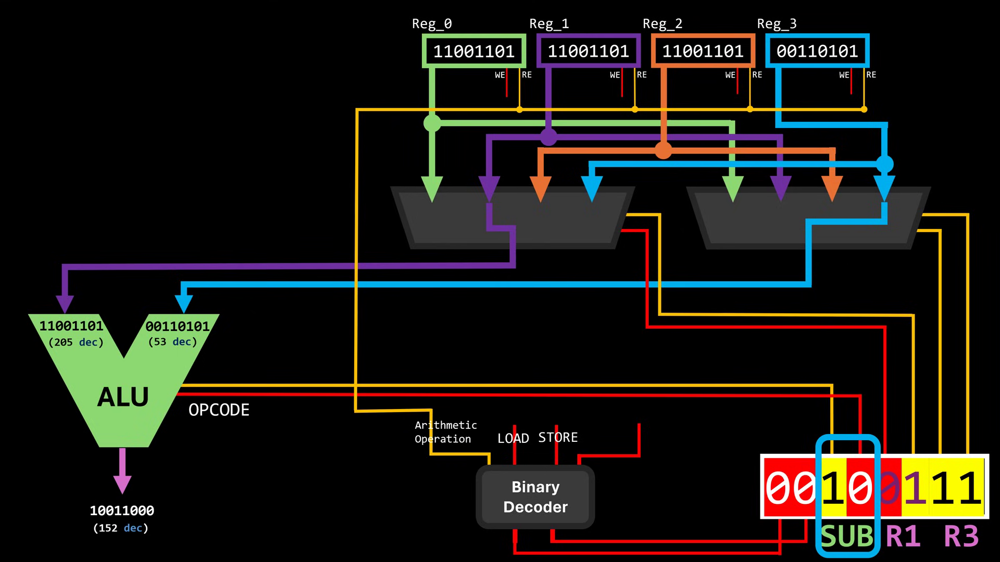

The result of the operation needs to be stored somewhere. In many architectures, it is stored in one of the registers that contained the operands. In our architecture, the result of any operation is stored in the register that contained the first operand.

But we can't write to it directly while reading from it. Instead, the result is temporarily saved in a register. Then, the registers are connected and set so the value can be written to the target register, which in this case is register one.

At this point, you've probably noticed that as we progress in this video, I'm starting to abstract more concepts and omit some details. This is intentional. I've done my best to provide a clear explanation. Unfortunately, I don't have enough screen space to draw every decoder, logic gate, multiplexer, or other component necessary to execute each possible instruction. Fifteen minutes wouldn't be enough either.

Hopefully, the overview of how the load and store instructions are decoded and executed gives you a brief idea of how this component, which we will call the control unit, works under the hood to decode a whole bunch of other instructions.

Now, let's explain how the control unit works. This is when we revisit the pending explanation about how instructions are loaded into the instruction register. This is perhaps the most important part of this video, so pay attention, because what I'm about to explain is practically how CPUs run programs.

The main job of the control unit is to read each instruction of a program and send the necessary signals to all other components to execute each particular instruction. In a way, the control unit acts like an orchestrator.
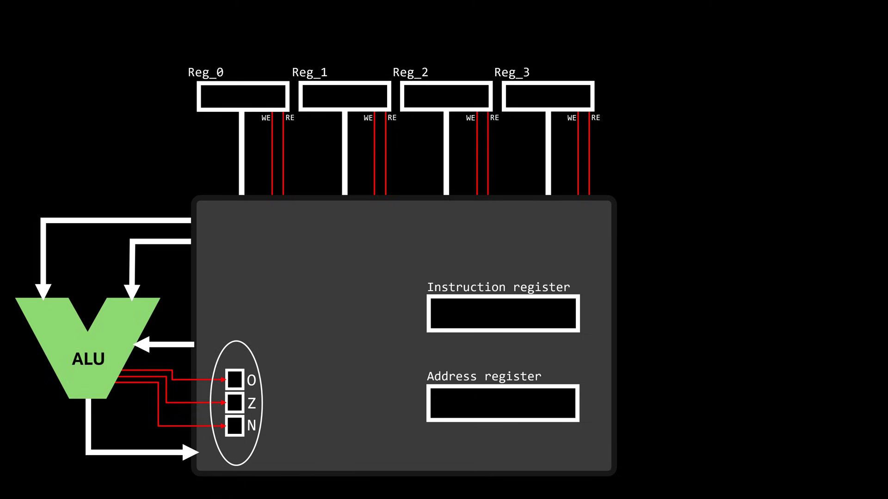

Inside the control unit, there are special registers such as the instruction register and the address register. Additionally, there are small one-bit registers called flags, which will be very important in the next episode. All of these components are packed inside another component known as the central processing unit, also known as the CPU.
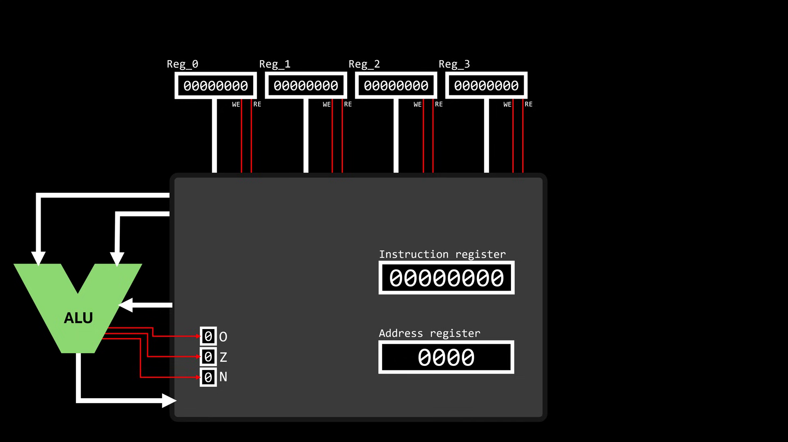

When this giant circuit is powered on, everything is set to zero, so both data and instructions need to be fetched from an external source—memory. Unlike the general-purpose registers, the registers inside the control unit each have a specific purpose.

We already know the purpose of the instruction register. The address register's purpose is to point to the memory location of the next instruction the CPU will execute. Currently, that location is zero.
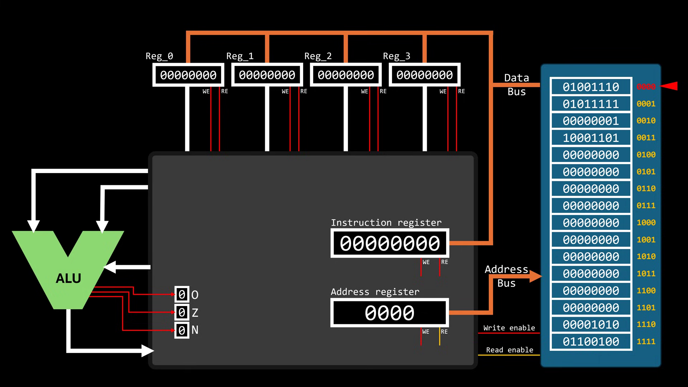

To load the instruction into the instruction register, the control unit activates the memory read enable input so the memory can output the value stored at the provided address. In our architecture, this value is sent to multiple registers, so the control unit must activate the write enable input of the instruction register.

This process of bringing instructions from memory to the CPU is known as the fetch stage.
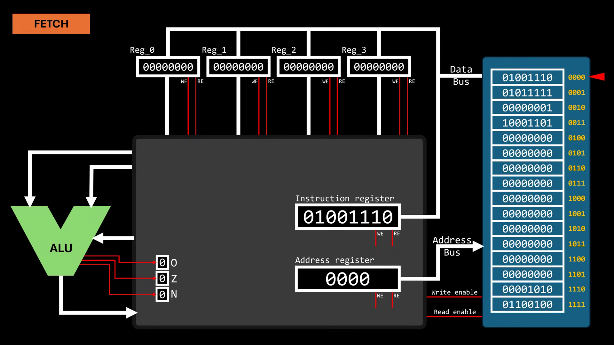

Then comes the decode stage. The outputs of the instruction register are inputs for all the internal components of the control unit. In this step, the internal circuitry reads and interprets the bit sequence in the instruction register in order to send the necessary signals to all components needed to execute that specific instruction.
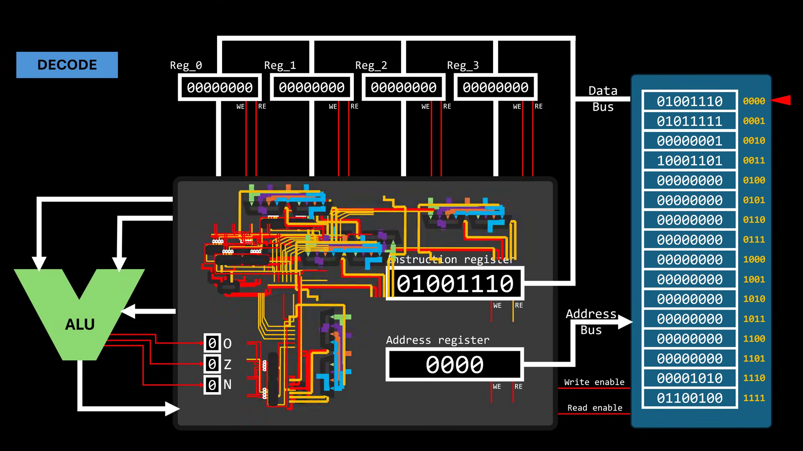

And once everything is set up, the CPU can execute the instruction. In this example, copying the value from memory location 14 to register 0. This is known as the execute stage.

And just like that, our CPU has run the first instruction of the program.

After executing the instruction, the internal circuitry of the control unit increments the value of the address register. In our architecture, the value is increased by one because each instruction is one byte long. Modern architectures have thousands of possible instructions, so instructions are much larger and the increment value can vary.
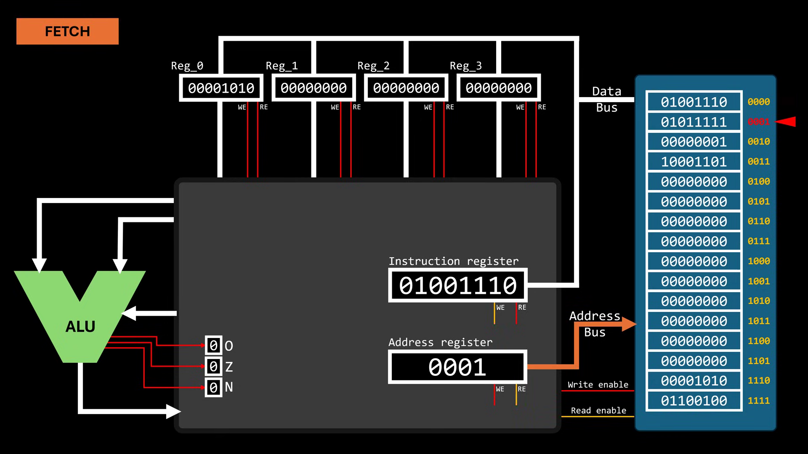
This increment operation ensures that when the CPU goes back to the fetch step, the address register points to the next instruction of the program, and the cycle repeats.

The instruction is loaded into the instruction register, decoded, and then executed. Here, copying the value in memory location 15 into register 1. Afterward, the address register is incremented, pointing to the third instruction during the following fetch stage.

This time, the instruction is an arithmetic operation—specifically, an addition between the values in register 0 and 1, which were loaded in the previous two instructions. The control unit must activate the read enable signal of both registers and use internal multiplexers to direct both values to the ALU inputs.

The ALU also needs the opcode for the addition operation. The ALU then outputs the result of adding the two numbers.
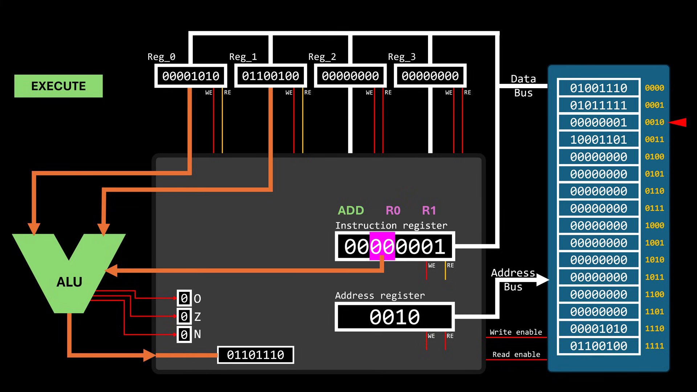
And, as we learned earlier, the result is temporarily stored in an internal register, giving the control unit time to reset and set the signals needed to store the value in the specified general-purpose register, which in this case is register zero.

After executing the instruction, the address register is incremented, and the cycle repeats.
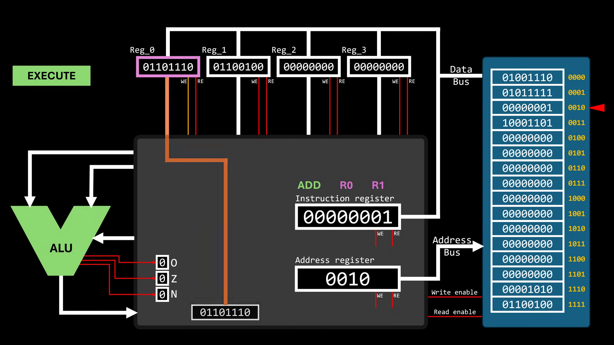
Since this is a store instruction, the control unit needs to set everything to copy the value from register zero, where the result of the addition is held, to memory location 13.

And there we go—we've come all the way from transistors to creating our own tiny CPU that runs programs.

If you think about it, the program we just ran is exactly what a line of code like this would look like when compiled for our tiny architecture. We load two values, add them, and then store the result in a variable. In this example, location 13 is where the content of variable A will reside in memory.

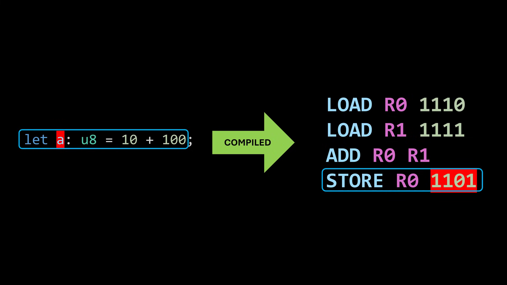

Finally, for the people with more experience: I didn't mention the concept of a clock because it would make this video more complicated. I'll talk about clocks in a future episode.
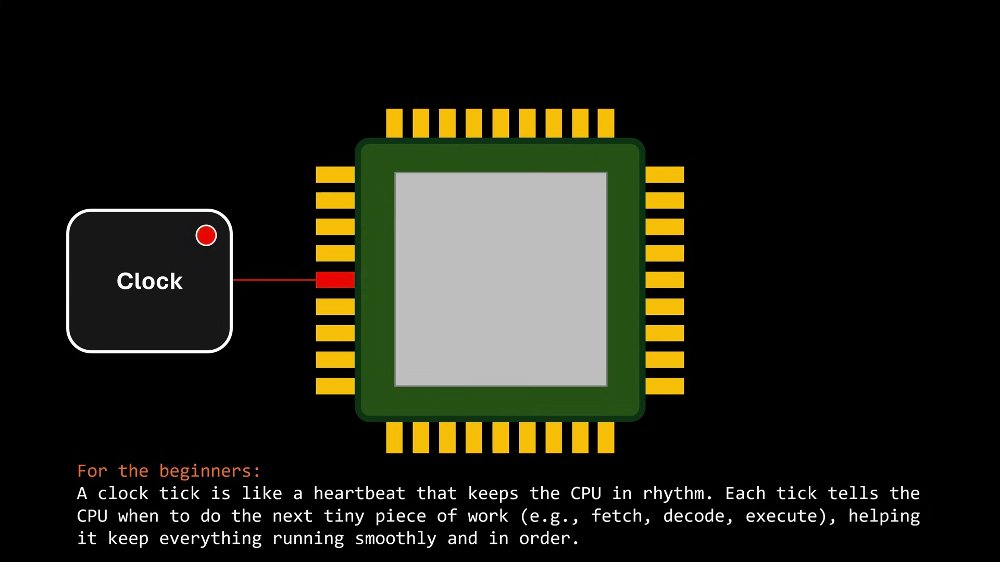

For now, I'll leave you with the question I mentioned at the beginning of the video.

And that about wraps it up for now. In the next video, I'll talk about how CPUs run more complex algorithms like conditions and loops, so don't forget to subscribe.