About static RAM, a type of memory made entirely of transistors, today we are going to explore the basics of dynamic RAM—a different type of memory, cheaper to produce but with several challenges when implementing it.

Hi friends, my name is George, and this is Core Dumped.

Let's start talking about capacitors. A capacitor is an electronic device that stores electric charges. For example, if we connect its terminals to a voltage source, electricity will flow, and the capacitor will begin to accumulate energy, retaining it even after being disconnected from the power source. At this point, the capacitor acts like a small battery capable of powering another component, but only for a brief period—unlike a battery that can last for hours.
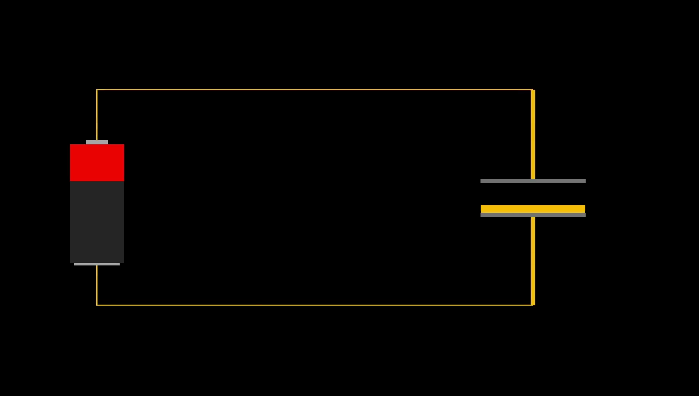

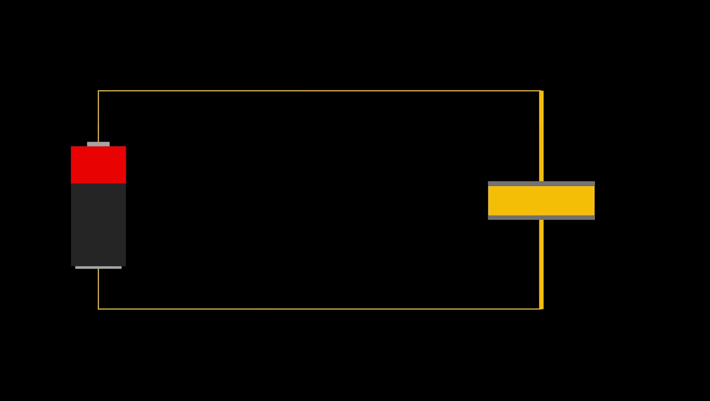

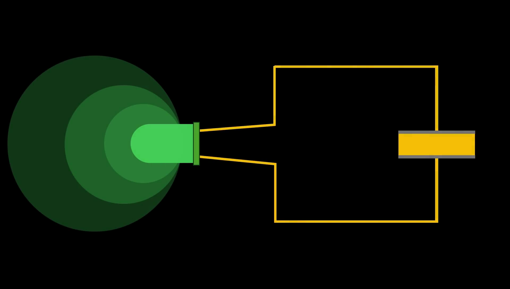

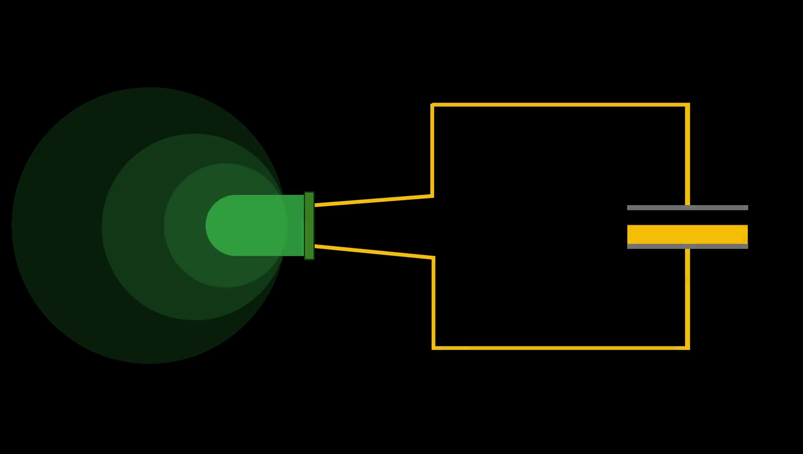
On the other hand, a MOSFET is a special kind of transistor, better suited for miniaturization and computer applications due to its efficiency compared to other types of transistors. It has three terminals: the gate, the source, and the drain. By applying a small voltage to the gate, electricity can flow from the source to the drain, and under certain conditions, electricity can also flow in the reverse direction, which will be important later on.

That being said, consider this: we can configure these two components in a way that uses the MOSFET's gate to allow electricity to flow, thus charging the capacitor. Once fully charged, we can interrupt the flow of electricity, and the capacitor will remain charged. Later, to discharge the capacitor, we can again use the gate to allow electricity to flow, but now in the opposite direction, enabling the charges to escape from the capacitor.
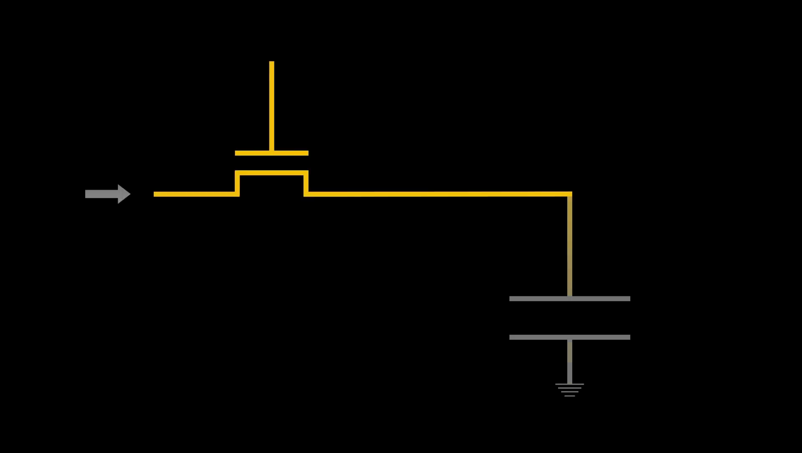

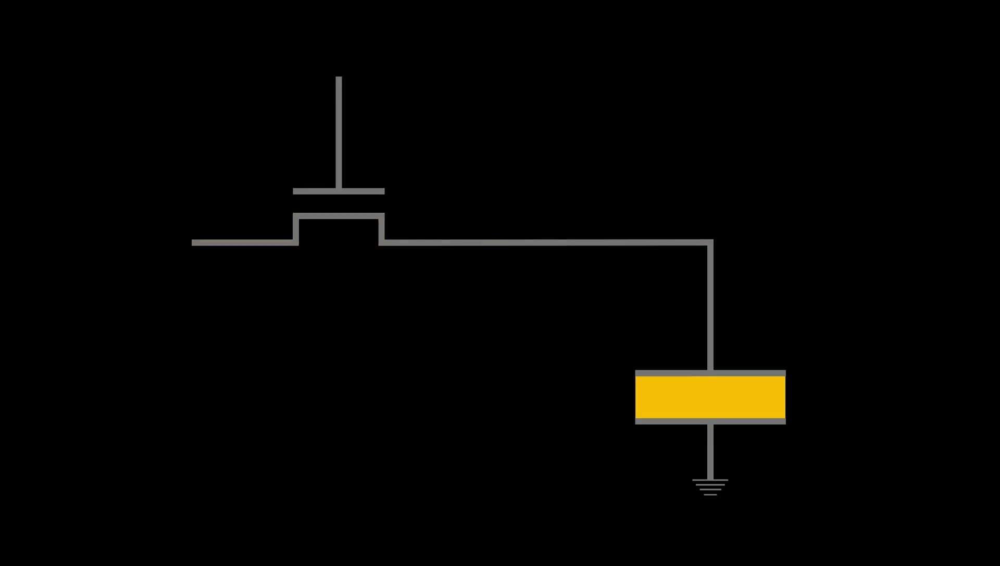

This very simple behavior is the fundamental of dynamic RAM. When the capacitor is discharged, we can consider a zero as being stored. When the capacitor is charged, a one is stored. This circuit can be abstracted as a memory cell capable of storing one bit of information.
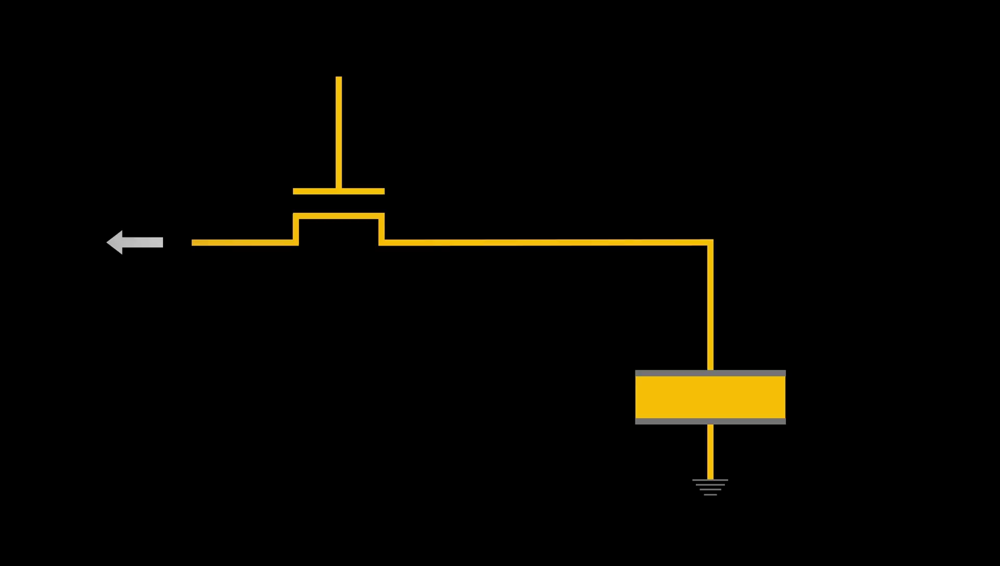

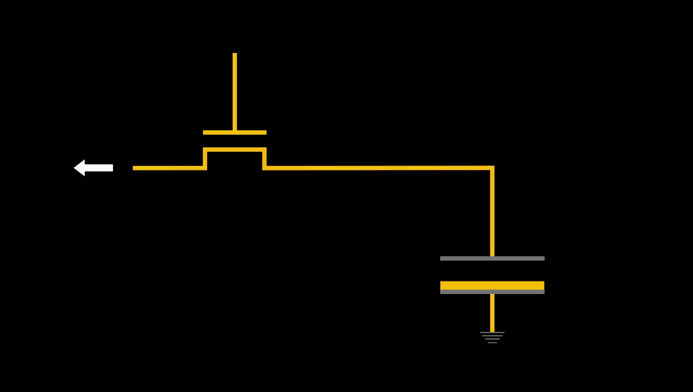   

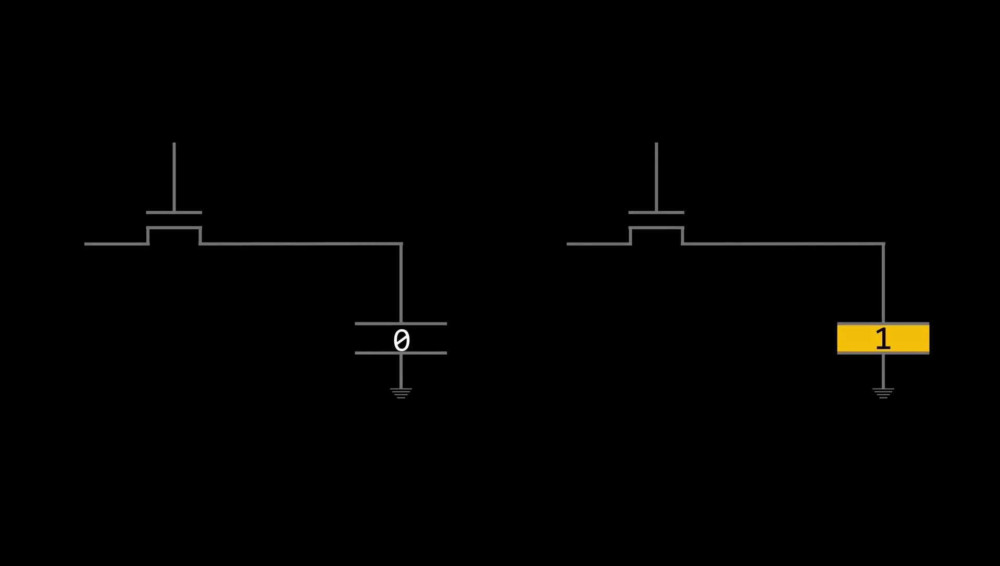
If you've watched my video on static RAM, you might think that dynamic RAM is way simpler to implement. In static RAM, we don't use capacitors; instead, we connect a series of logic gates in a clever but more complex arrangement to trap the value we want to store as an electrical signal. And when I say trap, I mean that the signal holds the value even if we reset the inputs to their default states.
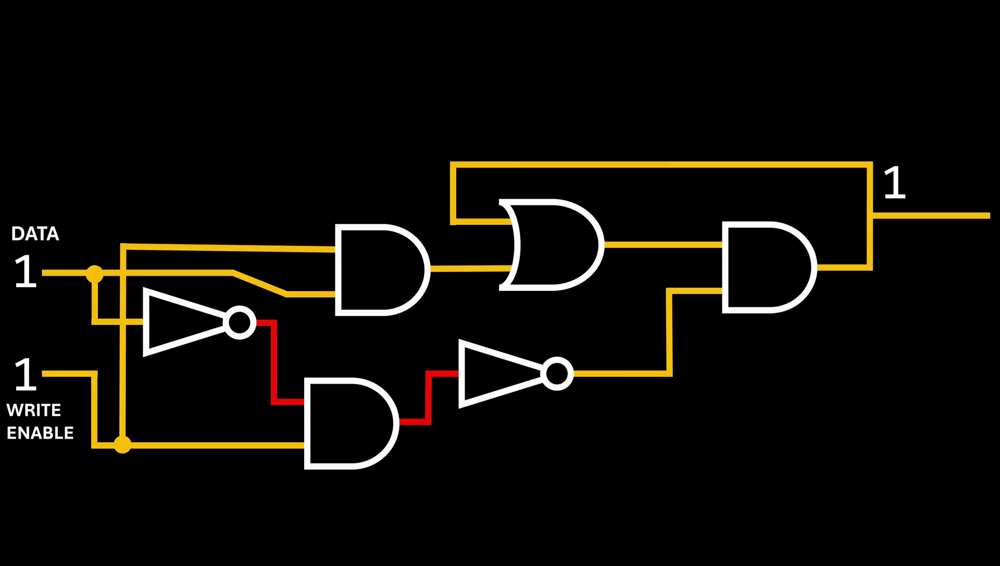

Compared to this, charging and discharging a capacitor looks way easier, right? While a single static memory cell, also known as a latch, requires many transistors, we only need one transistor and a very small capacitor to create a dynamic memory cell. This is what makes dynamic RAM attractive: we can pack more memory cells into a given area compared to static RAM. In other words, we can achieve higher memory capacities using fewer components, making this type of memory very cost-effective to produce.

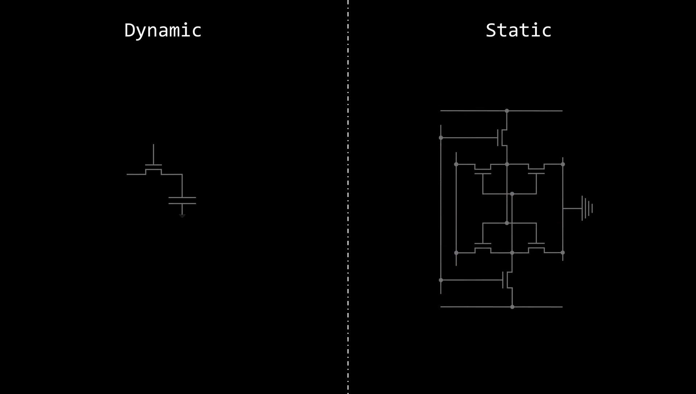

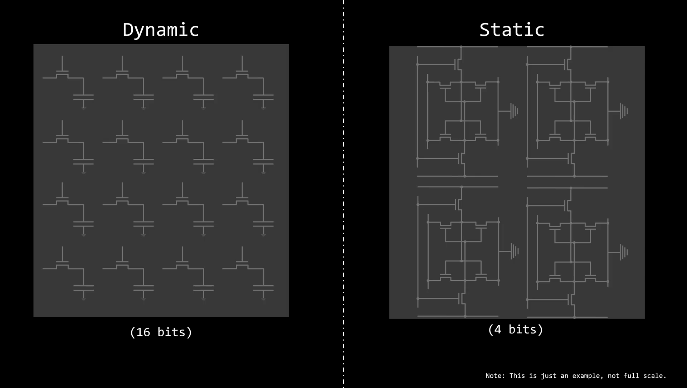

But not everything is perfect. Dynamic RAM has several disadvantages. Consider a scenario where a dynamic memory cell is storing a one, meaning the capacitor is fully charged. To read the value stored in the cell, our only option is to open the gate to check if electricity flows from the capacitor. This means that in dynamic memory, reading data is a self-destructive operation because checking whether a capacitor holds a charge involves discharging it.
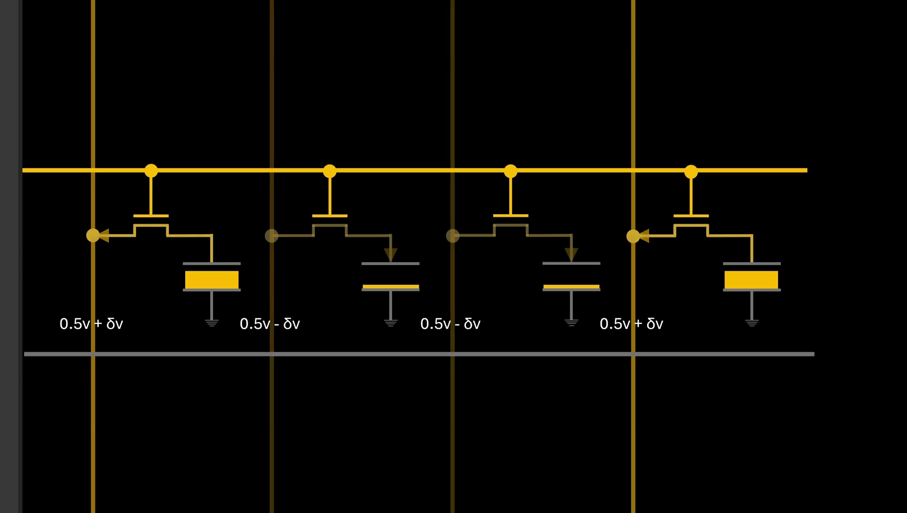

And this is where things start to become very complicated when implementing dynamic memory. For the rest of this video, we're going to explore how the reliability issues of dynamic memory are addressed.

A quick note for those more experienced viewers: I might simplify some concepts to keep the explanation accessible for everyone.

Firstly, it is impractical to handle each memory cell individually because that would require an insane amount of wires. Instead, we arrange the cells in a matrix. We use a single wire to connect the sources of each MOSFET along each column, which we'll refer to as bit lines, and a single wire connects the gates of the MOSFETs along each row, known as word lines.
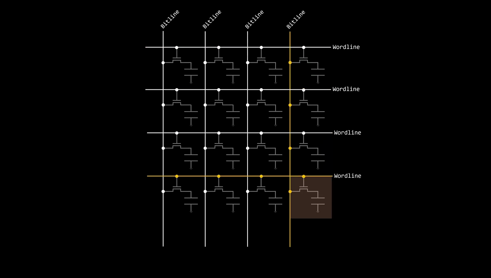

As mentioned in a previous episode, organizing memory cells in a matrix allows us to locate any cell by intersecting two wires. A component called a binary decoder, which utilizes a series of logic gates, enables us to select any given output. Using a decoder to select a row and another to select a column lets us pinpoint the specific intersection or memory cell we want to address. This introduces the concept of a memory address.

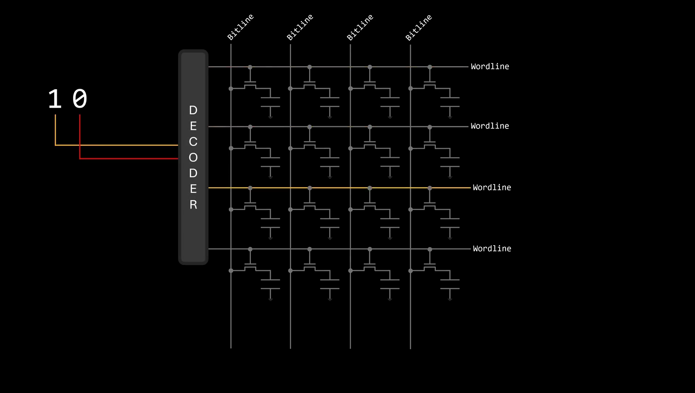
However, using a decoder to select a bit line isn't ideal because bit lines not only carry data into the memory cells but also out of them during a reading operation. For example, activating a word line causes all cells in that row to output their values. In this scenario, we cannot send signals to the outputs of a decoder because, well, they are outputs.

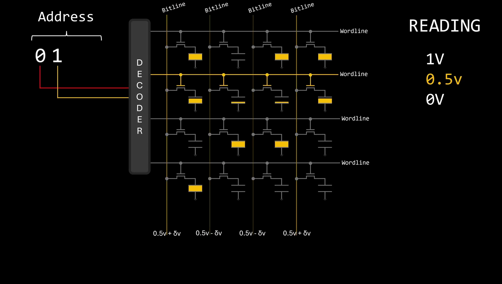

Moreover, remember that reading from a dynamic memory cell causes the capacitor to discharge. Since all cells in a row are connected to the same word line, any charged capacitors will discharge somehow, making the problem even worse.

When things get this complicated, the solution can seem like magic—until someone with patience explains it in an intuitive way.

Dynamic RAM reads values from its cells without erasing its data in the process but uses 1 volt to represent a binary one and zero volts to represent a binary zero.
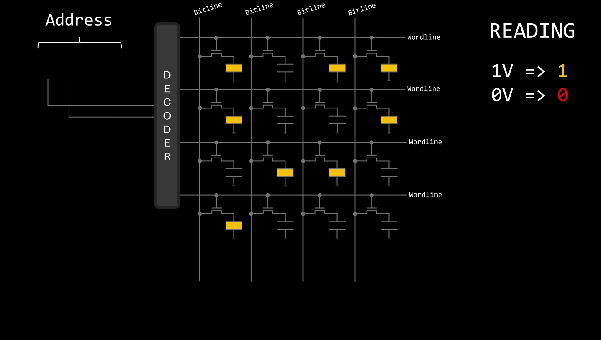

One thing I haven't mentioned is that if the bit lines are disconnected from the ground and then a voltage is applied to them, they act as capacitors, storing charges and holding a voltage for a few nanoseconds.

The first step in reading is to pre-charge the bit lines to half the working voltage of the RAM—in this example, 0.5 volts.
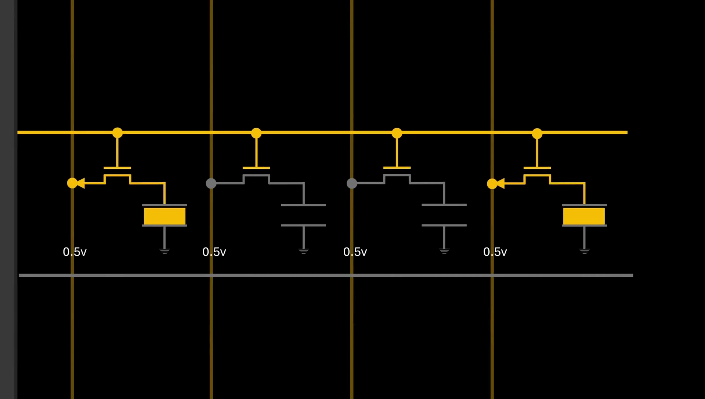

Why? When we use the decoder to activate a word line, we open the gate of all cells in that row. For cells holding a binary one, the capacitor's voltage is greater than the bit line's, so charges flow out, slightly discharging the capacitor. The bit line gaining some charges will see a small increase in voltage.
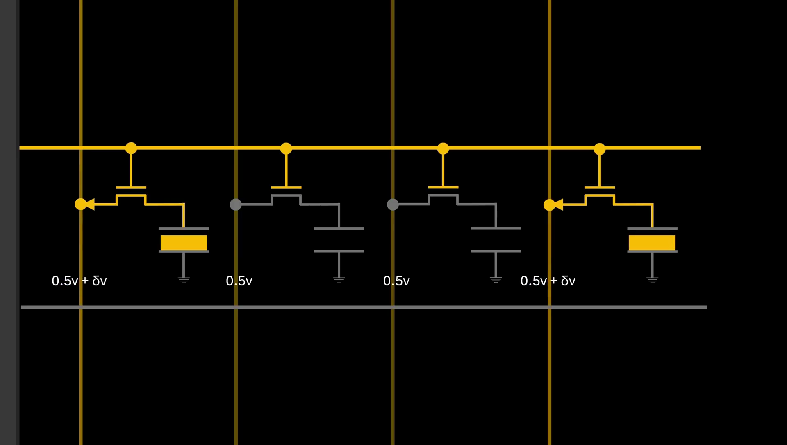
For cells storing a binary zero, the completely discharged capacitor has a lower voltage than the bit line. As the gates are open, charges flow from the bit line to the capacitor, causing the bit line to lose some charges and its voltage to decrease.
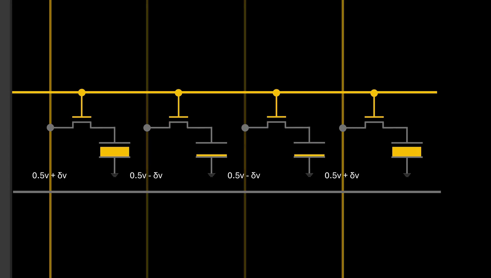
These voltage changes on each bit line are detected by a component called a **sense amplifier** at the end of each bit line. If the sense amplifier detects that the voltage is above 0.5 volts, it outputs 1 volt, representing a binary one. If below 0.5 volts, it outputs zero volts, representing a binary zero.

The internals of these sensors are beyond the scope of this video, but essentially they work by comparing two voltage sources. Each sensor is connected to a latch similar to those used in static RAM. Because the bit lines might not hold their charges long enough, as soon as a sense amplifier detects a value, it stores it in its latch.
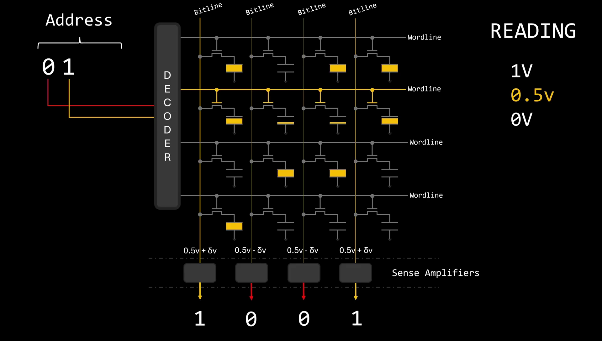

Even if the bit line discharges, the sense amplifiers can still output the values read from the specified row.

But we don't want the value of a whole row; we want the value of a specific cell in that row. Here, we use a component that gathers these outputs and uses the address input to determine which one is sent to the output line. This is exactly what a multiplexer does.
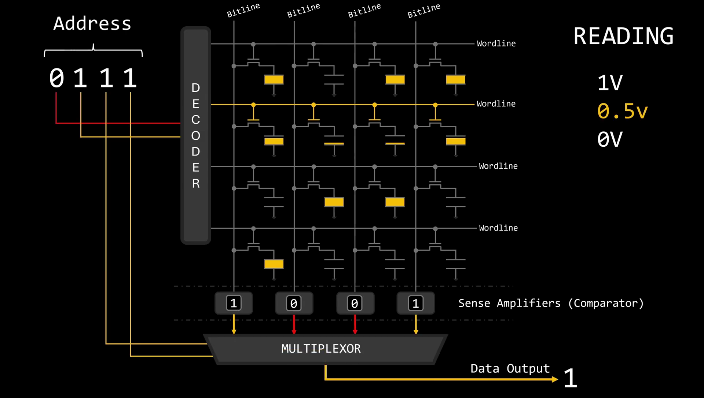

Internally, a multiplexer, or mux, uses a decoder with a few logic gates connected in a clever way to achieve this behavior.
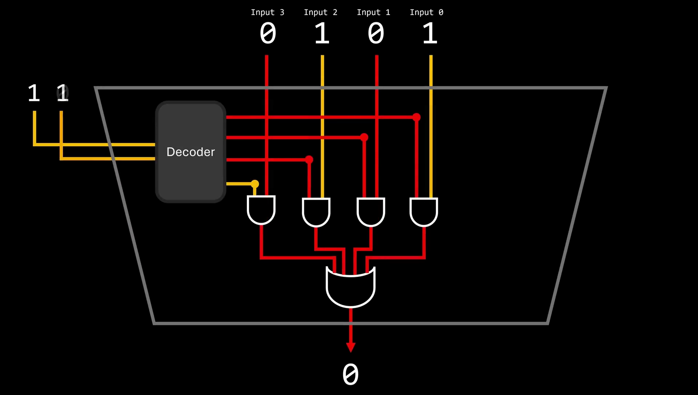

After the sense amplifiers, a multiplexer is used to ensure we can read the value stored in any memory cell we want. But since reading alters the state of the capacitors storing those bits, we need to reset them to their original state.

This is straightforward: the sense amplifier reads the value from the latch and sends it back to the bit lines, restoring the capacitors to their previous state.
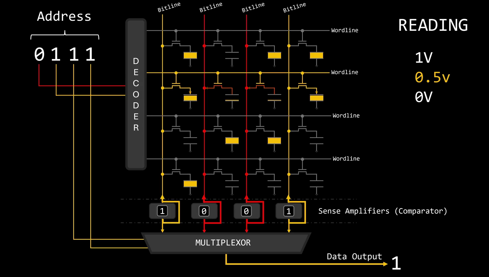

And there you have it—we can read from dynamic memory without destroying our data in the process.

Let's now turn our attention to the writing operation, which builds on the basics we've already discussed.

We need to apply a voltage, either 0 or 1 volts, to the source of the MOSFET, then activate the word line to either charge or discharge the capacitor based on the desired stored value.
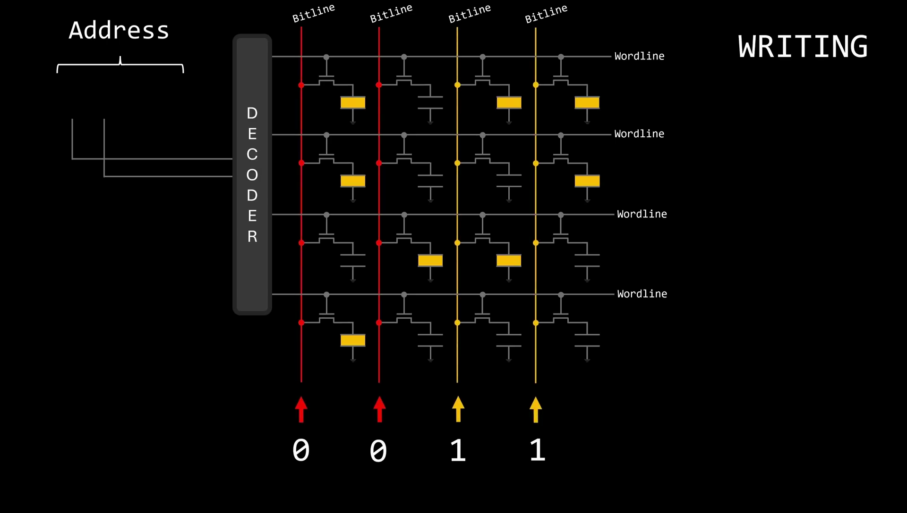
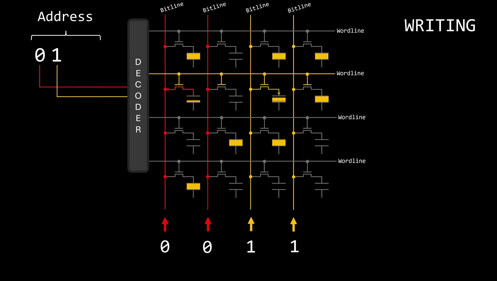

However, there are two challenges. First, we aim to write to a specific memory cell, not all the cells in the same row. Second, given the existing circuitry for the read operation, we can't simply bypass it.

Our solution is to modify this circuitry. Since we're writing, data should flow in the opposite direction; thus, a simple multiplexer won't work.

A demultiplexer, or demux, performs the opposite function of a multiplexer. It receives a single data input, and with a select input, it determines which one of the outputs will receive the input value.

We need a component that can act both as a multiplexer and a demultiplexer, commonly referred to as a mux-demux. This component's ability to switch roles depending on whether we are reading or writing is crucial for reliable memory operations.

The writing process closely resembles reading. We start by charging the bit lines to 0.5 volts, then activate the word line of the desired cell, causing all capacitors in that row to either charge or discharge and change the voltage of the bit lines. The sense amplifiers detect these changes and store the values just as they do during reading.

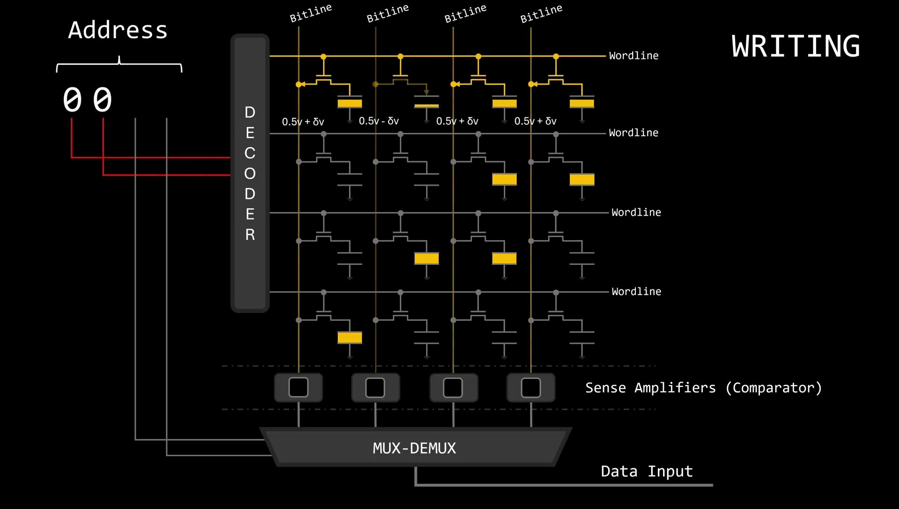

The key difference in writing is that instead of outputting a value, we input it. The address tells the demultiplexer which latch to direct the input value to. With only the targeted latch overwritten, the sense amplifiers then send all values back through the bit lines.
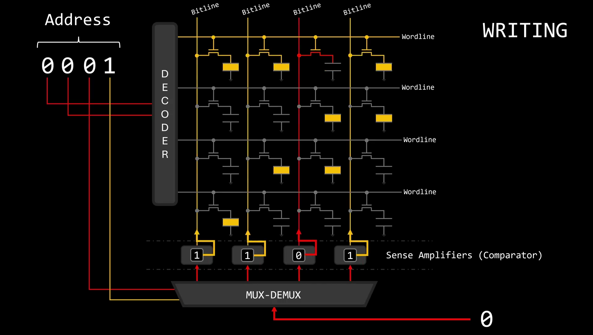

This step ensures that each cell's capacitor either charges or discharges according to the value received. In other words, we write the new value while also rewriting other values in the same row to prevent data loss.

And this is how we write to any memory cell in the matrix without affecting the data integrity of other cells in the same row.

Here's another example where we're writing a binary zero to a different memory location. The process starts by charging the bit lines, then selecting a row. The sense amplifiers detect and store the existing values. The intended zero is then input and directed by the demultiplexer to the specific latch.

Once the value is overwritten, all values, including the newly changed one, are written back to the memory cells from which they originated.

Now, before we move on to the next issue with dynamic RAM—yes, we're not done yet—let's outline the steps for each operation.
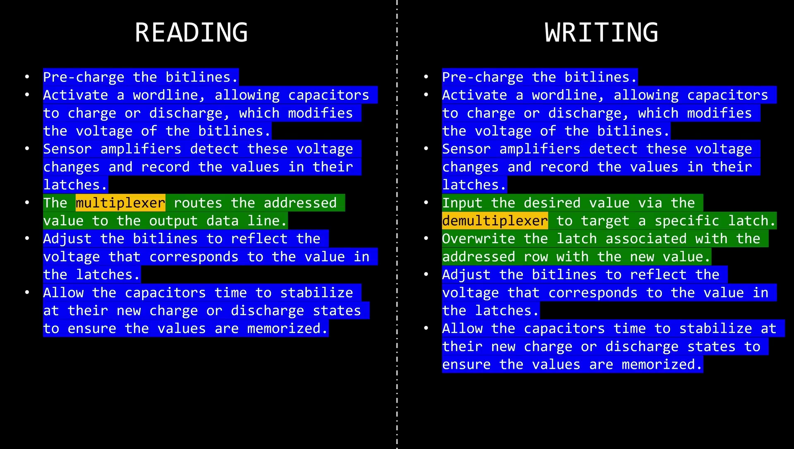

Note that except for the intermediate steps, both operations appear almost identical, although all of this occurs in just a few nanoseconds.

There are many steps involved in reading or writing a single bit of information, especially when compared to static RAM.

In static RAM, bits are stored as electrical signals rather than charges, so reading from a latch doesn't cause it to lose its value. This is a significant reason why dynamic RAM is slower than static RAM.

Despite the process taking only nanoseconds, these extra steps slow down the entire memory addressing process.

If you want to learn more about how static RAM handles this, check out my previous video.

Finally, there is one more problem with dynamic RAM that I haven't mentioned.

Even when the gate of the MOSFET is closed, some small charges can still escape, moving from the drain to the source of the MOSFET, thus discharging the capacitor.
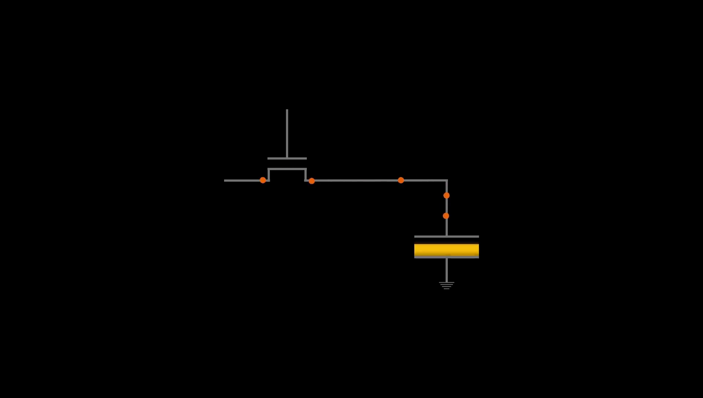

Although this happens much slower than if we intentionally open the gate of the MOSFET, it's still a major issue.

If we don't address any cell in a row, the information contained by those cells will be lost over time as we are neither reading nor writing to refresh the information at the end of the operation.

The solution to the problem is to make this type of memory refresh itself.

From this point, I will abstract some things to avoid overcomplication.

With everything we've learned so far, understanding this operation called refreshing should be easy.

Before the capacitors in a row have time to discharge to the point where we can no longer read their information, we simply read all of the values in that row and then set the bit lines to the voltage that corresponds to those values.

This ensures the cells are fully charged or discharged according to the binary values they were originally storing.

Essentially, we are doing the same as we did for the reading and writing operations but without outputting or inputting any values—so no multiplexer or demultiplexer is used during this process.

In a few words, refreshing works by reading the value in a row and then writing those values back to the cells they came from.

Since the circuit has only one latch per bit line, not all cells in the matrix can be refreshed simultaneously. Thus, each row is refreshed one by one.

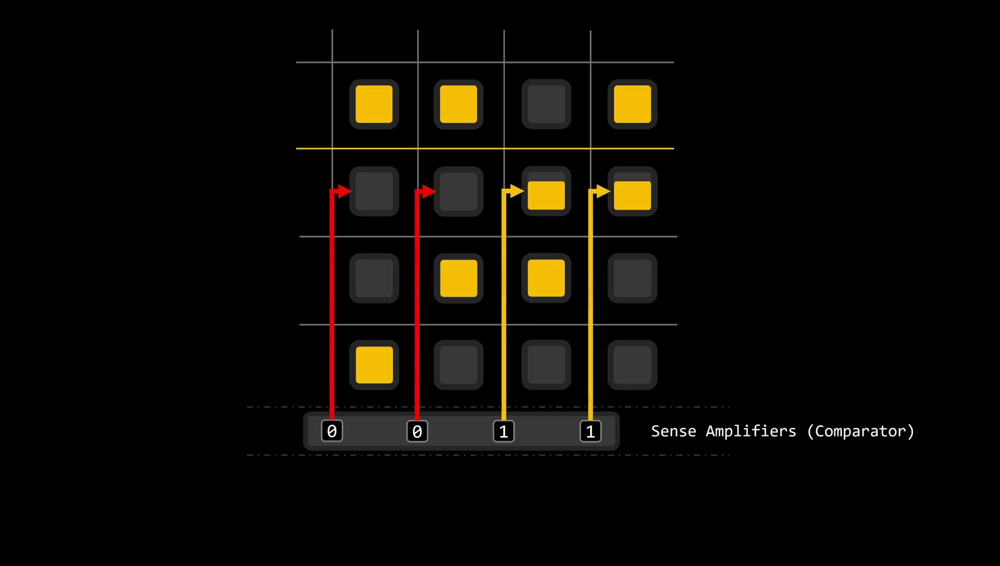

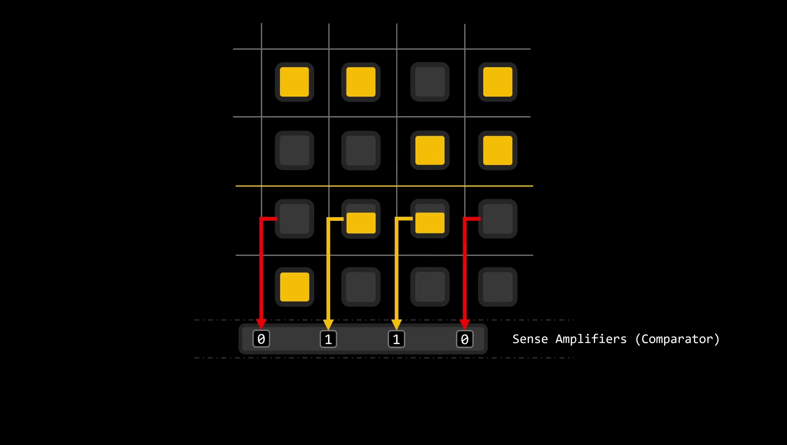
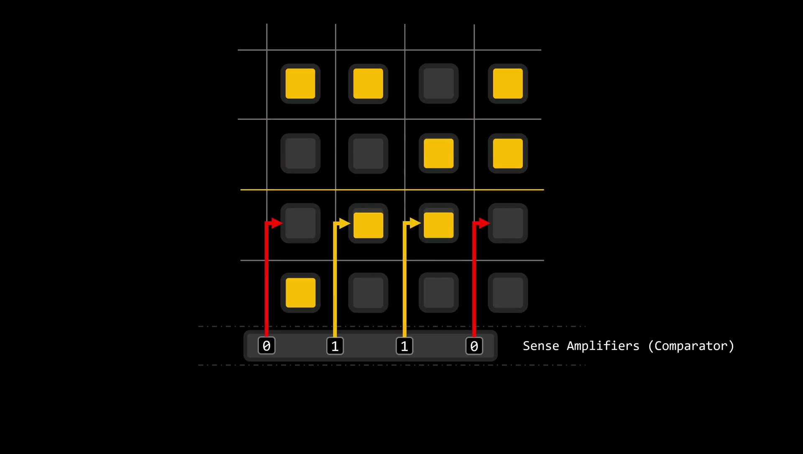

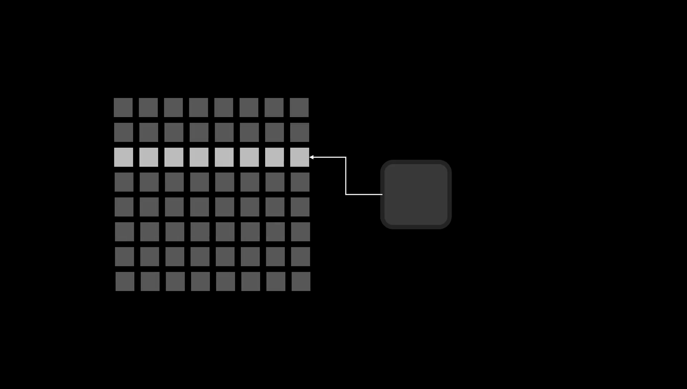
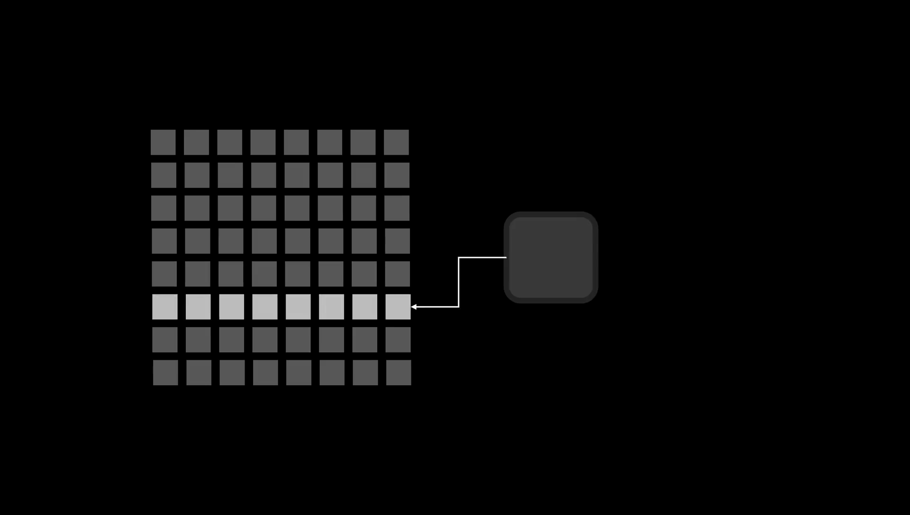
Special circuitry is designed specifically for this purpose.

Ideally, reading and writing operations are performed when none of the rows are being refreshed. But this introduces another disadvantage.

In dynamic RAM, each refresh cycle temporarily prevents access to the memory since the same circuitry needed for reading or writing is used for the refresh operation.

If the CPU attempts to read or write during a refresh cycle, it must wait until the cycle is complete, introducing latency.

The good news is that typically, the intervals during which no row is being refreshed are long enough to allow thousands of reading and writing operations before the next refresh cycle begins.

This is because each row generally needs to be refreshed every few milliseconds, while reading and writing operations usually take nanoseconds.

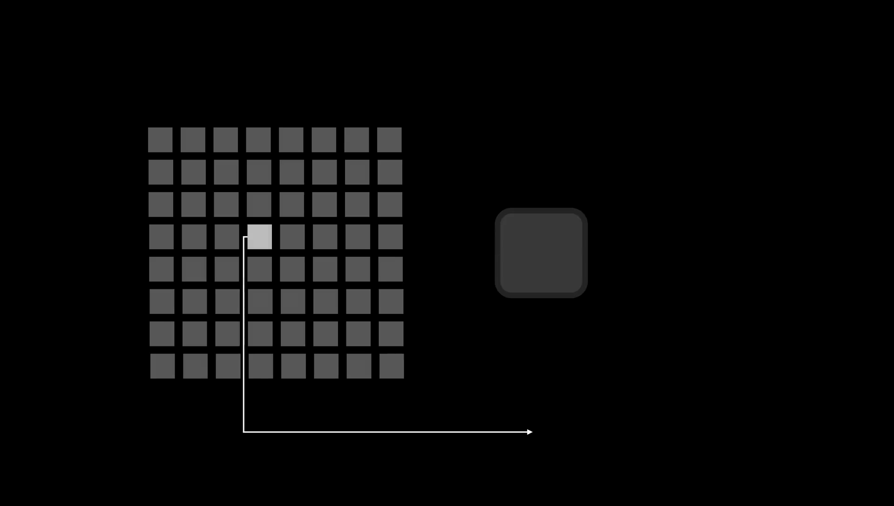
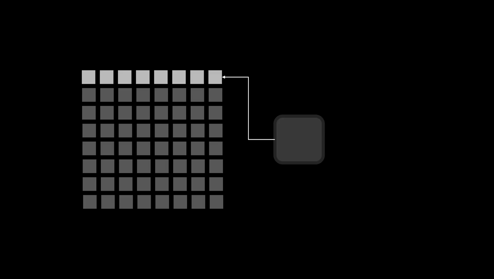

I'm a software engineer, not an electrical engineer, so I hesitate to provide exact figures.

For more details on aspects I don't feel fully qualified to explain, such as the timing involved in dynamic RAM operation or specific details about DDR5 RAM, I highly recommend checking out these videos.
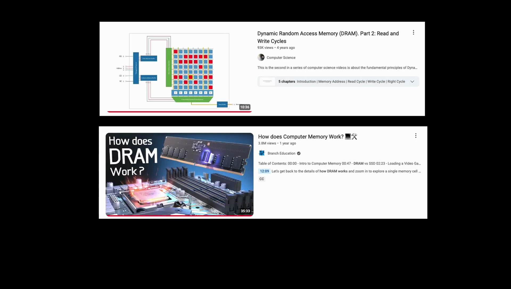

Before getting into the final part of this video, I want you to think about one of the examples on reading or writing operations.

You might have noticed before that when we input an address, different parts of the address are not used at the same time.

For example, in the writing operation, the part of the address that goes to the decoder is clearly used before the part that goes to the multiplexer.

When the CPU sends an address to read or write to, it cannot be connected directly. Rather, it is intercepted by another component that handles all of these timing matters, knowing exactly when to let each signal reach its target component depending on the operation the CPU wants to perform.

My point here is that there is a lot of timing involved in these operations, and there is some complicated circuitry that I'm not showing.
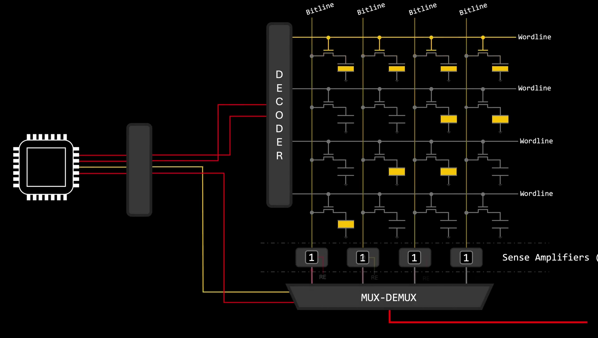

Finally, some of you might have noticed that up until now, we've been working with individual bits. However, computers use bytes, so how do we address bytes instead of bits?

This is quite simple.

Part of the answer lies in the complexity of multiplexers. Rather than routing individual bits of information, they can handle entire data buses internally.

This is still just a binary decoder with a few logic gates.

With a more complex multiplexer, we can add more columns to the matrix and divide them into groups of eight, since one byte equals eight bits.

In a reading operation, for example, the address tells the multiplexer which group of values to send to the output.
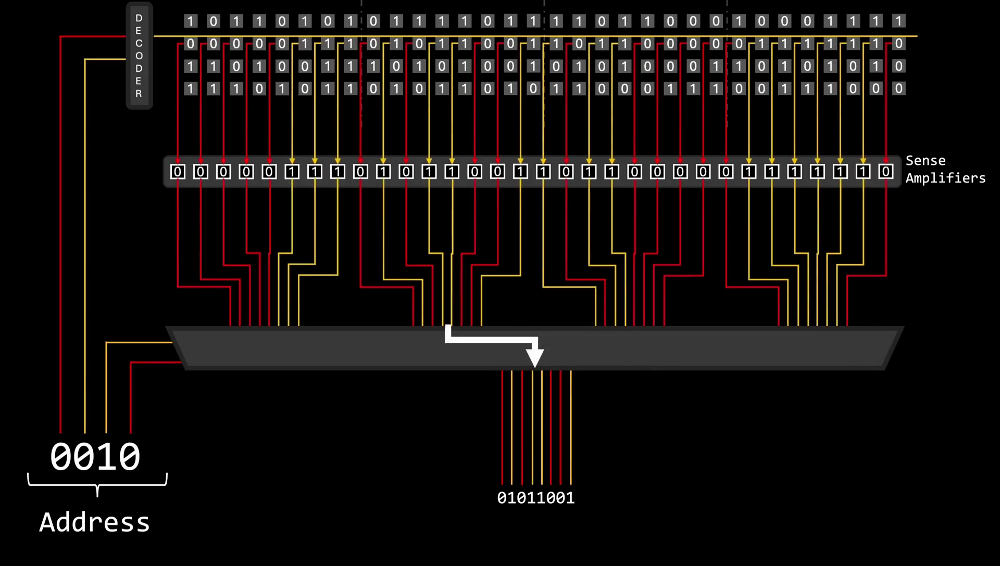

For writing operations, a demultiplexer capable of managing buses instead of single data lines is needed.

In conclusion, dynamic RAM has several disadvantages over static RAM, mainly because capacitors are used to store information and managing these capacitors to avoid losing information involves numerous steps that require precise timing.

But even though it's slower than static RAM, dynamic RAM is cheaper to produce because it allows higher storage capacities per area.

Hopefully, this video has clarified that the cache inside your processor—a type of static RAM—is faster than your computer's dynamic RAM memory modules due not only to their proximity to the CPU but also to their fundamentally different operational mechanisms.
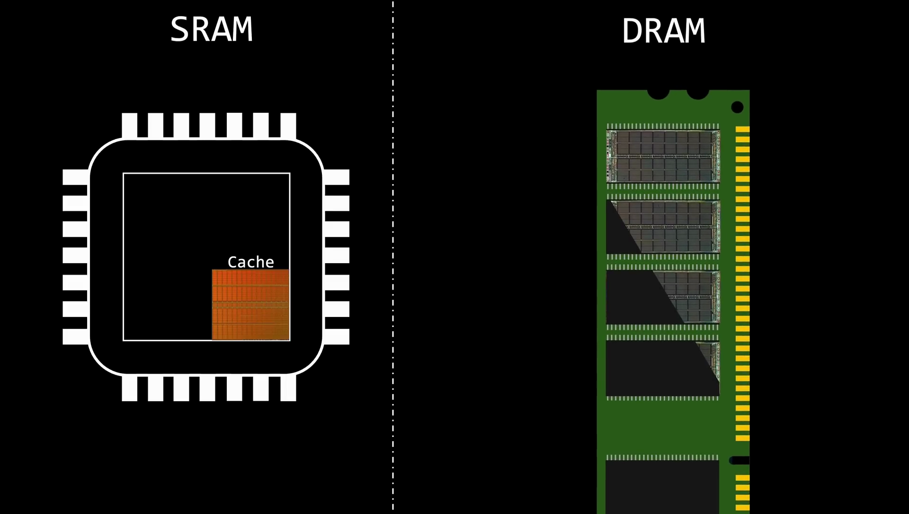
So, the next time you hear the term locality, don't take it too literally. Connecting your hard drive closer to the CPU won't make it faster than your RAM.

And that about wraps it up for now.

This video was...