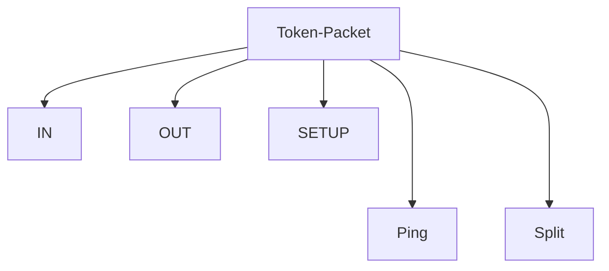
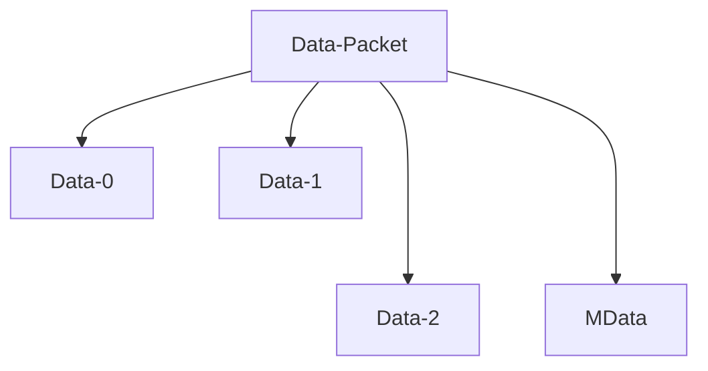
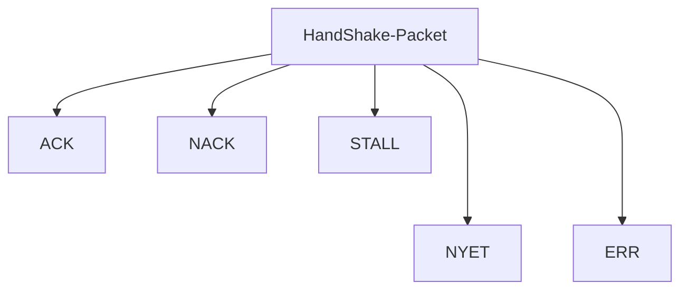

# **Questions :**

1@ Explain the USB Protocol and its Features ?

2@ What are the Speed Modes in USB ?

3@ Explain how Transaction of Data happen in USB Protocol.

4@ Explain the types of USB Transication Packets and their frame format.

5@ Name the USB discriptors and explain its working.

6@ Explain about Physical Interfacing of USB.

-----

**ANS 2 :**

**Speed Identification**:

For Low speed, D- data line is pulled up. While for full speed, D+ data line is pulled up.  High-speed devices are initially detected as full speed devices.

-------------------------

**ANS 3 :**

A single **transaction** contains transmission of up to **three packets**. These packets are:

• **Token Packet** : This packet is always sent by Host

• **Data Packet** : This packet can be sent by Host or Device.

• **Handshake Packet** : This packet provides success/failure information for the data packet received. If Host transmits the data packet, the device sends the handshake packet and vice versa.

**Transactions**

A successful transaction consists of up-to three phases that occur in sequence. They are Token phase, Data phase and Handshake phase.

 ```mermaid
 flowchart TB
 
 Transaction-->Token-Packet;
 Transaction-->Data-Packet;
 Transaction-->HandShake-Packet;
 
 ```


****************

 <span style='color:Green'> **ANS 4 :**</span>

**Types of USB packets**

Basically there are four types of data packets:

**1. Token packets**:




 These packets are only sent by host. The packet structure contains a PID byte, 11 bits of address and a 5-bit CRC. Types of token packets :


​																	*Fig. 2: Image showing Data Format of Token Packets*

• In – This packet notifies the USB device that host wants to read information.

• Out – This packet notifies the USB device that host wants to write information.

• Setup – This packet is used to start the control transfer

With USB2.0, two more packets were added:

• Ping – Before sending OUT/DATA packet pair, this token asks the USB device if it is ready to receive OUT/DATA packet pair.

• Split – This token is used to communicate to a low/full speed device on a high speed bus

 

**2. Data packets:** 




Two types of data packets are there, Data0 and Data1. The packet structure contains a PID byte, data field and 16-bit CRC. The data field can carry 0- 1023 bytes of data. Data must be always sent in multiple of bytes.


 *Fig. 3: Image showing data format of Data Packets*

• For low speed devices, maximum data field is of 8bytes.

• For full speed devices, maximum data field is of 1023bytes.

• For high speed devices, maximum data field is of 1024bytes

After USB2.0, two more types were added Data2 and MData. They are only used in high speed transfer high bandwidth isochronous transfer when there is a need to transfer more than 1024 bytes at 8192 kB/s.

**3. Handshake Packets**: 




These packets are mostly sent in response to data packets. They simply consist of a PID byte. There are three types of handshake packets :


*Fig. 4: Image showing Data Format of Handshake Packets*

 

• ACK – Acknowledgment for packet received

• NAK – Indicating that packets cannot be temporarily received or send. Also used to indicate that there         is no data to send

• STALL – Indicating that the device is in error state and needs intervention from the host

​        With USB2.0, two more packets were added:

• NYET – Indicating Split transaction is not yet complete.

• ERR – Indicating Split transaction failed

 

**4.** **Start of Frame packets (SOF)**:

\------------------------------------------------

 The SOF packet consists of an incrementing 11-bit frame number. On a full speed bus, this packet is sent by the host every 1ms and on a high speed bus every 125 us. This packet is used to synchronize isochronous transfer.

 


​															*Fig. 5: Image showing data Format of Start of Frame packets (SOF)*

 

 

 

**USB Packet Fields**

**-----------------------------------**

In USB the LSB of the packet is transmitted first. An USB packet contains different fields. They are:

**• Sync**: It is a mandatory field occurring at starting of the packet. This field synchronizes the clock of the receiver with the transmitter. For low and full speed mode, this field is 8 bytes long and for high speed mode it is 32 bytes long.

**• PID**: PID means Packet ID. It indicates the packet type that is being sent. This field is of 8 bits long. The upper four bits identifies the type of packet and lower four bits are bit-wise compliment of upper four bits. The lower four bits helps in detecting errors.


*Fig. 1: Table Listing USB Packet Fields*

 

**• ADDR**: This field contains the designation address of the USB device. It is of 7 bits, this means it can supports 27 ¬ = 127 devices.

**• ENDP**: This field specifies the endpoint number. It is of 4 bits, this means it can indicate 2¬¬4¬¬ ¬¬= 16 possible endpoints.

**•** **CRC:** CRC stands for Cyclic Redundancy Check. This field is used to check data in the packet for any error using CRC process

For token packets, 5-bit CRC is used and for data packets 16-bit CRC is used

**• EOP**: EOP stands for End of Packet. This field signals the data lines for Single Ended Zero(SE0) for approximately 2 bit times, followed by J state(idle state) for 1 bit time

 

 

 

 

 

 

**Pipes**

A pipe is a logical data connection between host controller’s software and device endpoint. The information is exchanged through this pipe. It is created during enumeration process. When the device is unplugged, unneeded pipes are removed.

There are two types of pipes:

**• Message pipes:** These are bi-directional pipes which follow defined packet format. They are controlled by host and only support control transfer.

**• Stream pipes:** These are unidirectional pipes which don’t follow any specific data format. They can be controlled by host or device (peripheral) and support bulk, isochronous and interrupt types of transfer.

The **Default Control pipe** is a special type of message pipe which is bidirectional and supports control transfer type. It uses endpoint 0-IN and endpoint 0-OUT. This pipe can be accessed when a device is plugged in.


 

 


 

 

**Handshaking**

Handshaking is a mechanism to check the success/failure of a request or to check the delivery of a packet. It is done to avoid loss of packets and to ensure successful transmission. Terms related to handshaking:

**• ACK** – acknowledgment for data receive (success)

**• NAK** – negative acknowledgment means no data

**• STALL** – request not supported or endpoint halted

**• NYET** – not yet. A case can be when device is busy and not ready for next data packet

**• ERR** – split transaction error

**• No response**


 

**USB Device States**

A USB device can have several possible states as described below:

**• Attached State:** This state occurs when the device is attached to the Host.

**• Powered State:** After the device is attached, the Host provides power to the device if it does not have its own power supply. The device should not draw more than 100 mA in this state.

**• Default State:** This state occurs when the device is reset and has not been assigned a unique address. In this state the device uses default control pipe for communication and default address 0.

**• Addressed State:** The USB device enters this state after it gets a unique address which is used for future communications.

**• Configured:** When the Host obtains required information from the device, it loads the appropriate driver for the device. The host configures the device by selecting a configuration. The device is now ready to do the operations it was meant for.

**• Suspended State:** The USB device enters the suspended state when the bus remains idle for more than 3mS. In this state, the device must not draw more than 500uA of current.

 


 

**Descriptor Types**

There are mainly five types of descriptors

• Device Descriptors

• Configuration Descriptors

• Interface Descriptors

• Endpoint Descriptors

• String Descriptors


 


 

 **Q : Endpoint Types**

The Universal Serial Bus specification defines four transfer/endpoint types,

- - **[Control Transfers](https://www.beyondlogic.org/usbnutshell/usb4.shtml#Control)**
  - **[Interrupt Transfers](https://www.beyondlogic.org/usbnutshell/usb4.shtml#Interrupt)**
  - **[Isochronous Transfers](https://www.beyondlogic.org/usbnutshell/usb4.shtml#Isochronous)**
  - **[Bulk Transfers](https://www.beyondlogic.org/usbnutshell/usb4.shtml#Bulk)**

 Important Links :

1-> https://www.totalphase.com/blog/2020/08/what-is-enumeration-why-usb-descriptors-important/

