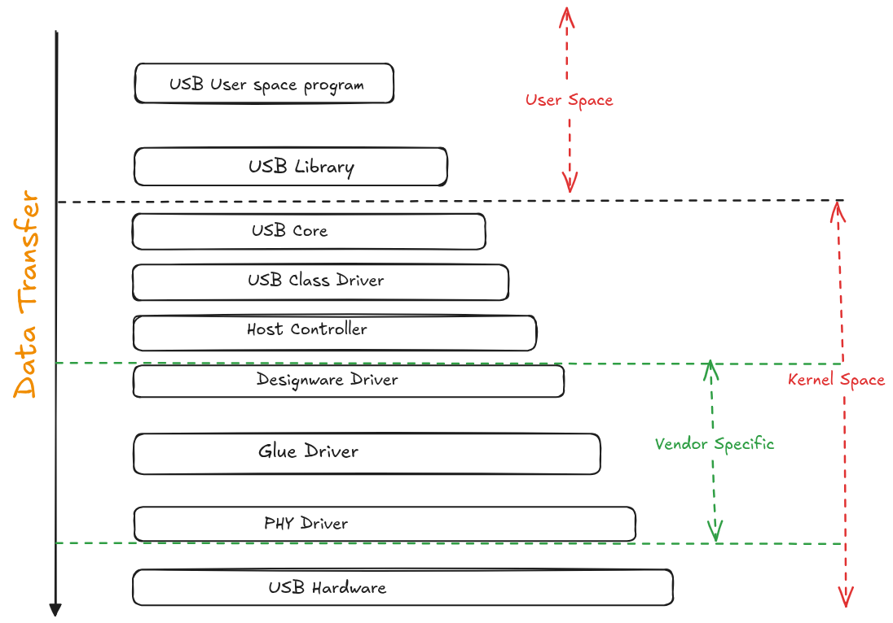

# Block Diagram

# USB data flow through Linux Kernel Layers till user space

# Responsibilities of USB Drivers (Layers wise)

## User Space Layer
Applications and tools that initiate USB operations.

**Interfaces used:**

    - /dev/bus/usb/*
    - /sys/bus/usb/
    - ioctl on usbfs
    - libusb APIs

## USB Filesystem Interface Layer (usbfs)
    - Implements usbfs
    - Handles user-space control/bulk transfers
    - Used by libusb
    - Creates /dev/bus/usb/* nodes

## USB Core Layer
**Device management**

    - Enumeration
    - Address assignment
    - Descriptor parsing
    - Configuration selection

**Driver model integration**

    - Match device ↔ driver
    - Bind/unbind USB drivers

**Transfer management**

    - URB allocation & lifecycle
    - Control / Bulk / Interrupt / Isochronous

## USB Class Drivers (Function Drivers)
    - Parse interface descriptors
    - Create kernel device nodes
    - Provide subsystem integration

## USB Bus Drivers (Host Controller Drivers-HCD)
**Interface to usbcore**

    - Program host controller registers
    - Manage transfer rings/queues
    - Convert URBs → hardware TRBs/descriptors
    - Handle interrupts
    - DMA handling

## USB PHY & Controller Glue Layer
    - PHY power control
    - Link state management
    - Role switching (host/device/OTG)
    - SoC glue logic

 

# USB Data (Packets) formation checks and important points to remember